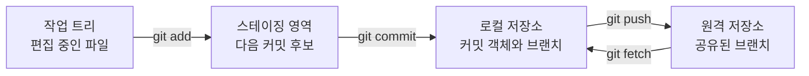



## 문제: 명령을 외워도 Git이 계속 불안한 이유

Git에서 가장 흔한 혼란은 `add`, `commit`, `push`를 하나의 “저장” 동작처럼 생각하는 데서 시작한다. 하지만 세 명령은 서로 다른 공간을 바꾼다. `pull` 역시 단순 다운로드가 아니라 원격 변경을 가져온 뒤 현재 브랜치에 통합하는 복합 동작이다.

이 구분이 없으면 다음 질문에 답하기 어렵다.

- 파일을 수정했는데 왜 커밋에 포함되지 않았는가?
- 커밋했는데 왜 원격 저장소에는 보이지 않는가?
- `git diff`에는 아무것도 없는데 왜 `git status`는 변경이 있다고 하는가?
- `pull` 직후 왜 충돌 또는 예상하지 못한 merge commit이 생겼는가?

Git을 안정적으로 쓰는 핵심은 명령을 많이 아는 것이 아니라 **현재 변경이 어느 공간에 있는지 관찰하는 것**이다.

## Mental model: 작업은 네 공간 사이를 이동한다



### 1. 작업 트리(working tree)

에디터와 파일 탐색기에서 보는 실제 파일이다. 저장 버튼을 눌렀다는 것은 디스크의 파일이 바뀌었다는 뜻일 뿐, Git 이력에 기록됐다는 뜻은 아니다.

### 2. 스테이징 영역(index)

“다음 커밋에 넣을 스냅샷”을 조립하는 공간이다. Git은 파일을 저장하는 단위처럼 보이지만 실제로는 커밋 시점의 프로젝트 트리 스냅샷을 기록한다. `git add`는 현재 파일 내용을 스테이징 영역에 복사한다.

파일을 `add`한 뒤 다시 수정하면 한 파일에 두 버전이 동시에 존재할 수 있다.

- 스테이징된 버전: 다음 커밋에 들어갈 내용
- 작업 트리 버전: 그 후 추가로 편집한 내용

### 3. 로컬 저장소(local repository)

커밋 객체, 트리, blob, 브랜치 참조가 `.git` 아래에 저장된다. `git commit`은 스테이징 영역의 스냅샷을 새 커밋으로 만들고 현재 브랜치가 그 커밋을 가리키게 한다. 아직 네트워크 통신은 없다.

### 4. 원격 저장소(remote repository)

팀과 CI가 공유하는 저장소다. `origin`은 관례적인 원격 이름일 뿐 특별한 키워드가 아니다. `git push origin main`은 로컬 `main`이 가리키는 커밋을 원격으로 전송하고 원격 `main` 참조를 이동해 달라는 요청이다.

`origin/main`도 원격 서버 그 자체가 아니다. 마지막 `fetch` 또는 `push` 시점에 로컬 Git이 기억한 **remote-tracking branch**다. 서버의 최신 상태를 알려면 먼저 `git fetch`가 필요하다.

### HEAD와 브랜치는 포인터다

커밋은 보통 바뀌지 않는 객체이고, 브랜치는 특정 커밋을 가리키는 이동 가능한 이름이다. `HEAD`는 대개 현재 체크아웃한 브랜치를 가리킨다.

```text
HEAD -> main -> C3 -> C2 -> C1
```

새 커밋 `C4`를 만들면 과거 커밋을 수정하는 것이 아니라 `main` 포인터가 `C4`로 이동한다. 이 모델을 이해하면 branch, reset, rebase, reflog도 “어떤 포인터가 어디로 이동했는가”로 해석할 수 있다.

## 실전 패턴: 관찰하고, 작은 단위로 기록하고, 명시적으로 동기화한다

### 상태를 보는 네 가지 기본 명령

```bash
git status --short --branch
git diff
git diff --staged
git log --oneline --decorate --graph --all -n 20
```

각 명령의 질문은 다르다.

| 명령 | 답하는 질문 |
|---|---|
| `git status --short --branch` | 현재 브랜치와 변경 파일은 무엇인가? |
| `git diff` | 작업 트리와 스테이징 영역은 어떻게 다른가? |
| `git diff --staged` | 스테이징 영역과 `HEAD` 커밋은 어떻게 다른가? |
| `git log ...` | 브랜치와 커밋 그래프는 어떤 모양인가? |

`git diff`가 비어 있어도 변경이 없다고 단정하면 안 된다. 이미 `add`한 변경은 `git diff --staged`에서 보인다.

### 한 작업을 하나의 검토 가능한 커밋으로 만들기

```bash
# 1) 전체 상태를 본다.
git status --short --branch

# 2) 필요한 hunk만 선택한다.
git add --patch

# 3) 실제 커밋될 내용을 검토한다.
git diff --staged --check
git diff --staged

# 4) 의도를 설명하는 메시지로 기록한다.
git commit -m "docs: explain cache invalidation policy"

# 5) 커밋 후 작업 트리와 이력을 다시 확인한다.
git status --short --branch
git show --stat --oneline HEAD
```

`git add .`가 항상 나쁜 것은 아니지만, 서로 다른 작업과 임시 파일이 섞였을 때 검토 범위가 커진다. `git add --patch`는 변경 hunk 단위로 포함 여부를 선택할 수 있어 커밋의 응집도를 높인다.

좋은 커밋은 다음 속성을 가진다.

- 한 문장으로 목적을 설명할 수 있다.
- 빌드 또는 테스트 가능한 상태를 유지한다.
- 포맷 변경과 동작 변경을 가능하면 분리한다.
- 비밀, 생성물, 개인 환경 파일을 포함하지 않는다.
- 메시지는 “무엇을 했다”뿐 아니라 필요한 경우 “왜 했는가”를 남긴다.

### push 전에 원격과의 차이를 확인하기

```bash
git fetch --prune origin

# 로컬에만 있는 커밋
git log --oneline origin/main..HEAD

# 원격에만 있는 커밋
git log --oneline HEAD..origin/main

# 양쪽 차이와 갈라진 지점
git log --left-right --graph --oneline HEAD...origin/main
```

`fetch`는 작업 트리나 현재 브랜치를 자동으로 바꾸지 않기 때문에 안전한 관찰 단계로 쓰기 좋다. 원격 변경을 확인한 뒤 통합 방식을 선택한다.

현재 브랜치가 원격보다 뒤에 있고 로컬 커밋이 없다면 다음 명령은 fast-forward만 허용한다.

```bash
git pull --ff-only
```

서로 갈라졌다면 `--ff-only`는 멈춘다. 이 실패는 문제를 숨기지 않고 merge 또는 rebase를 의식적으로 선택하게 해 주는 안전장치다.

새 브랜치를 처음 공유할 때는 upstream을 설정한다.

```bash
git switch -c docs/cache-policy
git push --set-upstream origin docs/cache-policy
```

이후에는 `git push`와 `git pull --ff-only`가 추적 대상 브랜치를 알 수 있다. 단, upstream이 설정됐다는 사실이 push 대상이 항상 옳다는 보장은 아니므로 `git status --short --branch`를 먼저 본다.

### pull을 두 동작으로 분해해서 생각하기

개념적으로 `pull`은 다음과 같다.

```text
git pull = git fetch + 통합(merge 또는 rebase)
```

초기 학습과 중요한 브랜치에서는 이를 실제로 분리하면 판단 지점이 선명해진다.

```bash
git fetch origin
git log --left-right --graph --oneline HEAD...origin/main

# fast-forward 가능한 경우에만 현재 브랜치를 이동
git merge --ff-only origin/main
```

팀 정책이 rebase라면 feature branch에서 명시적으로 `git rebase origin/main`을 사용할 수 있다. 이미 다른 사람이 사용하는 공개 브랜치의 커밋을 재작성해서는 안 된다.

### `.gitignore`는 아직 추적하지 않은 파일에 적용된다

```gitignore
# 로컬 환경과 생성물 예시
.env
.env.*
!.env.example
build/
dist/
*.log
```

이미 커밋된 파일은 `.gitignore`에 추가해도 계속 추적된다. 그리고 `.gitignore`는 보안 장치가 아니다. 비밀값은 처음부터 커밋하지 않고, 실수로 노출했다면 즉시 폐기·재발급해야 한다.

공유 가능한 템플릿은 값 없이 별도로 둔다.

```dotenv
# .env.example
SERVICE_ENDPOINT=https://example.invalid
API_TOKEN=<SET_IN_SECRET_STORE>
```

## 검증 체크리스트

변경을 공유하기 전 다음 순서로 확인한다.

- [ ] `git status --short --branch`에서 현재 브랜치와 upstream이 예상과 같다.
- [ ] `git diff`와 `git diff --staged`를 모두 읽었다.
- [ ] `git diff --staged --check`가 공백 오류를 보고하지 않는다.
- [ ] 빌드, 테스트, 린트를 변경 범위에 맞게 실행했다.
- [ ] `.env`, 키, 토큰, 고객 데이터, 개인 경로, 대용량 생성물이 없다.
- [ ] `git fetch --prune origin` 후 로컬과 원격의 차이를 확인했다.
- [ ] 커밋 하나가 하나의 의도를 표현하고 메시지가 그 의도를 설명한다.
- [ ] push 후 원격 브랜치와 CI 결과를 확인했다.

다음 별칭은 필수는 아니지만 그래프를 반복해서 볼 때 유용하다.

```bash
git config --global alias.lg "log --graph --decorate --oneline --all"
```

별칭을 팀 문서나 자동화에 전제로 삼지는 않는 편이 좋다. 다른 환경에서 명령이 재현되지 않을 수 있기 때문이다.

## 실패 사례와 한계

### “commit했으니 백업됐다”

로컬 디스크가 손상되면 push하지 않은 커밋은 사라질 수 있다. commit은 이력 생성이고, 원격 push나 별도 백업은 내구성 확보다. 둘은 다른 문제다.

### “pull은 최신 파일로 덮어쓴다”

Git은 커밋 그래프를 통합한다. 로컬과 원격이 모두 전진했다면 충돌이나 merge commit이 생길 수 있다. 자동화에서는 `git pull`보다 `fetch`와 명시적 통합 정책을 선호하는 이유다.

### “작업 트리가 깨끗하면 원격과 같다”

깨끗한 작업 트리는 `HEAD` 대비 미커밋 변경이 없다는 뜻일 뿐이다. 로컬 브랜치가 원격보다 앞서거나 뒤처질 수 있다.

### “Git이 모든 파일 이력에 적합하다”

Git은 소스와 텍스트 중심 변경에 강하지만, 거대한 바이너리·빈번히 바뀌는 모델 파일·데이터셋에는 저장 비용과 diff 한계가 있다. Git LFS, 아티팩트 저장소, 데이터 버전 관리 도구를 목적에 맞게 분리해야 한다.

### “Git 이력이 곧 완전한 재현성이다”

코드 버전만으로 실행 환경, 외부 서비스, 데이터 스냅샷, 비밀 구성, 빌드 도구까지 복원되지는 않는다. lock file, 컨테이너 이미지 digest, IaC, 데이터 provenance, 실행 메타데이터가 함께 있어야 재현 가능한 시스템에 가까워진다.

Git의 가장 중요한 습관은 짧다. **상태를 보고, 차이를 읽고, 작은 스냅샷을 만들고, 원격 그래프를 확인한 뒤 공유한다.**
