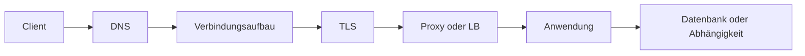



„Die API ist langsam“ ist ein Symptom, keine Ursachenanalyse. Eine Anfrage durchläuft DNS-Auflösung, Verbindungsaufbau, TLS-Aushandlung, Serverwarteschlange, Anwendungsverarbeitung, Datenbanken und Antwortübertragung. Ohne Zerlegung dieses Pfads sind Versuche mit Caches, Serverskalierung oder Wiederholungen vom Glück abhängig.

## Anfragepfad schichtweise untersuchen



Jede Schicht besitzt andere Fragen und Metriken.

| Schicht | Zu stellende Frage | Typisches Symptom |
|---|---|---|
| DNS | Wird der Name zur korrekten Adresse aufgelöst? | Lookup-Timeout, veralteter Eintrag |
| Verbindung | Erreicht eine Verbindung den Zielport? | verweigert, zurückgesetzt, Connect-Timeout |
| TLS | Stimmen Zertifikat, Name, Zeit und Protokoll? | Handshake-Fehler |
| Proxy/LB | Zeigt er auf den richtigen Upstream und Health-Zustand? | 502, 503, 504 |
| Anwendung | Sind Warteschlangen und Worker gesättigt? | hohe Queue-Zeit, 5xx |
| Abhängigkeit | Ist eine Datenbank oder externe API der Engpass? | Pool-Erschöpfung, Downstream-Timeout |

## Latenz als Verteilung statt als Mittelwert behandeln

Ein Mittelwert von 100 ms kann ein System verbergen, in dem die meisten Anfragen 50 ms und einige fünf Sekunden dauern. Mindestens Folgendes wird gemeinsam untersucht.

- Anfragerate und Parallelität
- Erfolgs- und Fehlerrate nach Statuscode
- p50-, p95- und p99-Latenz
- Zeit je Schicht: DNS, Connect, TLS, Time to First Byte und Download
- Serverwarteschlangen- und Verarbeitungszeit
- Aufrufzahl und Latenz je Abhängigkeit

Auch die Intuition hinter Littles Gesetz ist nützlich.

$$L = \lambda W$$

Steigt die mittlere Verarbeitungszeit \(W\) oder nähert sich die Ankunftsrate λ der Verarbeitungskapazität, wächst die parallele Arbeit \(L\) im System und die Warteschlange nimmt stark zu. Selbst bei CPU-Auslastung unter 100 % können Datenbank-Connection-Pool oder Worker-Slot zuerst sättigen.

## Ein Timeout ist ein Budget, keine einzelne Zahl

Übersteigt die Summe der Downstream-Timeouts die Client-Deadline, läuft „Zombie-Arbeit“ weiter, nachdem die vorgelagerte Anfrage bereits aufgegeben wurde.

```text
전체 요청 deadline: 2.0 s
├── DNS + connect + TLS: 0.3 s
├── 애플리케이션 queue: 0.2 s
├── downstream 호출: 1.0 s
└── 직렬화·응답 및 여유: 0.5 s
```

Folgende Timeouts sind zu unterscheiden.

- Connect-Timeout: Warten auf den Verbindungsaufbau
- Read-Timeout: Warten auf Antwortdaten nach der Verbindung
- Write-Timeout: Warten auf das Senden der Anfrage
- Pool-Timeout: Warten auf den Erwerb einer Verbindung aus dem Pool
- Gesamt-Deadline: maximale Gesamtwartezeit des Benutzers

Jeden Wert lediglich zu erhöhen verzögert das Auftreten des Fehlers und belegt Ressourcen länger.

## Wiederholungen können Fehler verstärken

Wiederholungen werden auf transiente Fehler beschränkt. Wiederholt jede Schicht unabhängig dreimal, kann sich eine reale Anfrage in viele Versuche vervielfachen.

Sichere Standardgrundsätze:

1. Gesamtbudget für Wiederholungen festlegen.
2. Exponentiellen Backoff und zufälligen Jitter verwenden.
3. Nur eindeutig transiente Fehler wiederholen.
4. Vom Server gesendetes `Retry-After` respektieren.
5. Keine Wiederholung beginnen, die die Deadline überschreitet.
6. Anfragen mit Nebenwirkungen nur automatisch wiederholen, wenn Idempotenz nachgewiesen ist.

In HTTP sind sichere Methoden wie GET und idempotente Methoden wie PUT und DELETE so definiert, dass der beabsichtigte Effekt wiederholter Ausführung semantisch derselbe wie bei einmaliger Ausführung ist. Eine Implementierung kann diesen Vertrag dennoch brechen, und Begleiteffekte wie Logs oder Auditdatensätze können zunehmen. Anfragen mit Nebenwirkungen wie POST-Zahlungen oder Joberstellung benötigen einen Idempotenzschlüssel und serverseitige Duplikatvermeidung.

## Statuscodes sind der Ausgangspunkt der Diagnose

- `400`: Fehler des Request-Formats oder der Domänenvalidierung
- `401`: Authentifizierung fehlt oder ist ungültig
- `403`: authentifiziert, aber nicht autorisiert
- `404`: Ressource fehlt oder wird nicht offengelegt
- `409`: Konflikt mit aktuellem Zustand
- `422`: häufig verwendet, wenn Syntax verstanden wurde, aber Inhaltsvalidierung scheiterte
- `429`: Rate Limit oder vorübergehende Überlastung
- `500`: unbehandelter Serverfehler
- `502`: Gateway erhielt keine gültige Antwort vom Upstream
- `503`: Dienst derzeit nicht verfügbar
- `504`: Gateway erhielt vor seiner Deadline keine Upstream-Antwort

Die Ursache darf nicht allein aus dem Statuscode bestimmt werden. Derselbe `504` kann aus Proxy-Timeout, Serverwarteschlange, Datenbanksperre oder Latenz einer externen API entstehen.

## Ablauf der Incident Response

1. **Auswirkungsumfang**: Welche Benutzer, Regionen, Versionen oder Endpoints sind betroffen?
2. **Minderung**: Was ist am sichersten – Rollback, Feature deaktivieren, Rate Limiting oder horizontales Skalieren?
3. **Schichtzerlegung**: In welchem Segment stieg die Zeit oder begannen Fehler?
4. **Hypothesenvalidierung**: Bestätigen Metriken und Traces vor und nach der Änderung die Ursache?
5. **Wiederherstellungsbestätigung**: Haben sich Backlog und Tail-Latenz normalisiert, nicht nur die Fehlerrate?
6. **Prävention**: Wie müssen Alarme, Tests, Kapazitätsmodelle und Runbooks geändert werden?

## Minimale Korrelation für Beobachtbarkeit

Mit jeder Anfrage wird eine `request_id` oder ein Trace-Kontext weitergegeben. Logs, Metriken und Traces müssen sich über dieselben Endpoint-, Versions- und Abhängigkeitsdimensionen verbinden lassen.

```text
request_id=req-example
route=/v1/jobs
status=504
duration_ms=1900
upstream=worker-service
upstream_duration_ms=1800
attempt=2
```

Authentifizierungsheader, Cookies, Passwörter oder rohe personenbezogene Informationen gehören nicht in reale Logs.

## Prüfliste zur Verifikation

- [ ] DNS-, Connect-, TLS-, TTFB- und Serververarbeitungszeit werden getrennt gemessen.
- [ ] Mittelwerte werden gemeinsam mit p95/p99, Fehlerrate und Anfragerate untersucht.
- [ ] Vorgelagerte Deadline umschließt nachgelagerte Timeouts und Wiederholungen.
- [ ] Wiederholbare Fehler und maximales Wiederholungsbudget sind dokumentiert.
- [ ] Jobs mit Nebenwirkungen besitzen Idempotenzschlüssel oder Bedingungen zur Duplikatvermeidung.
- [ ] Sättigung von Connection Pool und Worker-Warteschlange wird beobachtet.
- [ ] Incident-Minderung wird von der Ursachenbehebung unterschieden.
- [ ] Backlog und Tail-Latenz werden nach der Wiederherstellung geprüft.

## Häufige Fehler

- Aus einem erfolgreichen `ping` schließen, HTTP, TLS und Proxy seien gesund
- Timeouts fortlaufend erhöhen und Ressourcenerschöpfung spät entdecken
- Jede 5xx-Antwort sofort wiederholen und die Überlastung erhöhen
- Nur mittlere Latenz untersuchen und extreme Verzögerungen einer Benutzerminderheit übersehen
- Serverseitige Arbeit nach Clientabbruch fortsetzen
- Schichten nicht verbinden können, weil Logs keine Korrelationskennungen besitzen

Gute Netzwerkdiagnose bedeutet nicht, viele Werkzeugnamen zu kennen, sondern ist **der Prozess, einen Fehler nach Schicht und Zeitbudget einzugrenzen**.

## Referenzen

- [RFC 9110 — HTTP-Semantik](https://www.rfc-editor.org/rfc/rfc9110.html)
