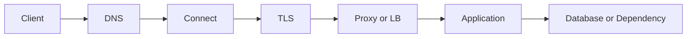



“The API is slow” is a symptom, not a root-cause diagnosis. A request passes through DNS resolution, connection establishment, TLS negotiation, server queueing, application processing, databases, and response transmission. Unless this path is decomposed, attempts involving caches, server scaling, or retries depend on luck.

## Inspect the Request Path by Layer



Each layer has different questions and metrics.

| Layer | Question to ask | Typical symptom |
|---|---|---|
| DNS | Does the name resolve to the correct address? | Lookup timeout, stale record |
| Connection | Can a connection reach the target port? | Refused, reset, connect timeout |
| TLS | Are the certificate, name, time, and protocol correct? | Handshake failure |
| Proxy/LB | Does it point to the correct upstream and health state? | 502, 503, 504 |
| Application | Are queues and workers saturated? | High queue time, 5xx |
| Dependency | Is a database or external API the bottleneck? | Pool exhaustion, downstream timeout |

## Treat Latency as a Distribution, Not an Average

An average of 100 ms can conceal a system where most requests take 50 ms and a few take five seconds. At minimum, inspect the following together.

- Request rate and concurrency
- Success rate and error rate by status code
- p50, p95, and p99 latency
- Time by layer: DNS, connect, TLS, time to first byte, and download
- Server queue time and processing time
- Call count and latency by dependency

The intuition behind Little's Law is also useful.

$$L = \lambda W$$

As mean processing time (W) increases or arrival rate λ approaches processing capacity, concurrent work in the system (L) grows and the queue length rises sharply. Even when CPU usage is below 100%, a database connection pool or worker slot can saturate first.

## A Timeout Is a Budget, Not One Number

If the sum of downstream call timeouts exceeds the client deadline, “zombie work” continues after the upstream request has already been abandoned.

```text
전체 요청 deadline: 2.0 s
├── DNS + connect + TLS: 0.3 s
├── 애플리케이션 queue: 0.2 s
├── downstream 호출: 1.0 s
└── 직렬화·응답 및 여유: 0.5 s
```

Distinguish the following timeouts.

- Connect timeout: waiting to establish a connection
- Read timeout: waiting for response data after connecting
- Write timeout: waiting to send the request
- Pool timeout: waiting to acquire a connection from the pool
- Total deadline: the overall maximum time the user will wait

Simply increasing every value delays the appearance of failure and occupies resources longer.

## Retries Can Amplify Failures

Restrict retries to transient failures. If every layer retries three times independently, one actual request can multiply into many attempts.

Safe default principles are as follows.

1. Set an overall retry budget.
2. Use exponential backoff and random jitter.
3. Retry only clearly transient errors.
4. Respect `Retry-After` sent by the server.
5. Do not start a retry that exceeds the deadline.
6. Automatically retry side-effecting requests only when idempotency is proven.

In HTTP, safe methods such as GET and idempotent methods such as PUT and DELETE are defined so that the intended effect of repeated execution is semantically the same as one execution. An implementation can still break this contract, and ancillary effects such as logs or audit records can increase. Side-effecting requests such as POST payments or job creation need an idempotency key and server-side duplicate prevention.

## Status Codes Are the Starting Point of Diagnosis

- `400`: request format or domain-validation failure
- `401`: authentication is missing or invalid
- `403`: authenticated but not authorized
- `404`: the resource is absent or not disclosed
- `409`: conflict with the current state
- `422`: often used when syntax was understood but content validation failed
- `429`: rate limit or transient overload
- `500`: unhandled server error
- `502`: the gateway did not receive a valid response from the upstream
- `503`: service currently unavailable
- `504`: the gateway did not receive an upstream response before its deadline

Do not determine the root cause from the status code alone. The same `504` can arise from a proxy timeout, server queue, database lock, or external API latency.

## Incident-Response Sequence

1. **Impact scope**: Which users, regions, versions, or endpoints are affected?
2. **Mitigation**: Which is safest—rollback, disabling a feature, rate limiting, or scaling out?
3. **Layer decomposition**: In which segment did time increase or errors begin?
4. **Hypothesis validation**: Did metrics and traces before and after the change confirm the cause?
5. **Recovery confirmation**: Have backlog and tail latency normalized, not only the error rate?
6. **Prevention**: How should alerts, tests, capacity models, and runbooks change?

## Minimum Correlation for Observability

Propagate a `request_id` or trace context with each request. Logs, metrics, and traces must connect on the same endpoint, version, and dependency dimensions.

```text
request_id=req-example
route=/v1/jobs
status=504
duration_ms=1900
upstream=worker-service
upstream_duration_ms=1800
attempt=2
```

Do not put authentication headers, cookies, passwords, or raw personal information into real logs.

## Verification Checklist

- [ ] DNS, connect, TLS, TTFB, and server processing time are measured separately.
- [ ] Averages are examined together with p95/p99, error rate, and request rate.
- [ ] The upstream deadline encloses downstream timeouts and retries.
- [ ] Retryable errors and the maximum retry budget are documented.
- [ ] Side-effecting jobs have idempotency keys or duplicate-prevention constraints.
- [ ] Connection-pool and worker-queue saturation are observed.
- [ ] Incident mitigation is distinguished from the root-cause fix.
- [ ] Backlog and tail latency are checked after recovery.

## Common Failures

- Concluding that HTTP, TLS, and the proxy are healthy based only on a successful `ping`
- Continually increasing timeouts and discovering resource exhaustion late
- Immediately retrying every 5xx response and increasing overload
- Inspecting only mean latency and missing extreme delays for a minority of users
- Continuing server-side work after the client cancels
- Failing to connect layers because logs lack correlation identifiers

Good network diagnosis is not knowing many tool names; it is **the process of narrowing a failure by layer and time budget**.

## References

- [RFC 9110 — HTTP Semantics](https://www.rfc-editor.org/rfc/rfc9110.html)
