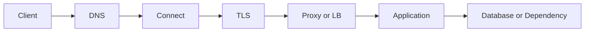



"El API es lento" es un síntoma, no un diagnóstico de causa raíz. Una solicitud pasa por la resolución DNS, el establecimiento de la conexión, la negociación TLS, la cola del servidor, el procesamiento de aplicaciones, las bases de datos y la transmisión de respuestas. A menos que esta ruta se descomponga, los intentos que involucran cachés, escalado del servidor o reintentos dependen de la suerte.

## Inspeccionar la ruta de la solicitud por capa



Cada capa tiene diferentes preguntas y métricas.

| Capa | Pregunta para hacer | Síntoma típico |
|---|---|---|
| DNS | ¿El nombre corresponde a la dirección correcta? | Tiempo de espera de búsqueda, registro obsoleto |
| Conexión | ¿Puede una conexión llegar al puerto de destino? | Rechazado, reinicio, tiempo de espera de conexión |
| TLS | ¿Son correctos el certificado, nombre, hora y protocolo? | Fallo en el apretón de manos |
| Proxy/LB | ¿Apunta al estado correcto de salud y aguas arriba? | 502, 503, 504 |
| Solicitud | ¿Están saturadas las colas y los trabajadores? | Tiempo de cola alto, 5xx |
| Dependencia | ¿Es una base de datos o API externa el cuello de botella? | Agotamiento de la piscina, tiempo de espera aguas abajo |

## Trate la latencia como una distribución, no como un promedio

Un promedio de 100 ms puede ocultar un sistema donde la mayoría de las solicitudes tardan 50 ms y algunas tardan cinco segundos. Como mínimo, inspeccione lo siguiente juntos.

- Tasa de solicitud y concurrencia.
- Tasa de éxito y tasa de error por código de estado
- latencia p50, p95 y p99
- Tiempo por capa: DNS, conexión, TLS, tiempo hasta el primer byte y descarga.
- Tiempo de cola del servidor y tiempo de procesamiento.
- Recuento de llamadas y latencia por dependencia.

La intuición detrás de la Ley de Little también es útil.

$$L = \lambda W$$

A medida que aumenta el tiempo medio de procesamiento (W) o la tasa de llegada λ se acerca a la capacidad de procesamiento, el trabajo concurrente en el sistema (L) crece y la longitud de la cola aumenta considerablemente. Incluso cuando el uso de CPU es inferior al 100 %, un grupo de conexiones de base de datos o una ranura de trabajo pueden saturarse primero.

## Un tiempo de espera es un presupuesto, no un número

Si la suma de los tiempos de espera de las llamadas descendentes excede la fecha límite del cliente, el "trabajo zombi" continúa después de que la solicitud ascendente ya haya sido abandonada.

```text
전체 요청 deadline: 2.0 s
├── DNS + connect + TLS: 0.3 s
├── 애플리케이션 queue: 0.2 s
├── downstream 호출: 1.0 s
└── 직렬화·응답 및 여유: 0.5 s
```

Distinga los siguientes tiempos de espera.

- Tiempo de espera de conexión: esperando establecer una conexión
- Tiempo de espera de lectura: esperando datos de respuesta después de conectarse
- Tiempo de espera de escritura: esperando para enviar la solicitud.
- Tiempo de espera del grupo: esperando adquirir una conexión desde el grupo
- Plazo total: el tiempo máximo total que esperará el usuario.

Simplemente aumentar cada valor retrasa la aparición de fallas y ocupa recursos por más tiempo.

## Los reintentos pueden amplificar los fallos

Restrinja los reintentos a fallas transitorias. Si cada capa vuelve a intentarlo tres veces de forma independiente, una solicitud real puede multiplicarse en muchos intentos.

Los principios de incumplimiento seguro son los siguientes.

1. Establezca un presupuesto general de reintentos.
2. Utilice retroceso exponencial y fluctuación aleatoria.
3. Vuelva a intentarlo únicamente con errores claramente transitorios.
4. Respetar el `Retry-After` enviado por el servidor.
5. No inicie un reintento que exceda la fecha límite.
6. Vuelva a intentar automáticamente las solicitudes de efectos secundarios solo cuando se demuestre la idempotencia.

En HTTP, se definen métodos seguros como GET y métodos idempotentes como PUT y DELETE para que el efecto deseado de la ejecución repetida sea semánticamente el mismo que el de una ejecución. Una implementación aún puede romper este contrato y los efectos auxiliares, como registros o registros de auditoría, pueden aumentar. Las solicitudes con efectos secundarios, como pagos POST o creación de empleo, necesitan una clave de idempotencia y prevención de duplicados del lado del servidor.

## Los códigos de estado son el punto de partida del diagnóstico

- `400`: formato de solicitud o error de validación de dominio
- `401`: falta la autenticación o no es válida
- `403`: autenticado pero no autorizado
- `404`: el recurso está ausente o no se divulga
- `409`: conflicto con el estado actual
- `422`: se utiliza a menudo cuando se entiende la sintaxis pero falla la validación del contenido.
- `429`: límite de velocidad o sobrecarga transitoria
- `500`: error de servidor no controlado
- `502`: la puerta de enlace no recibió una respuesta válida del upstream
- `503`: servicio no disponible actualmente
- `504`: la puerta de enlace no recibió una respuesta ascendente antes de la fecha límite

No determine la causa raíz únicamente a partir del código de estado. El mismo `504` puede surgir de un tiempo de espera de proxy, una cola del servidor, un bloqueo de la base de datos o una latencia externa de API.

## Secuencia de respuesta al incidente

1. **Alcance del impacto**: ¿Qué usuarios, regiones, versiones o puntos finales se ven afectados?
2. **Mitigación**: ¿Qué es más seguro: revertir, deshabilitar una función, limitar la velocidad o escalar horizontalmente?
3. **Descomposición de capas**: ¿En qué segmento aumentó el tiempo o comenzaron los errores?
4. **Validación de hipótesis**: ¿Las métricas y los seguimientos antes y después del cambio confirmaron la causa?
5. **Confirmación de recuperación**: ¿Se han normalizado el trabajo pendiente y la latencia de cola, no solo la tasa de error?
6. **Prevención**: ¿Cómo deberían cambiar las alertas, las pruebas, los modelos de capacidad y los runbooks?

## Correlación mínima para la observabilidad

Propague un `request_id` o un contexto de seguimiento con cada solicitud. Los registros, métricas y seguimientos deben conectarse en el mismo punto final, versión y dimensiones de dependencia.

```text
request_id=req-example
route=/v1/jobs
status=504
duration_ms=1900
upstream=worker-service
upstream_duration_ms=1800
attempt=2
```

No incluya encabezados de autenticación, cookies, contraseñas ni información personal sin procesar en registros reales.

## Lista de verificación de verificación

- [ ] DNS, conexión, TLS, TTFB y el tiempo de procesamiento del servidor se miden por separado.
- [ ] Los promedios se examinan junto con p95/p99, tasa de error y tasa de solicitudes.
- [ ] La fecha límite ascendente incluye tiempos de espera y reintentos descendentes.
- [ ] Se documentan los errores que se pueden reintentar y el presupuesto máximo de reintento.
- [] Los trabajos con efectos secundarios tienen claves de idempotencia o restricciones de prevención de duplicados.
- [] Se observa saturación del grupo de conexiones y de la cola de trabajadores.
- [ ] La mitigación de incidentes se distingue de la solución de la causa raíz.
- [] El trabajo pendiente y la latencia de cola se verifican después de la recuperación.

## Fallos comunes

- Concluir que HTTP, TLS y el proxy están en buen estado basándose únicamente en un `ping` exitoso.
- Aumentar continuamente los tiempos de espera y descubrir tarde el agotamiento de los recursos.
- Reintentar inmediatamente cada respuesta 5xx y aumentar la sobrecarga
- Inspeccionar solo la latencia media y omitir retrasos extremos para una minoría de usuarios
- Continuar el trabajo del lado del servidor después de que el cliente cancele
- No se pueden conectar capas porque los registros carecen de identificadores de correlación

Un buen diagnóstico de red consiste en no conocer muchos nombres de herramientas; es **el proceso de reducir una falla por capa y presupuesto de tiempo**.

## Referencias

- [RFC 9110 — Semántica HTTP](https://www.rfc-editor.org/rfc/rfc9110.html)
