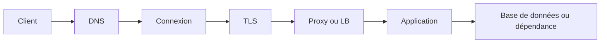



« L'API est lente » est un symptôme, pas un diagnostic de la cause. Une requête traverse la résolution DNS, l'établissement de la connexion, la négociation TLS, la mise en file d'attente sur le serveur, le traitement applicatif, les bases de données et la transmission de la réponse. Sans décomposer ce parcours, toute tentative fondée sur le cache, l'ajout de serveurs ou les nouvelles tentatives dépend de la chance.

## Examiner le parcours d'une requête couche par couche



Chaque couche possède ses propres questions et métriques.

| Couche | Question à poser | Symptôme typique |
|---|---|---|
| DNS | Le nom se résout-il vers la bonne adresse ? | Timeout de résolution, enregistrement obsolète |
| Connexion | La connexion peut-elle atteindre le port cible ? | Refus, réinitialisation, timeout de connexion |
| TLS | Le certificat, le nom, l'heure et le protocole sont-ils corrects ? | Échec de la négociation |
| Proxy/LB | L'upstream et son état de santé sont-ils corrects ? | 502, 503, 504 |
| Application | Les files et les workers sont-ils saturés ? | Temps d'attente élevé, 5xx |
| Dépendance | Une base de données ou une API externe constitue-t-elle le goulot d'étranglement ? | Épuisement du pool, timeout downstream |

## Considérer la latence comme une distribution, et non une moyenne

Une moyenne de 100 ms peut masquer un système dans lequel la plupart des requêtes prennent 50 ms et quelques-unes cinq secondes. Examinez au minimum les éléments suivants ensemble.

- Débit des requêtes et concurrence
- Taux de réussite et taux d'erreur par code de statut
- Latences p50, p95 et p99
- Durée par couche : DNS, connexion, TLS, time-to-first-byte et téléchargement
- Temps d'attente dans la file du serveur et temps de traitement
- Nombre d'appels et latence par dépendance

L'intuition de la loi de Little est également utile.

$$L = \lambda W$$

Lorsque le temps de traitement moyen (W) augmente ou que le taux d'arrivée λ approche de la capacité de traitement, le nombre de tâches simultanées dans le système (L) croît et la file d'attente s'allonge brutalement. Même si le CPU n'est pas utilisé à 100 %, le pool de connexions à la base de données ou les slots des workers peuvent saturer en premier.

## Un timeout est un budget, pas une valeur unique

Si la somme des timeouts des appels sous-jacents dépasse la deadline du client, des « tâches zombies » continuent alors que la requête parente a déjà été abandonnée.

```text
전체 요청 deadline: 2.0 s
├── DNS + connect + TLS: 0.3 s
├── 애플리케이션 queue: 0.2 s
├── downstream 호출: 1.0 s
└── 직렬화·응답 및 여유: 0.5 s
```

Il faut distinguer les timeouts suivants.

- Timeout de connexion : attente de l'établissement d'une connexion
- Timeout de lecture : attente des données de réponse après la connexion
- Timeout d'écriture : attente de l'envoi de la requête
- Timeout de pool : attente de l'obtention d'une connexion dans le pool
- Deadline totale : durée maximale globale que l'utilisateur acceptera d'attendre

Augmenter simplement toutes les valeurs retarde la manifestation de l'échec et immobilise les ressources plus longtemps.

## Les nouvelles tentatives peuvent amplifier les pannes

Limitez les nouvelles tentatives aux échecs temporaires. Si chaque couche réessaie indépendamment trois fois, une seule requête réelle peut se multiplier en un grand nombre de tentatives.

Les principes sûrs par défaut sont les suivants.

1. Définir un budget global de nouvelles tentatives.
2. Utiliser un backoff exponentiel et un jitter aléatoire.
3. Ne réessayer que les erreurs manifestement temporaires.
4. Respecter l'en-tête `Retry-After` envoyé par le serveur.
5. Ne pas lancer de nouvelle tentative qui dépasserait la deadline.
6. Ne réessayer automatiquement les requêtes à effets de bord que si leur idempotence est démontrée.

En HTTP, les méthodes sûres telles que GET et les méthodes idempotentes telles que PUT et DELETE sont définies de sorte que l'effet attendu de plusieurs exécutions soit sémantiquement identique à celui d'une seule. Une implémentation peut néanmoins violer ce contrat, et des effets accessoires comme les journaux ou les pistes d'audit peuvent se multiplier. Les requêtes à effets de bord, par exemple un paiement ou la création d'une tâche par POST, nécessitent une clé d'idempotence et une prévention des doublons côté serveur.

## Les codes de statut sont le point de départ du diagnostic

- `400` : format de requête incorrect ou échec de la validation métier
- `401` : authentification absente ou invalide
- `403` : utilisateur authentifié, mais non autorisé
- `404` : ressource absente ou non divulguée
- `409` : conflit avec l'état courant
- `422` : souvent employé lorsque la syntaxe est comprise, mais que la validation du contenu échoue
- `429` : limitation du débit ou surcharge temporaire
- `500` : erreur serveur non gérée
- `502` : le gateway n'a pas reçu de réponse valide de l'upstream
- `503` : service actuellement indisponible
- `504` : le gateway n'a pas reçu la réponse de l'upstream dans le délai imparti

Ne déduisez pas la cause à partir du seul code de statut. Un même `504` peut provenir d'un timeout du proxy, de la file du serveur, d'un verrou dans la base de données ou de la lenteur d'une API externe.

## Séquence de réponse à un incident

1. **Étendue de l'impact** : quels utilisateurs, régions, versions ou endpoints sont touchés ?
2. **Atténuation** : quelle est la mesure la plus sûre parmi un rollback, la désactivation d'une fonctionnalité, une limitation du débit et un scale-out ?
3. **Décomposition par couche** : dans quel segment le temps a-t-il augmenté ou les erreurs ont-elles commencé ?
4. **Validation de l'hypothèse** : les métriques et les traces avant et après le changement ont-elles confirmé la cause ?
5. **Confirmation du rétablissement** : le backlog et la latence de longue traîne sont-ils revenus à la normale, et pas uniquement le taux d'erreur ?
6. **Prévention** : comment faut-il faire évoluer les alertes, les tests, les modèles de capacité et les runbooks ?

## Corrélation minimale pour l'observabilité

Propagez un `request_id` ou un contexte de trace avec chaque requête. Les journaux, métriques et traces doivent pouvoir être reliés selon les mêmes dimensions d'endpoint, de version et de dépendance.

```text
request_id=req-example
route=/v1/jobs
status=504
duration_ms=1900
upstream=worker-service
upstream_duration_ms=1800
attempt=2
```

N'inscrivez pas les en-têtes d'authentification, les cookies, les mots de passe ni les données personnelles brutes dans les journaux réels.

## Liste de vérification

- [ ] Les durées DNS, connexion, TLS, TTFB et traitement serveur sont mesurées séparément.
- [ ] La moyenne est examinée avec p95/p99, le taux d'erreur et le débit des requêtes.
- [ ] La deadline parente englobe les timeouts et les nouvelles tentatives des appels sous-jacents.
- [ ] Les erreurs autorisant une nouvelle tentative et le budget maximal sont documentés.
- [ ] Les tâches à effets de bord disposent d'une clé d'idempotence ou de contraintes empêchant les doublons.
- [ ] La saturation du pool de connexions et de la file des workers est observée.
- [ ] L'atténuation de l'incident est distinguée de la correction de sa cause première.
- [ ] Le backlog et la latence de longue traîne sont également vérifiés après le rétablissement.

## Échecs courants

- Conclure qu'HTTP, TLS et le proxy fonctionnent correctement sur la seule base d'un `ping` réussi.
- Augmenter continuellement les timeouts et découvrir tardivement l'épuisement des ressources.
- Réessayer immédiatement toutes les réponses 5xx et aggraver la surcharge.
- N'examiner que la latence moyenne et manquer les délais extrêmes subis par une minorité d'utilisateurs.
- Laisser le traitement se poursuivre côté serveur après l'annulation par le client.
- Ne pas pouvoir relier les couches parce que les journaux ne contiennent aucun identifiant de corrélation.

Un bon diagnostic réseau ne consiste pas à connaître de nombreux noms d'outils, mais à **réduire progressivement le champ d'une panne selon les couches et le budget temporel**.

## Références

- [RFC 9110 — HTTP Semantics](https://www.rfc-editor.org/rfc/rfc9110.html)
