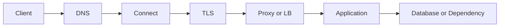



「APIが遅い」は原因診断ではなく症状である。1件のリクエストは、DNSルックアップ、接続確立、TLSネゴシエーション、サーバーでのキューイング、アプリケーション処理、データベース、レスポンス転送を通過する。この経路を分解しなければ、キャッシュ、サーバー増設、再試行のどれを行っても偶然に依存することになる。

## リクエスト経路を階層別に見る



各階層には、それぞれ異なる問いと指標がある。

| 階層 | 確認する問い | 代表的な症状 |
|---|---|---|
| DNS | 名前が正しいアドレスに解決されるか | lookup timeout, stale record |
| 接続 | 対象ポートまで接続できるか | refused, reset, connect timeout |
| TLS | 証明書・名前・時刻・プロトコルが正しいか | handshake failure |
| プロキシ/LB | 正しいupstreamとhealth状態か | 502, 503, 504 |
| アプリケーション | キューとworkerが飽和しているか | 高いqueue time, 5xx |
| 依存先 | DB・外部APIがボトルネックか | pool exhaustion, downstream timeout |

## latencyは平均ではなく分布で見る

平均100 msという値は、大半が50 msで一部が5秒というシステムを隠してしまう可能性がある。最低限、次を併せて確認する。

- リクエスト率と同時実行数
- 成功率およびステータスコード別エラー率
- p50、p95、p99 latency
- 階層別時間：DNS、connect、TLS、time-to-first-byte、download
- サーバーのqueue timeと処理時間
- 依存先別の呼び出し数とlatency

Little's Lawの直感も有用である。

$$L = \lambda W$$

平均処理時間 (W) が増えるか、流入率 (lambda) が処理能力に近づくと、システム内の同時作業数 (L) が増え、キューが急激に長くなる。CPUが100%でなくても、DB connection poolやworker slotが先に飽和することがある。

## timeoutは単一値ではなく予算である

クライアントのdeadlineより各下位呼び出しのtimeout合計が長ければ、上位リクエストはすでに諦めているのに下位処理が続く「ゾンビ処理」が生じる。

```text
전체 요청 deadline: 2.0 s
├── DNS + connect + TLS: 0.3 s
├── 애플리케이션 queue: 0.2 s
├── downstream 호출: 1.0 s
└── 직렬화·응답 및 여유: 0.5 s
```

区別すべきtimeoutは次のとおりである。

- connect timeout：接続確立の待機
- read timeout：接続後のレスポンスデータ待機
- write timeout：リクエスト送信の待機
- pool timeout：connection pool取得の待機
- total deadline：利用者が待つ全体上限

すべての値を単に大きくすると、失敗の発見が遅れ、リソースが長時間占有される。

## retryは障害を増幅し得る

再試行は一時的な障害だけに限定する。すべての階層がそれぞれ3回再試行すれば、実際の1リクエストが何倍にも増える可能性がある。

安全な基本原則は次のとおりである。

1. 全体のretry budgetを定める。
2. 指数backoffとランダムjitterを使う。
3. 明確に一時的なエラーだけを対象とする。
4. サーバーが送った`Retry-After`を尊重する。
5. deadlineを超えた再試行は開始しない。
6. 副作用のあるリクエストはidempotencyが証明された場合だけ自動再試行する。

HTTPではGETのようなsafe methodと、PUT・DELETEのようなidempotent methodは、意味論上、反復実行の意図された効果が1回の実行と同じになるよう定義される。しかし実装がその契約を破る可能性があり、ログや監査履歴などの付随的な効果は増えることがある。POSTによる決済・ジョブ作成のように副作用を持つリクエストには、idempotency keyとサーバー側の重複防止が必要である。

## ステータスコードは診断の出発点である

- `400`：リクエスト形式またはドメイン検証の失敗
- `401`：認証情報がない、または無効
- `403`：認証済みだが権限がない
- `404`：リソースが存在しない、または存在を開示しない
- `409`：現在の状態との競合
- `422`：構文は解釈できたが内容検証に失敗した場合に多く使われる
- `429`：rate limitまたは一時的な過負荷
- `500`：処理できなかったサーバーエラー
- `502`：gatewayがupstreamから有効なレスポンスを受け取れない
- `503`：現在サービスを提供できない
- `504`：gatewayが期限内にupstreamのレスポンスを受け取れない

ステータスコードだけで原因を確定してはならない。同じ`504`でも、プロキシtimeout、サーバーqueue、DB lock、外部API遅延によって発生し得る。

## 障害対応の順序

1. **影響範囲**：どの利用者・地域・バージョン・endpointか。
2. **緩和**：rollback、機能停止、rate limit、scale-outのうち最も安全なものは何か。
3. **階層分解**：どの区間で時間が増え、またはエラーが始まるか。
4. **仮説検証**：変更前後の指標とtraceで原因を確認したか。
5. **復旧確認**：エラー率だけでなくbacklogとtail latencyも正常化したか。
6. **再発防止**：alert、test、capacity model、runbookをどう変更するか。

## Observabilityの最小相関関係

1件のリクエストに`request_id`またはtrace contextを伝播させる。ログ、metric、traceが同じendpoint・version・dependencyを軸に関連付けられていなければならない。

```text
request_id=req-example
route=/v1/jobs
status=504
duration_ms=1900
upstream=worker-service
upstream_duration_ms=1800
attempt=2
```

実際のログには、認証ヘッダー、Cookie、パスワード、生の個人情報を記録しない。

## 検証チェックリスト

- [ ] DNS、connect、TLS、TTFB、サーバー処理時間を分離して測定する。
- [ ] 平均とp95/p99、エラー率、リクエスト率を併せて見る。
- [ ] 上位deadlineが下位timeoutとretryを包含する。
- [ ] retry対象エラーと最大予算が文書化されている。
- [ ] 副作用のある処理にはidempotency keyまたは重複防止制約がある。
- [ ] connection poolとworker queueの飽和を観測する。
- [ ] 障害緩和と根本修正が区別されている。
- [ ] 復旧後にbacklogとtail latencyまで確認する。

## よくある失敗

- `ping`の成功だけでHTTP、TLS、プロキシまで正常だと結論づける。
- timeoutを延ばし続けてリソース枯渇の発見を遅らせる。
- すべての5xxを直ちに再試行して過負荷を拡大する。
- 平均latencyだけを見て、一部利用者の極端な遅延を見逃す。
- クライアントがキャンセルした後もサーバー処理が続く。
- ログに相関識別子がなく、階層を結び付けられない。

優れたネットワーク診断とは、ツール名を多く知ることではなく、**障害を階層と時間予算によって絞り込んでいく過程**である。

## 参考資料

- [RFC 9110 — HTTP Semantics](https://www.rfc-editor.org/rfc/rfc9110.html)
