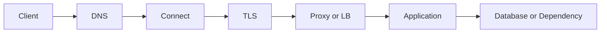



“API가 느리다”는 원인 진단이 아니라 증상이다. 한 요청은 DNS 조회, 연결 수립, TLS 협상, 서버 큐잉, 애플리케이션 처리, 데이터베이스, 응답 전송을 통과한다. 이 경로를 분해하지 않으면 캐시, 서버 증설, 재시도 중 무엇을 해도 우연에 의존하게 된다.

## 요청 경로를 계층별로 본다



각 계층은 다른 질문과 지표를 가진다.

| 계층 | 확인 질문 | 대표 증상 |
|---|---|---|
| DNS | 이름이 올바른 주소로 해석되는가 | lookup timeout, stale record |
| 연결 | 대상 포트까지 연결되는가 | refused, reset, connect timeout |
| TLS | 인증서·이름·시간·프로토콜이 맞는가 | handshake failure |
| 프록시/LB | 올바른 upstream과 health 상태인가 | 502, 503, 504 |
| 애플리케이션 | 큐와 worker가 포화됐는가 | 높은 queue time, 5xx |
| 의존성 | DB/외부 API가 병목인가 | pool exhaustion, downstream timeout |

## latency는 평균이 아니라 분포로 본다

평균 100 ms는 대부분이 50 ms이고 일부가 5초인 시스템을 숨길 수 있다. 최소한 다음을 함께 본다.

- 요청률과 동시성
- 성공률 및 상태 코드별 오류율
- p50, p95, p99 latency
- 계층별 시간: DNS, connect, TLS, time-to-first-byte, download
- 서버 queue time과 처리 시간
- 의존성별 호출 수와 latency

Little's Law의 직관도 유용하다.

$$L = \lambda W$$

평균 처리시간 (W)가 늘거나 유입률 λ가 처리능력에 가까워지면 시스템 내 동시 작업 (L)이 커지고 큐가 급격히 길어진다. CPU가 100%가 아니어도 DB connection pool이나 worker slot이 먼저 포화될 수 있다.

## timeout은 하나가 아니라 예산이다

클라이언트 deadline보다 각 하위 호출 timeout의 합이 길면 상위 요청은 이미 포기했는데 하위 작업이 계속되는 “좀비 작업”이 생긴다.

```text
전체 요청 deadline: 2.0 s
├── DNS + connect + TLS: 0.3 s
├── 애플리케이션 queue: 0.2 s
├── downstream 호출: 1.0 s
└── 직렬화·응답 및 여유: 0.5 s
```

구분해야 할 timeout은 다음과 같다.

- connect timeout: 연결 수립 대기
- read timeout: 연결 후 응답 데이터 대기
- write timeout: 요청 전송 대기
- pool timeout: connection pool 획득 대기
- total deadline: 사용자가 기다릴 전체 상한

단순히 모든 값을 크게 올리면 실패가 늦게 드러나고 자원이 오래 점유된다.

## retry는 실패를 증폭시킬 수 있다

재시도는 일시적인 실패에만 제한한다. 모든 계층이 각각 세 번 재시도하면 실제 한 요청이 여러 번 폭증할 수 있다.

안전한 기본 원칙은 다음과 같다.

1. 전체 retry budget을 정한다.
2. 지수 backoff와 무작위 jitter를 사용한다.
3. 명확히 일시적인 오류만 대상으로 한다.
4. 서버가 보낸 `Retry-After`를 존중한다.
5. deadline을 넘긴 재시도는 시작하지 않는다.
6. 부작용 요청은 idempotency가 증명된 경우에만 자동 재시도한다.

HTTP에서 GET 같은 safe method와 PUT·DELETE 같은 idempotent method는 의미론상 반복 실행의 의도된 효과가 한 번과 같도록 정의된다. 그러나 구현이 그 계약을 깨뜨릴 수 있고, 로그나 감사 이력 같은 부수 효과는 늘 수 있다. POST 결제·작업 생성처럼 부작용이 있는 요청은 idempotency key와 서버 측 중복 방지가 필요하다.

## 상태 코드는 진단의 시작점이다

- `400`: 요청 형식 또는 도메인 검증 실패
- `401`: 인증이 없거나 유효하지 않음
- `403`: 인증됐지만 권한이 없음
- `404`: 리소스가 없거나 노출하지 않음
- `409`: 현재 상태와 충돌
- `422`: 구문은 읽었지만 내용 검증 실패로 사용하는 경우가 많음
- `429`: rate limit 또는 일시적 과부하
- `500`: 처리하지 못한 서버 오류
- `502`: gateway가 upstream에서 유효한 응답을 받지 못함
- `503`: 현재 서비스를 제공할 수 없음
- `504`: gateway가 upstream 응답을 기한 내 받지 못함

상태 코드만으로 원인을 확정해서는 안 된다. 같은 `504`도 프록시 timeout, 서버 queue, DB lock, 외부 API 지연에서 발생할 수 있다.

## 장애 대응 순서

1. **영향 범위**: 어떤 사용자·지역·버전·endpoint인가?
2. **완화**: rollback, 기능 차단, rate limit, scale-out 중 가장 안전한 것은?
3. **계층 분해**: 어느 구간에서 시간이 늘거나 오류가 시작되는가?
4. **가설 검증**: 변경 전후 지표와 trace로 원인을 확인했는가?
5. **복구 확인**: 오류율뿐 아니라 backlog와 tail latency가 정상화됐는가?
6. **재발 방지**: alert, test, capacity model, runbook을 무엇으로 바꿀 것인가?

## 관측성의 최소 상관관계

한 요청에 `request_id` 또는 trace context를 전달한다. 로그, metric, trace가 같은 endpoint·version·dependency 기준으로 연결되어야 한다.

```text
request_id=req-example
route=/v1/jobs
status=504
duration_ms=1900
upstream=worker-service
upstream_duration_ms=1800
attempt=2
```

실제 로그에는 인증 헤더, 쿠키, 비밀번호, 원시 개인정보를 넣지 않는다.

## 검증 체크리스트

- [ ] DNS, connect, TLS, TTFB, 서버 처리 시간을 분리해 측정한다.
- [ ] 평균과 p95/p99, 오류율, 요청률을 함께 본다.
- [ ] 상위 deadline이 하위 timeout과 retry를 감싼다.
- [ ] retry 대상 오류와 최대 예산이 문서화되어 있다.
- [ ] 부작용 작업은 idempotency key 또는 중복 방지 제약이 있다.
- [ ] connection pool과 worker queue 포화를 관측한다.
- [ ] 장애 완화와 근본 수정이 구분되어 있다.
- [ ] 복구 후 backlog와 tail latency까지 확인한다.

## 흔한 실패

- `ping` 성공만으로 HTTP, TLS, 프록시까지 정상이라고 결론낸다.
- timeout을 계속 늘려 자원 고갈을 늦게 발견한다.
- 모든 5xx를 즉시 재시도해 과부하를 키운다.
- 평균 latency만 보고 소수 사용자의 극단적 지연을 놓친다.
- 클라이언트가 취소한 뒤에도 서버 작업이 계속된다.
- 로그에 상관관계 식별자가 없어 계층을 연결하지 못한다.

좋은 네트워크 진단은 도구 이름을 많이 아는 것이 아니라, **실패를 계층과 시간 예산으로 좁혀 가는 과정**이다.

## 참고 자료

- [RFC 9110 — HTTP Semantics](https://www.rfc-editor.org/rfc/rfc9110.html)
