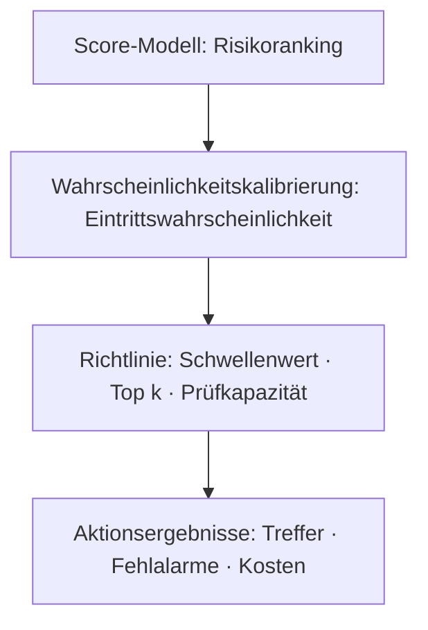



Bei der Erkennung seltener Ereignisse ist die wichtigere Frage nicht „Klassifiziert das Modell gut?“, sondern „Wie viele wichtige Ereignisse können wir mit begrenzten Prüfressourcen erfassen, und können wir die Kosten von Fehlalarmen tragen?“ Ist die Positivrate sehr niedrig, können vertraute Metriken wie Accuracy und ROC-AUC allein diese Frage kaum beantworten.

In diesem Artikel bezeichnet **positiv** das seltene Ereignis, das erkannt werden soll. Es muss nicht zwangsläufig ein schädliches Ereignis sein.

## 1. Das Problem: Warum ein guter Score bei unausgeglichenen Daten zu einer schlechten Richtlinie werden kann

### Accuracy belohnt Vorhersagen der Mehrheitsklasse

Sei die Positivrate \(\pi=P(Y=1)\). Ein Modell, das jede Stichprobe als negativ vorhersagt, besitzt eine Accuracy von \(1-\pi\). Bei kleinem \(\pi\) ist die Accuracy sehr hoch, obwohl das Modell überhaupt nichts erkennt.

Zuerst werden die vier Einträge der Konfusionsmatrix getrennt.

| Tatsächlich / vorhergesagt | Positiv | Negativ |
|---|---:|---:|
| Positiv | TP | FN |
| Negativ | FP | TN |

\[
\text{precision}=\frac{TP}{TP+FP}, \qquad
\text{recall}=\frac{TP}{TP+FN}
\]

- Precision: Anteil der Alarme, die tatsächlich positiv sind
- Recall: Anteil der tatsächlich positiven Fälle, die erfasst wurden

Bei einem unausgeglichenen Problem müssen sowohl „Wie viele positive Fälle fanden wir?“ als auch „Wie viele Alarme wurden dabei verschwendet?“ untersucht werden.

### ROC-AUC misst die Rankingqualität, kann aber die Alarmlast verbergen

Die ROC-Kurve zeigt die Beziehung zwischen TPR und FPR.

\[
\text{TPR}=\frac{TP}{TP+FN}, \qquad
\text{FPR}=\frac{FP}{FP+TN}
\]

Wenn negative Fälle positive bei Weitem übertreffen, kann selbst eine scheinbar niedrige FPR noch sehr viele False Positives erzeugen. Auch bei kleiner FPR kann eine negative Population in Millionenhöhe zahlreiche Fehlalarme zur Prüfung auslösen. ROC-AUC eignet sich zum Vergleich der allgemeinen Rankingfähigkeit, zeigt aber nicht direkt den praktisch betreibbaren Alarmbereich.

### Klassengewichte und Resampling lösen das Schwellenwertproblem nicht

Gewichtete Losses, Oversampling positiver und Undersampling negativer Fälle können das Trainingssignal verbessern. Folgende Fragen bleiben jedoch eigenständig.

- Ist der Ausgabescore eine tatsächliche Wahrscheinlichkeit?
- Entspricht die Positivrate der Betriebsumgebung derjenigen der Trainingsstichprobe?
- Bei welchem Schwellenwert soll das System handeln?
- Wie viele Alarme können verarbeitet werden?
- Wie unterscheiden sich die Kosten eines FN und eines FP?

Trainingsstrategie und Betriebsrichtlinie dürfen nicht gleichgesetzt werden.

## 2. Denkmodell: Einen Detektor in drei Ebenen betrachten – Ranking, Wahrscheinlichkeit und Richtlinie

Ein System für seltene Ereignisse wird verständlicher, wenn es in drei Ebenen geteilt wird.



1. **Rankingebene**: Ordnet das Modell positive Fälle über negativen ein?
2. **Wahrscheinlichkeitsebene**: Entspricht eine Ausgabe von 0,2 einer tatsächlichen Häufigkeit von ungefähr 20 %?
3. **Richtlinienebene**: Welche Fälle sollen angesichts von Kosten und Ressourcen eine Aktion erhalten?

Ein Modell kann gut ranken, aber schlecht kalibriert sein, oder gut kalibriert sein, aber bei einer bestimmten Verarbeitungskapazität unzureichend ranken.

### Die PR-Kurve zeigt unmittelbar die Reinheit der Alarme

Eine Precision-Recall-Kurve zeigt den Trade-off zwischen Precision und Recall bei verändertem Schwellenwert. Die erwartete Precision eines zufällig rankenden Modells entspricht ungefähr der positiven Prävalenz \(\pi\). PR-AUC muss daher zusammen mit der Basisrate interpretiert werden.

PR-AUC kann sich bei unterschiedlichen Positivraten zwischen Zeiträumen oder Gruppen verändern. Selbst bei unveränderter Rankingfähigkeit sinkt die Precision, wenn die Prävalenz abnimmt. Gemeinsam zu berichten sind:

- Positivrate im Evaluationsintervall
- PR-Kurve oder Average Precision
- Precision im betrieblich zulässigen Recall-Bereich
- Leistung in den obersten \(k\) % oder bei täglicher Verarbeitungskapazität

Je nach Implementierung können trapezförmige Integration der PR-Kurve und Average Precision verschiedene Werte ergeben. Berechnungsdefinition und Bibliotheksversion sind im Bericht anzugeben.

### Der optimale Schwellenwert hängt von der Kostenfunktion ab

Die erwarteten Kosten beim Schwellenwert \(t\) können wie folgt definiert werden.

\[
J(t)=C_{FP}FP(t)+C_{FN}FN(t)+C_{R}N_{alert}(t)+C_{delay}D(t)
\]

- \(C_{FP}\): Kosten eines Fehlalarms selbst
- \(C_{FN}\): Kosten einer verpassten Erkennung
- \(C_R\): Kosten der Prüfung eines Alarms
- \(N_{alert}\): Anzahl der Alarme
- \(D\): gesamte oder gewichtete Erkennungsverzögerung

Sind genaue Geldbeträge schwer anzugeben, werden sie als Verhältnisse und Beschränkungen ausgedrückt.

- Recall muss mindestens \(r_{min}\) betragen
- Precision muss mindestens \(p_{min}\) betragen
- höchstens \(B\) Alarme pro Tag
- unter diesen Bedingungen die erwarteten verpassten Erkennungen minimieren

### Kalibrierte Wahrscheinlichkeiten machen Kosten und Richtlinien übertragbar

Eine Wahrscheinlichkeit ist gut kalibriert, wenn die tatsächliche Positivrate unter Stichproben mit Vorhersage \(q\) ebenfalls ungefähr \(q\) beträgt.

\[
P(Y=1\mid \hat{p}=q) \approx q
\]

Sind Kosten und Beschränkungen vollständig, Aktionen binär und Wahrscheinlichkeiten genau, kann ein Schwellenwert durch Vergleich der Kosten von Aktion 1 hergeleitet werden. Sind etwa die FP-Kosten \(C_{FP}\) und die FN-Kosten \(C_{FN}\), gilt unter einfachen Bedingungen:

\[
\text{action} \iff \hat{p} > \frac{C_{FP}}{C_{FP}+C_{FN}}
\]

Reale Systeme besitzen Prüfkosten, Kapazitätsgrenzen und Aktionswirkungen; deshalb muss die Richtlinie auf Validierungsdaten neu bewertet werden. Diese Gleichung ist ein Ausgangspunkt, um die Vorstellung aufzugeben, „0,5 sei der Standardschwellenwert“.

## 3. Praktischer Workflow

### Schritt 1. Seltenes Ereignis und Evaluationseinheit genau definieren

Zuerst sind folgende Punkte festzulegen.

- Sind Ereignis- und Vorhersageeinheit identisch?
- Kann dasselbe Ereignis durch mehrere Alarme wiederholt gezählt werden?
- Wie lange vor dem Ereignis muss eine Erkennung stattfinden, damit sie nützlich ist?
- Wie lange dauert es, bis ein positives Label endgültig ist?
- Wie werden nicht erkennbare Intervalle und Fälle mit unterbrochener Beobachtung behandelt?

Selbst bei hoher zeilenweiser Precision kann ein wiederholter Alarm für dasselbe Ereignis wenig betrieblichen Wert besitzen. Bei Bedarf werden sowohl ereignisbezogene als auch alarmepisodenbezogene Metriken erzeugt.

### Schritt 2. Zeit-, Entitäts- und Ereignisgrenzen in Datensplits bewahren

Da seltene positive Fälle nur in geringer Zahl vorliegen, besitzen zufällige Splits hohe Varianz. Wird jedoch die zeitliche Reihenfolge gebrochen, um positive Fälle gleichmäßig über alle Folds zu verteilen, kann die zukünftige Leistung überschätzt werden.

Empfohlene Reihenfolge:

1. Training, Kalibrierung, Validierung und Test in einer den Betrieb simulierenden zeitlichen Reihenfolge teilen.
2. Aus derselben Entität oder demselben Ereignis abgeleitete Zeilen nur in einem Intervall halten.
3. Enthält der endgültige Test zu wenige positive Fälle oder zu geringe Ereignisvielfalt, einen längeren Beobachtungszeitraum beschaffen.
4. Varianz über mehrere rollierende Fenster messen.
5. Intervalle mit noch nicht ausgereiften aktuellen Labels von der Evaluation ausschließen.

Bei extrem seltenen positiven Fällen werden neben Punktschätzern Bootstrap-Konfidenzintervalle oder zeitraumspezifische Bereiche berichtet. Das Bootstrap erfolgt auf Ereignis- oder Entitätsebene, um die Korrelationsstruktur zu bewahren.

### Schritt 3. Eine einfache, Leakage-freie Ranking-Basislinie erstellen

Ein Vergleich in folgender Reihenfolge erleichtert das Verständnis des Wertes zusätzlicher Komplexität.

1. Zufallsranking und Gesamtbasisrate
2. bestehende Regeln oder einzelner Anomaliescore
3. gewichteter linearer Klassifikator
4. nichtlineares Modell überwachten Lernens
5. unüberwachtes oder teilüberwachtes Anomalieerkennungsmodell
6. bei Bedarf ein Ensemble

Ein unüberwachter Anomaliescore findet, was „ungewöhnlich“ ist; er findet nicht automatisch „wichtige positive Fälle“. Die Leistung kann schlecht sein, wenn viele Stichproben weit von der Normalverteilung entfernt, aber harmlos sind, oder wenn positive Fälle in der Normalverteilung verborgen liegen. Existieren auch nur wenige Labels, ist ein Vergleich mit überwachter Leistung erforderlich.

### Schritt 4. Trainingsungleichgewicht von betrieblicher Prävalenz trennen

Wurde Resampling eingesetzt, unterscheidet sich die Positivrate im Training \(\pi_s\) von der Betriebsrate \(\pi_t\). Die Modellausgabe lässt sich dann schwer direkt als betriebliche Wahrscheinlichkeit interpretieren.

Unter der starken Annahme gleichbleibender bedingter Verteilungen und ausschließlich geändertem Prior können die Odds korrigiert werden.

\[
\frac{p_t}{1-p_t}
=
\frac{p_s}{1-p_s}
\times
\frac{\pi_t/(1-\pi_t)}{\pi_s/(1-\pi_s)}
\]

In der Praxis können sich auch Feature-Verteilungen verändern. Am sichersten ist eine nachträgliche Kalibrierung in einem getrennten, der Betriebsverteilung nahen Kalibrierungsintervall und anschließende Prüfung in einem späteren Validierungs- oder Testintervall.

### Schritt 5. Kalibrierung als eigene Stufe evaluieren

Kalibrierungsverfahren fallen in zwei große Familien.

- **Parametrische Kalibrierung**: nimmt eine einfache Beziehung zwischen Score und Log-Odds an und ist bei begrenzten Daten stabil.
- **Nichtparametrische Kalibrierung**: flexibel, aber bei wenigen seltenen positiven Fällen anfällig für Überanpassung.

Das Kalibrierungsmodell erneut auf den ursprünglichen Trainingsdaten des Modells anzupassen kann optimistisch sein. Verwendet wird ein unabhängiges, zeitlich späteres Kalibrierungsintervall.

Evaluationsmetriken:

- Brier-Score: \(\frac{1}{n}\sum_i(\hat p_i-y_i)^2\)
- Log Loss
- Zuverlässigkeitsdiagramm
- erwarteter Kalibrierungsfehler und Stichprobenzahl in jedem Bin
- lokale Kalibrierung im höchsten Risikobereich, wenn die Positivrate besonders niedrig ist

Eine mittlere Kalibrierung kann über den gesamten Bereich gut wirken, obwohl sie in den obersten 1 %, in denen tatsächlich gehandelt wird, schlecht ist. Der von der Richtlinie genutzte Scorebereich muss vergrößert untersucht werden.

### Schritt 6. Schwellenwerte anhand von Kosten und Beschränkungen auswählen

Die Schwellenwertauswahl muss auf Validierungsdaten abgeschlossen werden, nicht auf Testdaten.

```python
def choose_threshold(y, probability, fp_cost, fn_cost, review_cost, max_alerts):
    candidates = sorted(set(probability), reverse=True)
    feasible = []

    for threshold in candidates:
        alert = probability >= threshold
        if alert.sum() > max_alerts:
            continue

        fp = ((alert == 1) & (y == 0)).sum()
        fn = ((alert == 0) & (y == 1)).sum()
        cost = fp_cost * fp + fn_cost * fn + review_cost * alert.sum()
        feasible.append((cost, threshold))

    return min(feasible)[1]
```

In der Praxis wird Folgendes ergänzt.

- Verarbeitungskapazität je Zeitraum
- Cooldown-Intervall für wiederholte Alarme desselben Ziels
- Behandlung gleicher Scores
- Pufferzone nahe dem Schwellenwert
- Kombination verpflichtender Prüfregeln mit Modellscores
- Sensitivitätsanalyse der Kostenannahmen

Sind Kosten unsicher, werden statt eines einzigen optimalen Schwellenwerts die über einen Bereich von Kostenverhältnissen gewählten Schwellenwerte dargestellt. Ein über einen breiten Bereich beständiger Schwellenwert ist robuster.

### Schritt 7. Schwellenwertfreie und Richtlinienmetriken gemeinsam berichten

Empfohlene Berichtsstruktur:

| Ebene | Metrik | Beantwortete Frage |
|---|---|---|
| Ranking | PR-AUC, ROC-AUC | Ordnet das Modell positive Fälle im Allgemeinen höher ein? |
| beschränkter Bereich | partielle PR, precision@k, recall@k | Ist es bei der realen Verarbeitungskapazität nützlich? |
| Wahrscheinlichkeit | Brier, Log Loss, Zuverlässigkeit | Kann dem Score als Wahrscheinlichkeit vertraut werden? |
| Richtlinie | Kosten, Alarmzahl, Ereigniserfassungsrate | Liefert die gewählte Aktionsregel einen Wert? |
| Stabilität | Bereich nach Zeitraum und Gruppe | Hängt die Leistung von einem bestimmten Intervall ab? |

Ein Modell darf nicht allein anhand von PR-AUC gewählt werden. Ist der Betriebsbereich eng, sind Precision-Recall und Richtlinienkosten in diesem Bereich wichtiger als die Gesamtfläche.

### Schritt 8. Nach dem Deployment Basisrate und Alarmqualität getrennt überwachen

In Systemen mit verzögerten Labels werden sofort verfügbare von später verfügbaren Metriken getrennt.

**Sofortige Metriken**

- Eingabeverteilung und Fehlwertrate
- Scoreverteilung
- Alarmrate und Anteil der höchsten Scores
- Feature-Aktualität und Inferenzlatenz
- Anzahl wiederholter Alarme je Entität

**Metriken nach Labelreife**

- Precision, Recall und Ereigniserfassungsrate
- PR-AUC und Kalibrierung
- tatsächliche Kosten nach Schwellenwert
- Fehler nach Zeitraum und Untergruppe
- Vorlaufzeit der Erkennung

Eine Änderung der Alarmrate allein beweist keine Modellverschlechterung. Änderungen der tatsächlichen Basisrate, Eingabedrift, Richtlinienänderungen und Erfassungsfehler werden getrennt untersucht.

## 4. Prüfliste für Evaluation und Verifikation

### Daten und Labels

- [ ] Positives Ereignis, Vorhersageeinheit und Aggregationsregeln für doppelte Alarme sind angegeben.
- [ ] Positivraten werden getrennt für Training, Kalibrierung, Validierung und Test berichtet.
- [ ] Dasselbe Ereignis oder dieselbe Entität überschreitet keine Split-Grenzen.
- [ ] Reifeverzögerungen aktueller negativer Labels werden berücksichtigt.
- [ ] Nicht beobachtete Fälle werden von echten negativen Fällen unterschieden.

### Metriken

- [ ] Accuracy wurde nicht allein verwendet.
- [ ] PR-AUC-Definition und Evaluationsbasisrate wurden gemeinsam aufgezeichnet.
- [ ] Die Beziehung zwischen ROC-AUC und tatsächlicher Alarmzahl wurde geprüft.
- [ ] Precision@k, Recall@k oder eine Metrik der Verarbeitungskapazität ist verfügbar.
- [ ] Ereignisbezogene Erfassungsrate und doppelte Alarme wurden evaluiert.
- [ ] Konfidenzintervalle wurden auf Zeitraum- oder Entitätsebene berechnet.

### Wahrscheinlichkeiten und Schwellenwerte

- [ ] Wahrscheinlichkeiten wurden nach Trainings-Resampling nicht unverändert interpretiert.
- [ ] Kalibrierungsdaten waren von den ursprünglichen Trainingsdaten des Modells getrennt.
- [ ] Kalibrierung wurde im Aktionsbereich wie auch insgesamt geprüft.
- [ ] Der Schwellenwert wurde anhand von Kosten und Beschränkungen auf Validierungsdaten gewählt.
- [ ] Die ausgewählte Richtlinie wurde genau einmal auf Testdaten evaluiert.
- [ ] Sensitivität gegenüber Kostenverhältnissen und Basisratenänderungen wurde analysiert.

### Betrieb

- [ ] Maximale Alarmverarbeitungskapazität je Zeiteinheit ist in der Richtlinie enthalten.
- [ ] Regeln für Alarmunterdrückung, Gleichstände und fehlende Scores bestehen.
- [ ] Score-Drift und tatsächliche Leistungsdrift werden getrennt überwacht.
- [ ] Bedingungen für Schwellenwertänderung, erneute Kalibrierung und erneutes Modelltraining sind getrennt.
- [ ] Für Modellausfälle besteht eine sichere Standardrichtlinie.

## 5. Einschränkungen und Vorsichtspunkte

Erstens ist PR-AUC keine universelle Metrik. Sie fasst Rankings auch außerhalb des betrieblich relevanten Bereichs zusammen und reagiert empfindlich auf Prävalenzänderungen. Intervallmetriken bei tatsächlicher Verarbeitungskapazität sind stets zusätzlich zu untersuchen.

Zweitens sind Kostenmatrizen gewöhnlich unsicher. Überhöhte Kosten verpasster Erkennungen oder ausgelassene Prüfermüdigkeit und Verzögerung führen zu einem zu aggressiven Schwellenwert. Ein Bereich plausibler Kosten und eine Sensitivitätsanalyse sind ehrlicher als eine einzelne Zahl.

Drittens hängt Wahrscheinlichkeitskalibrierung davon ab, dass die zukünftige Verteilung dem Kalibrierungsintervall ähnelt. Ändern sich Basisrate oder bedingte Verteilungen, reicht eine Rekalibrierung allein möglicherweise nicht aus.

Viertens kann ein Anomaliedetektor neue Ereignistypen finden, doch „anomal“ ist nicht gleich „gefährlich“. Einem unüberwachten Score Bedeutung zuzuweisen erfordert Fachprüfung, Sampling und nachträgliche Labelvergabe.

Schließlich kann die Erkennungsrichtlinie den Beobachtungsprozess im Feld verändern. Werden nur Fälle mit hohen Scores häufiger untersucht, enthalten spätere Daten von der Richtlinie ausgewählte Labels. Ohne Nachverfolgung dieser Rückkopplung lernt das Modell einen von seiner eigenen Richtlinie erzeugten Bias.
