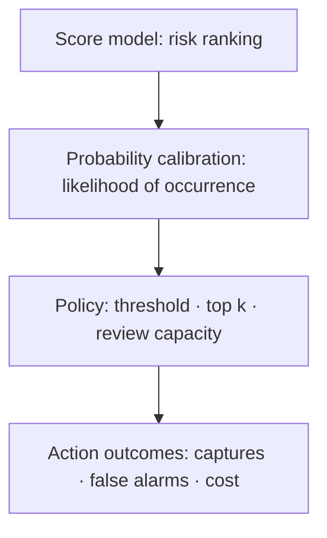



In rare-event detection, the more important question is not “Does the model classify well?” but “How many important events can we capture with limited review resources, and can we afford the false-alarm cost?” When the positive rate is very low, familiar metrics such as accuracy and ROC-AUC alone struggle to answer that question.

In this article, **positive** means the rare event we want to detect. It does not necessarily mean a harmful event.

## 1. The problem: Why a good score can become a bad policy on imbalanced data

### Accuracy rewards majority-class predictions

Let the positive rate be \(\pi=P(Y=1)\). A model that predicts every sample as negative has accuracy \(1-\pi\). When \(\pi\) is small, accuracy is very high even though the model detects nothing.

First, separate the four entries of the confusion matrix.

| Actual / predicted | Positive | Negative |
|---|---:|---:|
| Positive | TP | FN |
| Negative | FP | TN |

\[
\text{precision}=\frac{TP}{TP+FP}, \qquad
\text{recall}=\frac{TP}{TP+FN}
\]

- Precision: The proportion of alerts that are truly positive
- Recall: The proportion of actual positives captured

In an imbalanced problem, you must examine both “How many positives did we find?” and “How many alerts did we waste in the process?”

### ROC-AUC measures ranking quality but can hide the alert burden

The ROC curve shows the relationship between TPR and FPR.

\[
\text{TPR}=\frac{TP}{TP+FN}, \qquad
\text{FPR}=\frac{FP}{FP+TN}
\]

When negatives overwhelmingly outnumber positives, an apparently low FPR can still lead to a large number of false positives. Even with a small FPR, a negative population in the millions may generate many false alarms for review. ROC-AUC is useful for comparing overall ranking ability, but it does not directly reveal the range of alerts that can be operated in practice.

### Class weights and resampling do not solve the threshold problem

Weighted losses, positive oversampling, and negative undersampling can improve the training signal. However, the following questions remain separate.

- Is the output score an actual probability?
- Is the positive rate in the operating environment the same as in the training sample?
- At what threshold should the system act?
- How many alerts can be processed?
- How do the costs of one FN and one FP differ?

Do not treat the training strategy and the operating policy as the same thing.

## 2. Mental model: View a detector as three layers—ranking, probability, and policy

A rare-event system becomes clearer when divided into three layers.



1. **Ranking layer**: Does it place positives above negatives?
2. **Probability layer**: Does an output of 0.2 correspond to an actual frequency of about 20%?
3. **Policy layer**: Given costs and resources, which cases should receive action?

A model can rank well but be poorly calibrated, or be well calibrated but rank inadequately at a particular processing capacity.

### The PR curve directly shows alert purity

A Precision-Recall curve shows the tradeoff between precision and recall as the threshold changes. The expected precision of a random-ranking model is approximately the positive prevalence \(\pi\). PR-AUC must therefore be interpreted together with the base rate.

PR-AUC can change when positive rates differ across periods or groups. Even if a model's ranking ability stays the same, precision falls as prevalence declines. Report the following together:

- The positive rate in the evaluation interval
- The PR curve or Average Precision
- Precision in the operationally feasible recall range
- Performance at the top \(k\)% or at the daily processing capacity

Depending on the implementation, trapezoidal integration of the PR curve and Average Precision may produce different values. State the computational definition and library version in the report.

### The optimal threshold depends on the cost function

Expected cost at threshold \(t\) can be defined as follows.

\[
J(t)=C_{FP}FP(t)+C_{FN}FN(t)+C_{R}N_{alert}(t)+C_{delay}D(t)
\]

- \(C_{FP}\): Cost of a false alarm itself
- \(C_{FN}\): Cost of a missed detection
- \(C_R\): Cost of reviewing one alert
- \(N_{alert}\): Number of alerts
- \(D\): Total or weighted detection delay

If exact monetary costs are difficult to specify, express them as ratios and constraints.

- Recall must be at least \(r_{min}\)
- Precision must be at least \(p_{min}\)
- No more than \(B\) alerts per day
- Subject to those conditions, minimize expected missed detections

### Calibrated probabilities make costs and policies portable

A probability is well calibrated when the actual positive rate among samples predicted as \(q\) is also approximately \(q\).

\[
P(Y=1\mid \hat{p}=q) \approx q
\]

If costs and constraints are complete, actions are binary, and probabilities are accurate, a threshold can be derived by comparing the cost of action 1. For example, if the FP cost is \(C_{FP}\) and the FN cost is \(C_{FN}\), then under simple conditions:

\[
\text{action} \iff \hat{p} > \frac{C_{FP}}{C_{FP}+C_{FN}}
\]

Real systems have review costs, capacity limits, and action effects, so the policy must be reevaluated on validation data. This equation is a starting point for abandoning the idea that “0.5 is the default threshold.”

## 3. Practical workflow

### Step 1. Precisely define the rare event and evaluation unit

First, settle the following points.

- Are the event unit and prediction unit the same?
- Can the same event be counted repeatedly through multiple alerts?
- How far before the event must detection occur to be useful?
- How long does it take for a positive label to become final?
- How are undetectable intervals and cases with interrupted observation handled?

Even with high row-level precision, repeatedly alerting on the same event may have little operational value. If needed, create both event-level and alert-episode-level metrics.

### Step 2. Preserve time, entity, and event boundaries in data splits

Because rare positives are few, random splits have high variance. But breaking chronological order to distribute positives evenly across every fold can overestimate future performance.

The recommended sequence is:

1. Split train, calibration, validation, and test in chronological order that simulates operation.
2. Keep rows derived from the same entity or event in only one interval.
3. If the final test has too few positives or too little event diversity, obtain a longer observation period.
4. Measure variance over multiple rolling windows.
5. Exclude intervals with immature recent labels from evaluation.

When positives are extremely rare, report bootstrap confidence intervals or period-specific ranges alongside point estimates. Bootstrap at the event or entity level to preserve the correlation structure.

### Step 3. Build a simple, leakage-free ranking baseline

Comparing in the following order makes it easier to understand the value of added complexity.

1. Random ranking and the overall base rate
2. Existing rules or a single anomaly score
3. Weighted linear classifier
4. Nonlinear supervised-learning model
5. Unsupervised or semi-supervised anomaly-detection model
6. An ensemble if necessary

An unsupervised anomaly score finds what is “unusual”; it does not automatically find “important positives.” Performance can be poor when many samples are far from the normal distribution but harmless, or when positives are hidden within the normal distribution. If even a few labels exist, compare against supervised performance.

### Step 4. Separate training imbalance from operational prevalence

If resampling was used, the positive rate during training, \(\pi_s\), differs from the operating rate, \(\pi_t\). The model output is difficult to interpret directly as an operational probability.

Under the strong assumption that the conditional distributions remain the same and only the prior changes, the odds can be corrected.

\[
\frac{p_t}{1-p_t}
=
\frac{p_s}{1-p_s}
\times
\frac{\pi_t/(1-\pi_t)}{\pi_s/(1-\pi_s)}
\]

In practice, feature distributions may change as well. The safest method is to fit post-hoc calibration on a separate calibration interval close to the operating distribution, then verify it on a subsequent validation or test interval.

### Step 5. Evaluate calibration as a separate stage

Calibration methods fall into two broad families.

- **Parametric calibration**: Assumes a simple relationship between score and log-odds and is stable with limited data.
- **Nonparametric calibration**: Flexible, but prone to overfitting when there are few rare positives.

Fitting the calibration model again on the original model's training data can be optimistic. Use an independent calibration interval later in time.

Evaluation metrics:

- Brier score: \(\frac{1}{n}\sum_i(\hat p_i-y_i)^2\)
- Log loss
- Reliability diagram
- Expected calibration error and the sample count in each bin
- Local calibration in the highest-risk region when the positive rate is especially low

Average calibration can look good across the full range while being poor in the top 1% where actions are actually taken. Magnify the score region used by the policy.

### Step 6. Select thresholds with costs and constraints

Threshold selection must be completed on validation data, not test data.

```python
def choose_threshold(y, probability, fp_cost, fn_cost, review_cost, max_alerts):
    candidates = sorted(set(probability), reverse=True)
    feasible = []

    for threshold in candidates:
        alert = probability >= threshold
        if alert.sum() > max_alerts:
            continue

        fp = ((alert == 1) & (y == 0)).sum()
        fn = ((alert == 0) & (y == 1)).sum()
        cost = fp_cost * fp + fn_cost * fn + review_cost * alert.sum()
        feasible.append((cost, threshold))

    return min(feasible)[1]
```

In practice, add the following.

- Processing capacity per period
- A cooldown interval for repeated alerts on the same target
- Handling of tied scores
- A buffer zone near the threshold
- Combination of mandatory review rules and model scores
- Sensitivity analysis of cost assumptions

If costs are uncertain, instead of choosing a single optimal threshold, plot the thresholds selected over a range of cost ratios. A threshold that persists across a wide range is more robust.

### Step 7. Report threshold-free metrics and policy metrics together

A recommended reporting structure is:

| Layer | Metric | Question answered |
|---|---|---|
| Ranking | PR-AUC, ROC-AUC | Does the model generally place positives higher? |
| Constrained region | Partial PR, precision@k, recall@k | Is it useful at the actual processing capacity? |
| Probability | Brier, log loss, reliability | Can the score be trusted as a probability? |
| Policy | Cost, alert count, event capture rate | Does the selected action rule provide value? |
| Stability | Range by period and group | Does performance depend on one particular interval? |

Do not choose a model using PR-AUC alone. If the operating region is narrow, precision-recall and policy cost in that region matter more than the full area.

### Step 8. Monitor the base rate and alert quality separately after deployment

In systems where labels arrive late, separate metrics available immediately from delayed metrics.

**Immediate metrics**

- Input distribution and missing-value rate
- Score distribution
- Alert rate and proportion of top scores
- Feature freshness and inference latency
- Number of repeated alerts per entity

**Metrics after labels mature**

- Precision, recall, and event capture rate
- PR-AUC and calibration
- Actual cost by threshold
- Errors by period and subgroup
- Detection lead time

A change in alert rate alone does not prove model degradation. Investigate changes in the actual base rate, input drift, policy changes, and collection failures separately.

## 4. Evaluation and verification checklist

### Data and labels

- [ ] The positive event, prediction unit, and duplicate-alert aggregation rules are specified.
- [ ] Positive rates are reported separately for train, calibration, validation, and test.
- [ ] The same event or entity does not cross split boundaries.
- [ ] Maturation delays in recent negative labels are accounted for.
- [ ] Unobserved cases are distinguished from true negatives.

### Metrics

- [ ] Accuracy was not used alone.
- [ ] The PR-AUC definition and evaluation base rate were recorded together.
- [ ] The relationship between ROC-AUC and the actual number of alerts was checked.
- [ ] Precision@k, recall@k, or a processing-capacity metric is available.
- [ ] Event-level capture rate and duplicate alerts were evaluated.
- [ ] Confidence intervals were computed at the period or entity level.

### Probabilities and thresholds

- [ ] Probabilities were not interpreted unchanged after training resampling.
- [ ] Calibration data was separate from the original model's training data.
- [ ] Calibration was checked in the action region as well as overall.
- [ ] The threshold was selected on validation data using costs and constraints.
- [ ] The selected policy was evaluated once on test data.
- [ ] Sensitivity to cost ratios and base-rate changes was analyzed.

### Operations

- [ ] Maximum alert-processing capacity per unit time is included in the policy.
- [ ] Rules exist for alert suppression, ties, and missing scores.
- [ ] Score drift and actual performance drift are monitored separately.
- [ ] Conditions for threshold changes, calibration refitting, and model retraining are distinct.
- [ ] A safe default policy exists for model failures.

## 5. Limitations and cautions

First, PR-AUC is not a universal metric. It summarizes rankings even outside the region of operational interest and is sensitive to prevalence changes. Always examine interval metrics at the actual processing capacity as well.

Second, cost matrices are usually uncertain. Exaggerating missed-detection costs or omitting reviewer fatigue and delay leads to an overly aggressive threshold. A range of plausible costs and sensitivity analysis are more honest than a single number.

Third, probability calibration depends on the future distribution resembling the calibration interval. If the base rate or conditional distributions change, recalibration alone may not be enough.

Fourth, an anomaly detector may find new types of events, but “anomalous” is not identical to “dangerous.” Assigning meaning to an unsupervised score requires expert review, sampling, and follow-up labeling.

Finally, the detection policy can change the field observation process. If only high-scoring cases are inspected more often, later data will contain labels selected by the policy. Without tracking this feedback loop, the model learns bias created by its own policy.
