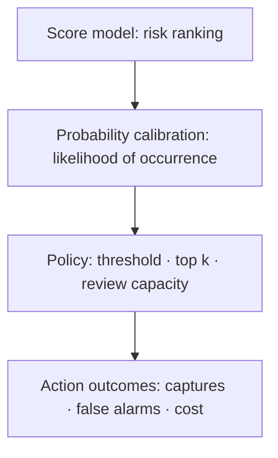



En la detección de eventos raros, la pregunta más importante no es "¿El modelo clasifica bien?" sino "¿Cuántos eventos importantes podemos capturar con recursos de revisión limitados y podemos permitirnos el costo de las falsas alarmas?" Cuando la tasa positiva es muy baja, métricas familiares como la precisión y ROC-AUC por sí solas luchan por responder esa pregunta.

En este artículo, **positivo** significa el evento poco común que queremos detectar. No necesariamente significa un evento dañino.

## 1. El problema: por qué una buena puntuación puede convertirse en una mala política en materia de datos desequilibrados

### La precisión recompensa las predicciones de la clase mayoritaria

Sea la tasa positiva \(\pi=P(Y=1)\). Un modelo que predice que cada muestra es negativa tiene una precisión \(1-\pi\). Cuando \(\pi\) es pequeño, la precisión es muy alta aunque el modelo no detecte nada.

Primero, separe las cuatro entradas de la matriz de confusión.

| Real / previsto | Positivo | Negativo |
|---|---:|---:|
| Positivo | TP | FN |
| Negativo | FP | TN |

\[
\text{precision}=\frac{TP}{TP+FP}, \qquad
\text{recall}=\frac{TP}{TP+FN}
\]

- Precisión: La proporción de alertas que son verdaderamente positivas.
- Recordatorio: la proporción de positivos reales capturados

En un problema desequilibrado, debes examinar "¿Cuántos aspectos positivos encontramos?" y "¿Cuántas alertas desperdiciamos en el proceso?"

### ROC-AUC mide la calidad de la clasificación pero puede ocultar la carga de alertas

La curva ROC muestra la relación entre TPR y FPR.

\[
\text{TPR}=\frac{TP}{TP+FN}, \qquad
\text{FPR}=\frac{FP}{FP+TN}
\]

Cuando los negativos superan abrumadoramente a los positivos, un FPR aparentemente bajo aún puede generar una gran cantidad de falsos positivos. Incluso con un FPR pequeño, una población negativa de millones puede generar muchas falsas alarmas para su revisión. ROC-AUC es útil para comparar la capacidad de clasificación general, pero no revela directamente el rango de alertas que se pueden operar en la práctica.

### Los pesos de clase y el remuestreo no resuelven el problema del umbral

Las pérdidas ponderadas, el sobremuestreo positivo y el submuestreo negativo pueden mejorar la señal de entrenamiento. Sin embargo, las siguientes preguntas permanecen separadas.

- ¿La puntuación obtenida es una probabilidad real?
- ¿La tasa positiva en el entorno operativo es la misma que en la muestra de formación?
- ¿En qué umbral debería actuar el sistema?
- ¿Cuántas alertas se pueden procesar?
- ¿En qué se diferencian los costos de un FN y un FP?

No tratar la estrategia de capacitación y la política operativa como la misma cosa.

## 2. Modelo mental: vea un detector como tres capas: clasificación, probabilidad y política

Un sistema de eventos raros se vuelve más claro cuando se divide en tres capas.



1. **Capa de clasificación**: ¿Coloca los aspectos positivos por encima de los negativos?
2. **Capa de probabilidad**: ¿una salida de 0,2 corresponde a una frecuencia real de aproximadamente el 20%?
3. **Capa de políticas**: dados los costos y recursos, ¿qué casos deberían recibir acción?

Un modelo puede tener una buena clasificación pero estar mal calibrado, o estar bien calibrado pero tener una clasificación inadecuada en una capacidad de procesamiento particular.

### La curva PR muestra directamente la pureza de la alerta

Una curva de recuperación de precisión muestra la compensación entre precisión y recuperación a medida que cambia el umbral. La precisión esperada de un modelo de clasificación aleatoria es aproximadamente la prevalencia positiva \(\pi\). Por lo tanto, PR-AUC debe interpretarse junto con la tarifa base.

PR-AUC puede cambiar cuando las tasas positivas difieren entre períodos o grupos. Incluso si la capacidad de clasificación de un modelo sigue siendo la misma, la precisión disminuye a medida que disminuye la prevalencia. Informen juntos lo siguiente:

- La tasa positiva en el intervalo de evaluación.
- La curva PR o Precisión Promedio
- Precisión en el rango de recuperación operativamente factible
- Rendimiento al máximo \(k\)% o a la capacidad de procesamiento diaria

Dependiendo de la implementación, la integración trapezoidal de la curva PR y la precisión promedio pueden producir valores diferentes. Indique la definición computacional y la versión de la biblioteca en el informe.

### El umbral óptimo depende de la función de costo.

El costo esperado en el umbral \(t\) se puede definir de la siguiente manera.

\[
J(t)=C_{FP}FP(t)+C_{FN}FN(t)+C_{R}N_{alert}(t)+C_{delay}D(t)
\]

- \(C_{FP}\): Coste de una falsa alarma propiamente dicha
- \(C_{FN}\): Costo de una detección perdida
- \(C_R\): Costo de revisar una alerta
- \(N_{alert}\): Número de alertas
- \(D\): Retardo de detección total o ponderado

Si es difícil especificar los costos monetarios exactos, expréselos como razones y restricciones.

- El retiro debe ser al menos \(r_{min}\)
- La precisión debe ser al menos \(p_{min}\)
- No más de alertas \(B\) por día
- Sujeto a esas condiciones, minimizar las detecciones perdidas esperadas

### Las probabilidades calibradas hacen que los costos y las políticas sean portátiles

Una probabilidad está bien calibrada cuando la tasa positiva real entre las muestras predichas como \(q\) también es aproximadamente \(q\).

\[
P(Y=1\mid \hat{p}=q) \approx q
\]

Si los costos y las restricciones están completos, las acciones son binarias y las probabilidades son precisas, se puede derivar un umbral comparando el costo de la acción 1. Por ejemplo, si el costo FP es \(C_{FP}\) y el costo FN es \(C_{FN}\), entonces, en condiciones simples:

\[
\text{action} \iff \hat{p} > \frac{C_{FP}}{C_{FP}+C_{FN}}
\]

Los sistemas reales tienen costos de revisión, límites de capacidad y efectos de acción, por lo que la política debe reevaluarse en función de los datos de validación. Esta ecuación es un punto de partida para abandonar la idea de que “0,5 es el umbral predeterminado”.

## 3. Flujo de trabajo práctico

### Paso 1. Definir con precisión el evento raro y la unidad de evaluación

Primero, resuelva los siguientes puntos.

- ¿Son iguales la unidad de evento y la unidad de predicción?
- ¿Se puede contar repetidamente el mismo evento a través de múltiples alertas?
- ¿Con qué antelación debe realizarse la detección para que sea útil?
- ¿Cuánto tiempo tarda una etiqueta positiva en ser definitiva?
- ¿Cómo se manejan los intervalos indetectables y los casos con observación interrumpida?

Incluso con una alta precisión a nivel de fila, alertar repetidamente sobre el mismo evento puede tener poco valor operativo. Si es necesario, cree métricas tanto a nivel de evento como a nivel de episodio de alerta.

### Paso 2. Preservar los límites de tiempo, entidad y evento en las divisiones de datos

Debido a que los positivos raros son pocos, las divisiones aleatorias tienen una gran variación. Pero romper el orden cronológico para distribuir los aspectos positivos de manera uniforme en todos los pliegues puede sobreestimar el desempeño futuro.

La secuencia recomendada es:

1. Dividir tren, calibración, validación y prueba en orden cronológico que simule la operación.
2. Mantenga las filas derivadas de la misma entidad o evento en un solo intervalo.
3. Si la prueba final tiene muy pocos positivos o muy poca diversidad de eventos, obtenga un período de observación más largo.
4. Mida la variación en múltiples ventanas móviles.
5. Excluir de la evaluación los intervalos con etiquetas recientes inmaduras.

Cuando los resultados positivos sean extremadamente raros, informe los intervalos de confianza de arranque o los rangos específicos de un período junto con las estimaciones puntuales. Arranque a nivel de evento o entidad para preservar la estructura de correlación.

### Paso 3. Cree una base de clasificación sencilla y sin fugas

Comparar en el siguiente orden hace que sea más fácil comprender el valor de la complejidad agregada.

1. Clasificación aleatoria y tasa base general
2. Reglas existentes o puntuación de anomalía única
3. Clasificador lineal ponderado
4. Modelo de aprendizaje supervisado no lineal
5. Modelo de detección de anomalías no supervisado o semisupervisado
6. Un conjunto si es necesario

Una puntuación de anomalía no supervisada encuentra lo que es "inusual"; no encuentra automáticamente "aspectos positivos importantes". El rendimiento puede ser deficiente cuando muchas muestras están lejos de la distribución normal pero son inofensivas, o cuando los aspectos positivos están ocultos dentro de la distribución normal. Si existen incluso unas pocas etiquetas, compárelas con el rendimiento supervisado.

### Paso 4. Separar el desequilibrio de formación de la prevalencia operativa

Si se utilizó el remuestreo, la tasa positiva durante el entrenamiento, \(\pi_s\), difiere de la tasa operativa, \(\pi_t\). El resultado del modelo es difícil de interpretar directamente como una probabilidad operativa.

Bajo el fuerte supuesto de que las distribuciones condicionales siguen siendo las mismas y sólo los cambios anteriores, las probabilidades se pueden corregir.

\[
\frac{p_t}{1-p_t}
=
\frac{p_s}{1-p_s}
\times
\frac{\pi_t/(1-\pi_t)}{\pi_s/(1-\pi_s)}
\]

En la práctica, las distribuciones de características también pueden cambiar. El método más seguro es realizar una calibración post hoc en un intervalo de calibración separado cercano a la distribución operativa y luego verificarla en un intervalo de validación o prueba posterior.

### Paso 5. Evaluar la calibración como una etapa separada

Los métodos de calibración se dividen en dos grandes familias.

- **Calibración paramétrica**: asume una relación simple entre la puntuación y las probabilidades logarítmicas y es estable con datos limitados.
- **Calibración no paramétrica**: flexible, pero propenso al sobreajuste cuando hay pocos positivos raros.

Ajustar el modelo de calibración nuevamente a los datos de entrenamiento del modelo original puede ser optimista. Utilice un intervalo de calibración independiente más adelante.

Métricas de evaluación:

- Puntuación de zarzo: \(\frac{1}{n}\sum_i(\hat p_i-y_i)^2\)
- Pérdida de registro
- Diagrama de confiabilidad
- Error de calibración esperado y recuento de muestras en cada contenedor
- Calibración local en la región de mayor riesgo cuando la tasa positiva es especialmente baja

La calibración promedio puede verse bien en todo el rango, pero ser deficiente en el 1% superior donde realmente se toman medidas. Amplíe la región de puntuación utilizada por la política.

### Paso 6. Seleccionar umbrales con costos y restricciones

La selección del umbral debe completarse con datos de validación, no con datos de prueba.

```python
def choose_threshold(y, probability, fp_cost, fn_cost, review_cost, max_alerts):
    candidates = sorted(set(probability), reverse=True)
    feasible = []

    for threshold in candidates:
        alert = probability >= threshold
        if alert.sum() > max_alerts:
            continue

        fp = ((alert == 1) & (y == 0)).sum()
        fn = ((alert == 0) & (y == 1)).sum()
        cost = fp_cost * fp + fn_cost * fn + review_cost * alert.sum()
        feasible.append((cost, threshold))

    return min(feasible)[1]
```

En la práctica, agregue lo siguiente.

- Capacidad de procesamiento por período
- Un intervalo de recuperación para alertas repetidas en el mismo objetivo
- Manejo de puntuaciones empatadas.
- Una zona de amortiguamiento cerca del umbral
- Combinación de reglas de revisión obligatorias y puntuaciones modelo.
- Análisis de sensibilidad de supuestos de costes.

Si los costos son inciertos, en lugar de elegir un único umbral óptimo, grafique los umbrales seleccionados sobre un rango de relaciones de costos. Un umbral que persiste en un amplio rango es más sólido.

### Paso 7. Informar juntas las métricas sin umbral y las métricas de políticas

Una estructura de informes recomendada es:

| Capa | Métrica | Pregunta respondida |
|---|---|---|
| Clasificación | PR-AUC, ROC-AUC | ¿El modelo generalmente sitúa los aspectos positivos en un nivel más alto? |
| Región restringida | Parcial PR, precisión@k, recuperación@k | ¿Es útil con la capacidad de procesamiento real? |
| Probabilidad | Brier, pérdida de registros, confiabilidad | ¿Se puede confiar en la puntuación como una probabilidad? |
| Política | Costo, recuento de alertas, tasa de captura de eventos | ¿La regla de acción seleccionada proporciona valor? |
| Estabilidad | Rango por periodo y grupo | ¿El rendimiento depende de un intervalo en particular? |

No elija un modelo que utilice solo PR-AUC. Si la región operativa es estrecha, el retiro de precisión y el costo de la política en esa región importan más que el área completa.

### Paso 8. Supervise la tasa base y la calidad de las alertas por separado después de la implementación

En sistemas donde las etiquetas llegan tarde, separe las métricas disponibles inmediatamente de las métricas retrasadas.

**Métricas inmediatas**

- Distribución de entradas y tasa de valores perdidos.
- Distribución de puntuación
- Tasa de alerta y proporción de puntuaciones máximas.
- Característica de frescura y latencia de inferencia.
- Número de alertas repetidas por entidad

**Métricas después de que las etiquetas maduran**

- Precisión, recuperación y tasa de captura de eventos
- PR-AUC y calibración
- Costo real por umbral
- Errores por periodo y subgrupo
- Plazo de detección

Un cambio en la tasa de alerta por sí solo no prueba la degradación del modelo. Investigue por separado los cambios en la tasa base real, la desviación de los insumos, los cambios de políticas y las fallas en la recaudación.

## 4. Lista de verificación de evaluación y verificación

### Datos y etiquetas

- [] Se especifican el evento positivo, la unidad de predicción y las reglas de agregación de alertas duplicadas.
- [ ] Las tasas positivas se informan por separado para entrenamiento, calibración, validación y prueba.
- [ ] El mismo evento o entidad no cruza fronteras divididas.
- [ ] Se contabilizan retrasos en la maduración en etiquetas negativas recientes.
- [ ] Los casos no observados se distinguen de los verdaderos negativos.

### Métricas

- [ ] La precisión no se utilizó sola.
- [ ] La definición PR-AUC y la tasa base de evaluación se registraron juntas.
- [ ] Se verificó la relación entre ROC-AUC y el número real de alertas.
- [ ] Precision@k, retirada@k o una métrica de capacidad de procesamiento está disponible.
- [ ] Se evaluaron la tasa de captura a nivel de evento y las alertas duplicadas.
- [ ] Los intervalos de confianza se calcularon a nivel de período o entidad.

### Probabilidades y umbrales

- [] Las probabilidades no se interpretaron sin cambios después del remuestreo del entrenamiento.
- [] Los datos de calibración estaban separados de los datos de entrenamiento del modelo original.
- [ ] Se verificó la calibración en la región de acción y en general.
- [ ] El umbral se seleccionó a partir de los datos de validación utilizando costos y restricciones.
- [] La política seleccionada se evaluó una vez en los datos de prueba.
- [ ] Se analizó la sensibilidad a los ratios de costos y cambios en la tarifa base.

### Operaciones

- [ ] La capacidad máxima de procesamiento de alertas por unidad de tiempo está incluida en la política.
- [ ] Existen reglas para la supresión de alertas, empates y puntuaciones faltantes.
- [] La desviación de la puntuación y la desviación del rendimiento real se monitorean por separado.
- [ ] Las condiciones para los cambios de umbral, el reacondicionamiento de la calibración y el reentrenamiento del modelo son distintas.
- [] Existe una política predeterminada segura para fallas del modelo.

## 5. Limitaciones y precauciones

Primero, PR-AUC no es una métrica universal. Resume clasificaciones incluso fuera de la región de interés operativo y es sensible a los cambios de prevalencia. Examine siempre también las métricas de intervalo en la capacidad de procesamiento real.

En segundo lugar, las matrices de costos suelen ser inciertas. Exagerar los costos de detección fallida u omitir la fatiga y las demoras del revisor conduce a un umbral demasiado agresivo. Una variedad de costos plausibles y análisis de sensibilidad son más honestos que un solo número.

En tercer lugar, la calibración de probabilidad depende de la distribución futura que se asemeja al intervalo de calibración. Si la tasa base o las distribuciones condicionales cambian, la recalibración por sí sola puede no ser suficiente.

En cuarto lugar, un detector de anomalías puede encontrar nuevos tipos de eventos, pero "anómalo" no es idéntico a "peligroso". Asignar significado a una puntuación no supervisada requiere revisión de expertos, muestreo y etiquetado de seguimiento.

Finalmente, la política de detección puede cambiar el proceso de observación de campo. Si sólo se inspeccionan con mayor frecuencia los casos con puntuación alta, los datos posteriores contendrán etiquetas seleccionadas por la política. Sin realizar un seguimiento de este circuito de retroalimentación, el modelo aprende el sesgo creado por su propia política.
