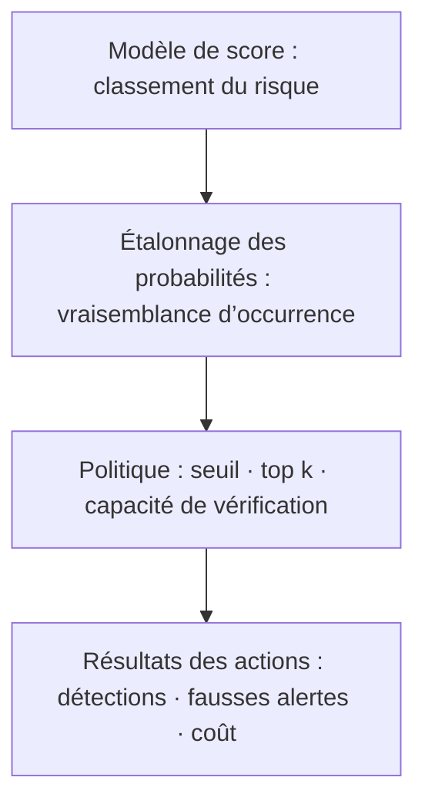



Dans la détection d’événements rares, la question la plus importante n’est pas « Le modèle classe-t-il bien ? », mais « Combien d’événements importants pouvons-nous capter avec des ressources de vérification limitées, et pouvons-nous supporter le coût des fausses alertes ? » Lorsque le taux de positifs est très faible, des métriques familières comme l’exactitude et la ROC-AUC ne suffisent pas à répondre.

Dans cet article, **positif** désigne l’événement rare que nous voulons détecter. Il ne s’agit pas nécessairement d’un événement nuisible.

## 1. Le problème : pourquoi un bon score peut conduire à une mauvaise politique sur des données déséquilibrées

### L’exactitude récompense les prédictions de la classe majoritaire

Soit \(\pi=P(Y=1)\) le taux de positifs. Un modèle qui prédit chaque échantillon comme négatif obtient une exactitude de \(1-\pi\). Lorsque \(\pi\) est faible, cette exactitude est très élevée alors même que le modèle ne détecte rien.

Commençons par distinguer les quatre cases de la matrice de confusion.

| Réel / prédit | Positif | Négatif |
|---|---:|---:|
| Positif | TP | FN |
| Négatif | FP | TN |

\[
\text{precision}=\frac{TP}{TP+FP}, \qquad
\text{recall}=\frac{TP}{TP+FN}
\]

- Précision : proportion des alertes qui sont réellement positives
- Rappel : proportion des positifs réels qui ont été détectés

Dans un problème déséquilibré, il faut examiner à la fois « Combien de positifs avons-nous trouvés ? » et « Combien d’alertes avons-nous gaspillées pour y parvenir ? »

### La ROC-AUC mesure la qualité du classement mais peut masquer la charge d’alertes

La courbe ROC montre la relation entre TPR et FPR.

\[
\text{TPR}=\frac{TP}{TP+FN}, \qquad
\text{FPR}=\frac{FP}{FP+TN}
\]

Lorsque les négatifs sont immensément plus nombreux que les positifs, un FPR apparemment faible peut encore produire beaucoup de faux positifs. Même un petit FPR appliqué à des millions de négatifs peut générer de nombreuses fausses alertes à examiner. La ROC-AUC permet de comparer la capacité générale de classement, mais ne révèle pas directement la plage d’alertes exploitable en pratique.

### Les poids de classe et le rééchantillonnage ne résolvent pas le problème du seuil

Les pertes pondérées, le suréchantillonnage positif et le sous-échantillonnage négatif peuvent améliorer le signal d’entraînement. Les questions suivantes restent toutefois distinctes.

- Le score produit est-il une véritable probabilité ?
- Le taux de positifs de l’environnement d’exploitation est-il identique à celui de l’échantillon d’entraînement ?
- À quel seuil le système doit-il agir ?
- Combien d’alertes peuvent être traitées ?
- Comment les coûts d’un FN et d’un FP diffèrent-ils ?

Ne confondez pas stratégie d’entraînement et politique d’exploitation.

## 2. Modèle mental : voir un détecteur comme trois couches — classement, probabilité et politique

Un système de détection d’événements rares devient plus clair lorsqu’on le divise en trois couches.



1. **Couche de classement** : place-t-elle les positifs au-dessus des négatifs ?
2. **Couche de probabilité** : une sortie de 0,2 correspond-elle à une fréquence réelle proche de 20 % ?
3. **Couche de politique** : compte tenu des coûts et ressources, quels cas doivent déclencher une action ?

Un modèle peut bien classer mais être mal étalonné, ou être bien étalonné mais mal classer dans une capacité de traitement donnée.

### La courbe PR montre directement la pureté des alertes

Une courbe précision-rappel montre le compromis entre précision et rappel à mesure que le seuil varie. La précision attendue d’un modèle au classement aléatoire est approximativement la prévalence positive \(\pi\). La PR-AUC doit donc être interprétée avec le taux de base.

La PR-AUC peut varier lorsque les taux de positifs diffèrent selon les périodes ou groupes. Même si la capacité de classement du modèle ne change pas, la précision diminue quand la prévalence baisse. Rapportez ensemble :

- le taux de positifs pendant l’intervalle d’évaluation ;
- la courbe PR ou la précision moyenne ;
- la précision dans la plage de rappel réalisable en exploitation ;
- les performances sur les \(k\) % supérieurs ou à la capacité de traitement quotidienne.

Selon l’implémentation, l’intégration trapézoïdale de la courbe PR et la précision moyenne peuvent donner des valeurs différentes. Indiquez la définition de calcul et la version de la bibliothèque dans le rapport.

### Le seuil optimal dépend de la fonction de coût

Le coût attendu au seuil \(t\) peut se définir ainsi.

\[
J(t)=C_{FP}FP(t)+C_{FN}FN(t)+C_{R}N_{alert}(t)+C_{delay}D(t)
\]

- \(C_{FP}\) : coût propre à une fausse alerte
- \(C_{FN}\) : coût d’une détection manquée
- \(C_R\) : coût de vérification d’une alerte
- \(N_{alert}\) : nombre d’alertes
- \(D\) : délai de détection total ou pondéré

Si les coûts monétaires exacts sont difficiles à préciser, exprimez-les sous forme de rapports et de contraintes.

- Le rappel doit être au moins égal à \(r_{min}\)
- La précision doit être au moins égale à \(p_{min}\)
- Pas plus de \(B\) alertes par jour
- Sous ces contraintes, minimiser le nombre attendu de détections manquées

### Des probabilités étalonnées rendent coûts et politiques transférables

Une probabilité est bien étalonnée lorsque le taux de positifs réel parmi les échantillons auxquels la valeur \(q\) est prédite est lui aussi proche de \(q\).

\[
P(Y=1\mid \hat{p}=q) \approx q
\]

Si les coûts et contraintes sont complets, les actions binaires et les probabilités exactes, un seuil peut être déduit en comparant le coût de l’action 1. Par exemple, si le coût d’un FP est \(C_{FP}\) et celui d’un FN est \(C_{FN}\), alors, dans des conditions simples :

\[
\text{action} \iff \hat{p} > \frac{C_{FP}}{C_{FP}+C_{FN}}
\]

Les systèmes réels comportent des coûts de vérification, des limites de capacité et des effets d’action ; la politique doit donc être réévaluée sur les données de validation. Cette équation constitue un point de départ pour abandonner l’idée que « 0,5 est le seuil par défaut ».

## 3. Flux de travail pratique

### Étape 1. Définir précisément l’événement rare et l’unité d’évaluation

Commencez par trancher les points suivants.

- L’unité d’événement et l’unité de prédiction sont-elles les mêmes ?
- Un même événement peut-il être compté plusieurs fois à travers plusieurs alertes ?
- Combien de temps avant l’événement faut-il le détecter pour que cela soit utile ?
- Combien de temps faut-il pour qu’une étiquette positive devienne définitive ?
- Comment traite-t-on les intervalles indétectables et les observations interrompues ?

Même avec une grande précision au niveau des lignes, alerter plusieurs fois sur le même événement peut présenter peu de valeur opérationnelle. Si nécessaire, créez des métriques à la fois au niveau des événements et des épisodes d’alerte.

### Étape 2. Préserver les limites temporelles, d’entité et d’événement dans les découpages de données

Comme les positifs rares sont peu nombreux, les découpages aléatoires présentent une forte variance. Mais rompre l’ordre chronologique afin de répartir uniformément les positifs dans tous les plis peut surestimer les performances futures.

La séquence recommandée est la suivante :

1. Découper entraînement, étalonnage, validation et test dans un ordre chronologique qui simule l’exploitation.
2. Conserver les lignes provenant de la même entité ou du même événement dans un seul intervalle.
3. Si le test final contient trop peu de positifs ou trop peu de diversité d’événements, obtenir une période d’observation plus longue.
4. Mesurer la variance sur plusieurs fenêtres glissantes.
5. Exclure de l’évaluation les intervalles dont les étiquettes récentes ne sont pas encore arrivées à maturité.

Lorsque les positifs sont extrêmement rares, rapportez des intervalles de confiance par bootstrap ou des plages propres à chaque période avec les estimations ponctuelles. Effectuez le bootstrap au niveau de l’événement ou de l’entité afin de préserver la structure de corrélation.

### Étape 3. Construire une référence de classement simple et sans fuite

Comparer dans l’ordre suivant permet de mieux comprendre la valeur de la complexité ajoutée.

1. Classement aléatoire et taux de base global
2. Règles existantes ou score d’anomalie unique
3. Classifieur linéaire pondéré
4. Modèle d’apprentissage supervisé non linéaire
5. Modèle de détection d’anomalies non supervisé ou semi-supervisé
6. Ensemble, si nécessaire

Un score d’anomalie non supervisé trouve ce qui est « inhabituel » ; il ne trouve pas automatiquement les « positifs importants ». Les performances peuvent être médiocres lorsque de nombreux échantillons éloignés de la distribution normale sont inoffensifs, ou lorsque les positifs sont cachés dans cette distribution. Même avec très peu d’étiquettes, comparez aux performances supervisées.

### Étape 4. Séparer le déséquilibre d’entraînement de la prévalence opérationnelle

En cas de rééchantillonnage, le taux de positifs de l’entraînement, \(\pi_s\), diffère du taux opérationnel, \(\pi_t\). Il devient difficile d’interpréter directement la sortie du modèle comme une probabilité opérationnelle.

Sous l’hypothèse forte que les distributions conditionnelles restent identiques et que seul l’a priori change, les cotes peuvent être corrigées.

\[
\frac{p_t}{1-p_t}
=
\frac{p_s}{1-p_s}
\times
\frac{\pi_t/(1-\pi_t)}{\pi_s/(1-\pi_s)}
\]

En pratique, les distributions des caractéristiques peuvent également changer. La méthode la plus sûre consiste à ajuster a posteriori l’étalonnage sur un intervalle distinct proche de la distribution d’exploitation, puis à le vérifier sur un intervalle de validation ou de test ultérieur.

### Étape 5. Évaluer l’étalonnage comme une étape distincte

Les méthodes d’étalonnage se répartissent en deux grandes familles.

- **Étalonnage paramétrique** : suppose une relation simple entre score et log-cote et reste stable avec peu de données.
- **Étalonnage non paramétrique** : flexible, mais sujet au surajustement lorsqu’il y a peu de positifs rares.

Réajuster le modèle d’étalonnage sur les données d’entraînement du modèle original peut produire une évaluation optimiste. Utilisez un intervalle d’étalonnage indépendant et postérieur dans le temps.

Métriques d’évaluation :

- score de Brier : \(\frac{1}{n}\sum_i(\hat p_i-y_i)^2\)
- perte logarithmique
- diagramme de fiabilité
- erreur d’étalonnage attendue et nombre d’échantillons dans chaque tranche
- étalonnage local dans la région de risque maximal lorsque le taux de positifs est particulièrement faible

L’étalonnage moyen peut sembler bon sur toute la plage tout en étant mauvais dans le 1 % supérieur où les actions sont réellement menées. Agrandissez la région de score utilisée par la politique.

### Étape 6. Sélectionner les seuils à partir des coûts et contraintes

La sélection du seuil doit être achevée sur les données de validation, et non sur celles de test.

```python
def choose_threshold(y, probability, fp_cost, fn_cost, review_cost, max_alerts):
    candidates = sorted(set(probability), reverse=True)
    feasible = []

    for threshold in candidates:
        alert = probability >= threshold
        if alert.sum() > max_alerts:
            continue

        fp = ((alert == 1) & (y == 0)).sum()
        fn = ((alert == 0) & (y == 1)).sum()
        cost = fp_cost * fp + fn_cost * fn + review_cost * alert.sum()
        feasible.append((cost, threshold))

    return min(feasible)[1]
```

En pratique, ajoutez les éléments suivants.

- Capacité de traitement par période
- Délai de carence pour les alertes répétées sur la même cible
- Traitement des scores ex æquo
- Zone tampon autour du seuil
- Combinaison de règles de vérification obligatoire et des scores du modèle
- Analyse de sensibilité des hypothèses de coût

Si les coûts sont incertains, au lieu de choisir un seuil optimal unique, tracez les seuils sélectionnés pour une plage de rapports de coûts. Un seuil qui persiste sur une large plage est plus robuste.

### Étape 7. Rapporter ensemble les métriques indépendantes du seuil et celles de la politique

Structure de rapport recommandée :

| Couche | Métrique | Question traitée |
|---|---|---|
| Classement | PR-AUC, ROC-AUC | Le modèle place-t-il généralement les positifs plus haut ? |
| Région contrainte | PR partielle, précision@k, rappel@k | Est-il utile à la capacité réelle de traitement ? |
| Probabilité | Brier, perte logarithmique, fiabilité | Peut-on faire confiance au score comme probabilité ? |
| Politique | Coût, nombre d’alertes, taux de détection d’événements | La règle d’action choisie apporte-t-elle de la valeur ? |
| Stabilité | Plage par période et groupe | Les performances dépendent-elles d’un intervalle particulier ? |

Ne choisissez pas un modèle sur la seule PR-AUC. Si la région opérationnelle est étroite, précision-rappel et coût de politique dans cette région comptent davantage que l’aire complète.

### Étape 8. Surveiller séparément le taux de base et la qualité des alertes après le déploiement

Dans les systèmes où les étiquettes arrivent tardivement, séparez les métriques immédiatement disponibles des métriques différées.

**Métriques immédiates**

- Distribution des entrées et taux de valeurs manquantes
- Distribution des scores
- Taux d’alertes et proportion des meilleurs scores
- Fraîcheur des caractéristiques et latence d’inférence
- Nombre d’alertes répétées par entité

**Métriques disponibles après maturation des étiquettes**

- Précision, rappel et taux de détection des événements
- PR-AUC et étalonnage
- Coût réel par seuil
- Erreurs par période et sous-groupe
- Temps d’anticipation de la détection

Une variation du seul taux d’alertes ne prouve pas une dégradation du modèle. Étudiez séparément les changements du taux de base réel, la dérive des entrées, les modifications de politique et les défaillances de collecte.

## 4. Liste de vérification de l’évaluation

### Données et étiquettes

- [ ] L’événement positif, l’unité de prédiction et les règles d’agrégation des alertes en double sont précisés.
- [ ] Les taux de positifs sont rapportés séparément pour l’entraînement, l’étalonnage, la validation et le test.
- [ ] Un même événement ou une même entité ne franchit pas les limites des découpages.
- [ ] Les délais de maturation des étiquettes négatives récentes sont pris en compte.
- [ ] Les cas non observés sont distingués des vrais négatifs.

### Métriques

- [ ] L’exactitude n’a pas été utilisée seule.
- [ ] La définition de la PR-AUC et le taux de base de l’évaluation ont été consignés ensemble.
- [ ] La relation entre ROC-AUC et nombre réel d’alertes a été vérifiée.
- [ ] Une métrique de précision@k, rappel@k ou capacité de traitement est disponible.
- [ ] Le taux de détection au niveau des événements et les alertes en double ont été évalués.
- [ ] Des intervalles de confiance ont été calculés au niveau de la période ou de l’entité.

### Probabilités et seuils

- [ ] Les probabilités n’ont pas été interprétées sans correction après rééchantillonnage de l’entraînement.
- [ ] Les données d’étalonnage étaient distinctes des données d’entraînement du modèle original.
- [ ] L’étalonnage a été vérifié dans la région d’action ainsi que globalement.
- [ ] Le seuil a été sélectionné sur les données de validation au moyen des coûts et contraintes.
- [ ] La politique choisie a été évaluée une fois sur les données de test.
- [ ] La sensibilité aux rapports de coûts et aux variations du taux de base a été analysée.

### Exploitation

- [ ] La capacité maximale de traitement des alertes par unité de temps est intégrée à la politique.
- [ ] Il existe des règles pour la suppression des alertes, les ex æquo et les scores manquants.
- [ ] La dérive des scores et celle des performances réelles sont surveillées séparément.
- [ ] Les conditions de changement de seuil, de réajustement de l’étalonnage et de réentraînement du modèle sont distinctes.
- [ ] Une politique sûre par défaut existe en cas de défaillance du modèle.

## 5. Limites et précautions

Premièrement, la PR-AUC n’est pas une métrique universelle. Elle résume le classement même hors de la région opérationnellement intéressante et elle est sensible aux changements de prévalence. Examinez toujours aussi les métriques d’intervalle à la capacité réelle de traitement.

Deuxièmement, les matrices de coûts sont généralement incertaines. Exagérer le coût des détections manquées ou omettre la fatigue et les délais des analystes conduit à un seuil trop agressif. Une plage de coûts plausibles et une analyse de sensibilité sont plus honnêtes qu’un chiffre unique.

Troisièmement, l’étalonnage des probabilités suppose que la distribution future ressemble à l’intervalle d’étalonnage. Si le taux de base ou les distributions conditionnelles changent, un simple réétalonnage peut ne pas suffire.

Quatrièmement, un détecteur d’anomalies peut trouver de nouveaux types d’événements, mais « anormal » ne signifie pas « dangereux ». Donner un sens à un score non supervisé exige une expertise métier, un échantillonnage et un étiquetage de suivi.

Enfin, la politique de détection peut modifier le processus d’observation sur le terrain. Si seuls les cas à score élevé sont inspectés plus souvent, les données ultérieures contiendront des étiquettes sélectionnées par la politique. Sans suivi de cette boucle de rétroaction, le modèle apprend le biais créé par sa propre politique.
