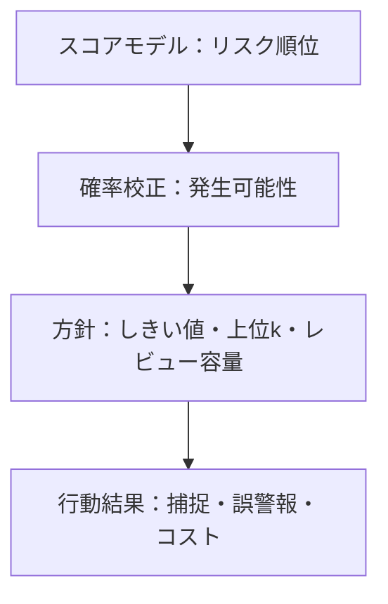



希少事象の検知では、「モデルがうまく分類できるか」よりも、「限られたレビュー資源で重要な事象をどれだけ捉え、誤警報のコストを負担できるか」の方が重要な問いである。陽性率が非常に低い場合、一般的なaccuracyとROC-AUCだけでは、この問いに答えることは難しい。

本稿でいう**陽性**とは、検知対象の希少事象を指す。陽性が必ずしも悪い事象を意味するわけではない。

## 1. 問題：不均衡データで高いスコアが悪い方針につながる理由

### accuracyは多数派クラスの予測を優遇する

陽性率を \(\pi=P(Y=1)\) とする。すべての標本を陰性と予測するモデルのaccuracyは \(1-\pi\) である。\(\pi\) が小さければ、何も検知できなくてもaccuracyは非常に高くなる。

まず、混同行列の四つの項目を分けて見る。

| 実際 / 予測 | 陽性 | 陰性 |
|---|---:|---:|
| 陽性 | TP | FN |
| 陰性 | FP | TN |

\[
\text{precision}=\frac{TP}{TP+FP}, \qquad
\text{recall}=\frac{TP}{TP+FN}
\]

- precision：警報のうち実際に陽性である割合
- recall：実際の陽性のうち捕捉した割合

不均衡問題では、「どれだけ多くの陽性を見つけたか」と「その過程で警報をどれだけ無駄にしたか」を同時に見る必要がある。

### ROC-AUCは順位品質を見るが、警報負担を隠すことがある

ROC曲線は、TPRとFPRの関係を見る。

\[
\text{TPR}=\frac{TP}{TP+FN}, \qquad
\text{FPR}=\frac{FP}{FP+TN}
\]

陰性が圧倒的に多い場合、低く見えるFPRでも大きなFP件数につながる。たとえば、FPRが小さくても陰性母集団が数百万件なら、レビューすべき誤警報が多数発生し得る。ROC-AUCはモデル全体の順位付け能力を比較するのに有用だが、運用可能な警報領域を直接示すものではない。

### クラス重みと再標本化はしきい値問題を解決しない

重み付き損失、陽性のover-sampling、陰性のunder-samplingは、学習信号を改善できる。しかし、次の問題は別に残る。

- 出力スコアは実際の確率か。
- 運用環境の陽性率と学習標本の陽性率は同じか。
- どのしきい値で行動するか。
- 処理可能な警報数はいくつか。
- FN 1件とFP 1件のコストはどのように異なるか。

学習戦略と運用方針を同じものとして扱ってはならない。

## 2. Mental model：検知器を順位・確率・方針の三層で捉える

希少事象システムは、三つの層に分けて考えると明確になる。



1. **順位層**：陽性を陰性より上位に置けるか。
2. **確率層**：0.2という出力が、実際に約20%の頻度を意味するか。
3. **方針層**：コストと資源を考慮したとき、誰を対象に行動するか。

あるモデルは順位が良くても校正が悪い場合があり、校正が良くても特定の処理容量では順位付け能力が不足する場合がある。

### PR曲線は警報の純度を直接見る

Precision-Recall曲線は、しきい値を変化させながらprecisionとrecallのトレードオフを表す。ランダム順位モデルの期待precisionは、おおよそ陽性有病率 \(\pi\) である。したがって、PR-AUCは必ずbase rateと併せて解釈する必要がある。

期間や集団によって陽性率が異なると、PR-AUCも変化し得る。モデルの順位付け能力が同じでも、有病率が下がればprecisionも下がる。そのため、次の項目を併せて報告する。

- 評価区間の陽性率
- PR曲線またはAverage Precision
- 運用可能なrecall領域でのprecision
- 上位 \(k\)%または1日当たり処理量での性能

実装によっては、PR-AUCを台形積分した値とAverage Precisionが異なる場合がある。報告書には計算の定義とライブラリのバージョンを明記する。

### 最適なしきい値はコスト関数に依存する

しきい値 \(t\) での期待コストを次のように定義できる。

\[
J(t)=C_{FP}FP(t)+C_{FN}FN(t)+C_{R}N_{alert}(t)+C_{delay}D(t)
\]

- \(C_{FP}\)：誤警報そのもののコスト
- \(C_{FN}\)：見逃しコスト
- \(C_R\)：警報1件をレビューするコスト
- \(N_{alert}\)：警報数
- \(D\)：検知遅延の総量または重み

コストを正確な金額で定めることが難しければ、比率と制約で表現できる。

- recallは少なくとも \(r_{min}\) 以上
- precisionは少なくとも \(p_{min}\) 以上
- 1日の警報は \(B\) 件以下
- その条件下で期待見逃しを最小化

### 校正された確率はコストと方針を移植可能にする

確率が十分に校正されているとは、予測値が \(q\) の標本集合において、実際の陽性率もおおよそ \(q\) であることを意味する。

\[
P(Y=1\mid \hat{p}=q) \approx q
\]

完全なコストと制約がなく、行動が二値で、確率が正確であれば、行動1のコストを比較してしきい値を導出できる。たとえば、FPのコストが \(C_{FP}\)、FNのコストが \(C_{FN}\) なら、単純な条件では次のようになる。

\[
\text{行動} \iff \hat{p} > \frac{C_{FP}}{C_{FP}+C_{FN}}
\]

実際のシステムにはレビューコスト、処理容量、行動効果があるため、検証データで方針を再評価する必要がある。この式は、「しきい値0.5が標準」という考えを捨てるための出発点となる。

## 3. 実践workflow

### Step 1. 希少事象と評価単位を正確に定義する

まず、次の項目を固定する。

- 事象単位と予測単位は同じか。
- 同一事象が複数の警報として重複集計される可能性があるか。
- 事象発生前のどの時点までに検知すれば有効か。
- 陽性ラベルが最終確定するまで、どの程度の時間がかかるか。
- 検知不能区間や観測中断の事例をどのように扱うか。

行単位のprecisionが高くても、同一事象に対して警報を繰り返せば、運用上の価値は低くなり得る。必要に応じて、事象単位と警報エピソード単位の指標を併せて作成する。

### Step 2. データ分割で時間・個体・事象の境界を保つ

希少な陽性は数が少ないため、ランダム分割の偶然性が大きくなる。しかし、陽性をすべてのfoldへ均等に配置するために時間順序を崩すと、将来の性能を過大評価する可能性がある。

推奨する手順は次のとおりである。

1. 運用を模倣する時間順序でtrain、calibration、validation、testに分割する。
2. 同じ個体や事象から派生した行は、一つの区間にのみ配置する。
3. 最終testの陽性数と事象の多様性が少なすぎる場合は、より長い観測期間を確保する。
4. 複数のrolling windowで分散を測定する。
5. 最近のラベルが未成熟な区間は評価から除外する。

陽性数が極めて少ない場合は、点推定値だけでなくbootstrap信頼区間や期間別の範囲も併せて報告する。bootstrapも事象・個体単位で再標本化し、相関構造を保つ必要がある。

### Step 3. 漏洩のない単純な順位baselineを作る

次の順序で比較すると、複雑さの価値を理解しやすい。

1. ランダム順位と全体base rate
2. 既存のルールまたは単一の異常スコア
3. 重み付き線形分類器
4. 非線形教師あり学習モデル
5. 教師なし・半教師あり異常検知モデル
6. 必要に応じてensemble

教師なし異常スコアは「珍しいもの」を見つけるのであって、「重要な陽性」を自動的に見つけるわけではない。正常分布から離れていても無害な標本が多い場合や、陽性が正常分布内に隠れている場合は、性能が低い可能性がある。ラベルが少しでもあれば、教師あり性能との比較が必要である。

### Step 4. 学習時の不均衡と運用時の有病率を分離する

再標本化を用いた場合、学習中の陽性率 \(\pi_s\) と運用時の陽性率 \(\pi_t\) は異なる。モデル出力をそのまま運用確率として解釈することは難しい。

条件付き分布が同じでpriorだけが変化するという強い仮定のもとでは、oddsを補正できる。

\[
\frac{p_t}{1-p_t}
=
\frac{p_s}{1-p_s}
\times
\frac{\pi_t/(1-\pi_t)}{\pi_s/(1-\pi_s)}
\]

しかし実際には、特徴分布も同時に変化し得る。最も安全な方法は、運用分布に近い別のcalibration区間で後処理校正を適合させ、その次の時点のvalidation/testで確認することである。

### Step 5. 校正を独立した段階として評価する

校正方法は、大きく二つの系統に分かれる。

- **パラメトリック校正**：スコアとlog-oddsの間に単純な形を仮定するため、データが少ない場合に安定している。
- **ノンパラメトリック校正**：柔軟だが、希少な陽性が少ないと過学習しやすい。

校正モデルを元のモデルの学習データに再び適合させると、楽観的な結果になる可能性がある。時間順序で後に位置する独立したcalibration区間を使用する。

評価指標：

- Brier score：\(\frac{1}{n}\sum_i(\hat p_i-y_i)^2\)
- log loss
- reliability diagram
- expected calibration errorと区間ごとの標本数
- 陽性率が特に低い場合、上位リスク区間のlocal calibration

全区間のcalibration平均が良くても、実際に行動する上位1%の区間が悪い場合がある。方針が使用するスコア領域を拡大して確認する。

### Step 6. コスト・制約でしきい値を選択する

しきい値の選択は、testではなくvalidationで完了させる。

```python
def choose_threshold(y, probability, fp_cost, fn_cost, review_cost, max_alerts):
    candidates = sorted(set(probability), reverse=True)
    feasible = []

    for threshold in candidates:
        alert = probability >= threshold
        if alert.sum() > max_alerts:
            continue

        fp = ((alert == 1) & (y == 0)).sum()
        fn = ((alert == 0) & (y == 1)).sum()
        cost = fp_cost * fp + fn_cost * fn + review_cost * alert.sum()
        feasible.append((cost, threshold))

    return min(feasible)[1]
```

実務では、次の項目を追加する。

- 期間ごとの処理容量
- 同一対象への再警報を抑制する時間
- スコア同値の処理
- しきい値付近のバッファ区間
- 必須レビュールールとモデルスコアの組み合わせ
- コスト仮定の感度分析

コストが不確実な場合、一つの最適しきい値ではなく、コスト比の範囲ごとに選択されるしきい値を描く。広い範囲で維持されるしきい値ほどロバストである。

### Step 7. しきい値に依存しない指標と方針指標を併せて報告する

推奨する報告構造は次のとおりである。

| 層 | 指標 | 答える問い |
|---|---|---|
| 順位 | PR-AUC, ROC-AUC | 陽性を全体として上位に置けるか。 |
| 制限領域 | partial PR, precision@k, recall@k | 実際の処理容量で有用か。 |
| 確率 | Brier, log loss, reliability | スコアを確率として信頼できるか。 |
| 方針 | コスト, 警報数, 事象捕捉率 | 選択した行動ルールに価値があるか。 |
| 安定性 | 期間・集団別の範囲 | 性能が特定の区間だけに依存していないか。 |

PR-AUC一つだけでモデルを選ばない。運用領域が狭ければ、その領域のprecision-recallと方針コストの方が、全体の面積より重要である。

### Step 8. 配備後はbase rateと警報品質を別々に監視する

ラベルが遅れて入るシステムでは、すぐに把握できる指標と遅延指標に分ける。

**即時指標**

- 入力分布と欠損率
- スコア分布
- 警報率と上位スコアの割合
- 特徴の鮮度と推論遅延
- 個体ごとの反復警報数

**ラベル成熟後の指標**

- precision、recall、事象捕捉率
- PR-AUCとcalibration
- しきい値ごとの実コスト
- 期間・下位集団別の誤り
- 検知の先行時間

警報率の変化だけでモデルの劣化と断定することはできない。実際のbase rateの変化、入力drift、方針変更、収集障害を分離して調査する。

## 4. 評価・検証checklist

### データとラベル

- [ ] 陽性事象、予測単位、重複警報の集計ルールを明示した。
- [ ] 陽性率をtrain・calibration・validation・testごとに報告した。
- [ ] 同じ事象・個体が分割境界をまたいでいない。
- [ ] 最近の陰性ラベルの成熟遅延を反映した。
- [ ] 未観測と真の陰性を区別した。

### 指標

- [ ] accuracyだけを使用していない。
- [ ] PR-AUCの定義と評価時のbase rateを併せて記録した。
- [ ] ROC-AUCと実際の警報件数の関係を確認した。
- [ ] precision@k、recall@kまたは処理容量の指標がある。
- [ ] 事象単位の捕捉率と重複警報を評価した。
- [ ] 期間・個体単位の信頼区間を計算した。

### 確率としきい値

- [ ] 学習時の再標本化後、確率をそのまま解釈していない。
- [ ] 校正データを元モデルの学習から分離した。
- [ ] 全体だけでなく、行動区間のcalibrationを確認した。
- [ ] しきい値をvalidationでコスト・制約に基づいて選択した。
- [ ] testでは選択済みの方針を一度だけ評価した。
- [ ] コスト比とbase rateの変化に対する感度分析を行った。

### 運用

- [ ] 単位時間当たりの最大警報処理量を方針に含めた。
- [ ] 再警報の抑制、同値、欠損スコアの処理ルールがある。
- [ ] スコアdriftと実性能driftを区別してmonitoringしている。
- [ ] しきい値変更、校正の再適合、モデルの再学習の条件を分離した。
- [ ] モデル障害時の安全な既定方針がある。

## 5. 限界と注意点

第一に、PR-AUCも万能の指標ではない。運用上関心のない領域の順位まで含めた要約値であり、有病率の変化に敏感である。実際の処理容量に対応する区間指標を必ず併せて確認する。

第二に、コスト行列は通常、不確実である。見逃しコストを誇張したり、レビュアーの疲労・遅延を除外したりすると、攻撃的なしきい値が選ばれる。単一の数値より、あり得るコスト範囲と感度分析を示す方が誠実である。

第三に、確率校正は、将来の分布がcalibration区間と類似するという前提に依存する。base rateや条件付き分布が変化した場合、再校正だけでは不十分な可能性がある。

第四に、異常検知器には新しい種類の事象を発見できる可能性があるが、「異常であること」と「危険であること」は同じではない。教師なしスコアに意味を持たせるには、専門家によるレビュー、標本調査、後続のラベリングが必要である。

最後に、検知方針が現場の観測過程を変える可能性がある。高スコアの事例だけをより頻繁に検査すると、その後のデータには方針によって選択されたラベルが付く。このフィードバックループを追跡しなければ、モデルは自らの方針が生んだバイアスを学習する。
