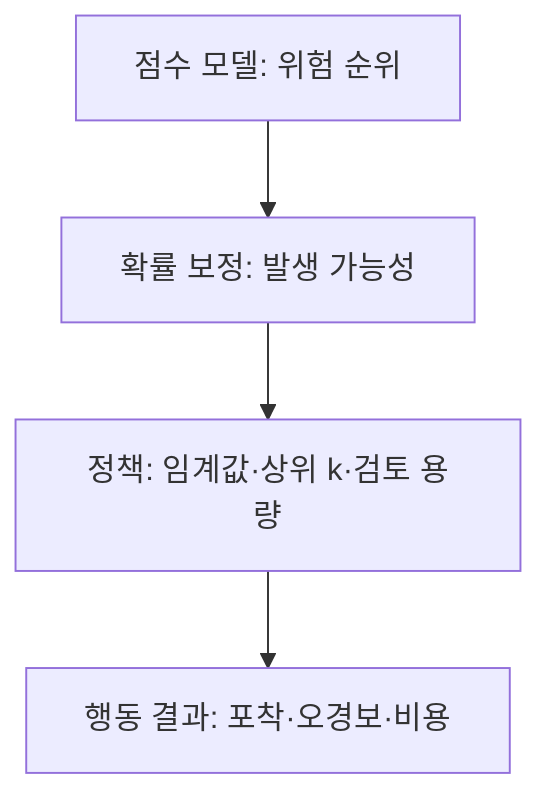



희귀 사건 탐지에서는 “모델이 잘 분류하는가?”보다 “한정된 검토 자원으로 중요한 사건을 얼마나 포착하며, 오경보 비용을 감당할 수 있는가?”가 더 중요한 질문이다. 양성 비율이 매우 작으면 익숙한 정확도와 ROC-AUC만으로는 이 질문에 답하기 어렵다.

이 글에서 **양성**은 탐지하려는 희귀 사건을 뜻한다. 양성이 반드시 나쁜 사건이라는 의미는 아니다.

## 1. 문제: 불균형 데이터에서 좋은 점수가 나쁜 정책이 되는 이유

### 정확도는 다수 클래스 예측을 보상한다

양성 비율을 \(\pi=P(Y=1)\)라고 하자. 모든 표본을 음성으로 예측하는 모델의 정확도는 \(1-\pi\)다. \(\pi\)가 작으면 아무것도 탐지하지 못해도 정확도가 매우 높다.

혼동행렬의 네 항목을 먼저 분리해서 본다.

| 실제 / 예측 | 양성 | 음성 |
|---|---:|---:|
| 양성 | TP | FN |
| 음성 | FP | TN |

\[
\text{precision}=\frac{TP}{TP+FP}, \qquad
\text{recall}=\frac{TP}{TP+FN}
\]

- precision: 경보 중 실제 양성의 비율
- recall: 실제 양성 중 포착한 비율

불균형 문제에서는 “얼마나 많은 양성을 찾았는가”와 “그 과정에서 경보를 얼마나 낭비했는가”를 동시에 봐야 한다.

### ROC-AUC는 순위 품질을 보지만 경보 부담을 숨길 수 있다

ROC 곡선은 TPR과 FPR의 관계를 본다.

\[
\text{TPR}=\frac{TP}{TP+FN}, \qquad
\text{FPR}=\frac{FP}{FP+TN}
\]

음성이 압도적으로 많으면 낮아 보이는 FPR도 큰 FP 건수로 이어진다. 예를 들어 FPR이 작더라도 음성 모집단이 수백만 건이면 검토해야 할 오경보가 많을 수 있다. ROC-AUC는 모델의 전체 순위 능력을 비교하는 데 유용하지만, 운영 가능한 경보 영역을 직접 보여 주지는 않는다.

### 클래스 가중치와 재표본화는 임계값 문제를 해결하지 않는다

가중 손실, 양성 과표본화, 음성 과소표본화는 학습 신호를 개선할 수 있다. 그러나 다음 문제는 별도로 남는다.

- 출력 점수가 실제 확률인가?
- 운영 환경의 양성 비율과 학습 표본의 양성 비율이 같은가?
- 어느 임계값에서 행동할 것인가?
- 처리 가능한 경보 수는 얼마인가?
- FN 한 건과 FP 한 건의 비용은 어떻게 다른가?

학습 전략과 운영 정책을 같은 것으로 취급하면 안 된다.

## 2. Mental model: 탐지기를 순위·확률·정책의 세 층으로 본다

희귀 사건 시스템은 세 층으로 나누어 생각하면 명확해진다.



1. **순위 층**: 양성을 음성보다 위에 놓는가?
2. **확률 층**: 0.2라는 출력이 실제 약 20%의 빈도를 의미하는가?
3. **정책 층**: 비용과 자원을 고려했을 때 누구에게 행동할 것인가?

한 모델이 순위는 좋지만 보정은 나쁠 수 있고, 보정은 좋지만 특정 처리 용량에서 순위가 부족할 수 있다.

### PR 곡선은 경보의 순도를 직접 본다

Precision-Recall 곡선은 임계값을 변화시키며 precision과 recall의 교환관계를 나타낸다. 무작위 순위 모델의 기대 precision은 대략 양성 유병률 \(\pi\)다. 따라서 PR-AUC는 반드시 base rate와 함께 해석해야 한다.

서로 다른 기간이나 집단의 양성 비율이 다르면 PR-AUC도 달라질 수 있다. 모델 순위 능력이 같더라도 유병률이 낮아지면 precision이 내려간다. 그러므로 다음을 같이 보고한다.

- 평가 구간의 양성 비율
- PR 곡선 또는 Average Precision
- 운영 가능한 recall 영역의 precision
- 상위 \(k\)% 또는 일일 처리량에서의 성능

구현에 따라 PR-AUC를 사다리꼴 적분한 값과 Average Precision이 다를 수 있다. 보고서에는 계산 정의와 라이브러리 버전을 명시한다.

### 최적 임계값은 비용 함수에 종속된다

임계값 \(t\)에서 기대 비용을 다음처럼 정의할 수 있다.

\[
J(t)=C_{FP}FP(t)+C_{FN}FN(t)+C_{R}N_{alert}(t)+C_{delay}D(t)
\]

- \(C_{FP}\): 오경보 자체의 비용
- \(C_{FN}\): 미탐 비용
- \(C_R\): 경보 한 건을 검토하는 비용
- \(N_{alert}\): 경보 수
- \(D\): 탐지 지연의 총량 또는 가중치

비용을 정확한 화폐로 정하기 어렵다면 비율과 제약으로 표현할 수 있다.

- recall은 최소 \(r_{min}\) 이상
- precision은 최소 \(p_{min}\) 이상
- 하루 경보는 \(B\)건 이하
- 그 조건에서 기대 미탐을 최소화

### 보정된 확률은 비용과 정책을 이동 가능하게 만든다

확률이 잘 보정되었다는 것은 예측값이 \(q\)인 표본 집합에서 실제 양성 비율도 대략 \(q\)라는 뜻이다.

\[
P(Y=1\mid \hat{p}=q) \approx q
\]

완전한 비용과 제약이 없고 행동이 이진적이며 확률이 정확하다면, 행동 1의 비용을 비교해 임계값을 유도할 수 있다. 예를 들어 FP 비용이 \(C_{FP}\), FN 비용이 \(C_{FN}\)이면 단순 조건에서:

\[
\text{행동} \iff \hat{p} > \frac{C_{FP}}{C_{FP}+C_{FN}}
\]

실제 시스템에는 검토 비용, 처리 용량, 행동 효과가 있으므로 검증 데이터에서 정책을 다시 평가해야 한다. 이 식은 “임계값 0.5가 기본”이라는 생각을 버리게 해 주는 출발점이다.

## 3. 실전 workflow

### Step 1. 희귀 사건과 평가 단위를 정확히 정의한다

먼저 다음을 고정한다.

- 사건 단위와 예측 단위가 같은가?
- 동일 사건이 여러 경보로 중복 집계될 수 있는가?
- 사건 발생 전 어느 시점까지 탐지해야 유효한가?
- 양성 레이블이 최종 확정되기까지 얼마나 걸리는가?
- 탐지 불가능 구간이나 관측 중단 사례는 어떻게 다루는가?

행 단위 precision이 높아도 동일 사건에 반복 경보를 내면 운영 가치는 낮을 수 있다. 필요하면 사건 단위와 경보 에피소드 단위 지표를 함께 만든다.

### Step 2. 데이터 분할에서 시간·개체·사건 경계를 보존한다

희귀 양성은 수가 적어 무작위 분할의 우연성이 커진다. 그러나 양성을 모든 fold에 고르게 넣기 위해 시간 순서를 깨면 미래 성능을 과대평가할 수 있다.

권장 순서는 다음과 같다.

1. 운영을 모사하는 시간 순서로 train, calibration, validation, test를 나눈다.
2. 같은 개체나 사건에서 파생된 행은 한 구간에만 둔다.
3. 최종 test의 양성 수와 사건 다양성이 너무 작다면 더 긴 관측 기간을 확보한다.
4. 여러 rolling window에서 분산을 측정한다.
5. 최근 레이블이 미성숙한 구간은 평가에서 제외한다.

양성 수가 극히 적을 때는 점추정치보다 bootstrap 신뢰구간이나 기간별 범위를 함께 보고한다. bootstrap도 사건·개체 단위로 재표본화해야 상관 구조를 보존한다.

### Step 3. 누수 없는 단순 순위 베이스라인을 만든다

다음 순서로 비교하면 복잡성의 가치를 이해하기 쉽다.

1. 무작위 순위와 전체 base rate
2. 기존 규칙 또는 단일 이상 점수
3. 가중 선형 분류기
4. 비선형 지도학습 모델
5. 비지도·준지도 이상 탐지 모델
6. 필요한 경우 앙상블

비지도 이상 점수는 “드문 것”을 찾지 “중요한 양성”을 자동으로 찾지는 않는다. 정상 분포에서 멀지만 무해한 표본이 많거나, 양성이 정상 분포 안에 숨어 있으면 성능이 낮을 수 있다. 레이블이 조금이라도 있다면 지도 성능과의 비교가 필요하다.

### Step 4. 학습 불균형과 운영 유병률을 분리한다

재표본화를 썼다면 학습 중 양성 비율 \(\pi_s\)와 운영 비율 \(\pi_t\)가 다르다. 모델 출력은 그대로 운영 확률로 해석하기 어렵다.

조건부 분포가 같고 prior만 변한다는 강한 가정 아래에서는 odds를 보정할 수 있다.

\[
\frac{p_t}{1-p_t}
=
\frac{p_s}{1-p_s}
\times
\frac{\pi_t/(1-\pi_t)}{\pi_s/(1-\pi_s)}
\]

하지만 실제로는 특징 분포도 함께 변할 수 있다. 가장 안전한 방법은 운영 분포와 가까운 별도 calibration 구간에서 후처리 보정을 적합하고, 그 다음 시점의 validation/test에서 확인하는 것이다.

### Step 5. 보정을 별도 단계로 평가한다

보정 방법은 크게 두 계열이다.

- **모수적 보정**: 점수와 log-odds 사이에 단순한 형태를 가정해 데이터가 적을 때 안정적이다.
- **비모수적 보정**: 유연하지만 희귀 양성이 적으면 과적합하기 쉽다.

보정 모델을 원 모델 훈련 데이터에 다시 적합하면 낙관적일 수 있다. 시간 순서상 뒤의 독립된 calibration 구간을 사용한다.

평가 지표:

- Brier score: \(\frac{1}{n}\sum_i(\hat p_i-y_i)^2\)
- log loss
- reliability diagram
- 예상 보정 오차와 구간별 표본 수
- 양성 비율이 특히 낮다면 상위 위험 구간의 local calibration

전체 구간의 calibration 평균이 좋아도 실제 행동하는 상위 1% 구간이 나쁠 수 있다. 정책이 사용하는 점수 영역을 확대해서 본다.

### Step 6. 비용·제약으로 임계값을 선택한다

임계값 선택은 test가 아니라 validation에서 끝낸다.

```python
def choose_threshold(y, probability, fp_cost, fn_cost, review_cost, max_alerts):
    candidates = sorted(set(probability), reverse=True)
    feasible = []

    for threshold in candidates:
        alert = probability >= threshold
        if alert.sum() > max_alerts:
            continue

        fp = ((alert == 1) & (y == 0)).sum()
        fn = ((alert == 0) & (y == 1)).sum()
        cost = fp_cost * fp + fn_cost * fn + review_cost * alert.sum()
        feasible.append((cost, threshold))

    return min(feasible)[1]
```

실무에서는 다음을 추가한다.

- 기간별 처리 용량
- 동일 대상 재경보 억제 시간
- 점수 동률 처리
- 임계값 근처 완충 구간
- 필수 검토 규칙과 모델 점수의 결합
- 비용 가정의 민감도 분석

비용이 불확실하면 하나의 최적 임계값 대신 비용 비율 범위마다 선택되는 임계값을 그린다. 넓은 범위에서 유지되는 임계값이 더 견고하다.

### Step 7. 임계값 없는 지표와 정책 지표를 함께 보고한다

권장 보고 구조는 다음과 같다.

| 층 | 지표 | 답하는 질문 |
|---|---|---|
| 순위 | PR-AUC, ROC-AUC | 양성을 전반적으로 위에 두는가? |
| 제한 영역 | partial PR, precision@k, recall@k | 실제 처리 용량에서 유용한가? |
| 확률 | Brier, log loss, reliability | 점수를 확률로 믿을 수 있는가? |
| 정책 | 비용, 경보 수, 사건 포착률 | 선택한 행동 규칙이 가치가 있는가? |
| 안정성 | 기간·집단별 범위 | 성능이 특정 구간에만 의존하는가? |

PR-AUC 하나로 모델을 고르지 않는다. 운영 영역이 좁다면 그 영역의 precision-recall과 정책 비용이 전체 면적보다 더 중요하다.

### Step 8. 배포 후 base rate와 경보 품질을 별도로 감시한다

레이블이 늦게 들어오는 시스템에서는 즉시 알 수 있는 지표와 지연 지표를 나눈다.

**즉시 지표**

- 입력 분포와 결측률
- 점수 분포
- 경보율과 상위 점수 비율
- 특징 신선도와 추론 지연
- 개체별 반복 경보 수

**레이블 성숙 후 지표**

- precision, recall, 사건 포착률
- PR-AUC와 calibration
- 임계값별 실제 비용
- 기간·하위집단별 오류
- 탐지 선행시간

경보율 변화만으로 모델 열화를 단정할 수 없다. 실제 base rate 변화, 입력 drift, 정책 변경, 수집 장애를 분리해 조사한다.

## 4. 평가·검증 checklist

### 데이터와 레이블

- [ ] 양성 사건, 예측 단위, 중복 경보 집계 규칙이 명시되었다.
- [ ] 양성 비율을 train·calibration·validation·test별로 보고했다.
- [ ] 같은 사건·개체가 분할 경계를 넘지 않는다.
- [ ] 최근 음성 레이블의 성숙 지연을 반영했다.
- [ ] 미관측과 진짜 음성을 구분했다.

### 지표

- [ ] 정확도만 사용하지 않았다.
- [ ] PR-AUC의 정의와 평가 base rate를 함께 기록했다.
- [ ] ROC-AUC와 실제 경보 건수의 관계를 확인했다.
- [ ] precision@k, recall@k 또는 처리 용량 지표가 있다.
- [ ] 사건 단위 포착률과 중복 경보를 평가했다.
- [ ] 기간·개체 단위 신뢰구간을 계산했다.

### 확률과 임계값

- [ ] 학습 재표본화 후 확률을 그대로 해석하지 않았다.
- [ ] 보정 데이터는 원 모델 학습과 분리했다.
- [ ] 전체뿐 아니라 행동 구간의 calibration을 확인했다.
- [ ] 임계값은 validation에서 비용·제약으로 선택했다.
- [ ] test에서는 선택된 정책을 한 번 평가했다.
- [ ] 비용 비율과 base rate 변화에 대한 민감도 분석을 했다.

### 운영

- [ ] 단위 시간당 최대 경보 처리량이 정책에 포함되었다.
- [ ] 재경보 억제, 동률, 누락 점수 처리 규칙이 있다.
- [ ] 점수 drift와 실제 성능 drift를 구분해 모니터링한다.
- [ ] 임계값 변경, 보정 재적합, 모델 재학습의 조건이 분리되었다.
- [ ] 모델 장애 시 안전한 기본 정책이 있다.

## 5. 한계와 주의점

첫째, PR-AUC도 만능 지표가 아니다. 운영 관심 영역 밖의 순위까지 합친 요약값이며, 유병률 변화에 민감하다. 반드시 실제 처리 용량의 구간 지표를 함께 본다.

둘째, 비용 행렬은 대개 불확실하다. 미탐 비용을 과장하거나 검토자의 피로·지연을 누락하면 공격적인 임계값이 선택된다. 단일 숫자보다 가능한 비용 범위와 민감도 분석이 정직하다.

셋째, 확률 보정은 미래 분포가 calibration 구간과 유사하다는 전제에 의존한다. base rate나 조건부 분포가 변하면 재보정만으로 충분하지 않을 수 있다.

넷째, 이상 탐지기는 새로운 유형의 사건을 찾을 가능성이 있지만, “이상함”과 “위험함”은 동일하지 않다. 비지도 점수에 의미를 부여하려면 전문가 검토, 표본 조사, 후속 레이블링이 필요하다.

마지막으로, 탐지 정책이 현장의 관측 과정을 바꿀 수 있다. 높은 점수의 사례만 더 자주 검사하면 이후 데이터는 정책에 의해 선택된 레이블을 갖게 된다. 이 피드백 루프를 추적하지 않으면 모델은 자기 정책이 만든 편향을 학습한다.
