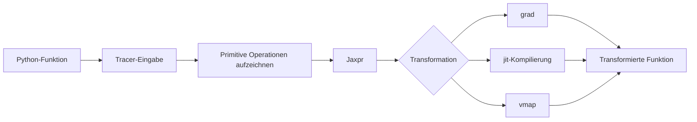



Das Wesentliche an JAX ist nicht seine NumPy-ähnliche Syntax.
Entscheidend ist das Ausführungsmodell, das Python-Funktionen nachverfolgt und Programmtransformationen wie Differenzierung, Kompilierung und Vektorisierung anwendet.

## 1. Das Problem: Direkte Python-Ausführung und nachverfolgte Programme verhalten sich unterschiedlich

Eine gewöhnliche Python-Funktion kann während der Ausführung Werte prüfen, Verzweigungen ausführen und Seiteneffekte erzeugen.
Innerhalb einer JAX-Transformation kann ein Wert dagegen ein Tracer sein, der eine Berechnung anstelle eines konkreten Arrays repräsentiert.

Folgende Probleme treten häufig auf.

- Verwendung eines Tracer-Werts in einem Python-`if`
- Änderung globalen Zustands innerhalb einer Funktion
- Verbrauch eines Iterators
- Impliziter Aufruf eines Zufallszahlengenerators
- Formänderungen zwischen Aufrufen und dadurch fortlaufende Neukompilierung
- Konvertierung eines Tracers mit einer NumPy-Operation auf dem Host
- Erwartung einer In-place-Mutation

JAX-Code ist besser vorhersagbar, wenn er als **reine, formstabile Funktion von Eingaben auf Ausgaben** entworfen wird.

## 2. Denkmodell: Python einmal durchlaufen, um einen Berechnungsgraphen aufzubauen



Der Python-Rumpf einer mit `jit` kompilierten Funktion wird nicht bei jedem Aufruf unverändert ausgeführt.
Nachverfolgung und Kompilierung erfolgen abhängig von Eingabeformen, Datentypen, statischen Argumenten und weiteren Eigenschaften; anschließend wird das ausführbare Programm wiederverwendet.

Daher kann es zu unerwarteten Ergebnissen führen, wenn Ausgaben, Protokollierung oder Dateischreibvorgänge Teil der Funktionssemantik sind.

## 3. Der Vertrag reiner Funktionen

Eine reine Funktion erzeugt bei gleicher Eingabe dieselbe Ausgabe und besitzt keine beobachtbaren Seiteneffekte.

Schlechtes Beispiel:

```python
scale = 2.0

def f(x):
    global scale
    scale += 1.0
    return x * scale
```

Verbesserte Fassung:

```python
def f(state, x):
    new_scale = state["scale"] + 1.0
    y = x * new_scale
    return {"scale": new_scale}, y
```

Zustand sollte eine explizite Ein- und Ausgabe sein.
Dasselbe Prinzip gilt für Optimiererzustand, Batch-Statistiken und Zufallsschlüssel.

## 4. `grad`: Skalare Zielfunktionen und Differenzierbarkeit

Der Gradient einer skalaren Funktion (f:\mathbb{R}^n\rightarrow\mathbb{R}) lautet

$$
\nabla_x f = \left[\frac{\partial f}{\partial x_1},\ldots,
\frac{\partial f}{\partial x_n}\right]
$$

```python
import jax
import jax.numpy as jnp

def loss(params, x, y):
    prediction = x @ params
    return jnp.mean((prediction - y) ** 2)

loss_and_grad = jax.value_and_grad(loss)
```

Dabei ist Folgendes zu beachten.

- Standardmäßig muss die von `grad` differenzierte Ausgabe skalar sein.
- Ganzzahlige Eingaben sind im Allgemeinen keine Differenzierungsziele.
- Unstetige Operationen können einen unbrauchbaren oder überhaupt keinen Gradienten besitzen.
- Für funktionale Aktualisierungen ist `.at[...]` statt Mutation zu verwenden.
- Die mathematische Bedeutung eigener Ableitungen muss validiert werden.

Gradienten sollten unabhängig anhand endlicher Differenzen und kleiner analytischer Probleme geprüft werden.

## 5. `jit`: Leistungsgrenzen und Neukompilierung

```python
@jax.jit
def step(params, batch):
    grads = jax.grad(loss)(params, batch["x"], batch["y"])
    return params - 1e-3 * grads
```

Der erste Aufruf umfasst die Kosten der Nachverfolgung und Kompilierung.
Für Messungen des stabilen Betriebs sollte zunächst aufgewärmt und anschließend der Abschluss der Ausführung synchronisiert werden.

```python
compiled = step.lower(params, batch).compile()
result = compiled(params, batch)
result.block_until_ready()
```

Zu den Ursachen einer Neukompilierung gehören:

- Formänderungen
- Änderungen des Datentyps
- Änderungen statischer Argumentwerte
- Änderungen der Struktur von Python-Containern
- Wiederholte Erzeugung von Funktionsobjekten

Bei Sequenzen variabler Länge begrenzen Padding und Masken oder Buckets die Anzahl unterschiedlicher Formen.

## 6. Tracer und Kontrollfluss

Der folgende Code kann unter `jit` fehlschlagen.

```python
def clipped(x):
    if x.sum() > 0:
        return x
    return -x
```

Ist die Bedingung ein nachverfolgter Wert, kann Python sie nicht zur Kompilierzeit entscheiden.
Dann ist ein JAX-Kontrollflussprimitiv zu verwenden.

```python
from jax import lax

def clipped(x):
    return lax.cond(x.sum() > 0, lambda z: z, lambda z: -z, x)
```

Eine kurze Schleife mit fester Länge kann entrollt werden; für lange Schleifen eignen sich jedoch möglicherweise `lax.scan`, `fori_loop` oder `while_loop` besser.
Die Einschränkungen der automatischen Differenzierung jedes Primitivs sind in der offiziellen Dokumentation zu prüfen.

## 7. `vmap`: Eine Schleife in eine Batch-Achse überführen

Eine Funktion für ein einzelnes Beispiel:

```python
def predict_one(params, x):
    return jnp.tanh(x @ params["w"] + params["b"])
```

Anwendung auf einen Batch:

```python
predict_batch = jax.vmap(predict_one, in_axes=(None, 0))
```

`in_axes` legt fest, welche Eingabeachsen abgebildet werden.
Die Modellparameter werden gemeinsam genutzt, während nur die Beispielachse abgebildet wird.

`vmap` ist keine Zauberlösung, die eine Python-Schleife einfach beschleunigt.
Auf jedes Primitiv werden Batch-Regeln angewendet, wodurch Zwischenarrays stark anwachsen können.
Auch das Speicherprofil muss untersucht werden.

## 8. Reihenfolge der Transformationskomposition

`jit(vmap(grad(f)))` und `vmap(jit(grad(f)))` können sich in Bedeutung und Kompilierungsgrenzen unterscheiden.

Zu den allgemeinen Überlegungen gehören:

- Werden Gradienten pro Beispiel oder der Gradient eines Batch-Verlusts benötigt?
- Wo soll die Batch-Achse liegen?
- Wie groß soll die Kompilierungseinheit sein?
- Steigt der Speicherbedarf durch die Materialisierung von Zwischenergebnissen?

Beispiel: Gradient des mittleren Batch-Verlusts

```python
def batch_loss(params, xs, ys):
    losses = jax.vmap(single_loss, in_axes=(None, 0, 0))(params, xs, ys)
    return losses.mean()

train_grad = jax.jit(jax.grad(batch_loss))
```

Form und Bedeutung des Ergebnisses unterscheiden sich von einem Gradienten pro Beispiel.

## 9. Ein Zufallsschlüssel ist ein Wert

JAX übergibt Schlüssel explizit, anstatt für Zufälligkeit einen impliziten globalen Zustand zu verwenden.

```python
key = jax.random.key(0)
key, subkey = jax.random.split(key)
noise = jax.random.normal(subkey, shape=(128,))
```

Die Wiederverwendung desselben Schlüssels erzeugt dieselben Zufallszahlen.

Empfohlene Muster:

- Eine Funktion erhält einen Schlüssel.
- Sie teilt die benötigten Unterschlüssel ab.
- Einen verbrauchten Schlüssel verwendet sie nicht erneut.
- In verteilten Umgebungen werden Fold-in-Werte für jeden Prozess und jedes Gerät eingesetzt.
- Der nächste Schlüssel oder ein reproduzierbarer Seed-Zustand wird in Checkpoints gespeichert.

Fehler bei der Verwaltung von Zufallsschlüsseln können die statistische Unabhängigkeit zerstören, obwohl der Code weiterhin läuft.

## 10. Zustand mit PyTrees strukturieren

Listen, Tupel, Wörterbücher und registrierte Klassen können als Bäume aus Array-Blättern behandelt werden.

```python
params = {
    "encoder": {"w": w1, "b": b1},
    "head": {"w": w2, "b": b2},
}

norms = jax.tree.map(jnp.linalg.norm, params)
```

Auch die Baumstruktur selbst kann die Kompilierungssignatur beeinflussen.
Schlüsselmenge und Containerstruktur dürfen zwischen Schritten nicht geändert werden.

Statische Metadaten sind vom Array-Zustand zu trennen.
Ein großes Python-Objekt als statisches Argument kann Hashing- und Neukompilierungsprobleme verursachen.

## 11. Praktischer Prüfablauf

1. Korrektheit der direkt ausgeführten Funktion ohne Transformationen testen.
2. Bei kleinen Eingaben mit einer NumPy- oder Referenzimplementierung vergleichen.
3. `grad` analytisch oder mit endlichen Differenzen prüfen.
4. Ergebnisse von `vmap` mit einer expliziten Schleife vergleichen.
5. Ergebnisse und Datentypen vor und nach `jit` vergleichen.
6. Anzahl der Kompilierungen bei Aufrufen mit unterschiedlichen Formen beobachten.
7. Messungen mit Aufwärmen und Synchronisierung durchführen.
8. NaN-, Inf- und Grenzwerteingaben testen.

```python
expected = jnp.stack([predict_one(params, x) for x in xs])
actual = predict_batch(params, xs)
assert jnp.allclose(actual, expected, rtol=1e-5, atol=1e-6)
```

Toleranzen sind passend zum Datentyp und numerischen Verfahren zu wählen.

## 12. Bewertungscheckliste

- [ ] Ist die transformierte Funktion rein und frei von Seiteneffekten?
- [ ] Sind Zustand und Zufallsschlüssel explizite Ein- und Ausgaben?
- [ ] Wird derselbe Zufallsschlüssel niemals wiederverwendet?
- [ ] Wurden Ausgabe und mathematische Differenzierbarkeit der an `grad` übergebenen Funktion geprüft?
- [ ] Werden Tracer nicht für Python-`if`, `int` oder NumPy-Konvertierungen verwendet?
- [ ] Werden dynamische Formen mit Padding oder Buckets begrenzt?
- [ ] Wurden `vmap`-Ergebnisse mit einer Schleifenreferenz verglichen?
- [ ] Stimmen Korrektheit und Datentypen vor und nach `jit` überein?
- [ ] Wurde die Kompilierung vor der Leistungsmessung aufgewärmt?
- [ ] Wird die asynchrone Ausführung mit `block_until_ready` synchronisiert?
- [ ] Werden die Ursachen von Neukompilierungen beobachtet?
- [ ] Werden eigene Gradienten mit einem unabhängigen numerischen Test geprüft?

## 13. Häufige Fehler und Einschränkungen

### `jit` auf jede kleine Funktion anwenden

Kompilierungsgrenzen können dadurch zu feingranular werden und der Dispatch-Aufwand kann wachsen.
Die Profilerstellung sollte auf Ebene sinnvoller Rechenschritte erfolgen.

### Die Zeit des ersten Aufrufs als stabile Latenz angeben

Der erste Aufruf umfasst die Kompilierung.
Kalte und warme Latenz sind getrennt auszuweisen.

### NumPy- und JAX-Arrays unbedacht mischen

Dies kann Host-Gerät-Übertragungen oder Fehler bei der Tracer-Konvertierung verursachen.
Innerhalb transformierter Bereiche sind `jax.numpy` und unterstützte Primitive zu verwenden.

### Reine Funktionen nur als Stilempfehlung behandeln

Seiteneffekte werden entsprechend der Anzahl der Nachverfolgungen ausgeführt und können die tatsächliche Programmbedeutung verändern.
Zustandsübergänge sind durch Rückgabewerte auszudrücken.

JAX optimiert nicht automatisch jedes Python-Programm.
Bei dynamischen Objekten, E/A-lastigen Abläufen oder kleinen Berechnungen können die Kompilierungskosten den Nutzen übersteigen.

## 14. Offizielle Referenzen

- [Offizielle Dokumentation zu den JAX-Schlüsselkonzepten](https://docs.jax.dev/en/latest/key-concepts.html)
- [Thinking in JAX](https://docs.jax.dev/en/latest/notebooks/thinking_in_jax.html)
- [JAX Sharp Bits](https://docs.jax.dev/en/latest/notebooks/Common_Gotchas_in_JAX.html)
- [Offizielle Dokumentation zur automatischen Vektorisierung](https://docs.jax.dev/en/latest/automatic-vectorization.html)
- [Offizielle Dokumentation zu Zufallszahlen in JAX](https://docs.jax.dev/en/latest/random-numbers.html)

## 15. Fazit

Der Schlüssel zur zuverlässigen Nutzung von JAX liegt nicht im Auswendiglernen seiner Array-API, sondern in der Umstrukturierung eines Programms in nachverfolgbare reine Funktionen.
Der Vergleich der Bedeutung jeder Transformation mit Schleifen, Referenzimplementierungen und numerischer Differenzierung bewahrt sowohl Leistung als auch Korrektheit.
