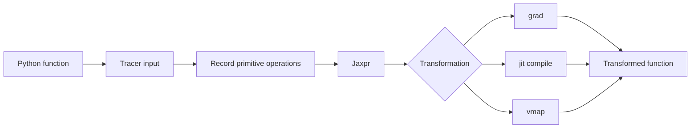



The essence of JAX is not its NumPy-like syntax.
It is an execution model that traces Python functions and applies program transformations such as differentiation, compilation, and vectorization.

## 1. The Problem: Eager Python and Traced Programs Behave Differently

An ordinary Python function can inspect values while executing, branch, and produce side effects.
Within a JAX transformation, a value may be a tracer representing a computation rather than a concrete array.

The following problems are common.

- Using a tracer value in a Python `if`
- Modifying global state inside a function
- Consuming an iterator
- Calling a random generator implicitly
- Changing shapes between calls and continually recompiling
- Converting a tracer with a host NumPy operation
- Expecting in-place mutation

JAX code is more predictable when designed as a **pure, shape-stable function from inputs to outputs**.

## 2. Mental Model: Follow Python Once to Build a Computation Graph



The Python body of a `jit`-compiled function is not executed unchanged on every call.
Tracing and compilation occur according to input shapes, dtypes, static arguments, and other properties, after which the executable is reused.

Therefore, putting printing, logging, or file writes into the function's semantics can produce unexpected results.

## 3. The Pure-Function Contract

A pure function produces the same output for the same input and has no observable side effects.

Bad example:

```python
scale = 2.0

def f(x):
    global scale
    scale += 1.0
    return x * scale
```

Improved version:

```python
def f(state, x):
    new_scale = state["scale"] + 1.0
    y = x * new_scale
    return {"scale": new_scale}, y
```

Make state an explicit input and output.
The same principle applies to optimizer state, batch statistics, and random keys.

## 4. `grad`: Scalar Objectives and Differentiability

The gradient of a scalar function (f:\mathbb{R}^n\rightarrow\mathbb{R}) is

$$
\nabla_x f = \left[\frac{\partial f}{\partial x_1},\ldots,
\frac{\partial f}{\partial x_n}\right]
$$

```python
import jax
import jax.numpy as jnp

def loss(params, x, y):
    prediction = x @ params
    return jnp.mean((prediction - y) ** 2)

loss_and_grad = jax.value_and_grad(loss)
```

Be aware of the following.

- By default, the output differentiated by `grad` must be scalar.
- Integer inputs are generally not differentiation targets.
- Discontinuous operations may have no useful gradient, or no gradient at all.
- Use `.at[...]` functional updates instead of mutation.
- Validate the mathematical meaning of custom derivatives.

Independently validate gradients with finite differences and small analytical problems.

## 5. `jit`: Performance Boundaries and Recompilation

```python
@jax.jit
def step(params, batch):
    grads = jax.grad(loss)(params, batch["x"], batch["y"])
    return params - 1e-3 * grads
```

The first call includes tracing and compilation costs.
For steady-state benchmarks, warm up first and synchronize execution completion.

```python
compiled = step.lower(params, batch).compile()
result = compiled(params, batch)
result.block_until_ready()
```

Causes of recompilation include the following.

- Shape changes
- Dtype changes
- Static argument value changes
- Python container structure changes
- Repeated creation of function objects

For variable-length sequences, use padding and masks or buckets to limit the number of shapes.

## 6. Tracers and Control Flow

The following code can fail under `jit`.

```python
def clipped(x):
    if x.sum() > 0:
        return x
    return -x
```

If the condition is a traced value, Python cannot decide it at compile time.
Use a JAX control-flow primitive.

```python
from jax import lax

def clipped(x):
    return lax.cond(x.sum() > 0, lambda z: z, lambda z: -z, x)
```

A short fixed loop may be unrolled, but `lax.scan`, `fori_loop`, or `while_loop` may be more suitable for a long loop.
Check the autodiff constraints of each primitive in the official documentation.

## 7. `vmap`: Turn a Loop into a Batch Axis

A single-sample function:

```python
def predict_one(params, x):
    return jnp.tanh(x @ params["w"] + params["b"])
```

Batch application:

```python
predict_batch = jax.vmap(predict_one, in_axes=(None, 0))
```

`in_axes` specifies which input axes to map.
The model parameters are shared, while only the sample axis is mapped.

`vmap` is not magic that simply makes a Python loop faster.
Batching rules are applied to each primitive, and intermediate arrays may grow large.
Inspect the memory profile as well.

## 8. Transformation Composition Order

`jit(vmap(grad(f)))` and `vmap(jit(grad(f)))` can differ in meaning and compilation boundaries.

General considerations include the following.

- Do you need per-example gradients or a batch-loss gradient?
- Where should the batch axis be placed?
- How large should the compilation unit be?
- Does intermediate materialization increase memory use?

Example: the gradient of mean batch loss

```python
def batch_loss(params, xs, ys):
    losses = jax.vmap(single_loss, in_axes=(None, 0, 0))(params, xs, ys)
    return losses.mean()

train_grad = jax.jit(jax.grad(batch_loss))
```

Its result shape and meaning differ from those of a per-example gradient.

## 9. A Random Key Is a Value

JAX passes keys explicitly rather than using implicit global state for randomness.

```python
key = jax.random.key(0)
key, subkey = jax.random.split(key)
noise = jax.random.normal(subkey, shape=(128,))
```

Reusing the same key produces the same random numbers.

Recommended patterns:

- A function receives a key.
- It splits the subkeys it needs.
- It does not reuse a consumed key.
- In distributed environments, use fold-in values for each process and device.
- Store the next key or reproducible seed state in checkpoints.

Random-key management errors can break statistical independence even while the code continues to run.

## 10. Structure State with PyTrees

Lists, tuples, dictionaries, and registered classes can be treated as trees of leaf arrays.

```python
params = {
    "encoder": {"w": w1, "b": b1},
    "head": {"w": w2, "b": b2},
}

norms = jax.tree.map(jnp.linalg.norm, params)
```

The tree structure itself can also affect the compilation signature.
Do not change the key set or container structure between steps.

Distinguish static metadata from array state.
Passing a large Python object as a static argument can cause hashing and recompilation problems.

## 11. Practical Verification Workflow

1. Test the correctness of the eager function without transformations.
2. Compare it with a NumPy or reference implementation on small inputs.
3. Check `grad` analytically or with finite differences.
4. Compare `vmap` results with an explicit loop.
5. Compare results and dtypes before and after `jit`.
6. Observe compilation counts across calls with different shapes.
7. Benchmark with warm-up and synchronization.
8. Test NaN, Inf, and boundary inputs.

```python
expected = jnp.stack([predict_one(params, x) for x in xs])
actual = predict_batch(params, xs)
assert jnp.allclose(actual, expected, rtol=1e-5, atol=1e-6)
```

Choose tolerances based on the dtype and numerical method.

## 12. Evaluation Checklist

- [ ] Is the transformed function a pure function without side effects?
- [ ] Are state and random keys explicit inputs and outputs?
- [ ] Is the same random key never reused?
- [ ] Have the output and mathematical differentiability of the function passed to `grad` been checked?
- [ ] Are tracers kept out of Python `if`, `int`, and NumPy conversions?
- [ ] Are dynamic shapes limited with padding or buckets?
- [ ] Have `vmap` results been compared with a loop baseline?
- [ ] Do correctness and dtypes match before and after `jit`?
- [ ] Was compilation warmed up before benchmarking?
- [ ] Is asynchronous execution synchronized with `block_until_ready`?
- [ ] Are the causes of recompilation observed?
- [ ] Are custom gradients checked with an independent numerical test?

## 13. Common Failures and Limitations

### Applying `jit` to every small function

Compilation boundaries may become too granular and dispatch overhead may grow.
Profile at the level of meaningful compute steps.

### Reporting first-call time as steady-state latency

The first call includes compilation.
Report cold and warm latency separately.

### Carelessly mixing NumPy and JAX arrays

This can cause host-device transfers or tracer-conversion errors.
Use `jax.numpy` and supported primitives within transformed regions.

### Treating pure functions as only a style recommendation

Side effects execute according to the number of traces and can change the program's actual meaning.
Express state transitions through return values.

JAX does not automatically optimize every Python program.
For dynamic objects, I/O-centric workflows, or small computations, compilation costs can exceed the benefits.

## 14. Official References

- [Official JAX Key Concepts documentation](https://docs.jax.dev/en/latest/key-concepts.html)
- [Thinking in JAX](https://docs.jax.dev/en/latest/notebooks/thinking_in_jax.html)
- [JAX Sharp Bits](https://docs.jax.dev/en/latest/notebooks/Common_Gotchas_in_JAX.html)
- [Official automatic vectorization documentation](https://docs.jax.dev/en/latest/automatic-vectorization.html)
- [Official JAX random numbers documentation](https://docs.jax.dev/en/latest/random-numbers.html)

## 15. Conclusion

The key to using JAX reliably is not memorizing its array API, but restructuring a program as traceable pure functions.
Comparing the meaning of each transformation against loops, reference implementations, and numerical differentiation preserves both performance and correctness.
