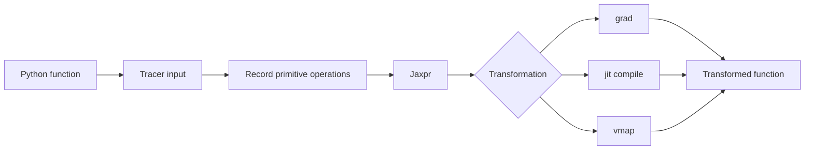



La esencia de JAX no es su sintaxis tipo NumPy.
Es un modelo de ejecución que rastrea funciones de Python y aplica transformaciones de programas como diferenciación, compilación y vectorización.

## 1. El problema: Python ansioso y los programas rastreados se comportan de manera diferente

Una función ordinaria de Python puede inspeccionar valores mientras se ejecuta, bifurcar y producir efectos secundarios.
Dentro de una transformación JAX, un valor puede ser un rastreador que representa un cálculo en lugar de una matriz concreta.

Los siguientes problemas son comunes.

- Usando un valor de seguimiento en Python `if`
- Modificar el estado global dentro de una función.
- Consumir un iterador
- Llamar implícitamente a un generador aleatorio.
- Cambiar formas entre llamadas y recompilar continuamente
- Conversión de un rastreador con una operación NumPy de host
- Se espera una mutación in situ

El código JAX es más predecible cuando se diseña como una **función pura y de forma estable desde las entradas hasta las salidas**.

## 2. Modelo mental: siga Python una vez para crear un gráfico de cálculo



El cuerpo de Python de una función compilada `jit` no se ejecuta sin cambios en cada llamada.
El seguimiento y la compilación se producen según las formas de entrada, los tipos, los argumentos estáticos y otras propiedades, después de lo cual se reutiliza el ejecutable.

Por lo tanto, incluir la impresión, el registro o la escritura de archivos en la semántica de la función puede producir resultados inesperados.

## 3. El contrato de función pura

Una función pura produce el mismo resultado para la misma entrada y no tiene efectos secundarios observables.

Mal ejemplo:

```python
scale = 2.0

def f(x):
    global scale
    scale += 1.0
    return x * scale
```

Versión mejorada:

```python
def f(state, x):
    new_scale = state["scale"] + 1.0
    y = x * new_scale
    return {"scale": new_scale}, y
```

Haga del estado una entrada y salida explícita.
El mismo principio se aplica al estado del optimizador, las estadísticas por lotes y las claves aleatorias.

## 4. `grad`: Objetivos escalares y diferenciabilidad

El gradiente de una función escalar (f:\mathbb{R}^n\rightarrow\mathbb{R}) es

$$
\nabla_x f = \left[\frac{\partial f}{\partial x_1},\ldots,
\frac{\partial f}{\partial x_n}\right]
$$

```python
import jax
import jax.numpy as jnp

def loss(params, x, y):
    prediction = x @ params
    return jnp.mean((prediction - y) ** 2)

loss_and_grad = jax.value_and_grad(loss)
```

Tenga en cuenta lo siguiente.

- Por defecto, la salida diferenciada por `grad` debe ser escalar.
- Las entradas de números enteros generalmente no son objetivos de diferenciación.
- Las operaciones discontinuas pueden no tener ningún gradiente útil o ningún gradiente.
- Utilice `.at[...]` actualizaciones funcionales en lugar de mutaciones.
- Validar el significado matemático de derivadas personalizadas.

Validar de forma independiente gradientes con diferencias finitas y pequeños problemas analíticos.

## 5. `jit`: Límites de rendimiento y recopilación

```python
@jax.jit
def step(params, batch):
    grads = jax.grad(loss)(params, batch["x"], batch["y"])
    return params - 1e-3 * grads
```

La primera convocatoria incluye los costos de rastreo y compilación.
Para realizar pruebas comparativas de estado estable, caliente primero y sincronice la finalización de la ejecución.

```python
compiled = step.lower(params, batch).compile()
result = compiled(params, batch)
result.block_until_ready()
```

Las causas de la recompilación incluyen las siguientes.

- Cambios de forma
- Cambios de tipo D
- Cambios en el valor del argumento estático.
- Cambios en la estructura del contenedor de Python.
- Creación repetida de objetos de función.

Para secuencias de longitud variable, use relleno y máscaras o cubos para limitar la cantidad de formas.

## 6. Trazadores y flujo de control

El siguiente código puede fallar en `jit`.

```python
def clipped(x):
    if x.sum() > 0:
        return x
    return -x
```

Si la condición es un valor rastreado, Python no puede decidirlo en el momento de la compilación.
Utilice una primitiva de flujo de control JAX.

```python
from jax import lax

def clipped(x):
    return lax.cond(x.sum() > 0, lambda z: z, lambda z: -z, x)
```

Se puede desenrollar un bucle fijo corto, pero `lax.scan`, `fori_loop` o `while_loop` pueden ser más adecuados para un bucle largo.
Verifique las restricciones de autodiff de cada primitiva en la documentación oficial.

## 7. `vmap`: convertir un bucle en un eje por lotes

Una función de muestra única:

```python
def predict_one(params, x):
    return jnp.tanh(x @ params["w"] + params["b"])
```

Aplicación por lotes:

```python
predict_batch = jax.vmap(predict_one, in_axes=(None, 0))
```

`in_axes` especifica qué ejes de entrada asignar.
Los parámetros del modelo se comparten, mientras que solo se asigna el eje de muestra.

`vmap` no es magia que simplemente hace que un bucle de Python sea más rápido.
Se aplican reglas de procesamiento por lotes a cada primitiva y las matrices intermedias pueden crecer.
Inspeccione también el perfil de la memoria.

## 8. Orden de composición de transformación

`jit(vmap(grad(f)))` y `vmap(jit(grad(f)))` pueden diferir en significado y límites de compilación.

Las consideraciones generales incluyen las siguientes.

- ¿Necesita gradientes por ejemplo o un gradiente de pérdida por lotes?
- ¿Dónde se debe colocar el eje del lote?
- ¿Qué tamaño debe tener la unidad de compilación?
- ¿La materialización intermedia aumenta el uso de la memoria?

Ejemplo: el gradiente de pérdida media de lotes

```python
def batch_loss(params, xs, ys):
    losses = jax.vmap(single_loss, in_axes=(None, 0, 0))(params, xs, ys)
    return losses.mean()

train_grad = jax.jit(jax.grad(batch_loss))
```

La forma y el significado de su resultado difieren de los de un gradiente por ejemplo.

## 9. Una clave aleatoria es un valor

JAX pasa claves explícitamente en lugar de utilizar el estado global implícito para lograr aleatoriedad.

```python
key = jax.random.key(0)
key, subkey = jax.random.split(key)
noise = jax.random.normal(subkey, shape=(128,))
```

Reutilizar la misma clave produce los mismos números aleatorios.

Patrones recomendados:

- Una función recibe una clave.
- Divide las subclaves que necesita.
- No reutiliza una clave consumida.
- En entornos distribuidos, utilice valores desplegables para cada proceso y dispositivo.
- Almacenar la siguiente clave o estado de semilla reproducible en puntos de control.

Los errores de administración de claves aleatorias pueden romper la independencia estadística incluso mientras el código continúa ejecutándose.

## 10. Estado de estructura con PyTrees

Las listas, tuplas, diccionarios y clases registradas pueden tratarse como árboles de conjuntos de hojas.

```python
params = {
    "encoder": {"w": w1, "b": b1},
    "head": {"w": w2, "b": b2},
}

norms = jax.tree.map(jnp.linalg.norm, params)
```

La propia estructura de árbol también puede afectar la firma de la compilación.
No cambie el conjunto de claves ni la estructura del contenedor entre pasos.

Distinga los metadatos estáticos del estado de la matriz.
Pasar un objeto Python grande como argumento estático puede causar problemas de hash y recompilación.

## 11. Flujo de trabajo de verificación práctica

1. Pruebe la corrección de la función ansiosa sin transformaciones.
2. Compárelo con una implementación NumPy o de referencia en entradas pequeñas.
3. Verifique `grad` analíticamente o con diferencias finitas.
4. Compare los resultados de `vmap` con un bucle explícito.
5. Compare resultados y tipos de antes y después de `jit`.
6. Observe los recuentos de compilación entre llamadas con diferentes formas.
7. Benchmark con calentamiento y sincronización.
8. Pruebe las entradas NaN, Inf y de límites.

```python
expected = jnp.stack([predict_one(params, x) for x in xs])
actual = predict_batch(params, xs)
assert jnp.allclose(actual, expected, rtol=1e-5, atol=1e-6)
```

Elija tolerancias según el tipo de d y el método numérico.

## 12. Lista de verificación de evaluación

- [] ¿La función transformada es una función pura sin efectos secundarios?
- [] ¿Las claves de estado y aleatorias son entradas y salidas explícitas?
- [] ¿Nunca se reutiliza la misma clave aleatoria?
- [] ¿Se ha comprobado la salida y la diferenciabilidad matemática de la función pasada a `grad`?
- [] ¿Se mantienen los rastreadores fuera de las conversiones de Python `if`, `int` y NumPy?
- [] ¿Las formas dinámicas están limitadas con relleno o cubos?
- [ ] ¿Se han comparado los resultados de `vmap` con una línea base de bucle?
- [] ¿Coinciden la corrección y los tipos antes y después de `jit`?
- [] ¿Se calentó la compilación antes de la evaluación comparativa?
- [] ¿La ejecución asincrónica está sincronizada con `block_until_ready`?
- [ ] ¿Se observan las causas de la recompilación?
- [] ¿Se verifican los gradientes personalizados con una prueba numérica independiente?

## 13. Fallas y limitaciones comunes

### Aplicando `jit` a cada función pequeña

Los límites de la compilación pueden volverse demasiado granulares y los gastos de envío pueden aumentar.
Perfil a nivel de pasos de cálculo significativos.

### Informar el tiempo de la primera llamada como latencia de estado estable

La primera convocatoria incluye recopilación.
Informe la latencia fría y cálida por separado.

### Mezclar descuidadamente matrices NumPy y JAX

Esto puede provocar transferencias al dispositivo host o errores de conversión del rastreador.
Utilice `jax.numpy` y primitivas admitidas dentro de las regiones transformadas.

### Tratar las funciones puras como solo una recomendación de estilo

Los efectos secundarios se ejecutan según la cantidad de rastros y pueden cambiar el significado real del programa.
Expresar transiciones de estado a través de valores de retorno.

JAX no optimiza automáticamente todos los programas de Python.
Para objetos dinámicos, I/O-flujos de trabajo centrados o cálculos pequeños, los costos de compilación pueden superar los beneficios.

## 14. Referencias oficiales

- [Documentación oficial de conceptos clave JAX](https://docs.jax.dev/en/latest/key-concepts.html)
- [Pensando en JAX](https://docs.jax.dev/en/latest/notebooks/thinking_in_jax.html)
- [JAX Brocas afiladas](https://docs.jax.dev/en/latest/notebooks/Common_Gotchas_in_JAX.html)
- [Documentación oficial de vectorización automática](https://docs.jax.dev/en/latest/automatic-vectorization.html)
- [Documentación oficial de números aleatorios JAX](https://docs.jax.dev/en/latest/random-numbers.html)

## 15. Conclusión

La clave para utilizar JAX de manera confiable no es memorizar su matriz API, sino reestructurar un programa como funciones puras rastreables.
Comparar el significado de cada transformación con bucles, implementaciones de referencia y diferenciación numérica preserva tanto el rendimiento como la corrección.
