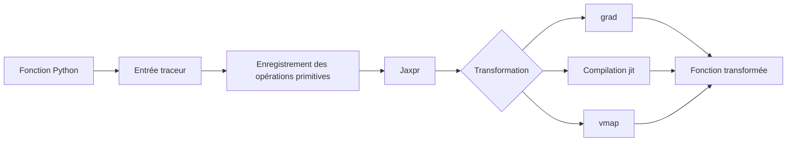



L’essence de JAX n’est pas sa syntaxe semblable à celle de NumPy.
C’est un modèle d’exécution qui trace les fonctions Python et applique des transformations de programme telles que la différenciation, la compilation et la vectorisation.

## 1. Le problème : Python en exécution immédiate et les programmes tracés se comportent différemment

Une fonction Python ordinaire peut examiner les valeurs pendant son exécution, bifurquer et produire des effets de bord.
Au sein d’une transformation JAX, une valeur peut être un traceur représentant un calcul plutôt qu’un tableau concret.

Les problèmes suivants sont fréquents.

- Utiliser la valeur d’un traceur dans un `if` Python
- Modifier l’état global dans une fonction
- Consommer un itérateur
- Appeler implicitement un générateur aléatoire
- Changer les formes entre les appels et provoquer des recompilations continuelles
- Convertir un traceur à l’aide d’une opération NumPy sur l’hôte
- S’attendre à une mutation sur place

Le code JAX est plus prévisible lorsqu’il est conçu comme une **fonction pure aux formes stables, des entrées vers les sorties**.

## 2. Modèle mental : parcourir Python une fois pour construire un graphe de calcul



Le corps Python d’une fonction compilée par `jit` n’est pas réexécuté tel quel à chaque appel.
Le traçage et la compilation ont lieu en fonction des formes d’entrée, des types, des arguments statiques et d’autres propriétés, après quoi l’exécutable est réutilisé.

Par conséquent, intégrer l’affichage, la journalisation ou l’écriture de fichiers à la sémantique de la fonction peut produire des résultats inattendus.

## 3. Le contrat de fonction pure

Une fonction pure produit la même sortie pour une même entrée et ne possède aucun effet de bord observable.

Mauvais exemple :

```python
scale = 2.0

def f(x):
    global scale
    scale += 1.0
    return x * scale
```

Version améliorée :

```python
def f(state, x):
    new_scale = state["scale"] + 1.0
    y = x * new_scale
    return {"scale": new_scale}, y
```

Faites de l’état une entrée et une sortie explicites.
Le même principe s’applique à l’état de l’optimiseur, aux statistiques de lot et aux clés aléatoires.

## 4. `grad` : objectifs scalaires et différentiabilité

Le gradient d’une fonction scalaire (f:\mathbb{R}^n\rightarrow\mathbb{R}) est

$$
\nabla_x f = \left[\frac{\partial f}{\partial x_1},\ldots,
\frac{\partial f}{\partial x_n}\right]
$$

```python
import jax
import jax.numpy as jnp

def loss(params, x, y):
    prediction = x @ params
    return jnp.mean((prediction - y) ** 2)

loss_and_grad = jax.value_and_grad(loss)
```

Gardez à l’esprit les points suivants.

- Par défaut, la sortie différenciée par `grad` doit être scalaire.
- Les entrées entières ne constituent généralement pas des cibles de différenciation.
- Les opérations discontinues peuvent avoir un gradient inexploitable, voire aucun gradient.
- Utilisez les mises à jour fonctionnelles `.at[...]` au lieu de mutations.
- Validez le sens mathématique des dérivées personnalisées.

Validez indépendamment les gradients à l’aide de différences finies et de petits problèmes analytiques.

## 5. `jit` : limites de performance et recompilation

```python
@jax.jit
def step(params, batch):
    grads = jax.grad(loss)(params, batch["x"], batch["y"])
    return params - 1e-3 * grads
```

Le premier appel comprend le coût du traçage et de la compilation.
Pour mesurer les performances en régime permanent, effectuez d’abord une montée en température et synchronisez la fin de l’exécution.

```python
compiled = step.lower(params, batch).compile()
result = compiled(params, batch)
result.block_until_ready()
```

Les causes de recompilation sont notamment les suivantes.

- Changement de forme
- Changement de type
- Changement de valeur d’un argument statique
- Changement de structure d’un conteneur Python
- Création répétée d’objets fonction

Pour les séquences de longueur variable, utilisez du remplissage et des masques ou des compartiments afin de limiter le nombre de formes.

## 6. Traceurs et flux de contrôle

Le code suivant peut échouer sous `jit`.

```python
def clipped(x):
    if x.sum() > 0:
        return x
    return -x
```

Si la condition est une valeur tracée, Python ne peut pas la décider au moment de la compilation.
Utilisez une primitive de flux de contrôle de JAX.

```python
from jax import lax

def clipped(x):
    return lax.cond(x.sum() > 0, lambda z: z, lambda z: -z, x)
```

Une courte boucle fixe peut être déroulée, mais `lax.scan`, `fori_loop` ou `while_loop` peuvent mieux convenir à une boucle longue.
Consultez dans la documentation officielle les contraintes de différenciation automatique propres à chaque primitive.

## 7. `vmap` : transformer une boucle en axe de lot

Une fonction pour un seul échantillon :

```python
def predict_one(params, x):
    return jnp.tanh(x @ params["w"] + params["b"])
```

Application à un lot :

```python
predict_batch = jax.vmap(predict_one, in_axes=(None, 0))
```

`in_axes` indique les axes d’entrée à mettre en correspondance.
Les paramètres du modèle sont partagés et seul l’axe des échantillons est parcouru.

`vmap` n’est pas une formule magique qui se contente d’accélérer une boucle Python.
Des règles de mise en lots sont appliquées à chaque primitive et les tableaux intermédiaires peuvent devenir volumineux.
Examinez aussi le profil d’utilisation de la mémoire.

## 8. Ordre de composition des transformations

`jit(vmap(grad(f)))` et `vmap(jit(grad(f)))` peuvent différer par leur signification et leurs limites de compilation.

Les considérations générales comprennent les questions suivantes.

- Avez-vous besoin d’un gradient par exemple ou du gradient de la perte du lot ?
- Où l’axe du lot doit-il être placé ?
- Quelle taille l’unité de compilation doit-elle avoir ?
- La matérialisation des intermédiaires augmente-t-elle l’utilisation de la mémoire ?

Exemple : gradient de la perte moyenne d’un lot

```python
def batch_loss(params, xs, ys):
    losses = jax.vmap(single_loss, in_axes=(None, 0, 0))(params, xs, ys)
    return losses.mean()

train_grad = jax.jit(jax.grad(batch_loss))
```

La forme et la signification de son résultat diffèrent de celles d’un gradient par exemple.

## 9. Une clé aléatoire est une valeur

JAX transmet explicitement les clés au lieu d’utiliser un état global implicite pour le hasard.

```python
key = jax.random.key(0)
key, subkey = jax.random.split(key)
noise = jax.random.normal(subkey, shape=(128,))
```

Réutiliser la même clé produit les mêmes nombres aléatoires.

Pratiques recommandées :

- Une fonction reçoit une clé.
- Elle la divise en autant de sous-clés que nécessaire.
- Elle ne réutilise pas une clé déjà consommée.
- Dans les environnements distribués, utilisez des valeurs d’incorporation propres à chaque processus et appareil.
- Enregistrez la clé suivante ou l’état de graine reproductible dans les points de contrôle.

Les erreurs de gestion des clés aléatoires peuvent rompre l’indépendance statistique alors même que le code continue à s’exécuter.

## 10. Structurer l’état avec des PyTrees

Les listes, les tuples, les dictionnaires et les classes enregistrées peuvent être traités comme des arbres dont les feuilles sont des tableaux.

```python
params = {
    "encoder": {"w": w1, "b": b1},
    "head": {"w": w2, "b": b2},
}

norms = jax.tree.map(jnp.linalg.norm, params)
```

La structure de l’arbre elle-même peut aussi influer sur la signature de compilation.
Ne modifiez pas l’ensemble de clés ni la structure du conteneur entre les étapes.

Distinguez les métadonnées statiques de l’état sous forme de tableaux.
Le passage d’un grand objet Python comme argument statique peut causer des problèmes de hachage et de recompilation.

## 11. Procédure pratique de vérification

1. Testez l’exactitude de la fonction en exécution immédiate, sans transformation.
2. Comparez-la à une implémentation NumPy ou de référence sur de petites entrées.
3. Vérifiez `grad` analytiquement ou à l’aide de différences finies.
4. Comparez les résultats de `vmap` à ceux d’une boucle explicite.
5. Comparez les résultats et les types avant et après `jit`.
6. Observez le nombre de compilations entre des appels de formes différentes.
7. Mesurez les performances après montée en température et synchronisation.
8. Testez les entrées NaN, Inf et les valeurs limites.

```python
expected = jnp.stack([predict_one(params, x) for x in xs])
actual = predict_batch(params, xs)
assert jnp.allclose(actual, expected, rtol=1e-5, atol=1e-6)
```

Choisissez les tolérances en fonction du type et de la méthode numérique.

## 12. Liste de contrôle de l’évaluation

- [ ] La fonction transformée est-elle une fonction pure sans effets de bord ?
- [ ] L’état et les clés aléatoires sont-ils des entrées et des sorties explicites ?
- [ ] Une même clé aléatoire n’est-elle jamais réutilisée ?
- [ ] La sortie et la différentiabilité mathématique de la fonction transmise à `grad` ont-elles été vérifiées ?
- [ ] Les traceurs restent-ils en dehors des conversions Python `if`, `int` et NumPy ?
- [ ] Les formes dynamiques sont-elles limitées au moyen de remplissage ou de compartiments ?
- [ ] Les résultats de `vmap` ont-ils été comparés à une boucle de référence ?
- [ ] L’exactitude et les types sont-ils identiques avant et après `jit` ?
- [ ] Une montée en température de la compilation a-t-elle précédé la mesure des performances ?
- [ ] L’exécution asynchrone est-elle synchronisée avec `block_until_ready` ?
- [ ] Les causes de recompilation sont-elles observées ?
- [ ] Les gradients personnalisés sont-ils contrôlés à l’aide d’un test numérique indépendant ?

## 13. Échecs courants et limites

### Appliquer `jit` à chaque petite fonction

Les limites de compilation peuvent devenir trop fines et le surcoût de distribution peut augmenter.
Établissez le profil au niveau d’étapes de calcul significatives.

### Présenter le temps du premier appel comme la latence en régime permanent

Le premier appel inclut la compilation.
Présentez séparément les latences à froid et à chaud.

### Mélanger sans précaution les tableaux NumPy et JAX

Cela peut provoquer des transferts entre l’hôte et l’appareil ou des erreurs de conversion de traceur.
Utilisez `jax.numpy` et les primitives prises en charge dans les régions transformées.

### Considérer les fonctions pures comme une simple recommandation de style

Les effets de bord s’exécutent selon le nombre de traçages et peuvent modifier le sens réel du programme.
Exprimez les transitions d’état au moyen des valeurs de retour.

JAX n’optimise pas automatiquement tous les programmes Python.
Pour les objets dynamiques, les processus centrés sur les entrées-sorties ou les petits calculs, le coût de compilation peut dépasser les bénéfices.

## 14. Références officielles

- [Documentation officielle des concepts clés de JAX](https://docs.jax.dev/en/latest/key-concepts.html)
- [Penser avec JAX](https://docs.jax.dev/en/latest/notebooks/thinking_in_jax.html)
- [Pièges de JAX](https://docs.jax.dev/en/latest/notebooks/Common_Gotchas_in_JAX.html)
- [Documentation officielle sur la vectorisation automatique](https://docs.jax.dev/en/latest/automatic-vectorization.html)
- [Documentation officielle sur les nombres aléatoires de JAX](https://docs.jax.dev/en/latest/random-numbers.html)

## 15. Conclusion

La clé d’une utilisation fiable de JAX n’est pas de mémoriser son API de tableaux, mais de restructurer un programme sous forme de fonctions pures traçables.
Comparer la signification de chaque transformation à des boucles, à des implémentations de référence et à une différenciation numérique permet de préserver à la fois les performances et l’exactitude.
