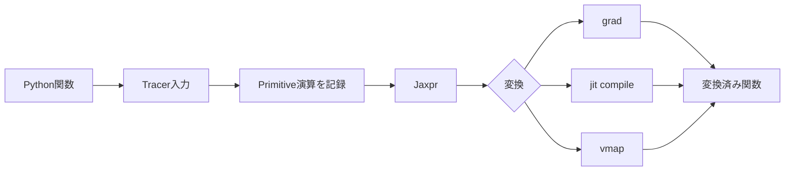



JAXの核心はNumPyに似た構文ではない。
Python関数を追跡し、微分、compilation、vectorizationのようなprogram transformationを適用する実行モデルである。

## 1. 問題：eager Pythonとtraced programは異なる動作をする

通常のPython関数は、実行中に値を見て分岐し、side effectを引き起こすことができる。
JAX transformationの内部では、値が具体的な配列ではなく、計算を表すtracerである場合がある。

次の問題がよく起きる。

- tracerの値をPythonの`if`で使用する。
- 関数内でglobal stateを変更する。
- iteratorを消費する。
- random generatorを暗黙的に呼び出す。
- shapeが呼び出しのたびに変わり、継続的にrecompileされる。
- host NumPy演算でtracerを変換する。
- in-place mutationを期待する。

JAXコードは、**入力から出力への純粋でshape-stableな関数**として設計するほど予測しやすくなる。

## 2. Mental model：Pythonを一度たどって計算graphを作る



`jit`された関数のPython bodyが、呼び出しのたびにそのまま実行されるわけではない。
入力のshape、dtype、static argumentなどに応じてtraceとcompileが行われ、executableが再利用される。

したがって、print、logging、file writeを関数の意味の一部にすると、予想とは異なる結果になり得る。

## 3. 純粋関数の契約

純粋関数は同じ入力に同じ出力を返し、観測可能なside effectを持たない。

悪い例：

```python
scale = 2.0

def f(x):
    global scale
    scale += 1.0
    return x * scale
```

改善：

```python
def f(state, x):
    new_scale = state["scale"] + 1.0
    y = x * new_scale
    return {"scale": new_scale}, y
```

stateを明示的な入力と出力にする。
optimizer state、batch statistics、random keyにも同じ原則を適用する。

## 4. `grad`：scalar objectiveと微分可能性

scalar関数 (f:\mathbb{R}^n\rightarrow\mathbb{R}) のgradientは次のとおりである。

$$
\nabla_x f = \left[\frac{\partial f}{\partial x_1},\ldots,
\frac{\partial f}{\partial x_n}\right]
$$

```python
import jax
import jax.numpy as jnp

def loss(params, x, y):
    prediction = x @ params
    return jnp.mean((prediction - y) ** 2)

loss_and_grad = jax.value_and_grad(loss)
```

注意：

- デフォルトで`grad`の対象となる出力はscalarである。
- 整数入力は一般的な微分対象ではない。
- 不連続演算にはgradientが存在しないか、有用でない場合がある。
- mutationの代わりに`.at[...]`によるfunctional updateを使用する。
- custom derivativeは数学的意味を検証しなければならない。

finite differenceと小規模な解析問題によってgradientを独立に検証する。

## 5. `jit`：性能境界と再コンパイル

```python
@jax.jit
def step(params, batch):
    grads = jax.grad(loss)(params, batch["x"], batch["y"])
    return params - 1e-3 * grads
```

最初の呼び出しにはtracingとcompilationのコストが含まれる。
steady-state benchmarkでは、warm-up後に実行完了を同期する。

```python
compiled = step.lower(params, batch).compile()
result = compiled(params, batch)
result.block_until_ready()
```

再コンパイルの原因：

- shapeの変更
- dtypeの変更
- static argumentの値の変更
- Python container構造の変更
- 関数オブジェクトが繰り返し生成される

可変長sequenceにはpaddingとmask、またはbucketを用い、shapeの種類を制限する。

## 6. Tracerとcontrol flow

次のコードは`jit`で失敗する場合がある。

```python
def clipped(x):
    if x.sum() > 0:
        return x
    return -x
```

条件がtraced valueであれば、Pythonはcompile時点で判定できない。
JAXのcontrol-flow primitiveを使用する。

```python
from jax import lax

def clipped(x):
    return lax.cond(x.sum() > 0, lambda z: z, lambda z: -z, x)
```

固定された短いloopはunrollされることがあるが、長いloopには`lax.scan`、`fori_loop`、`while_loop`が適している場合がある。
各primitiveのautodiff制約を公式ドキュメントで確認する。

## 7. `vmap`：loopをbatch axisに変える

単一sample関数：

```python
def predict_one(params, x):
    return jnp.tanh(x @ params["w"] + params["b"])
```

batchへの適用：

```python
predict_batch = jax.vmap(predict_one, in_axes=(None, 0))
```

`in_axes`はどの入力axisをmappingするかを指定する。
モデルparameterは共有し、sample axisだけをmappingする。

`vmap`はPython loopを単純に高速化する魔法ではない。
primitiveごとにbatching ruleが適用され、中間配列のサイズが大きくなることがある。
memory profileも併せて確認する。

## 8. 変換を組み合わせる順序

`jit(vmap(grad(f)))`と`vmap(jit(grad(f)))`では、意味とcompile境界が異なる場合がある。

一般的な検討事項：

- per-example gradientが必要か、batch loss gradientが必要か？
- batch axisをどこに置くか？
- compile単位をどの程度大きくするか？
- 中間materializationによってmemoryが増えるか？

例：batch平均lossのgradient

```python
def batch_loss(params, xs, ys):
    losses = jax.vmap(single_loss, in_axes=(None, 0, 0))(params, xs, ys)
    return losses.mean()

train_grad = jax.jit(jax.grad(batch_loss))
```

per-example gradientとは結果のshapeと意味が異なる。

## 9. Random keyは値である

JAX randomは暗黙的なglobal stateの代わりに、keyを明示的に渡す。

```python
key = jax.random.key(0)
key, subkey = jax.random.split(key)
noise = jax.random.normal(subkey, shape=(128,))
```

同じkeyを再利用すると、同じ乱数が生成される。

推奨パターン：

- 関数がkeyを受け取る。
- 必要なsubkeyをsplitする。
- 使用したkeyを再度使わない。
- distributed環境ではprocessおよびdeviceごとのfold-inを使用する。
- checkpointに次のkey、または再現可能なseed stateを保存する。

random keyの管理ミスは、コードが実行できていても統計的独立性を損なう可能性がある。

## 10. PyTreeでstateを構造化する

list、tuple、dict、登録済みclassを、leaf配列からなるtreeとして扱うことができる。

```python
params = {
    "encoder": {"w": w1, "b": b1},
    "head": {"w": w2, "b": b2},
}

norms = jax.tree.map(jnp.linalg.norm, params)
```

tree構造自体もcompile signatureに影響することがある。
stepの間でkey集合やcontainer構造を変更しない。

static metadataとarray stateを区別する。
大きなPythonオブジェクトをstatic argumentとして渡すと、hashingとrecompilationの問題が生じることがある。

## 11. 実践的な検証workflow

1. transformationを適用していないeager関数の正確性をtestする。
2. 小さな入力でNumPy/reference実装と比較する。
3. `grad`をanalyticまたはfinite differenceで確認する。
4. `vmap`の結果を明示的なloopと比較する。
5. `jit`の前後で結果とdtypeを比較する。
6. 複数のshapeで呼び出し、compilation countを観測する。
7. warm-upとsynchronizationを含めてbenchmarkする。
8. NaN、Inf、boundary inputをtestする。

```python
expected = jnp.stack([predict_one(params, x) for x in xs])
actual = predict_batch(params, xs)
assert jnp.allclose(actual, expected, rtol=1e-5, atol=1e-6)
```

toleranceはdtypeとnumerical methodに基づいて定める。

## 12. 評価checklist

- [ ] transformed関数はside effectのない純粋関数か？
- [ ] stateとrandom keyが明示的な入力・出力になっているか？
- [ ] 同じrandom keyを再利用していないか？
- [ ] `grad`対象関数の出力と数学的な微分可能性を確認したか？
- [ ] tracerをPythonの`if`、`int`、NumPy変換に使用していないか？
- [ ] dynamic shapeをpaddingまたはbucketで制限したか？
- [ ] `vmap`の結果をloop baselineと比較したか？
- [ ] `jit`の前後で正確性とdtypeが一致しているか？
- [ ] benchmarkの前にcompile warm-upを行ったか？
- [ ] 非同期実行を`block_until_ready`で同期したか？
- [ ] recompilationの原因を観測しているか？
- [ ] custom gradientを独立した数値検査で確認したか？

## 13. よくある失敗と限界

### `jit`を小さな関数ごとに付ける

compile境界が細かく分かれすぎ、dispatch overheadが大きくなることがある。
意味のあるcompute step単位でprofileする。

### 最初の呼び出し時間をsteady-state latencyとして報告する

最初の呼び出しにはcompilationが含まれる。
coldとwarmのlatencyを分ける。

### NumPyとJAXの配列を不用意に混在させる

host-device transferまたはtracer conversionエラーが起きる可能性がある。
transformed regionでは`jax.numpy`とサポート対象のprimitiveを使用する。

### pure functionをstyle上の推奨にすぎないと考える

side effectはtrace回数に応じて実行され、実際の意味を変える。
状態遷移をreturn valueで表現する。

JAXはすべてのPythonコードを自動的に最適化するわけではない。
動的オブジェクト、I/O中心のworkflow、小規模な計算では、compilationコストが利益を上回ることがある。

## 14. 公式参考資料

- [JAXの主要概念に関する公式ドキュメント](https://docs.jax.dev/en/latest/key-concepts.html)
- [Thinking in JAX](https://docs.jax.dev/en/latest/notebooks/thinking_in_jax.html)
- [JAX Sharp Bits](https://docs.jax.dev/en/latest/notebooks/Common_Gotchas_in_JAX.html)
- [Automatic vectorizationの公式ドキュメント](https://docs.jax.dev/en/latest/automatic-vectorization.html)
- [JAX random numbersの公式ドキュメント](https://docs.jax.dev/en/latest/random-numbers.html)

## 15. まとめ

JAXを安定して使うために重要なのは、array APIの暗記ではなく、プログラムを追跡可能な純粋関数として再構成することである。
各transformationの意味をloop・reference・数値微分と比較すれば、性能最適化と正確性を両立できる。
