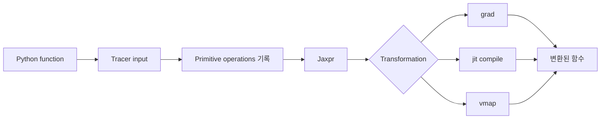



JAX의 핵심은 NumPy와 비슷한 문법이 아니다.
Python 함수를 추적해 미분, compilation, vectorization 같은 program transformation을 적용하는 실행 모델이다.

## 1. 문제: eager Python과 traced program은 다르게 동작한다

평범한 Python 함수는 실행 중 값을 보고 분기하고 side effect를 일으킬 수 있다.
JAX transformation 안에서는 값이 구체적인 배열이 아니라 계산을 나타내는 tracer일 수 있다.

다음 문제가 흔하다.

- tracer 값을 Python `if`에서 사용한다.
- 함수 안에서 global state를 변경한다.
- iterator를 소비한다.
- random generator를 암묵적으로 호출한다.
- shape가 호출마다 바뀌어 계속 recompile한다.
- host NumPy 연산으로 tracer를 변환한다.
- in-place mutation을 기대한다.

JAX 코드는 **입력에서 출력으로의 순수하고 shape-stable한 함수**로 설계할수록 예측 가능하다.

## 2. Mental model: Python을 한 번 따라가 계산 graph를 만든다



`jit`된 함수의 Python body는 모든 호출마다 그대로 실행되는 것이 아니다.
입력의 shape, dtype, static argument 등에 따라 trace와 compile이 일어나고 executable이 재사용된다.

따라서 print, logging, file write를 함수 의미의 일부로 두면 예상과 달라질 수 있다.

## 3. 순수 함수 계약

순수 함수는 같은 입력에 같은 출력을 내고 관찰 가능한 side effect가 없다.

나쁜 예:

```python
scale = 2.0

def f(x):
    global scale
    scale += 1.0
    return x * scale
```

개선:

```python
def f(state, x):
    new_scale = state["scale"] + 1.0
    y = x * new_scale
    return {"scale": new_scale}, y
```

state를 명시적 입력과 출력으로 만든다.
optimizer state, batch statistics, random key도 같은 원칙을 따른다.

## 4. `grad`: scalar objective와 미분 가능성

scalar 함수 (f:\mathbb{R}^n\rightarrow\mathbb{R})의 gradient는 다음이다.

$$
\nabla_x f = \left[\frac{\partial f}{\partial x_1},\ldots,
\frac{\partial f}{\partial x_n}\right]
$$

```python
import jax
import jax.numpy as jnp

def loss(params, x, y):
    prediction = x @ params
    return jnp.mean((prediction - y) ** 2)

loss_and_grad = jax.value_and_grad(loss)
```

주의:

- 기본 `grad` 대상 출력은 scalar다.
- 정수 입력은 일반적 미분 대상이 아니다.
- 불연속 연산은 gradient가 없거나 유용하지 않을 수 있다.
- mutation 대신 `.at[...]` functional update를 사용한다.
- custom derivative는 수학적 의미를 검증해야 한다.

finite difference와 작은 해석 문제로 gradient를 독립 검증한다.

## 5. `jit`: 성능 경계와 재컴파일

```python
@jax.jit
def step(params, batch):
    grads = jax.grad(loss)(params, batch["x"], batch["y"])
    return params - 1e-3 * grads
```

첫 호출에는 tracing과 compilation 비용이 포함된다.
steady-state benchmark에서는 warm-up 후 실행 완료를 동기화한다.

```python
compiled = step.lower(params, batch).compile()
result = compiled(params, batch)
result.block_until_ready()
```

재컴파일 원인:

- shape 변경
- dtype 변경
- static argument 값 변경
- Python container 구조 변경
- 함수 객체가 반복 생성됨

가변 길이 sequence는 padding과 mask 또는 bucket으로 shape 수를 제한한다.

## 6. Tracer와 control flow

다음 코드는 `jit`에서 실패할 수 있다.

```python
def clipped(x):
    if x.sum() > 0:
        return x
    return -x
```

조건이 traced value라면 Python이 compile 시점에 결정할 수 없다.
JAX control-flow primitive를 사용한다.

```python
from jax import lax

def clipped(x):
    return lax.cond(x.sum() > 0, lambda z: z, lambda z: -z, x)
```

고정된 작은 loop는 unroll될 수 있지만 긴 loop는 `lax.scan`, `fori_loop`, `while_loop`가 적합할 수 있다.
각 primitive의 autodiff 제약을 공식 문서에서 확인한다.

## 7. `vmap`: loop를 batch axis로 바꾼다

단일 sample 함수:

```python
def predict_one(params, x):
    return jnp.tanh(x @ params["w"] + params["b"])
```

batch 적용:

```python
predict_batch = jax.vmap(predict_one, in_axes=(None, 0))
```

`in_axes`는 어떤 입력 axis를 mapping할지 지정한다.
모델 parameter는 공유하고 sample axis만 mapping한다.

`vmap`은 Python loop를 단순히 빠르게 만드는 마법이 아니다.
primitive마다 batching rule이 적용되고 중간 배열 크기가 커질 수 있다.
memory profile을 함께 본다.

## 8. 변환 조합 순서

`jit(vmap(grad(f)))`와 `vmap(jit(grad(f)))`는 의미와 compile 경계가 다를 수 있다.

일반적 고려:

- per-example gradient가 필요한가, batch loss gradient가 필요한가?
- batch axis를 어디에 둘 것인가?
- compile 단위를 얼마나 크게 할 것인가?
- 중간 materialization이 memory를 키우는가?

예: batch 평균 loss의 gradient

```python
def batch_loss(params, xs, ys):
    losses = jax.vmap(single_loss, in_axes=(None, 0, 0))(params, xs, ys)
    return losses.mean()

train_grad = jax.jit(jax.grad(batch_loss))
```

per-example gradient와는 결과 shape와 의미가 다르다.

## 9. Random key는 값이다

JAX random은 암묵적 global state 대신 key를 명시적으로 전달한다.

```python
key = jax.random.key(0)
key, subkey = jax.random.split(key)
noise = jax.random.normal(subkey, shape=(128,))
```

같은 key를 재사용하면 같은 난수가 만들어진다.

권장 패턴:

- 함수가 key를 받는다.
- 필요한 subkey를 split한다.
- 사용한 key를 다시 쓰지 않는다.
- distributed 환경에서는 process와 device별 fold-in을 사용한다.
- checkpoint에 다음 key 또는 재현 가능한 seed state를 저장한다.

random key 관리 오류는 코드가 실행되면서도 통계적 독립성을 깨뜨릴 수 있다.

## 10. PyTree로 state를 구조화한다

list, tuple, dict와 등록된 class를 leaf 배열의 tree로 다룰 수 있다.

```python
params = {
    "encoder": {"w": w1, "b": b1},
    "head": {"w": w2, "b": b2},
}

norms = jax.tree.map(jnp.linalg.norm, params)
```

tree 구조 자체도 compile signature에 영향을 줄 수 있다.
step 사이에서 key 집합이나 container 구조를 바꾸지 않는다.

static metadata와 array state를 구분한다.
큰 Python 객체를 static argument로 넘기면 hashing과 recompilation 문제가 생길 수 있다.

## 11. 실전 검증 workflow

1. transformation 없는 eager 함수의 정확성을 test한다.
2. 작은 입력에서 NumPy/reference 구현과 비교한다.
3. `grad`를 analytic 또는 finite difference로 확인한다.
4. `vmap` 결과를 명시적 loop와 비교한다.
5. `jit` 전후 결과와 dtype을 비교한다.
6. 여러 shape 호출에서 compilation count를 관찰한다.
7. warm-up과 synchronization을 포함해 benchmark한다.
8. NaN, Inf, boundary input을 test한다.

```python
expected = jnp.stack([predict_one(params, x) for x in xs])
actual = predict_batch(params, xs)
assert jnp.allclose(actual, expected, rtol=1e-5, atol=1e-6)
```

tolerance는 dtype과 numerical method에 근거해 정한다.

## 12. 평가 checklist

- [ ] transformed 함수가 side effect 없는 순수 함수인가?
- [ ] state와 random key가 명시적 입력·출력인가?
- [ ] 같은 random key를 재사용하지 않는가?
- [ ] `grad` 대상 함수의 출력과 수학적 미분 가능성을 확인했는가?
- [ ] tracer를 Python `if`, `int`, NumPy 변환에 사용하지 않는가?
- [ ] dynamic shape를 padding 또는 bucket으로 제한했는가?
- [ ] `vmap` 결과를 loop baseline과 비교했는가?
- [ ] `jit` 전후 정확성과 dtype이 일치하는가?
- [ ] benchmark 전에 compile warm-up을 했는가?
- [ ] 비동기 실행을 `block_until_ready`로 동기화했는가?
- [ ] recompilation 원인을 관측하는가?
- [ ] custom gradient를 독립 수치 검사했는가?

## 13. 흔한 실패와 한계

### `jit`을 작은 함수마다 붙인다

compile 경계가 지나치게 잘게 나뉘고 dispatch overhead가 커질 수 있다.
의미 있는 compute step 단위로 profile한다.

### 첫 호출 시간을 steady-state latency로 보고한다

첫 호출에는 compilation이 포함된다.
cold와 warm latency를 분리한다.

### NumPy와 JAX 배열을 무심코 섞는다

host-device transfer 또는 tracer conversion 오류가 생길 수 있다.
transformed region에서는 `jax.numpy`와 지원 primitive를 사용한다.

### pure function을 style 권고로만 본다

side effect는 trace 횟수에 따라 실행돼 실제 의미를 바꾼다.
상태 전이를 return value로 표현한다.

JAX는 모든 Python 코드를 자동 최적화하지 않는다.
동적 객체, I/O 중심 workflow, 작은 계산에서는 compilation 비용이 이득보다 클 수 있다.

## 14. 공식 참고자료

- [JAX 핵심 개념 공식 문서](https://docs.jax.dev/en/latest/key-concepts.html)
- [Thinking in JAX](https://docs.jax.dev/en/latest/notebooks/thinking_in_jax.html)
- [JAX Sharp Bits](https://docs.jax.dev/en/latest/notebooks/Common_Gotchas_in_JAX.html)
- [Automatic vectorization 공식 문서](https://docs.jax.dev/en/latest/automatic-vectorization.html)
- [JAX random numbers 공식 문서](https://docs.jax.dev/en/latest/random-numbers.html)

## 15. 마무리

JAX를 안정적으로 쓰는 핵심은 array API 암기가 아니라 추적 가능한 순수 함수로 프로그램을 재구성하는 것이다.
각 transformation의 의미를 loop·reference·수치 미분과 비교하면 성능 최적화와 정확성을 함께 지킬 수 있다.
