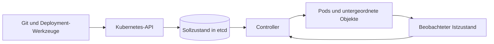



## Das Problem: Das Bereitstellen von YAML schafft noch kein Betriebsmodell

Kubernetes ist kein Werkzeug, das aus der Ferne Befehle zum Ausführen von Containern sendet.

Es ist ein System, in dem Benutzer ihren Sollzustand als API-Objekte festhalten und Controller den Istzustand fortlaufend an diesen Sollzustand annähern.

Ohne dieses Denkmodell treten immer wieder dieselben Probleme auf.

- Ein manuell erstellter Pod verschwindet und wird nie wiederhergestellt.
- Eine zustandsbehaftete Workload, die eine feste Identität benötigt, wird in ein Deployment gezwängt.
- Readiness und Liveness verwenden denselben Endpunkt und verstärken dadurch Störungen.
- Werden nur Limits, aber keine Requests gesetzt, sind Scheduling und Drosselung unvorhersehbar.
- Alte und neue Versionen geraten während eines Rolling Updates wegen inkompatibler Schemas in Konflikt.
- Eine vorübergehende Reparatur mit `kubectl exec` erzeugt Abweichungen vom deklarierten Zustand.
- Fehler von Probes werden mit tatsächlichen Fehlern für Benutzer verwechselt.

Die offizielle Dokumentation zu [Kubernetes Workloads](https://kubernetes.io/docs/concepts/workloads/) erläutert, dass Workload-Ressourcen wie Deployments, StatefulSets, DaemonSets und Jobs Gruppen von Pods verwalten sollen, statt Pods direkt zu verwalten.

## Denkmodell: der Regelkreis zwischen Soll- und Istzustand



### Ein API-Objekt ist ein Zustandsvertrag, kein Befehl

`replicas: 3` ist kein Befehl, einmalig drei Pods zu erstellen.

Es ist die Deklaration, dass der Controller das System beobachtet und die Anzahl verfügbarer Replikate auf dem Zielwert halten soll.

Verschwindet ein Pod aufgrund eines Node-Ausfalls, kann ein neuer Pod erstellt werden.

Der neue Pod übernimmt jedoch weder den Arbeitsspeicher noch den lokalen Plattenzustand des vorherigen Prozesses automatisch.

### Ein Pod ist die kleinste Scheduling-Einheit

Container in einem Pod teilen sich einen Netzwerk-Namespace und Volumes.

Nur eng gekoppelte Prozesse, die gemeinsam platziert und beendet werden müssen, sollten sich einen Pod teilen.

Eine Anwendung und eine Datenbank, die unabhängig skalieren müssen, gehören im Allgemeinen nicht in denselben Pod.

Ein Sidecar erzeugt stets eine Kopplung, die sowohl den Lebenszyklus als auch die Konkurrenz um Ressourcen umfasst.

### Die Wahl eines Controllers ist die Wahl von Identitäts- und Abschlusssemantik

- **Deployment**: eine dauerhaft laufende, zustandslose Workload mit austauschbaren Replikaten
- **StatefulSet**: eine Workload, die Identität in Form stabiler Namen, Reihenfolgen oder Storage-Bindungen benötigt
- **DaemonSet**: ein Node-lokaler Agent, der auf jedem ausgewählten Node einmal benötigt wird
- **Job**: eine endliche Aufgabe, bei der die Anzahl erfolgreicher Abschlüsse zählt
- **CronJob**: ein zeitgesteuerter Controller, der nach einem Zeitplan Jobs erstellt

Ein StatefulSet stellt weder Anwendungsreplikation noch Datenkonsistenz automatisch bereit.

Diese Verantwortung verbleibt bei der Datenbank beziehungsweise beim Anwendungsprotokoll.

## Zentrale Objekte und ihre Grenzen

### Deployment und ReplicaSet

Ein Deployment verwaltet Rollout-Historie und -Strategie, während ein ReplicaSet die Anzahl der Pods verwaltet.

Eine Änderung am Pod-Template erzeugt ein neues ReplicaSet.

Da ein Selector für die Eigentümerschaft des Controllers entscheidend ist, darf er nach der Bereitstellung nicht beliebig geändert werden.

### Service und EndpointSlice

Ein Service stellt einen stabilen Zugriffspunkt vor einer wechselnden Gruppe von Pods bereit.

Prüfen Sie, dass der Label-Selector ausschließlich die vorgesehenen Pods auswählt.

Pods, welche die Readiness-Prüfung nicht bestehen, können aus den normalen Service-Endpunkten entfernt werden.

Ein Service garantiert keine erfolgreichen Transaktionen auf Anwendungsebene.

### ConfigMap und Secret

Eine ConfigMap lagert nicht vertrauliche Konfiguration aus.

Ein Secret-Objekt repräsentiert sensible Werte; Verschlüsselung ruhender Daten, RBAC und die Einbindung externer Secret-Systeme müssen jedoch separat entworfen werden.

Über Umgebungsvariablen injizierte Werte aktualisieren sich nach dem Prozessstart nicht automatisch.

Bei Volume-Aktualisierungen ist zusätzlich zu prüfen, ob ihr Verhalten zur Reload-Semantik der Anwendung passt.

### PersistentVolume und PersistentVolumeClaim

Ein PVC ist eine Storage-Anforderung, ein PV eine bereitgestellte Storage-Ressource.

Leiten Sie nicht allein aus dem Namen des Zugriffsmodus ab, ob das tatsächliche Backend sichere gleichzeitige Schreibzugriffe unterstützt.

Prüfen Sie Reclaim Policy, Snapshots, Backups, Zonentopologie und Wiederherstellungsverfahren gemeinsam.

## Arbeitsablauf: eine Workload in der richtigen Reihenfolge entwerfen

### Schritt 1. Ausführungssemantik einordnen

Beantworten Sie zuerst diese Fragen.

- Läuft sie dauerhaft oder handelt es sich um eine Aufgabe mit Abschluss?
- Sind Replikate austauschbar?
- Benötigt sie eine stabile Netzwerkidentität?
- Muss sie auf jedem Node laufen?
- Wird der Zustand bereits extern verwaltet?
- Wie viel Zeit benötigt sie nach einem Beendigungssignal zum Aufräumen?

Grenzen Sie anhand dieser Antworten die infrage kommenden Workload-Controller ein.

### Schritt 2. Resource Requests aus realen Messungen ableiten

Ein Request ist die Grundlage, anhand derer der Scheduler die Machbarkeit einer Platzierung bestimmt.

Ein Limit ist eine Laufzeitbeschränkung; CPU und Arbeitsspeicher weisen unterschiedliche Fehlermodi auf.

- Das Überschreiten eines CPU-Limits kann sich als Drosselung zeigen.
- Das Überschreiten eines Memory-Limits kann zur Beendigung wegen OOM führen.
- Zu kleine Requests überbelegen Nodes.
- Zu große Requests können das Scheduling blockieren, obwohl reale Kapazität verbleibt.

Messen Sie Spitzen, Perzentile, Aufwärmphase, GC und Sidecar-Verbrauch gemeinsam.

### Schritt 3. Startup, Readiness und Liveness trennen

`startupProbe` schützt einen langsamen Initialisierungsprozess.

`readinessProbe` gibt an, ob die Workload neue Anfragen annehmen kann.

`livenessProbe` erkennt Blockaden, bei denen ein Neustart die Wiederherstellung unterstützt.

Hängt Liveness von einer ausgefallenen externen Datenbank ab, können alle Pods neu starten und den Vorfall verschärfen.

Wählen Sie Timeout, Period und `failureThreshold` für jede Probe bewusst.

### Schritt 4. Beendigung als normalen Pfad entwerfen

Beim Beenden eines Pods empfängt die Anwendung SIGTERM und muss ihre Arbeit innerhalb der Karenzzeit abschließen.

Entwerfen Sie die Reihenfolge für das Ablehnen neuer Anfragen, das Leeren von Verbindungen, Checkpointing und das Freigeben von Sperren.

Ist die Karenzzeit kürzer als die tatsächliche maximale Verarbeitungsdauer, wird die erzwungene Beendigung zum Normalfall.

Beachten Sie, dass ein `preStop`-Hook in die gesamte Karenzzeit eingerechnet wird.

### Schritt 5. Rollout-Kompatibilität sicherstellen

Während eines Rolling Updates existieren alte und neue Versionen gleichzeitig.

APIs, Nachrichten- und Datenbankschemas müssen dieses Nebeneinander daher erlauben.

Verwenden Sie eine Expand-and-Contract-Migration.

1. Stellen Sie ein additives Schema bereit, das die vorhandene Version ignorieren kann.
2. Stellen Sie eine Anwendung bereit, die beide Schemas verarbeitet.
3. Schließen Sie den Daten-Backfill ab und überprüfen Sie ihn.
4. Entfernen Sie die alten Felder, nachdem alle Consumer migriert wurden.

### Schritt 6. Platzierung und Unterbrechungen entwerfen

Verteilen Sie Replikate mittels Topology Spread und Anti-Affinity über Ausfalldomänen.

Node Selectors, Affinity, Taints und Tolerations bilden einen Platzierungsvertrag.

Ein PodDisruptionBudget begrenzt gleichzeitige Ausfälle bei freiwilligen Unterbrechungen.

Ein PDB kann unfreiwillige Unterbrechungen wie einen Node-Ausfall nicht verhindern.

### Schritt 7. Berechtigungen und Netzwerkzugriff minimieren

Verwenden Sie für jede Workload einen eigenen ServiceAccount.

Beschränken Sie Berechtigungen für die Kubernetes-API auf die minimal erforderlichen RBAC-Verben und -Ressourcen.

Nutzen Sie für Cloud-Zugriffe eine Workload Identity statt langlebiger Schlüssel.

Prüfen Sie bei NetworkPolicy die Unterstützung durch das CNI sowie das Verhalten für Ingress und Egress.

Ermitteln Sie DNS und notwendige Steuerpfade, bevor Sie Default Deny einführen.

### Schritt 8. Beobachtbarkeit und Diagnosebelege bewahren

Verknüpfen Sie die folgenden Signale.

- Deployment-Revision und Image-Digest
- Pod-Phase und Containerzustand
- Anzahl der Neustarts und letzter Beendigungsgrund
- Scheduling-Ereignis und Pending-Grund
- tatsächlicher CPU- und Speicherverbrauch im Verhältnis zu den Requests
- Probe-Fehler und Zeitpunkt der Entfernung vom Endpunkt
- Benutzer-SLI und Traces
- Node Pressure und Eviction-Ereignisse

## Praxisbeispiel: ein zustandsloses API-Deployment

```yaml
apiVersion: apps/v1
kind: Deployment
metadata:
  name: example-api
spec:
  replicas: 3
  selector:
    matchLabels:
      app: example-api
  strategy:
    rollingUpdate:
      maxUnavailable: 0
      maxSurge: 1
  template:
    metadata:
      labels:
        app: example-api
    spec:
      serviceAccountName: example-api
      containers:
        - name: api
          image: registry.example.invalid/api@sha256:REPLACE_WITH_DIGEST
          ports:
            - containerPort: 8080
          resources:
            requests:
              cpu: 200m
              memory: 256Mi
            limits:
              memory: 512Mi
          startupProbe:
            httpGet:
              path: /health/startup
              port: 8080
            failureThreshold: 30
            periodSeconds: 2
          readinessProbe:
            httpGet:
              path: /health/ready
              port: 8080
            periodSeconds: 5
          livenessProbe:
            httpGet:
              path: /health/live
              port: 8080
            periodSeconds: 10
      terminationGracePeriodSeconds: 60
```

Dieses Beispiel ist lediglich ein Ausgangspunkt, keine vollständige Sicherheitskonfiguration.

Ergänzen Sie passend zu den Anforderungen der Umgebung Digest-Pinning, ServiceAccount, NetworkPolicy, `securityContext`, Autoscaling und eine Disruption Policy.

Der Readiness-Endpunkt prüft, ob die erforderliche Initialisierung abgeschlossen ist und die Anwendung neue Anfragen annehmen kann.

Der Liveness-Endpunkt konzentriert sich auf nicht behebbaren Zustand im Prozess selbst statt auf externe Abhängigkeiten.

## Verfahren zur Störungsdiagnose

### Pod im Zustand Pending

1. Prüfen Sie in den Pod-Ereignissen die Begründung des Schedulers.
2. Vergleichen Sie Requests mit den zuweisbaren Ressourcen der Nodes.
3. Prüfen Sie Taints, Affinity und Topologiebeschränkungen.
4. Prüfen Sie PVC-Bindung und Zonenbeschränkungen.
5. Prüfen Sie Quotas und LimitRanges.

### CrashLoopBackOff

1. Prüfen Sie sowohl die aktuellen Logs als auch die Logs mit `--previous`.
2. Prüfen Sie den letzten Beendigungsgrund und Exit-Code.
3. Suchen Sie nach fehlenden Konfigurations- oder Secret-Schlüsseln.
4. Prüfen Sie das Timing von Startup und Liveness.
5. Prüfen Sie, ob der Container OOMKilled wurde, und untersuchen Sie seine Speicherspitze.

### Festgefahrener Rollout

1. Vergleichen Sie die Werte Desired, Ready und Available des neuen ReplicaSets.
2. Prüfen Sie neue Pod-Ereignisse und Readiness-Fehler.
3. Prüfen Sie `maxSurge`, `maxUnavailable` und Quotas.
4. Prüfen Sie das Zusammenspiel von PDB und Node-Kapazität.
5. Pausieren Sie den Rollout, wenn sich der Benutzer-SLI verschlechtert.

## Prüfliste zur Verifikation

### Workload-Semantik

- [ ] Die Begründung für die Wahl des Controllers ist in einem ADR festgehalten.
- [ ] Der Zustand kann nach dem Ersetzen eines Pods wiederhergestellt werden.
- [ ] Die Semantik für Beendigung und doppelte Ausführung ist definiert.
- [ ] Abschluss- und Fehlerbedingungen für Batch-Aufgaben sind eindeutig.

### Ressourcen und Scheduling

- [ ] Requests beruhen auf Beobachtungen.
- [ ] Für Memory-OOM und CPU-Drosselung bestehen Warnmeldungen.
- [ ] Die Verteilung über Ausfalldomänen wurde verifiziert.
- [ ] Die Reaktionszeit des Cluster Autoscalers wurde unter Last getestet.
- [ ] Quota- und Prioritätsrichtlinien wurden geprüft.

### Bereitstellung

- [ ] Images werden über unveränderliche Digests nachverfolgt.
- [ ] Der gleichzeitige Betrieb alter und neuer Versionen ist sicher.
- [ ] Die Zwecke aller drei Probe-Typen sind voneinander abgegrenzt.
- [ ] Graceful Shutdown wurde unter Last getestet.
- [ ] Rollback- und Schemakompatibilität wurden verifiziert.

### Sicherheit und Betrieb

- [ ] Die Notwendigkeit eines ServiceAccount-Tokens wurde geprüft.
- [ ] Die Verwendung des privilegierten Modus und von Host-Namespaces ist minimiert.
- [ ] Verschlüsselung ruhender Secrets und RBAC wurden geprüft.
- [ ] NetworkPolicy wurde anhand tatsächlicher Paketflüsse getestet.
- [ ] Audit-Logs sind mit der Deployment-Identität verknüpft.
- [ ] Vorübergehende Diagnoseänderungen wurden in den deklarierten Zustand übernommen oder entfernt.

## Häufige Fehler und Grenzen

### Annehmen, Kubernetes stelle automatisch Anwendungs-HA bereit

Kubernetes kann Prozesse neu einplanen; für die Korrektheit von Datenreplikation, Transaktionen und Leader Election sind jedoch Anwendung und Storage verantwortlich.

### Für jedes Problem einen Liveness-Neustart verwenden

Kann ein Neustart einen externen Fehler nicht beheben, erhöht er Last und Wiederherstellungsdauer.

### Das Tag `latest` bereitstellen

Zeigt dasselbe Manifest auf unterschiedliche Bytes, lassen sich Rollback und Audit nicht reproduzieren.

### `kubectl edit` als normalen Änderungspfad in der Produktion verwenden

Die Git- oder Deployment-Quelle weicht vom Clusterzustand ab, und die Änderung verschwindet bei der nächsten Reconciliation.

### Ein StatefulSet mit Automatisierung des Datenbankbetriebs verwechseln

Konsistente Backups, Quorum, Upgrades und Failover müssen separat verifiziert werden.

### Abstraktionskosten ignorieren

Für ein kleines System können eine verwaltete Laufzeitumgebung oder eine einfache VM ein geringeres Betriebsrisiko aufweisen.

Bewerten Sie die Einführung von Kubernetes gemeinsam mit den Betriebsfähigkeiten der Organisation und dem Lebenszyklus der Workload.

## Offizielle Referenzen

- [Kubernetes-Workloads](https://kubernetes.io/docs/concepts/workloads/)
- [Kubernetes-Deployments](https://kubernetes.io/docs/concepts/workloads/controllers/deployment/)
- [Kubernetes-StatefulSets](https://kubernetes.io/docs/concepts/workloads/controllers/statefulset/)
- [Pod-Lebenszyklus und Container-Probes](https://kubernetes.io/docs/concepts/workloads/pods/pod-lifecycle/)
- [Ressourcenverwaltung für Pods und Container](https://kubernetes.io/docs/concepts/configuration/manage-resources-containers/)
- [Kubernetes-Sicherheitscheckliste](https://kubernetes.io/docs/concepts/security/security-checklist/)

## Fazit

Die Grundeinheit des Kubernetes-Betriebs ist keine YAML-Datei, sondern ein fortlaufender Reconciliation-Vertrag.

Gestalten Sie Workload-Identität, Ressourcen, Probes, Beendigung, Rollout, Storage und Berechtigungen als einen gemeinsamen Lebenszyklus.

Die Vorteile von Kubernetes kommen zur Geltung, wenn ein verschwindender Pod nicht als Ausnahme, sondern als normaler Zustandsübergang behandelt wird.
