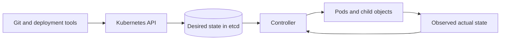



## The problem: deploying YAML does not create an operating model

Kubernetes is not a tool for remotely sending container execution commands.

It is a system in which users record their desired state as API objects and controllers continuously converge the actual state toward it.

Without this mental model, the following problems recur.

- A manually created Pod disappears and is never restored.
- A stateful workload that requires identity is forced into a Deployment.
- Readiness and liveness use the same endpoint, amplifying failures.
- Setting only limits without requests makes scheduling and throttling unpredictable.
- Old and new versions conflict during a rolling update because their schemas are incompatible.
- A temporary recovery made with `kubectl exec` causes drift from the declared state.
- Probe failures are confused with actual user failures.

The official [Kubernetes Workloads documentation](https://kubernetes.io/docs/concepts/workloads/) explains that workload resources such as Deployments, StatefulSets, DaemonSets, and Jobs should manage sets of Pods instead of managing Pods directly.

## Mental model: the control loop between desired and actual state



### An API object is a state contract, not a command

`replicas: 3` is not a command to create three Pods once.

It is a declaration that the controller should maintain the available replica count at the target while observing the system.

If a Pod disappears because of a node failure, a new Pod may be created.

However, the new Pod does not automatically inherit the previous process's memory or local disk state.

### A Pod is the smallest scheduling unit

Containers in a Pod share a network namespace and volumes.

Only processes that are tightly coupled and must be placed and terminated together should share a Pod.

In general, do not place an application and database that need to scale independently in one Pod.

Remember that a sidecar creates coupling that includes lifecycle and resource contention.

### Choosing a controller means choosing identity and completion semantics

- **Deployment**: a long-running stateless workload whose replicas are interchangeable
- **StatefulSet**: a workload that requires identity such as stable names, ordering, or storage bindings
- **DaemonSet**: a node-local agent required once on each selected node
- **Job**: a finite task for which the number of successful completions matters
- **CronJob**: a schedule controller that creates Jobs on a schedule

A StatefulSet does not automatically provide application replication or data consistency.

Those responsibilities remain with the database or application protocol.

## Core objects and boundaries

### Deployment and ReplicaSet

A Deployment manages rollout history and strategy, while a ReplicaSet manages the number of Pods.

Changing the Pod template creates a new ReplicaSet.

Because a selector is central to controller ownership, do not treat it as something to change arbitrarily after deployment.

### Service and EndpointSlice

A Service provides a stable access point in front of a changing set of Pods.

Verify that the label selector selects only the intended Pods.

Pods that do not pass readiness may be removed from normal Service endpoints.

A Service does not guarantee successful application-level transactions.

### ConfigMap and Secret

A ConfigMap separates non-confidential configuration.

A Secret object represents sensitive values, but encryption at rest, RBAC, and external secret integration must be designed separately.

Values injected through environment variables do not update automatically after the process starts.

For volume updates, also confirm that their behavior matches the application's reload semantics.

### PersistentVolume and PersistentVolumeClaim

A PVC is a storage request, and a PV is a provisioned storage resource.

Do not infer whether the actual backend supports safe concurrent writes from the access mode name alone.

Review the reclaim policy, snapshots, backups, zone topology, and restore procedures together.

## Workflow: the order for designing a workload

### Step 1. Classify its execution semantics

Answer these questions first.

- Is it permanently running or a task that completes?
- Are replicas interchangeable?
- Does it require a stable network identity?
- Must it run on every node?
- Is state already managed externally?
- How much cleanup time does it need after receiving a termination signal?

Use these answers to narrow the candidate workload controllers.

### Step 2. Set resource requests from actual measurements

A request is the basis the scheduler uses to determine placement feasibility.

A limit is a runtime constraint, and CPU and memory have different failure modes.

- Exceeding a CPU limit may appear as throttling.
- Exceeding a memory limit may lead to OOM termination.
- Requests that are too small overcrowd nodes.
- Requests that are too large can block scheduling even when real capacity remains.

Measure peaks, percentiles, warm-up, GC, and sidecar usage together.

### Step 3. Separate startup, readiness, and liveness

`startupProbe` protects a slow initialization process.

`readinessProbe` indicates whether the workload is ready to receive new requests.

`livenessProbe` detects deadlocks for which a restart would help recovery.

If liveness depends on an external database outage, every Pod may restart and amplify the incident.

Choose timeout, period, and failureThreshold deliberately for each probe.

### Step 4. Design termination as a normal path

When a Pod terminates, the application receives SIGTERM and must finish its work within the grace period.

Design the order for rejecting new requests, draining connections, checkpointing, and releasing locks.

If the grace period is shorter than the actual maximum processing time, forced termination becomes normal behavior.

When using a `preStop` hook, remember that it is included within the overall grace period.

### Step 5. Ensure rollout compatibility

Old and new versions coexist during a rolling update.

APIs, message schemas, and database schemas must therefore allow coexistence.

Use an expand-and-contract migration.

1. Deploy an additive schema that the existing version can ignore.
2. Deploy an application that handles both schemas.
3. Complete and verify the data backfill.
4. Remove the old fields after every consumer has migrated.

### Step 6. Design placement and disruption

Distribute replicas across failure domains with topology spread and anti-affinity.

Node selectors, affinity, taints, and tolerations form a placement contract.

A PodDisruptionBudget limits concurrent outages during voluntary disruptions.

A PDB cannot prevent involuntary disruptions such as a node failure.

### Step 7. Minimize permissions and network access

Use a separate ServiceAccount for each workload.

Restrict Kubernetes API permissions to the minimum RBAC verbs and resources.

Use workload identity for cloud access instead of long-lived keys.

For NetworkPolicy, verify support in the CNI and behavior in both ingress and egress directions.

Identify DNS and necessary control paths before introducing default deny.

### Step 8. Preserve observability and debugging evidence

Connect the following signals.

- deployment revision and image digest
- Pod phase and container state
- restart count and last termination reason
- scheduling event and pending reason
- actual CPU and memory usage relative to requests
- probe failure and endpoint removal time
- user SLI and traces
- node pressure and eviction events

## Practical example: a stateless API Deployment

```yaml
apiVersion: apps/v1
kind: Deployment
metadata:
  name: example-api
spec:
  replicas: 3
  selector:
    matchLabels:
      app: example-api
  strategy:
    rollingUpdate:
      maxUnavailable: 0
      maxSurge: 1
  template:
    metadata:
      labels:
        app: example-api
    spec:
      serviceAccountName: example-api
      containers:
        - name: api
          image: registry.example.invalid/api@sha256:REPLACE_WITH_DIGEST
          ports:
            - containerPort: 8080
          resources:
            requests:
              cpu: 200m
              memory: 256Mi
            limits:
              memory: 512Mi
          startupProbe:
            httpGet:
              path: /health/startup
              port: 8080
            failureThreshold: 30
            periodSeconds: 2
          readinessProbe:
            httpGet:
              path: /health/ready
              port: 8080
            periodSeconds: 5
          livenessProbe:
            httpGet:
              path: /health/live
              port: 8080
            periodSeconds: 10
      terminationGracePeriodSeconds: 60
```

This example is only a starting point, not a complete security configuration.

Add digest pinning, ServiceAccount, NetworkPolicy, securityContext, autoscaling, and disruption policy to match the environment's requirements.

The readiness endpoint checks that required initialization is complete and the application can accept new requests.

The liveness endpoint focuses on unrecoverable states in the process itself rather than external dependencies.

## Incident diagnosis procedures

### Pending Pod

1. Check the scheduler reason in the Pod events.
2. Compare requests with node allocatable resources.
3. Check taints, affinity, and topology constraints.
4. Check PVC binding and zone constraints.
5. Check quotas and LimitRanges.

### CrashLoopBackOff

1. Check both the current logs and the `--previous` logs.
2. Check the last termination reason and exit code.
3. Check for missing config or secret keys.
4. Check startup and liveness timing.
5. Check whether the container was OOMKilled and inspect its memory peak.

### Stalled rollout

1. Compare desired, ready, and available values for the new ReplicaSet.
2. Check new Pod events and readiness failures.
3. Check `maxSurge`, `maxUnavailable`, and quotas.
4. Check the interaction between the PDB and node capacity.
5. Pause the rollout if the user SLI deteriorates.

## Verification checklist

### Workload semantics

- [ ] The rationale for choosing the controller is recorded in an ADR.
- [ ] State can be restored after a Pod is replaced.
- [ ] Termination and duplicate execution semantics are defined.
- [ ] Completion and failure conditions for batch tasks are clear.

### Resources and scheduling

- [ ] Requests are based on observations.
- [ ] Alerts exist for memory OOM and CPU throttling.
- [ ] Distribution across failure domains has been verified.
- [ ] Cluster Autoscaler response time has been load-tested.
- [ ] Quota and priority policies have been checked.

### Deployment

- [ ] Images are tracked by immutable digest.
- [ ] Running old and new versions concurrently is safe.
- [ ] The purposes of all three probe types are distinct.
- [ ] Graceful shutdown has been tested under load.
- [ ] Rollback and schema compatibility have been verified.

### Security and operations

- [ ] The need for a ServiceAccount token has been reviewed.
- [ ] Use of privileged mode and host namespaces is minimized.
- [ ] Secret encryption at rest and RBAC have been reviewed.
- [ ] NetworkPolicy has been tested against actual packet flows.
- [ ] Audit logs are connected to deployment identity.
- [ ] Temporary debugging changes are reflected in the declared state or removed.

## Common failures and limitations

### Believing Kubernetes automatically provides application HA

Kubernetes can reschedule processes, but the correctness of data replication, transactions, and leader election is the responsibility of the application and storage.

### Using a liveness restart for every problem

If a restart cannot resolve an external failure, it increases load and recovery time.

### Deploying the `latest` tag

If the same manifest points to different bytes, rollback and auditing cannot be reproduced.

### Using `kubectl edit` as the normal production change path

The Git or deployment source diverges from cluster state, and the change disappears during the next reconciliation.

### Mistaking a StatefulSet for database operations automation

Consistent backups, quorum, upgrades, and failover require separate verification.

### Ignoring abstraction costs

For a small system, a managed runtime or simple VM may have lower operational risk.

Evaluate Kubernetes adoption together with the organization's operational capabilities and workload lifecycle.

## Official references

- [Kubernetes Workloads](https://kubernetes.io/docs/concepts/workloads/)
- [Kubernetes Deployments](https://kubernetes.io/docs/concepts/workloads/controllers/deployment/)
- [Kubernetes StatefulSets](https://kubernetes.io/docs/concepts/workloads/controllers/statefulset/)
- [Pod Lifecycle and Container Probes](https://kubernetes.io/docs/concepts/workloads/pods/pod-lifecycle/)
- [Resource Management for Pods and Containers](https://kubernetes.io/docs/concepts/configuration/manage-resources-containers/)
- [Kubernetes Security Checklist](https://kubernetes.io/docs/concepts/security/security-checklist/)

## Conclusion

The basic unit of Kubernetes operations is not a YAML file but an ongoing reconciliation contract.

Design workload identity, resources, probes, termination, rollout, storage, and permissions as one lifecycle.

Kubernetes's advantages emerge when a disappearing Pod is treated not as an exception but as a normal state transition.
