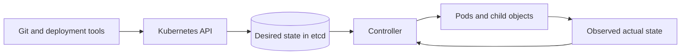



## El problema: la implementación de YAML no crea un modelo operativo

Kubernetes no es una herramienta para enviar remotamente comandos de ejecución de contenedores.

Es un sistema en el que los usuarios registran su estado deseado como objetos API y los controladores convergen continuamente en el estado real hacia él.

Sin este modelo mental, se repiten los siguientes problemas.

- Un Pod creado manualmente desaparece y nunca se restaura.
- Una carga de trabajo con estado que requiere identidad se fuerza a una implementación.
- La preparación y la vitalidad utilizan el mismo criterio de valoración, amplificando los fallos.
- Establecer sólo límites sin solicitudes hace que la programación y la limitación sean impredecibles.
- Las versiones antiguas y nuevas entran en conflicto durante una actualización continua porque sus esquemas son incompatibles.
- Una recuperación temporal realizada con `kubectl exec` provoca una desviación del estado declarado.
- Los fallos de la sonda se confunden con fallos reales del usuario.

La [Kubernetes Documentación de cargas de trabajo](https://kubernetes.io/docs/concepts/workloads/) oficial explica que los recursos de cargas de trabajo como Deployments, StatefulSets, DaemonSets y Jobs deben administrar conjuntos de Pods en lugar de administrar Pods directamente.

## Modelo mental: el circuito de control entre el estado deseado y el real



### Un objeto API es un contrato estatal, no un comando

`replicas: 3` no es un comando para crear tres Pods una vez.

Es una declaración de que el controlador debe mantener el recuento de réplicas disponibles en el objetivo mientras observa el sistema.

Si un Pod desaparece debido a una falla en el nodo, se puede crear un nuevo Pod.

Sin embargo, el nuevo Pod no hereda automáticamente la memoria del proceso anterior ni el estado del disco local.

### Un Pod es la unidad de programación más pequeña

Los contenedores en un Pod comparten un espacio de nombres y volúmenes de red.

Solo los procesos que están estrechamente acoplados y deben colocarse y terminarse juntos deben compartir un Pod.

En general, no coloque una aplicación y una base de datos que deban escalarse de forma independiente en un Pod.

Recuerde que un sidecar crea un acoplamiento que incluye el ciclo de vida y la contención de recursos.

### Elegir un controlador significa elegir la semántica de identidad y finalización

- **Implementación**: una carga de trabajo sin estado de larga duración cuyas réplicas son intercambiables
- **StatefulSet**: una carga de trabajo que requiere identidad, como nombres estables, ordenamiento o enlaces de almacenamiento.
- **DaemonSet**: se requiere un agente local de nodo una vez en cada nodo seleccionado
- **Trabajo**: una tarea finita para la que importa el número de finalizaciones exitosas.
- **CronJob**: un controlador de programación que crea trabajos según una programación

Un StatefulSet no proporciona automáticamente replicación de aplicaciones ni coherencia de datos.

Esas responsabilidades permanecen en la base de datos o el protocolo de aplicación.

## Objetos centrales y límites

### Implementación y conjunto de réplicas

Una implementación gestiona el historial y la estrategia de implementación, mientras que un ReplicaSet gestiona la cantidad de Pods.

Cambiar la plantilla del Pod crea un nuevo ReplicaSet.

Dado que un selector es fundamental para la propiedad del controlador, no lo trate como algo que deba cambiarse arbitrariamente después de la implementación.

### Servicio y EndpointSlice

Un Servicio proporciona un punto de acceso estable frente a un conjunto cambiante de Pods.

Verifique que el selector de etiquetas seleccione solo los Pods deseados.

Los pods que no pasen la preparación se pueden eliminar de los puntos finales de servicio normales.

Un Servicio no garantiza transacciones exitosas a nivel de aplicación.

### Mapa de configuración y secreto

Un ConfigMap separa la configuración no confidencial.

Un objeto secreto representa valores confidenciales, pero el cifrado en reposo, RBAC y la integración de secretos externos deben diseñarse por separado.

Los valores inyectados a través de variables de entorno no se actualizan automáticamente después de que comienza el proceso.

Para actualizaciones de volumen, confirme también que su comportamiento coincida con la semántica de recarga de la aplicación.

### Volumen persistente y Reclamación de volumen persistente

Un PVC es una solicitud de almacenamiento y un PV es un recurso de almacenamiento aprovisionado.

No infiera si el backend real admite escrituras simultáneas seguras únicamente a partir del nombre del modo de acceso.

Revise juntos la política de recuperación, las instantáneas, las copias de seguridad, la topología de zona y los procedimientos de restauración.

## Flujo de trabajo: el orden para diseñar una carga de trabajo

### Paso 1. Clasificar su semántica de ejecución.

Responda estas preguntas primero.

- ¿Está en ejecución permanente o es una tarea que se completa?
- ¿Las réplicas son intercambiables?
- ¿Requiere una identidad de red estable?
- ¿Debe ejecutarse en todos los nodos?
- ¿El Estado ya está gestionado externamente?
- ¿Cuánto tiempo de limpieza necesita después de recibir una señal de terminación?

Utilice estas respuestas para limitar los controladores de carga de trabajo candidatos.

### Paso 2. Establecer solicitudes de recursos a partir de mediciones reales

Una solicitud es la base que utiliza el planificador para determinar la viabilidad de la colocación.

Un límite es una restricción de tiempo de ejecución y CPU y la memoria tienen diferentes modos de error.

- Exceder un límite CPU puede parecer una limitación.
- Exceder un límite de memoria puede provocar la terminación de OOM.
- Solicitudes que son nodos demasiado pequeños y saturados.
- Las solicitudes que son demasiado grandes pueden bloquear la programación incluso cuando queda capacidad real.

Mida picos, percentiles, calentamiento, GC y uso del sidecar juntos.

### Paso 3. Separe el inicio, la preparación y la vida

`startupProbe` protege un proceso de inicialización lento.

`readinessProbe` indica si la carga de trabajo está lista para recibir nuevas solicitudes.

`livenessProbe` detecta puntos muertos para los cuales un reinicio ayudaría a la recuperación.

Si la vida depende de una interrupción de la base de datos externa, cada Pod puede reiniciarse y amplificar el incidente.

Elija deliberadamente el tiempo de espera, el período y el umbral de falla para cada sonda.

### Paso 4. Terminación del diseño como ruta normal

Cuando finaliza un Pod, la aplicación recibe SIGTERM y debe finalizar su trabajo dentro del período de gracia.

Diseñe la orden para rechazar nuevas solicitudes, drenar conexiones, marcar puntos de control y liberar cerraduras.

Si el período de gracia es más corto que el tiempo máximo de procesamiento real, la terminación forzada se convierte en un comportamiento normal.

Cuando utilice un gancho `preStop`, recuerde que está incluido dentro del período de gracia general.

### Paso 5. Garantizar la compatibilidad con la implementación

Las versiones antiguas y nuevas coexisten durante una actualización continua.

Por lo tanto, las API, los esquemas de mensajes y los esquemas de bases de datos deben permitir la coexistencia.

Utilice una migración de expansión y contracción.

1. Implemente un esquema aditivo que la versión existente pueda ignorar.
2. Implemente una aplicación que maneje ambos esquemas.
3. Completar y verificar el reabastecimiento de datos.
4. Elimine los campos antiguos después de que cada consumidor haya migrado.

### Paso 6. Colocación e interrupción del diseño

Distribuya réplicas entre dominios de falla con distribución de topología y antiafinidad.

Los selectores de nodos, la afinidad, las contaminaciones y las tolerancias forman un contrato de colocación.

Un PodDisruptionBudget limita las interrupciones simultáneas durante interrupciones voluntarias.

Un PDB no puede evitar interrupciones involuntarias, como una falla de nodo.

### Paso 7. Minimizar permisos y acceso a la red

Utilice una cuenta de servicio independiente para cada carga de trabajo.

Restrinja los permisos Kubernetes API al mínimo de RBAC verbos y recursos.

Utilice la identidad de la carga de trabajo para acceder a la nube en lugar de claves de larga duración.

Para NetworkPolicy, verifique la compatibilidad en CNI y el comportamiento en las direcciones de entrada y salida.

Identifique DNS y las rutas de control necesarias antes de introducir la denegación predeterminada.

### Paso 8. Preservar la observabilidad y la evidencia de depuración

Conecte las siguientes señales.

- revisión de implementación y resumen de imágenes
- Fase del pod y estado del contenedor.
- recuento de reinicios y motivo de la última terminación
- evento de programación y motivo pendiente
- CPU real y uso de memoria en relación con las solicitudes
- fallo de la sonda y tiempo de eliminación del punto final
- usuario SLI y seguimientos
- presión de nodo y eventos de desalojo

## Ejemplo práctico: una implementación API sin estado

```yaml
apiVersion: apps/v1
kind: Deployment
metadata:
  name: example-api
spec:
  replicas: 3
  selector:
    matchLabels:
      app: example-api
  strategy:
    rollingUpdate:
      maxUnavailable: 0
      maxSurge: 1
  template:
    metadata:
      labels:
        app: example-api
    spec:
      serviceAccountName: example-api
      containers:
        - name: api
          image: registry.example.invalid/api@sha256:REPLACE_WITH_DIGEST
          ports:
            - containerPort: 8080
          resources:
            requests:
              cpu: 200m
              memory: 256Mi
            limits:
              memory: 512Mi
          startupProbe:
            httpGet:
              path: /health/startup
              port: 8080
            failureThreshold: 30
            periodSeconds: 2
          readinessProbe:
            httpGet:
              path: /health/ready
              port: 8080
            periodSeconds: 5
          livenessProbe:
            httpGet:
              path: /health/live
              port: 8080
            periodSeconds: 10
      terminationGracePeriodSeconds: 60
```

Este ejemplo es sólo un punto de partida, no una configuración de seguridad completa.

Agregue fijación de resumen, cuenta de servicio, política de red, contexto de seguridad, escalado automático y política de interrupción para satisfacer los requisitos del entorno.

El punto final de preparación comprueba que la inicialización requerida esté completa y la aplicación puede aceptar nuevas solicitudes.

El punto final de vida se centra en estados irrecuperables en el proceso en sí en lugar de dependencias externas.

## Procedimientos de diagnóstico de incidentes

### Pod pendiente

1. Verifique el motivo del programador en los eventos del Pod.
2. Compare las solicitudes con los recursos asignables del nodo.
3. Verifique las restricciones de topología, afinidad y contaminación.
4. Verifique las restricciones de zona y enlace PVC.
5. Verifique cuotas y LimitRanges.

### CrashLoopBackOff

1. Verifique tanto los registros actuales como los registros `--previous`.
2. Verifique el último motivo de terminación y el código de salida.
3. Compruebe si faltan claves secretas o de configuración.
4. Verifique el tiempo de inicio y vida.
5. Verifique si el contenedor fue OOMKilled e inspeccione su pico de memoria.

### Lanzamiento estancado

1. Compare los valores deseados, listos y disponibles para el nuevo ReplicaSet.
2. Verifique nuevos eventos de Pod y fallas de preparación.
3. Verifique `maxSurge`, `maxUnavailable` y las cuotas.
4. Verifique la interacción entre PDB y la capacidad del nodo.
5. Pause la implementación si el usuario SLI se deteriora.

## Lista de verificación de verificación

### Semántica de la carga de trabajo

- [ ] El motivo de la elección del controlador se registra en un ADR.
- [] El estado se puede restaurar después de reemplazar un Pod.
- [ ] Se define la semántica de terminación y ejecución duplicada.
- [ ] Las condiciones de finalización y falla de las tareas por lotes son claras.

### Recursos y programación

- [ ] Las solicitudes se basan en observaciones.
- [ ] Existen alertas para la limitación de la memoria OOM y CPU.
- [] Se ha verificado la distribución entre dominios de error.
- [] Se ha probado la carga del tiempo de respuesta del escalador automático del clúster.
- [ ] Se han comprobado las políticas de cuotas y prioridades.

### Implementación

- [] Las imágenes se rastrean mediante un resumen inmutable.
- [] Ejecutar versiones antiguas y nuevas simultáneamente es seguro.
- [] Los propósitos de los tres tipos de sonda son distintos.
- [ ] Se ha probado el apagado elegante bajo carga.
- [] Se ha verificado la reversión y la compatibilidad del esquema.

### Seguridad y operaciones

- [] Se ha revisado la necesidad de un token de ServiceAccount.
- [] Se minimiza el uso del modo privilegiado y los espacios de nombres de host.
- Se han revisado [] Cifrado secreto en reposo y RBAC.
- [] NetworkPolicy se ha probado con flujos de paquetes reales.
- [] Los registros de auditoría están conectados a la identidad de implementación.
- [] Los cambios de depuración temporales se reflejan en el estado declarado o se eliminan.

## Fallos y limitaciones comunes

### Creer que Kubernetes proporciona automáticamente la aplicación HA

Kubernetes puede reprogramar procesos, pero la exactitud de la replicación de datos, las transacciones y la elección del líder es responsabilidad de la aplicación y el almacenamiento.

### Usar un reinicio de actividad para cada problema

Si un reinicio no puede resolver una falla externa, aumenta el tiempo de carga y recuperación.

### Implementación de la etiqueta `latest`

Si el mismo manifiesto apunta a bytes diferentes, no se pueden reproducir la reversión ni la auditoría.

### Usando `kubectl edit` como ruta normal de cambio de producción

El Git o la fuente de implementación difiere del estado del clúster y el cambio desaparece durante la siguiente conciliación.

### Confundir un StatefulSet con la automatización de operaciones de bases de datos

Las copias de seguridad, el quórum, las actualizaciones y la conmutación por error coherentes requieren una verificación por separado.

### Ignorar los costos de abstracción

Para un sistema pequeño, un tiempo de ejecución administrado o un VM simple pueden tener un riesgo operativo menor.

Evalúe la adopción de Kubernetes junto con las capacidades operativas de la organización y el ciclo de vida de la carga de trabajo.

## Referencias oficiales

- [Kubernetes Cargas de trabajo](https://kubernetes.io/docs/concepts/workloads/)
- [Kubernetes Implementaciones](https://kubernetes.io/docs/concepts/workloads/controllers/deployment/)
- [Kubernetes Conjuntos con estado](https://kubernetes.io/docs/concepts/workloads/controllers/statefulset/)
- [Sondas de contenedor y ciclo de vida del pod](https://kubernetes.io/docs/concepts/workloads/pods/pod-lifecycle/)
- [Gestión de recursos para pods y contenedores](https://kubernetes.io/docs/concepts/configuration/manage-resources-containers/)
- [Kubernetes Lista de verificación de seguridad](https://kubernetes.io/docs/concepts/security/security-checklist/)

## Conclusión

La unidad básica de operaciones Kubernetes no es un archivo YAML sino un contrato de conciliación en curso.

Diseñe la identidad de la carga de trabajo, los recursos, las sondas, la terminación, la implementación, el almacenamiento y los permisos como un solo ciclo de vida.

Las ventajas de Kubernetes surgen cuando un Pod que desaparece no se trata como una excepción sino como una transición de estado normal.
