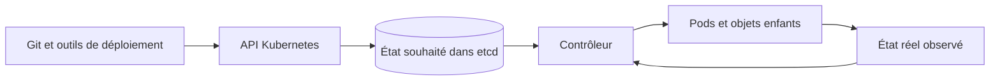



## Le problème : déployer du YAML ne crée pas un modèle d’exploitation

Kubernetes n’est pas un outil permettant d’envoyer à distance des commandes d’exécution de conteneurs.

C’est un système dans lequel les utilisateurs consignent leur état souhaité sous forme d’objets d’API, et où des contrôleurs font continuellement converger l’état réel vers celui-ci.

Sans ce modèle mental, les problèmes suivants se répètent.

- Un Pod créé manuellement disparaît et n’est jamais restauré.
- Un workload avec état qui exige une identité est forcé dans un Deployment.
- Readiness et liveness utilisent le même endpoint, ce qui amplifie les défaillances.
- Définir uniquement des limits sans requests rend la planification et le throttling imprévisibles.
- Les anciennes et nouvelles versions entrent en conflit pendant une mise à jour progressive parce que leurs schémas sont incompatibles.
- Une récupération temporaire effectuée avec `kubectl exec` provoque une dérive par rapport à l’état déclaré.
- Les échecs de sondes sont confondus avec les véritables échecs des utilisateurs.

La documentation officielle sur les [workloads Kubernetes](https://kubernetes.io/docs/concepts/workloads/) explique que les ressources de workload telles que Deployments, StatefulSets, DaemonSets et Jobs doivent gérer des ensembles de Pods au lieu de gérer directement les Pods.

## Modèle mental : la boucle de contrôle entre état souhaité et état réel



### Un objet d’API est un contrat d’état, pas une commande

`replicas: 3` n’est pas une commande visant à créer trois Pods une seule fois.

C’est une déclaration selon laquelle le contrôleur doit maintenir le nombre de réplicas disponibles à la cible tout en observant le système.

Si un Pod disparaît à cause d’une panne de nœud, un nouveau Pod peut être créé.

Cependant, le nouveau Pod n’hérite pas automatiquement de la mémoire du processus ni de l’état du disque local précédent.

### Un Pod est la plus petite unité de planification

Les conteneurs d’un Pod partagent un namespace réseau et des volumes.

Seuls les processus étroitement couplés qui doivent être placés et arrêtés ensemble doivent partager un Pod.

En règle générale, ne placez pas dans un même Pod une application et une base de données qui doivent évoluer indépendamment.

N’oubliez pas qu’un sidecar crée un couplage qui englobe le cycle de vie et la contention des ressources.

### Choisir un contrôleur, c’est choisir une sémantique d’identité et d’achèvement

- **Deployment** : workload sans état de longue durée dont les réplicas sont interchangeables
- **StatefulSet** : workload nécessitant une identité, par exemple des noms stables, un ordre ou des liaisons de stockage
- **DaemonSet** : agent local au nœud requis une fois sur chaque nœud sélectionné
- **Job** : tâche finie pour laquelle le nombre d’achèvements réussis est important
- **CronJob** : contrôleur de planification qui crée des Jobs selon un calendrier

Un StatefulSet ne fournit pas automatiquement la réplication de l’application ni la cohérence des données.

Ces responsabilités restent celles de la base de données ou du protocole applicatif.

## Objets fondamentaux et frontières

### Deployment et ReplicaSet

Un Deployment gère l’historique et la stratégie de rollout, tandis qu’un ReplicaSet gère le nombre de Pods.

Modifier le template de Pod crée un nouveau ReplicaSet.

Comme un sélecteur est central dans la propriété du contrôleur, ne le considérez pas comme une valeur que l’on peut modifier arbitrairement après le déploiement.

### Service et EndpointSlice

Un Service fournit un point d’accès stable devant un ensemble changeant de Pods.

Vérifiez que le sélecteur de labels ne sélectionne que les Pods prévus.

Les Pods qui ne passent pas la readiness peuvent être retirés des endpoints normaux du Service.

Un Service ne garantit pas la réussite des transactions au niveau applicatif.

### ConfigMap et Secret

Une ConfigMap sépare la configuration non confidentielle.

Un objet Secret représente des valeurs sensibles, mais le chiffrement au repos, le RBAC et l’intégration à un système externe de secrets doivent être conçus séparément.

Les valeurs injectées par variables d’environnement ne se mettent pas automatiquement à jour après le démarrage du processus.

Pour les mises à jour de volumes, confirmez également que leur comportement correspond à la sémantique de rechargement de l’application.

### PersistentVolume et PersistentVolumeClaim

Un PVC est une demande de stockage, et un PV une ressource de stockage provisionnée.

Ne déduisez pas du seul nom du mode d’accès si le backend réel prend en charge les écritures concurrentes en toute sécurité.

Examinez ensemble la politique de récupération, les snapshots, les sauvegardes, la topologie des zones et les procédures de restauration.

## Workflow : ordre de conception d’un workload

### Étape 1. Classer sa sémantique d’exécution

Répondez d’abord à ces questions.

- S’exécute-t-il en permanence ou s’agit-il d’une tâche qui s’achève ?
- Les réplicas sont-ils interchangeables ?
- Une identité réseau stable est-elle nécessaire ?
- Doit-il s’exécuter sur chaque nœud ?
- L’état est-il déjà géré à l’extérieur ?
- De combien de temps de nettoyage a-t-il besoin après réception d’un signal d’arrêt ?

Utilisez ces réponses pour réduire la liste des contrôleurs de workload candidats.

### Étape 2. Définir les requests de ressources à partir de mesures réelles

Une request est la base sur laquelle le scheduler détermine la faisabilité d’un placement.

Une limit est une contrainte d’exécution, et le CPU et la mémoire présentent des modes de défaillance différents.

- Dépasser une limit CPU peut se manifester par du throttling.
- Dépasser une limit mémoire peut entraîner un arrêt OOM.
- Des requests trop faibles surchargent les nœuds.
- Des requests trop élevées peuvent empêcher la planification même s’il reste de la capacité réelle.

Mesurez ensemble les pics, percentiles, phases de chauffe, GC et utilisation des sidecars.

### Étape 3. Séparer startup, readiness et liveness

`startupProbe` protège un processus d’initialisation lent.

`readinessProbe` indique si le workload est prêt à recevoir de nouvelles requêtes.

`livenessProbe` détecte les blocages pour lesquels un redémarrage faciliterait la récupération.

Si la liveness dépend d’une panne de base de données externe, chaque Pod risque de redémarrer et d’amplifier l’incident.

Choisissez délibérément timeout, period et failureThreshold pour chaque sonde.

### Étape 4. Concevoir l’arrêt comme un chemin normal

Lorsqu’un Pod s’arrête, l’application reçoit SIGTERM et doit terminer son travail pendant la période de grâce.

Concevez l’ordre du refus des nouvelles requêtes, du drainage des connexions, de l’enregistrement des points de reprise et de la libération des verrous.

Si la période de grâce est plus courte que le temps maximal réel de traitement, l’arrêt forcé devient un comportement normal.

Lorsque vous utilisez un hook `preStop`, n’oubliez pas qu’il est inclus dans la période de grâce globale.

### Étape 5. Garantir la compatibilité du rollout

Les anciennes et nouvelles versions coexistent pendant une mise à jour progressive.

Les API, schémas de messages et schémas de base de données doivent donc permettre cette coexistence.

Employez une migration expand-and-contract.

1. Déployer un schéma additif que la version existante peut ignorer.
2. Déployer une application qui gère les deux schémas.
3. Terminer et vérifier le backfill des données.
4. Supprimer les anciens champs après la migration de tous les consommateurs.

### Étape 6. Concevoir le placement et les perturbations

Répartissez les réplicas entre les domaines de défaillance grâce à topology spread et à l’anti-affinité.

Les sélecteurs de nœuds, affinités, taints et tolerations forment un contrat de placement.

Un PodDisruptionBudget limite les interruptions simultanées lors des perturbations volontaires.

Un PDB ne peut pas empêcher les perturbations involontaires telles qu’une panne de nœud.

### Étape 7. Réduire au minimum les autorisations et les accès réseau

Utilisez un ServiceAccount distinct pour chaque workload.

Limitez les autorisations d’API Kubernetes aux verbes et ressources RBAC strictement nécessaires.

Utilisez une identité de workload pour l’accès au cloud plutôt que des clés de longue durée.

Pour NetworkPolicy, vérifiez la prise en charge dans le CNI et le comportement dans les directions ingress et egress.

Identifiez le DNS et les chemins de contrôle nécessaires avant d’introduire un refus par défaut.

### Étape 8. Préserver l’observabilité et les éléments de débogage

Reliez les signaux suivants.

- révision du déploiement et digest de l’image
- phase du Pod et état du conteneur
- nombre de redémarrages et motif du dernier arrêt
- événement de planification et motif de l’état pending
- utilisation réelle du CPU et de la mémoire par rapport aux requests
- échec de sonde et heure de retrait de l’endpoint
- SLI utilisateur et traces
- pression sur le nœud et événements d’éviction

## Exemple pratique : Deployment d’une API sans état

```yaml
apiVersion: apps/v1
kind: Deployment
metadata:
  name: example-api
spec:
  replicas: 3
  selector:
    matchLabels:
      app: example-api
  strategy:
    rollingUpdate:
      maxUnavailable: 0
      maxSurge: 1
  template:
    metadata:
      labels:
        app: example-api
    spec:
      serviceAccountName: example-api
      containers:
        - name: api
          image: registry.example.invalid/api@sha256:REPLACE_WITH_DIGEST
          ports:
            - containerPort: 8080
          resources:
            requests:
              cpu: 200m
              memory: 256Mi
            limits:
              memory: 512Mi
          startupProbe:
            httpGet:
              path: /health/startup
              port: 8080
            failureThreshold: 30
            periodSeconds: 2
          readinessProbe:
            httpGet:
              path: /health/ready
              port: 8080
            periodSeconds: 5
          livenessProbe:
            httpGet:
              path: /health/live
              port: 8080
            periodSeconds: 10
      terminationGracePeriodSeconds: 60
```

Cet exemple n’est qu’un point de départ, pas une configuration de sécurité complète.

Ajoutez l’épinglage par digest, un ServiceAccount, une NetworkPolicy, un securityContext, l’autoscaling et une politique de perturbation adaptés aux exigences de l’environnement.

L’endpoint de readiness vérifie que l’initialisation nécessaire est terminée et que l’application peut accepter de nouvelles requêtes.

L’endpoint de liveness se concentre sur les états irrécupérables du processus lui-même plutôt que sur les dépendances externes.

## Procédures de diagnostic des incidents

### Pod Pending

1. Vérifier le motif du scheduler dans les événements du Pod.
2. Comparer les requests aux ressources allouables des nœuds.
3. Vérifier les taints, l’affinité et les contraintes de topologie.
4. Vérifier la liaison du PVC et les contraintes de zone.
5. Vérifier les quotas et les LimitRanges.

### CrashLoopBackOff

1. Vérifier les journaux actuels et ceux obtenus avec `--previous`.
2. Vérifier le motif du dernier arrêt et le code de sortie.
3. Rechercher les clés de configuration ou de secret manquantes.
4. Vérifier le timing de startup et de liveness.
5. Vérifier si le conteneur a été OOMKilled et examiner son pic de mémoire.

### Rollout bloqué

1. Comparer les valeurs souhaitée, ready et disponible du nouveau ReplicaSet.
2. Vérifier les événements des nouveaux Pods et les échecs de readiness.
3. Vérifier `maxSurge`, `maxUnavailable` et les quotas.
4. Vérifier l’interaction entre le PDB et la capacité des nœuds.
5. Mettre le rollout en pause si le SLI utilisateur se dégrade.

## Liste de contrôle de vérification

### Sémantique du workload

- [ ] La justification du choix du contrôleur est consignée dans un ADR.
- [ ] L’état peut être restauré après le remplacement d’un Pod.
- [ ] La sémantique d’arrêt et d’exécution en double est définie.
- [ ] Les conditions d’achèvement et d’échec des tâches batch sont claires.

### Ressources et planification

- [ ] Les requests sont fondées sur des observations.
- [ ] Des alertes existent pour les OOM mémoire et le throttling CPU.
- [ ] La distribution entre les domaines de défaillance a été vérifiée.
- [ ] Le temps de réponse de Cluster Autoscaler a été testé sous charge.
- [ ] Les politiques de quota et de priorité ont été vérifiées.

### Déploiement

- [ ] Les images sont suivies par un digest immuable.
- [ ] L’exécution simultanée des anciennes et nouvelles versions est sûre.
- [ ] Les objectifs des trois types de sondes sont distincts.
- [ ] L’arrêt gracieux a été testé sous charge.
- [ ] Le retour arrière et la compatibilité des schémas ont été vérifiés.

### Sécurité et opérations

- [ ] La nécessité d’un jeton ServiceAccount a été examinée.
- [ ] L’utilisation du mode privilégié et des namespaces de l’hôte est réduite au minimum.
- [ ] Le chiffrement des secrets au repos et le RBAC ont été examinés.
- [ ] NetworkPolicy a été testée sur les flux de paquets réels.
- [ ] Les journaux d’audit sont reliés à l’identité de déploiement.
- [ ] Les modifications de débogage temporaires sont répercutées dans l’état déclaré ou supprimées.

## Échecs courants et limites

### Croire que Kubernetes fournit automatiquement la haute disponibilité de l’application

Kubernetes peut replanifier les processus, mais la justesse de la réplication des données, des transactions et de l’élection du leader relève de l’application et du stockage.

### Utiliser un redémarrage de liveness pour chaque problème

Si un redémarrage ne peut pas résoudre une défaillance externe, il augmente la charge et le temps de récupération.

### Déployer le tag `latest`

Si le même manifeste pointe vers des octets différents, le retour arrière et l’audit ne sont pas reproductibles.

### Utiliser `kubectl edit` comme voie normale de modification en production

La source Git ou de déploiement diverge de l’état du cluster, et la modification disparaît lors de la réconciliation suivante.

### Prendre un StatefulSet pour une automatisation des opérations de base de données

Les sauvegardes cohérentes, le quorum, les mises à niveau et le failover exigent des vérifications distinctes.

### Ignorer le coût des abstractions

Pour un petit système, un runtime managé ou une VM simple peut présenter un risque opérationnel plus faible.

Évaluez l’adoption de Kubernetes avec les capacités opérationnelles de l’organisation et le cycle de vie du workload.

## Références officielles

- [Workloads Kubernetes](https://kubernetes.io/docs/concepts/workloads/)
- [Deployments Kubernetes](https://kubernetes.io/docs/concepts/workloads/controllers/deployment/)
- [StatefulSets Kubernetes](https://kubernetes.io/docs/concepts/workloads/controllers/statefulset/)
- [Cycle de vie des Pods et sondes des conteneurs](https://kubernetes.io/docs/concepts/workloads/pods/pod-lifecycle/)
- [Gestion des ressources pour les Pods et les conteneurs](https://kubernetes.io/docs/concepts/configuration/manage-resources-containers/)
- [Liste de contrôle de sécurité Kubernetes](https://kubernetes.io/docs/concepts/security/security-checklist/)

## Conclusion

L’unité fondamentale de l’exploitation de Kubernetes n’est pas un fichier YAML, mais un contrat de réconciliation continu.

Concevez l’identité du workload, les ressources, les sondes, l’arrêt, le rollout, le stockage et les autorisations comme un cycle de vie unique.

Les avantages de Kubernetes apparaissent lorsqu’un Pod qui disparaît est traité non comme une exception, mais comme une transition d’état normale.
