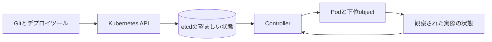



## 問題：YAMLをデプロイしただけでは運用モデルは生まれない

Kubernetesはcontainerの実行命令を遠隔送信するツールではない。

利用者が望む状態をAPI objectへ記録すると、controllerが実際の状態を継続的にそこへ収束させるシステムである。

このmental modelがないと、次の問題が繰り返される。

- 人が作ったPodが消えた後、復旧されない。
- identityが必要な状態保持workloadをDeploymentへ無理に入れる。
- readinessとlivenessで同じendpointを使い、障害を拡大する。
- requestなしにlimitだけ設定し、schedulingとthrottlingを予測できない。
- rolling update中のschema非互換により旧versionと新versionが衝突する。
- `kubectl exec`で一時修復した後、宣言状態とのdriftが生じる。
- probe失敗と実際の利用者失敗を区別できない。

公式の[Kubernetes Workloads文書](https://kubernetes.io/docs/concepts/workloads/)は、Podを直接管理するより、Deployment、StatefulSet、DaemonSet、Jobのようなworkload resourceにPodの集合を管理させる方法を説明している。

## Mental model：望ましい状態と実際の状態の間にある制御loop



### API objectは命令ではなく状態契約である

`replicas: 3`はPodを3つ一度だけ作成せよという命令ではない。

controllerが観察している間、利用可能なreplica数を目標に合わせるという宣言である。

node障害でPodが消えると、新しいPodが作られ得る。

ただし新しいPodは、以前のprocessのmemoryやlocal diskの状態を自動継承しない。

### Podは最小のscheduling単位である

Pod内のcontainerはnetwork namespaceとvolumeを共有する。

強く結合し、一緒に配置・終了しなければならないprocessだけを同じPodへ置く。

一般に、独立して拡張すべきapplicationとdatabaseを一つのPodへ入れない。

sidecarはlifecycleとresource競合も含む結合であることを忘れない。

### Controllerの選択はidentityと完了条件の選択である

- **Deployment**：replicaを交換可能な、長期実行のstateless workload
- **StatefulSet**：安定した名前、順序、storage bindingのようなidentityが必要なworkload
- **DaemonSet**：選択された各nodeに1つずつ必要なnode-local agent
- **Job**：成功完了回数が重要な有限処理
- **CronJob**：scheduleに従ってJobを作るcontroller

StatefulSetがapplication replicationやdata consistencyを自動提供するわけではない。

その責任はdatabaseまたはapplication protocolに残る。

## 主要objectと境界

### DeploymentとReplicaSet

Deploymentはrollout historyと戦略を管理し、ReplicaSetがPod数を管理する。

Pod templateが変わると新しいReplicaSetが作られる。

selectorはcontroller所有権の中心なので、デプロイ後に任意変更する対象とみなさない。

### ServiceとEndpointSlice

Serviceは変化するPod集合の前に安定したアクセスポイントを提供する。

label selectorが意図したPodだけを選ぶか検証する。

readinessを通過していないPodは、一般的なService endpointから除外され得る。

Serviceはapplication levelのtransaction成功まで保証しない。

### ConfigMapとSecret

ConfigMapは非機密設定を分離する。

Secret objectは機密値を表すが、保存時暗号化、RBAC、外部secret連携を別途設計しなければならない。

環境変数への注入はprocess開始後に自動更新されない。

volumeへの反映もapplication reloadの意味と一致するか確認する。

### PersistentVolumeとPersistentVolumeClaim

PVCはstorageの要求で、PVは提供されたstorage resourceである。

access modeの名称だけから実際のbackendの同時書き込み安全性を推測しない。

reclaim policy、snapshot、backup、zone topology、restore手順を併せて検討する。

## Workflow：workloadを設計する順序

### Step 1. 実行の意味を分類する

まず次へ答える。

- 永続実行か、完了する処理か。
- replicaは互いに交換可能か。
- 安定したnetwork identityが必要か。
- nodeごとに実行すべきか。
- 外部ですでに状態を管理しているか。
- 終了シグナル後、どの程度の時間をクリーンアップに使うか。

この回答からworkload controllerの候補を絞る。

### Step 2. resource requestを実測値で決める

requestはschedulerが配置可能性を判断する基準である。

limitはruntime制約であり、CPUとmemoryでは失敗の仕方が異なる。

- CPU limit超過はthrottlingとして現れ得る。
- memory limit超過はOOM終了につながり得る。
- requestが小さすぎるとnodeが過密になる。
- requestが大きすぎると実際に余裕があってもschedulingが止まる。

peakとpercentile、warm-up、GC、sidecar使用量を併せて測定する。

### Step 3. startup、readiness、livenessを分離する

`startupProbe`は遅い初期化を保護する。

`readinessProbe`は新しいリクエストを受ける準備ができたかを示す。

`livenessProbe`はrestartが復旧に役立つdeadlock状態を検知する。

livenessが外部database障害へ依存すると、すべてのPodが再起動し、障害が拡大し得る。

probeのtimeout、period、failureThresholdを意図的に定める。

### Step 4. 終了を正常経路として設計する

Pod終了時、applicationはSIGTERMを受け、grace period内に処理を終えなければならない。

新規リクエストの遮断、connection drain、checkpoint、lock解放の順序を設計する。

grace periodが実際の最大処理時間より短ければ、強制終了が通常動作になる。

`preStop` hookを使う場合も、全体grace periodへ含まれることを考慮する。

### Step 5. rolloutの互換性を確保する

rolling update中は旧versionと新versionが同時に存在する。

したがってAPI、message schema、database schemaは共存可能でなければならない。

expand-and-contract migrationを使う。

1. 旧versionが無視できるadditive schemaをデプロイする。
2. 両方のschemaを処理するapplicationをデプロイする。
3. data backfillを完了し検証する。
4. すべてのconsumer移行後、古いfieldを削除する。

### Step 6. placementとdisruptionを設計する

topology spreadとanti-affinityによりreplicaをfailure domainへ分散する。

node selector、affinity、taint、tolerationはplacementの契約である。

PodDisruptionBudgetはvoluntary disruption時の同時停止範囲を制限する。

PDBはnode障害のようなinvoluntary disruptionを防止しない。

### Step 7. 権限とnetworkを最小化する

workloadごとにServiceAccountを分離する。

Kubernetes API権限をRBACの最小verbとresourceへ制限する。

cloud accessには長期keyよりworkload identityを使う。

NetworkPolicyは、使用するCNIとingress・egress双方の動作を検証する。

default deny導入前にDNSと必要なcontrol pathを特定する。

### Step 8. observabilityとdebug evidenceを残す

次のシグナルを結び付ける。

- deployment revisionとimage digest
- Pod phaseとcontainer state
- restart countとlast termination reason
- scheduling eventとpending reason
- requestに対する実CPU・memory
- probe失敗とendpoint除外時間
- 利用者SLIとtrace
- node pressureとeviction event

## 実践例：stateless API Deployment

```yaml
apiVersion: apps/v1
kind: Deployment
metadata:
  name: example-api
spec:
  replicas: 3
  selector:
    matchLabels:
      app: example-api
  strategy:
    rollingUpdate:
      maxUnavailable: 0
      maxSurge: 1
  template:
    metadata:
      labels:
        app: example-api
    spec:
      serviceAccountName: example-api
      containers:
        - name: api
          image: registry.example.invalid/api@sha256:REPLACE_WITH_DIGEST
          ports:
            - containerPort: 8080
          resources:
            requests:
              cpu: 200m
              memory: 256Mi
            limits:
              memory: 512Mi
          startupProbe:
            httpGet:
              path: /health/startup
              port: 8080
            failureThreshold: 30
            periodSeconds: 2
          readinessProbe:
            httpGet:
              path: /health/ready
              port: 8080
            periodSeconds: 5
          livenessProbe:
            httpGet:
              path: /health/live
              port: 8080
            periodSeconds: 10
      terminationGracePeriodSeconds: 60
```

この例は出発点にすぎず、完成したセキュリティ設定ではない。

digest固定、ServiceAccount、NetworkPolicy、securityContext、autoscaling、disruption policyを環境要件に合わせて追加する。

readiness endpointは、必須初期化の完了と新規リクエストを受け入れられるかを検査する。

liveness endpointは外部dependencyよりprocess自体の回復不能状態へ集中する。

## 障害診断手順

### Pending Pod

1. Pod eventでscheduler reasonを確認する。
2. requestとnode allocatableを比較する。
3. taint、affinity、topology constraintを確認する。
4. PVC bindingとzone制約を確認する。
5. quotaとLimitRangeを確認する。

### CrashLoopBackOff

1. 現在のlogと`--previous` logの両方を確認する。
2. last termination reasonとexit codeを確認する。
3. config・secret keyの欠落を確認する。
4. startupとlivenessのtimingを確認する。
5. OOMKilledかどうかとmemory peakを確認する。

### rollout停滞

1. 新ReplicaSetのdesired・ready・availableを比較する。
2. 新Podのeventとreadiness失敗を確認する。
3. `maxSurge`、`maxUnavailable`、quotaを確認する。
4. PDBとnode容量の相互作用を確認する。
5. 利用者SLIが悪化したらrolloutを中断する。

## 検証Checklist

### workloadの意味

- [ ] controller選択の根拠がADRにある。
- [ ] Podが交換されても状態を復元できる。
- [ ] 終了と重複実行の意味が定義されている。
- [ ] batch処理の完了・失敗条件が明確である。

### resourceとscheduling

- [ ] requestを観測値から定めた。
- [ ] memory OOMとCPU throttlingへのアラートがある。
- [ ] failure domainへの分散を検証した。
- [ ] cluster autoscalerの反応時間を負荷試験した。
- [ ] quotaとpriority方針を確認した。

### デプロイ

- [ ] imageをimmutable digestで追跡する。
- [ ] 旧versionと新versionの同時実行が安全である。
- [ ] 3種類のprobeの目的が分離されている。
- [ ] graceful shutdownを負荷状態で試験した。
- [ ] rollbackとschemaの互換性を検証した。

### セキュリティと運用

- [ ] ServiceAccount tokenの必要性を検討した。
- [ ] privilegedとhost namespaceの利用を最小化した。
- [ ] Secret保存時暗号化とRBACを検討した。
- [ ] NetworkPolicyを実際のpacket flowで試験した。
- [ ] audit logとdeployment identityが接続される。
- [ ] debug用の一時変更を宣言状態へ反映するか削除する。

## よくある失敗と限界

### Kubernetesがapplication HAを自動提供すると信じる

Kubernetesはprocessを再配置できるが、データ複製、transaction、leader electionの正確性はapplicationとstorageの責任である。

### すべての問題にliveness restartを使う

再起動が外部障害を解決しなければ、負荷と復旧時間を増やす。

### `latest` tagをデプロイする

同じmanifestが異なるbytesを指すと、rollbackと監査を再現できない。

### 運用中に`kubectl edit`を通常の変更経路として使う

Gitまたはdeployment sourceとcluster状態が分岐し、次のreconcileで変更が消える。

### StatefulSetをdatabase運用の自動化と誤解する

一貫したbackup、quorum、upgrade、failoverには別途検証が必要である。

### abstractionコストを無視する

小規模システムではmanaged runtimeや単純なVMの方が運用リスクが低い場合がある。

Kubernetesの採用は、組織の運用能力とworkload lifecycleを併せて評価しなければならない。

## 公式参考資料

- [Kubernetes Workloads](https://kubernetes.io/docs/concepts/workloads/)
- [Kubernetes Deployments](https://kubernetes.io/docs/concepts/workloads/controllers/deployment/)
- [Kubernetes StatefulSets](https://kubernetes.io/docs/concepts/workloads/controllers/statefulset/)
- [Pod LifecycleとContainer Probes](https://kubernetes.io/docs/concepts/workloads/pods/pod-lifecycle/)
- [Resource Management for Pods and Containers](https://kubernetes.io/docs/concepts/configuration/manage-resources-containers/)
- [Kubernetes Security Checklist](https://kubernetes.io/docs/concepts/security/security-checklist/)

## まとめ

Kubernetes運用の基本単位はYAMLファイルではなく、継続的なreconciliation契約である。

workload identity、resource、probe、終了、rollout、storage、権限を一つのlifecycleとして設計しよう。

Podが消える事象を例外ではなく通常の状態遷移として扱うとき、Kubernetesの利点が現れる。
