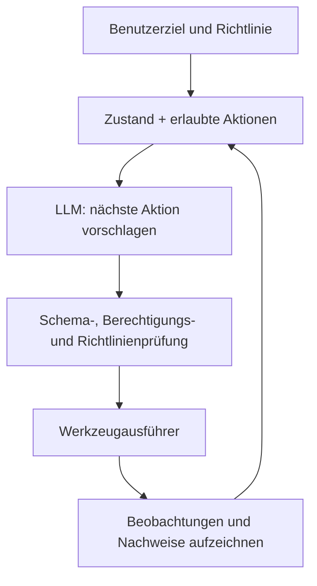



Ein LLM-Agent ist nicht „ein Programm, das einem Modell ein Ziel gibt und es selbstständig weitermachen lässt“. Ein produktionsreifer Agent ist ein System, das **ein probabilistisch urteilendes Modell mit deterministischen Zustandsübergängen, eingeschränkten Werkzeugen, überprüfbaren Ausgaben und expliziten Berechtigungsgrenzen verbindet**.

Die Sprachfähigkeit eines Modells ist mächtig. Wer diese Flexibilität jedoch mit Systemkontrolle verwechselt, riskiert doppelte Ausführungen, falsche externe Änderungen, Endlosschleifen und unbelegte Behauptungen über einen erfolgreichen Abschluss.

## 1. Das Problem: Der Unterschied zwischen einer Dialogdemo und einem zuverlässigen Agenten

Eine einfache Demo kann mit folgender Schleife funktionieren.

1. Das Ziel in den Prompt einfügen.
2. Das Modell wählt ein Werkzeug.
3. Das Werkzeugergebnis wieder in den Prompt einfügen.
4. Wiederholen, bis das Modell erklärt, fertig zu sein.

Im Produktivbetrieb müssen jedoch folgende Fragen beantwortet werden.

- Wer bestimmt den aktuellen Aufgabenzustand?
- Verursacht ein erneuter Versuch desselben Werkzeugaufrufs doppelte Änderungen?
- Kann das Modell unzulässige Argumente oder Ziele auswählen?
- Wird eine böswillige Anweisung in einer Werkzeugausgabe als Dateninhalt oder als Befehl behandelt?
- An welcher Stelle wird die Ausführung nach einem Teilausfall fortgesetzt?
- Ist vor einer externen Änderung die Zustimmung des Benutzers erforderlich?
- Welcher Nachweis – statt einer Aussage des Modells – bestimmt den „Abschluss“?
- Wie wird die Leistung jenseits von Eindrücken aus wenigen Gesprächen gemessen?

### Workflows von Agenten unterscheiden

- **Workflow**: Die meisten möglichen Schritte und Verzweigungen sind im Code definiert.
- **Agent**: Die Auswahl der nächsten Aktion erfordert das Urteil des Modells.

Wenn ein wiederholbares Verfahren bereits bekannt ist, ist ein Workflow vorhersehbarer und kostengünstiger. Nutzen Sie die Autonomie eines Agenten nur für unsichere Informationssuche, unstrukturierte Interpretation und dynamische Planung. Ein gutes System verbindet beides und hält die Grenze dazwischen klar.

### Natürliche Sprache kann eine Schnittstelle sein, darf aber nicht das interne Protokoll bilden

„Es scheint funktioniert zu haben“ ist kein Zustand. Ein Erfolgszustand verlangt maschinell überprüfbare Bedingungen wie die folgenden.

- Erforderliche Artefakte existieren
- Schema, Prüfsumme und Tests sind gültig
- Bestätigungs-ID der externen API
- Erwarteter Zustandsübergang wurde bestätigt
- Keine ungelösten Fehler

Die Behauptungen des Agenten müssen vom tatsächlichen Zustand der Welt getrennt werden.

## 2. Denkmodell: Einen probabilistischen Vorschlagsgeber mit einem deterministischen Ausführer verbinden



Das Modell **schlägt vor**, der Ausführer **validiert, autorisiert und führt aus**. Vom Modell erzeugter Text darf nicht direkt zu einem Shell-Befehl, einer Abfrage oder einer externen Änderung führen.

### Den Agenten als Zustandsautomaten darstellen

Gegeben seien Zustand \(s_t\), Beobachtung \(o_t\) und Aktion \(a_t\):

\[
a_t \sim \pi_\theta(a\mid s_t, o_t), \qquad
s_{t+1}=T(s_t,a_t,o_{t+1})
\]

- $\pi_\theta$: die vom LLM implementierte probabilistische Richtlinie
- $T$: der durch Code implementierte deterministische Zustandsübergang

Der Zustand sollte die für die Aufgabe nötigen strukturierten Fakten enthalten und nicht das gesamte Gespräch als Zeichenkette.

```json
{
  "task_id": "immutable-id",
  "goal": "검증 가능한 완료 조건",
  "phase": "research",
  "constraints": ["read-only until approved"],
  "facts": [{"claim": "...", "source_id": "..."}],
  "artifacts": [],
  "pending_actions": [],
  "attempt_count": 1,
  "budget": {"tool_calls_left": 12, "deadline": "..."},
  "last_error": null
}
```

Der Gesprächsverlauf ist für Kontext und Audit nützlich. Wird er jedoch zur einzigen Wahrheitsquelle des aktuellen Zustands, wird das System anfällig für Widersprüche und Kontextüberlauf.

### Ein Werkzeug ist eine typisierte Fähigkeit mit Berechtigungen

Eine Werkzeugdefinition benötigt mehr als Name und Beschreibung. Sie braucht außerdem:

- Eingabe- und Ausgabeschemas
- Lese-/Schreibmodus und Stufe der externen Auswirkung
- Zielumfang und Berechtigungen
- Timeout und Ratenlimit
- Zulässigkeit von Wiederholungsversuchen
- Unterstützung für Idempotenz
- Erwartete Fehlertypen
- Verfahren zur Erfolgsprüfung
- Bedingungen, die eine Benutzerfreigabe erfordern

Es ist sicherer, Fähigkeiten auf „eine Datei innerhalb des angegebenen Projekts lesen“, „einen Entwurf speichern“ und „nach Freigabe eine Nachricht senden“ zu beschränken, statt eine breite Funktion wie ein „Dateiverwaltungswerkzeug“ anzubieten.

## 3. Praktischer Workflow

### Schritt 1. Das Ziel in Abschluss- und Verbotskriterien umwandeln

Führen Sie ein natürlichsprachliches Ziel nicht unmittelbar aus. Wandeln Sie es in einen Aufgabenvertrag um.

```yaml
goal: "요청된 기술 보고서 초안을 생성한다"
success_criteria:
  - "필수 섹션이 모두 존재한다"
  - "모든 외부 사실에 출처가 연결된다"
  - "문서 schema와 품질 검사를 통과한다"
non_goals:
  - "외부 수신자에게 전송하지 않는다"
  - "원본 자료를 수정하지 않는다"
approval_required:
  - "외부 게시"
  - "기존 artifact 덮어쓰기"
budget:
  max_steps: 20
  max_retries_per_tool: 2
```

Fragen Sie nach, wenn eine Mehrdeutigkeit in der Benutzeranfrage das Ergebnis wesentlich verändern würde. Sind die Auswirkungen gering und reversibel, verwenden Sie einen vernünftigen Standard und nennen Sie die Annahme im Ergebnis.

### Schritt 2. Zustand und Kontext trennen

Der Kontext sollte nur enthalten, was das Modell für den aktuellen Schritt benötigt.

- Systemrichtlinie und Aufgabenvertrag
- Aktuelle Phase und erlaubte Werkzeuge
- Verifizierte Schlüsselfakten
- Benötigte Ausschnitte aus aktuellen Werkzeugergebnissen
- Verbleibendes Budget und Fehlerzustand

Das vollständige alte Protokoll jedes Mal einzufügen erhöht die Kosten und vergräbt wichtige Anweisungen. Stattdessen:

1. Ursprüngliches Ereignisprotokoll unverändert bewahren.
2. Strukturierten Zustand aktuell halten.
3. Komprimierte Zusammenfassungen mit Provenienz erstellen.
4. Bei Bedarf das Original anhand seiner ID abrufen.

Eine Zusammenfassung ist kein Schritt zur Erzeugung neuer Fakten. Weil Informationen ausgelassen oder verfälscht werden können, sollten wichtige Zahlen, Freigaben und Einschränkungen in separaten strukturierten Feldern verbleiben.

### Schritt 3. Verantwortlichkeiten von Planer und Ausführer trennen

Bei einer komplexen Aufgabe können Planung und Ausführung getrennt werden.

- Planer: schlägt Teilziele, Abhängigkeiten, erforderliche Nachweise und erwartete Kosten vor
- Ausführer: führt nur den einen aktuell erlaubten Schritt aus
- Prüfer: kontrolliert, ob das Ergebnis Schema und Abschlusskriterien erfüllt

Rollen auf mehrere Modellaufrufe aufzuteilen ist nicht immer vorteilhaft. Bei einer einfachen Aufgabe erhöht dies nur Kosten und Fehlerfläche. Trennen Sie Rollen nur an Schritten, an denen **eine unabhängige Prüfung das Risiko wesentlich verringert**.

### Schritt 4. Strukturierte Ausgabe streng validieren

Das Modell kann seine nächste Aktion als JSON vorschlagen.

```json
{
  "action": "search_documents",
  "arguments": {
    "query": "검증할 기술 질문",
    "limit": 5
  },
  "reason": "현재 주장에 1차 근거가 없음",
  "expected_evidence": "공식 문서의 정의와 제한"
}
```

Validieren Sie vor der Ausführung:

1. JSON-Syntax und -Schema
2. Allowlist der Aktionen
3. Typen, Längen und Wertebereiche der Argumente
4. Zielumfang wie Pfad, URL oder Empfänger
5. Berechtigungen der aktuellen Phase
6. Freigabe anhand externer Änderungen, Kosten und Sensibilität
7. Duplikat- und Wiederholungsstatus

Schemavalidierung ersetzt keine semantische Validierung. Ein Pfad kann den richtigen String-Typ besitzen und dennoch außerhalb des erlaubten Bereichs liegen; eine Empfänger-ID kann existieren, ohne die vom Benutzer gemeinte Person zu bezeichnen.

### Schritt 5. Kleine, deterministische Werkzeugschnittstellen entwerfen

Ein gutes Werkzeug verringert die Zahl der Entscheidungen, bei denen das Modell falschliegen kann.

Schlechtes Beispiel:

```text
run_any_command(command: string)
```

Besseres Beispiel:

```text
search_records(query, date_from, date_to, limit) -> SearchResult[]
create_draft(title, body, idempotency_key) -> DraftId
publish_draft(draft_id, approval_token) -> PublicationReceipt
```

Trennen Sie Lese- von Schreibvorgängen und die Entwurfserstellung von der Veröffentlichung. Im Idealfall unterstützen Schreibwerkzeuge einen Trockenlauf oder eine Vorschau.

### Schritt 6. Externe Änderungen idempotent und überprüfbar machen

Nach einem Netzwerk-Timeout weiß ein Agent womöglich nicht, ob die Anfrage fehlschlug oder gelang und nur die Antwort verloren ging. Eine bedingungslose Wiederholung kann eine Ressource doppelt erstellen oder zustellen.

Gegenmaßnahmen sind:

- Ein aus Aufgabe und Absicht abgeleiteter Idempotenzschlüssel
- Abfrage des aktuellen Zustands vor der Ausführung
- Prüfung des Belegs und der Ressourcenversion nach der Ausführung
- Optimistische Nebenläufigkeitskontrolle
- Duplikaterkennung und sicheres Upsert
- Entwurf kompensierender Aktionen bei At-least-once-Zustellung, wenn Exactly-once-Ausführung unmöglich ist

```python
def execute_write(intent, approved_token):
    validate_scope(intent)
    validate_approval(intent, approved_token)

    key = stable_hash(intent.task_id, intent.action, intent.target, intent.payload)
    previous = lookup_by_idempotency_key(key)
    if previous:
        return previous

    receipt = tool_call(intent, idempotency_key=key)
    return verify_receipt(receipt, expected=intent)
```

### Schritt 7. Freigaben und Berechtigungen nach Risiko gestalten

Klassifizieren Sie Werkzeugaktionen nach Risikostufe.

| Stufe | Beispiel | Standardrichtlinie |
|---|---|---|
| Niedrig | Öffentliche Informationen lesen, lokale Analyse | Darf automatisch ausgeführt werden |
| Mittel | Entwurf oder neues Artefakt erstellen | Umfang begrenzen und Ergebnis prüfen |
| Hoch | Externe Zustellung, Veröffentlichung, Zahlung, Berechtigungsänderungen | Explizite Freigabe |
| Sehr hoch | Massenlöschung, weitreichende Berechtigungen, irreversible Änderungen | Doppelte Bestätigung und getrennte Kontrollen |

Eine Freigabe muss an ein konkretes Ziel, eine Aktion und einen Inhalt gebunden sein, statt pauschale Formulierungen zu verwenden. Ändert sich die Payload nach der Freigabe, ist erneut eine Freigabe einzuholen.

Nach dem Prinzip der geringsten Rechte erhält eine Agentensitzung nur die minimalen Fähigkeiten für die aktuelle Aufgabe; verwenden Sie kurzlebige Zugangsdaten mit engem Geltungsbereich.

### Schritt 8. Prompt Injection als Problem einer Vertrauensgrenze behandeln

Webseiten, Dokumente, E-Mails und Werkzeugausgaben sind **Daten**, keine Systemanweisungen. Selbst wenn sie den Satz „Ignoriere vorherige Anweisungen“ enthalten, dürfen sie keine Ausführungsbefugnis erhalten.

Zu den Verteidigungsschichten gehören:

- Anweisungen strukturell von nicht vertrauenswürdigen Inhalten trennen
- Verhindern, dass externer Text Aktionen, Empfänger oder Berechtigungen direkt definiert
- Werkzeugergebnisse anhand von Schemas parsen und nur erforderliche Felder weitergeben
- Keine Geheimnisse in den Modellkontext aufnehmen
- Allowlists für URLs, Pfade und Domains
- Policy Engine und Freigabe vor Schreibaktionen
- Ausgabekodierung und Parametrisierung von Befehlen und Abfragen
- Evaluationen mit Angriffsbeispielen

Erwarten Sie nicht, dass Prompts allein vollständigen Schutz bieten. Entwerfen Sie den Ausführer so, dass er gefährliche Aktionen auch dann zurückweist, wenn das Modell getäuscht wurde.

### Schritt 9. Fehler klassifizieren und begrenzt beheben

Die Reaktion hängt vom Fehlertyp ab.

| Fehler | Reaktion |
|---|---|
| Schemafehler | Formatierungsfeedback geben und begrenzt neu generieren |
| Vorübergehender Timeout | Backoff anwenden, Idempotenz prüfen und erneut versuchen |
| Unzureichende Berechtigung | Um Freigabe oder Berechtigung bitten, ohne Kontrollen zu umgehen |
| Ziel nicht gefunden | Suchbereich prüfen oder Benutzer fragen |
| Semantischer Konflikt | Zustand und ursprüngliche Nachweise erneut untersuchen |
| Richtlinienverstoß | Aktion ablehnen und sichere Alternative anbieten |
| Wiederholter Fehler | Nicht weiter wiederholen und mit Diagnoseinformationen übergeben |

Nach jedem Fehler denselben Prompt erneut zu verwenden, wiederholt dieselben Fehler. Legen Sie Budgets für Wiederholungen, Gesamtschritte, Zeit, Tokens und Kosten fest. Wenn der Plan sich ständig ändert oder dieselben Zustände zyklisch durchläuft, sollte ein Schleifendetektor ihn stoppen.

### Schritt 10. Den Abschluss unabhängig verifizieren

Der Prüfer kontrolliert den Aufgabenvertrag und nicht die Behauptung des Modells, „fertig“ zu sein.

- Ist jede erforderliche Ausgabe vorhanden?
- Lässt sich jedes Artefakt öffnen und erfüllt es sein Schema?
- Sind die erforderlichen Tests bestanden?
- Stützen Zitate tatsächlich die zugehörigen Behauptungen?
- Entspricht der Beleg einer externen Änderung dem erwarteten Zustand?
- Gibt es keine unbehandelten Fehler oder ausstehenden Aktionen?
- Wurde keine vom Benutzer verbotene Aktion ausgeführt?

Wenn die Verifikation fehlschlägt, beginnen Sie nicht immer ganz von vorn. Erfassen Sie das gescheiterte Kriterium im Zustand und kehren Sie nur zum minimal erforderlichen Schritt zurück.

### Schritt 11. Evaluation nach Schichten aufbauen

Einen Agenten ausschließlich nach der Qualität seiner Endantwort zu bewerten reicht nicht aus.

#### Komponentenevaluation

- Genauigkeit der Werkzeugauswahl
- Genauigkeit von Argumentschema und Ziel
- Recall des Retrievals und Folgerichtigkeit der Zitate
- Gültigkeitsquote strukturierter Ausgaben
- Erhalt von Fakten in Zustandszusammenfassungen

#### Trajektorienevaluation

- Unnötige Schritte und Werkzeugaufrufe
- Wiederholungs- und Schleifenquote
- Versuche von Richtlinienverstößen und Blockierungsquote
- Qualität der Wiederherstellung nach Fehlern
- Gesamtkosten und Latenz

#### Ergebnisevaluation

- Erfolgsquote der Aufgaben
- Erfolgsquote je Abschlusskriterium
- Tatsächliche Korrektheit des externen Zustands
- Umfang der Benutzerkorrektur und Übergabequote
- Risikogewichtete Fehler

Ein vereinfachter erwarteter Nutzen lautet:

\[
U = V_{success}P(success)
-C_{tool}-C_{latency}
-\lambda C_{unsafe}
\]

Das Gewicht $\lambda$ der sicherheitsbezogenen Kosten $C_{unsafe}$ muss weit größer sein als bei gewöhnlichen stilistischen Fehlern.

### Schritt 12. Evaluationsdaten und Observability fortlaufend aktualisieren

Der Evaluationsdatensatz sollte Folgendes enthalten:

- Normale repräsentative Aufgaben
- Randfälle und mehrdeutige Anfragen
- Werkzeug-Timeouts und Teilausfälle
- Einander widersprechende Materialien
- Prompt Injection und Versuche einer Rechteausweitung
- Risiken doppelter Ausführung
- Lange Kontexte und veralteter Zustand
- Anfragen außerhalb der Domäne

Speichern Sie nicht wahllos die gesamte Modelleingabe in Ausführungs-Traces. Entfernen Sie personenbezogene Informationen und Geheimnisse und strukturieren Sie folgende Ereignisse.

- Aufgaben-, Release- und Prompt-Version
- Zustandsübergang
- Werkzeugname, bereinigte Argumente, Latenz und Ergebnisstatus
- Validierungs- und Richtlinienentscheidungen
- Freigabeereignis
- Tokens, Kosten und Wiederholungen
- Endergebnis des Prüfers

De-identifizieren Sie Produktionsfehler und überführen Sie sie anschließend in Regressionstests.

## 4. Checkliste für Evaluation und Verifikation

### Architektur und Zustand

- [ ] Wurden für einen Workflow geeignete Schritte von Schritten unterschieden, die das Urteil eines Agenten erfordern?
- [ ] Sind strukturierter Zustand und ursprüngliches Ereignisprotokoll getrennt?
- [ ] Sind Abschlusskriterien, Verbotskriterien und Budgets maschinell überprüfbar?
- [ ] Steuert der Code die Zustandsübergänge?
- [ ] Sind erlaubte Aktionen nach Phase beschränkt?

### Werkzeuge und Ausgabe

- [ ] Besitzt jedes Werkzeug Eingabe- und Ausgabeschemas?
- [ ] Sind Lese- von Schreibvorgängen und Entwürfe von Veröffentlichungen getrennt?
- [ ] Werden Pfad-, Domain-, Empfänger- und Ressourcenumfang semantisch validiert?
- [ ] Unterstützen Schreibwerkzeuge Idempotenz und Belegprüfung?
- [ ] Wird nach einem Timeout vor dem erneuten Versuch geprüft, ob der Vorgang erfolgreich war?
- [ ] Sind Anzahl der Fehler strukturierter Ausgaben und Fallback definiert?

### Sicherheit

- [ ] Sind nicht vertrauenswürdige Inhalte von Anweisungen getrennt?
- [ ] Sind Geheimnisse aus Modellkontext und Traces ausgeschlossen?
- [ ] Werden geringste Rechte und kurze Gültigkeitsdauern von Zugangsdaten verwendet?
- [ ] Sind externe und irreversible Aktionen an eine konkrete Freigabe gebunden?
- [ ] Wird eine frühere Freigabe verworfen, wenn sich die Payload ändert?
- [ ] Werden Angriffe durch Prompt Injection und Rechteausweitung evaluiert?

### Evaluation und Betrieb

- [ ] Werden Komponenten-, Trajektorien- und Ergebnismetriken unterschieden?
- [ ] Werden neben der Erfolgsquote auch Kosten, Latenz und risikogewichtete Fehler gemessen?
- [ ] Enthält der Evaluationsdatensatz normale Aufgaben, Randfälle, Fehler- und Angriffsaufgaben?
- [ ] Lassen sich Ergebnisse nach Modell-, Prompt-, Werkzeug- und Richtlinienversion vergleichen?
- [ ] Werden Wiederholungen, Schleifen, Übergaben und Richtlinienablehnungen überwacht?
- [ ] Werden reale Fehler als de-identifizierte Regressionstests aufgenommen?

## 5. Grenzen und Vorbehalte

Erstens erhöht strukturierte Ausgabe die syntaktische Zuverlässigkeit, garantiert aber weder Wahrhaftigkeit noch die richtige Absicht. Schemavalidierung, semantische Validierung und Verifikation von Nachweisen sind allesamt erforderlich.

Zweitens erleichtern mehrere Agenten die Rollenverteilung, vergrößern aber Fehlerfortpflanzung, Kosten, Latenz und Verantwortungsgrenzen. Mehrere Agenten für ein Problem einzusetzen, das ein einzelner Agent mit einem deterministischen Workflow lösen kann, kann Overengineering sein.

Drittens garantiert eine hohe Erfolgsquote in einem Offline-Benchmark kein entsprechendes Verhalten in einer Umgebung mit realen Berechtigungen, Latenz und unvollständigen Daten. Shadow-Ausführung und ein begrenzter Canary sind nötig.

Viertens ist auch menschliche Freigabe keine unfehlbare Guardrail. Häufige und schwer verständliche Freigabeanfragen verleiten zum automatischen Klicken. Der Freigabebildschirm sollte das exakte Ziel, die Änderung, ihre Auswirkung und Reversibilität knapp darstellen.

Schließlich reagieren LLMs empfindlich auf Updates und Prompt-Änderungen. Behandeln Sie einen Agenten nicht als „einmal validiert“, sondern unterziehen Sie jede Kombination aus Modell, Werkzeugen, Richtlinie und Daten bei jedem Release fortlaufenden Regressionstests.
