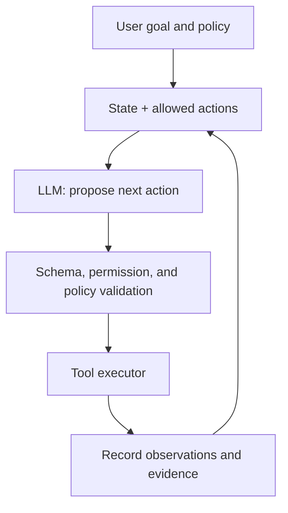



An LLM agent is not “a program that gives a model a goal and lets it keep going on its own.” A production-ready agent is a system that combines **a model that makes probabilistic judgments with deterministic state transitions, constrained tools, verifiable output, and explicit permission boundaries**.

A model's language ability is powerful, but confusing that flexibility with system control leads to duplicate execution, incorrect external changes, infinite loops, and unsupported claims of completion.

## 1. The Problem: The Difference Between a Conversational Demo and a Reliable Agent

A simple demo can work with the following loop.

1. Put the goal in the prompt.
2. The model selects a tool.
3. Put the tool result back into the prompt.
4. Repeat until the model says it is done.

In production, however, the following questions must be answered.

- Who determines the current task state?
- If the same tool call is retried, will it cause duplicate changes?
- Can the model select arguments or targets that are not allowed?
- Is a malicious instruction in tool output treated as data or as a command?
- Where does execution resume after a partial failure?
- Is user approval required before an external change?
- What evidence, rather than a sentence from the model, determines “completion”?
- How is performance measured beyond impressions from a few conversations?

### Distinguish workflows from agents

- **Workflow**: Most possible steps and branches are defined in code.
- **Agent**: Selecting the next action requires the model's judgment.

When a repeatable procedure is already known, a workflow is more predictable and less expensive. Use agent autonomy only for uncertain information exploration, unstructured interpretation, and dynamic planning. A good system combines the two while keeping their boundary clear.

### Natural language can be an interface, but it must not be the internal protocol

“It appears to have succeeded” is not a state. A success state requires machine-verifiable conditions such as the following.

- Required artifacts exist
- Schema, checksum, and tests pass
- Confirmation ID from the external API
- Expected state transition confirmed
- No unresolved errors

The agent's claims must be separated from the state of the world.

## 2. Mental Model: Combining a Probabilistic Proposer with a Deterministic Executor



The model **proposes**, and the executor **validates, authorizes, and executes**. Text generated by the model must not lead directly to a shell command, query, or external change.

### Represent the agent as a state machine

Given state \(s_t\), observation \(o_t\), and action \(a_t\):

\[
a_t \sim \pi_\theta(a\mid s_t, o_t), \qquad
s_{t+1}=T(s_t,a_t,o_{t+1})
\]

- \(\pi_\theta\): the probabilistic policy implemented by the LLM
- \(T\): the deterministic state transition implemented by code

State should contain the structured facts needed for the task, not the entire conversation as a string.

```json
{
  "task_id": "immutable-id",
  "goal": "검증 가능한 완료 조건",
  "phase": "research",
  "constraints": ["read-only until approved"],
  "facts": [{"claim": "...", "source_id": "..."}],
  "artifacts": [],
  "pending_actions": [],
  "attempt_count": 1,
  "budget": {"tool_calls_left": 12, "deadline": "..."},
  "last_error": null
}
```

Conversation history is useful for context and auditing, but using it as the single source of truth for current state leaves the system vulnerable to contradictions and context overflow.

### A tool is a typed capability with permissions

A tool definition needs more than a name and description. It also needs:

- input and output schemas
- read/write and external-impact level
- target scope and permissions
- timeout and rate limit
- whether retry is allowed
- idempotency support
- expected error types
- how success is verified
- conditions requiring user approval

It is safer to narrow capabilities to “read a file within the specified project,” “save a draft,” and “send a message after approval” than to offer a broad feature such as a “file management tool.”

## 3. Practical Workflow

### Step 1. Convert the goal into completion and prohibition criteria

Do not execute a natural-language goal directly. Convert it into a task contract.

```yaml
goal: "요청된 기술 보고서 초안을 생성한다"
success_criteria:
  - "필수 섹션이 모두 존재한다"
  - "모든 외부 사실에 출처가 연결된다"
  - "문서 schema와 품질 검사를 통과한다"
non_goals:
  - "외부 수신자에게 전송하지 않는다"
  - "원본 자료를 수정하지 않는다"
approval_required:
  - "외부 게시"
  - "기존 artifact 덮어쓰기"
budget:
  max_steps: 20
  max_retries_per_tool: 2
```

Ask when an ambiguity in the user's request would substantially change the result. When its impact is small and reversible, use a reasonable default and state the assumption in the result.

### Step 2. Separate state from context

Context should contain only what the model needs for the current step.

- System policy and task contract
- Current phase and allowed tools
- Verified key facts
- Necessary portions of recent tool results
- Remaining budget and error state

Including the entire old log every time increases cost and buries important instructions. Instead:

1. Preserve the original event log unchanged.
2. Keep the structured state current.
3. Create compressed summaries with provenance.
4. Retrieve the original by ID when needed.

A summary is not a step for creating new facts. Because information can be omitted or distorted, keep important numbers, approvals, and constraints in separate structured fields.

### Step 3. Divide planner and executor responsibilities

For a complex task, planning and execution can be separated.

- Planner: proposes subgoals, dependencies, required evidence, and expected cost
- Executor: performs only the one currently allowed step
- Verifier: checks whether the result satisfies the schema and completion criteria

Separating roles into multiple model calls is not always beneficial. For a simple task, it only increases cost and the error surface. Separate roles only at steps where **independent verification materially reduces risk**.

### Step 4. Strictly validate structured output

The model can propose its next action as JSON.

```json
{
  "action": "search_documents",
  "arguments": {
    "query": "검증할 기술 질문",
    "limit": 5
  },
  "reason": "현재 주장에 1차 근거가 없음",
  "expected_evidence": "공식 문서의 정의와 제한"
}
```

Validate before execution:

1. JSON syntax and schema
2. Action allowlist
3. Argument types, lengths, and ranges
4. Target scope, such as a path, URL, or recipient
5. Permissions for the current phase
6. Approval based on external changes, cost, and sensitivity
7. Duplication and retry status

Schema validation does not replace semantic validation. A path can have the correct string type and still fall outside the permitted scope, while a recipient ID can exist without identifying the person the user intended.

### Step 5. Design small, deterministic tool interfaces

A good tool reduces the number of choices the model can get wrong.

Bad example:

```text
run_any_command(command: string)
```

Better example:

```text
search_records(query, date_from, date_to, limit) -> SearchResult[]
create_draft(title, body, idempotency_key) -> DraftId
publish_draft(draft_id, approval_token) -> PublicationReceipt
```

Separate reads from writes, and draft creation from publication. Ideally, write tools support a dry run or preview.

### Step 6. Make external changes idempotent and verifiable

After a network timeout, an agent may not know whether the request failed or succeeded but its response was lost. Retrying unconditionally can cause duplicate creation or delivery.

Countermeasures include:

- An idempotency key based on the task and intent
- Querying current state before execution
- Checking the receipt and resource version after execution
- Optimistic concurrency control
- Duplicate detection and safe upsert
- Designing compensating actions under at-least-once delivery when exactly-once execution is impossible

```python
def execute_write(intent, approved_token):
    validate_scope(intent)
    validate_approval(intent, approved_token)

    key = stable_hash(intent.task_id, intent.action, intent.target, intent.payload)
    previous = lookup_by_idempotency_key(key)
    if previous:
        return previous

    receipt = tool_call(intent, idempotency_key=key)
    return verify_receipt(receipt, expected=intent)
```

### Step 7. Design approval and permissions according to risk

Classify tool actions by risk level.

| Level | Example | Default policy |
|---|---|---|
| Low | Read public information, local analysis | May run automatically |
| Medium | Create a draft or new artifact | Constrain scope and review the result |
| High | External delivery, publication, payment, permission changes | Explicit approval |
| Very high | Bulk deletion, broad permissions, irreversible changes | Double confirmation and separate controls |

Approval must bind a specific target, action, and content rather than use blanket wording. If the payload changes after approval, obtain approval again.

Following least privilege, give an agent session only the minimum capabilities needed for the current task, and use credentials with short lifetimes and narrow scopes.

### Step 8. Treat prompt injection as a trust-boundary problem

Web pages, documents, email, and tool output are **data**, not system instructions. Even if they contain a sentence saying “ignore previous instructions,” they must not gain execution authority.

Defense layers include:

- Structurally separate instructions from untrusted content
- Prevent external text from directly defining actions, recipients, or permissions
- Parse tool results with schemas and pass only required fields
- Do not put secrets in model context
- URL, path, and domain allowlists
- Policy engine and approval before write actions
- Output encoding and command/query parameterization
- Evaluations that include attack examples

Do not expect prompts alone to provide complete protection. Design the executor to reject dangerous actions even when the model is deceived.

### Step 9. Classify errors and recover within limits

Responses differ by error type.

| Error | Response |
|---|---|
| Schema error | Provide formatting feedback, then regenerate a limited number of times |
| Transient timeout | Back off, check idempotency, then retry |
| Insufficient permission | Request approval or permission without bypassing controls |
| Target not found | Check search scope or ask the user |
| Semantic conflict | Reexamine state and original evidence |
| Policy violation | Reject that action and offer a safe alternative |
| Repeated failure | Stop retrying and hand off with diagnostic information |

Retrying with the same prompt after every failure repeats the same errors. Set budgets for retries, total steps, time, tokens, and cost. If the plan keeps changing or cycles through the same state, a loop detector should stop it.

### Step 10. Verify completion independently

The verifier checks the task contract, not the model's claim that “I am done.”

- Does every required output exist?
- Can each artifact be opened, and does it satisfy its schema?
- Did the required tests pass?
- Do citations actually support their claims?
- Does the receipt for an external change match the expected state?
- Are there no unhandled errors or pending actions?
- Did none of the user-prohibited actions occur?

When verification fails, do not always restart from the beginning. Record the failed criterion in state and return only to the minimum necessary step.

### Step 11. Build evaluation by layer

Evaluating an agent solely by final-answer quality is insufficient.

#### Component evaluation

- Tool-selection accuracy
- Argument schema and target accuracy
- Retrieval recall and citation entailment
- Structured-output validity rate
- Preservation of facts in state summaries

#### Trajectory evaluation

- Unnecessary steps and tool calls
- Retry and loop rates
- Policy-violation attempts and block rate
- Quality of recovery after failure
- Total cost and latency

#### Outcome evaluation

- Task success rate
- Pass rate by completion criterion
- Actual correctness of external state
- Amount of user correction and handoff rate
- Risk-weighted errors

A simplified expected utility is:

\[
U = V_{success}P(success)
-C_{tool}-C_{latency}
-\lambda C_{unsafe}
\]

The weight \(\lambda\) on safety-related cost \(C_{unsafe}\) must be far greater than for ordinary stylistic errors.

### Step 12. Continuously update evaluation data and observability

The evaluation set should include:

- Normal representative tasks
- Edge cases and ambiguous requests
- Tool timeouts and partial failures
- Mutually contradictory materials
- Prompt injection and privilege-escalation attempts
- Duplicate-execution risks
- Long contexts and stale state
- Out-of-domain requests

Do not indiscriminately store the model's entire input in execution traces. Remove personal information and secrets, and structure the following events.

- Task, release, and prompt version
- State transition
- Tool name, sanitized arguments, latency, and result status
- Validation and policy decisions
- Approval event
- Tokens, cost, and retries
- Final verifier result

De-identify production failures, then promote them to regression tests.

## 4. Evaluation and Verification Checklist

### Architecture and state

- [ ] Have steps suitable for a workflow been distinguished from those requiring agent judgment?
- [ ] Are structured state and the original event log separate?
- [ ] Are completion criteria, prohibition criteria, and budgets machine-verifiable?
- [ ] Does code control state transitions?
- [ ] Are allowed actions constrained by phase?

### Tools and output

- [ ] Does every tool have input and output schemas?
- [ ] Are reads separated from writes, and drafts from publication?
- [ ] Are path, domain, recipient, and resource scopes semantically validated?
- [ ] Do write tools support idempotency and receipt verification?
- [ ] After a timeout, is success checked before retrying?
- [ ] Are the number of structured-output failures and the fallback defined?

### Security and safety

- [ ] Is untrusted content separated from instructions?
- [ ] Are secrets excluded from model context and traces?
- [ ] Are least privilege and short credential lifetimes used?
- [ ] Are external and irreversible actions bound to specific approval?
- [ ] Is prior approval discarded when the payload changes?
- [ ] Are prompt-injection and privilege-escalation attacks evaluated?

### Evaluation and operations

- [ ] Are component, trajectory, and outcome metrics distinguished?
- [ ] Are cost, latency, and risk-weighted errors measured as well as success rate?
- [ ] Does the evaluation set contain normal, boundary, failure, and attack tasks?
- [ ] Can results be compared by model, prompt, tool, and policy version?
- [ ] Are retries, loops, handoffs, and policy denials monitored?
- [ ] Are real failures added as de-identified regression tests?

## 5. Limitations and Caveats

First, structured output improves syntactic reliability but does not guarantee truthfulness or correct intent. Schema validation, semantic validation, and evidence verification are all required.

Second, multiple agents make role assignment easier but increase error propagation, cost, latency, and responsibility boundaries. Using multiple agents for a problem that a single agent and deterministic workflow can solve may be overengineering.

Third, a high success rate in an offline benchmark does not guarantee behavior in an environment with real permissions, latency, and incomplete data. Shadow execution and a limited canary are needed.

Fourth, human approval is not an infallible guardrail either. Frequent, hard-to-understand approval requests encourage automatic clicking. The approval screen should briefly show the exact target, change, impact, and reversibility.

Finally, LLMs are sensitive to updates and prompt changes. Rather than treating an agent as “validated once,” continuously regression-test each release as a combination of model, tools, policy, and data.
