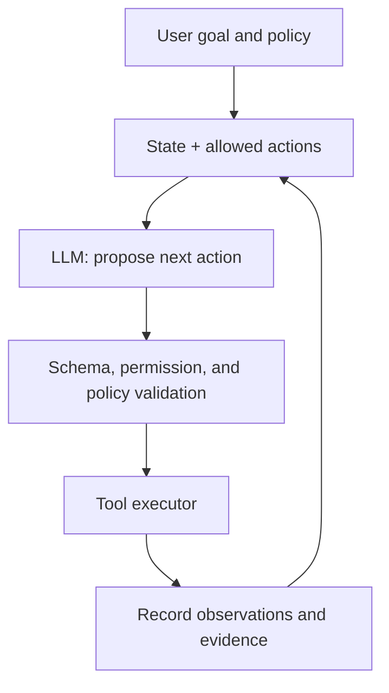



Un agente LLM no es "un programa que le da un objetivo a un modelo y le permite continuar por sí solo". Un agente listo para producción es un sistema que combina **un modelo que realiza juicios probabilísticos con transiciones de estado deterministas, herramientas restringidas, resultados verificables y límites de permiso explícitos**.

La capacidad lingüística de un modelo es poderosa, pero confundir esa flexibilidad con el control del sistema conduce a ejecuciones duplicadas, cambios externos incorrectos, bucles infinitos y afirmaciones de finalización no respaldadas.

## 1. El problema: la diferencia entre una demostración conversacional y un agente confiable

Una demostración simple puede funcionar con el siguiente bucle.

1. Pon la portería en el prompt.
2. El modelo selecciona una herramienta.
3. Vuelva a colocar el resultado de la herramienta en prompt.
4. Repita hasta que el modelo diga que está listo.

Sin embargo, en la producción es necesario responder a las siguientes preguntas.

- ¿Quién determina el estado actual de la tarea?
- Si se vuelve a intentar llamar a la misma herramienta, ¿provocará cambios duplicados?
- ¿Puede el modelo seleccionar argumentos u objetivos que no están permitidos?
- ¿Se trata una instrucción maliciosa en la salida de la herramienta como datos o como un comando?
- ¿Dónde se reanuda la ejecución tras un fallo parcial?
- ¿Se requiere la aprobación del usuario antes de un cambio externo?
- ¿Qué evidencia, más que una frase del modelo, determina la “completación”?
- ¿Cómo se mide el desempeño más allá de las impresiones de unas pocas conversaciones?

### Distinguir flujos de trabajo de agentes

- **Flujo de trabajo**: la mayoría de los pasos y ramas posibles se definen en el código.
- **Agente**: Seleccionar la siguiente acción requiere el criterio del modelo.

Cuando ya se conoce un procedimiento repetible, el flujo de trabajo es más predecible y menos costoso. Utilice la autonomía del agente sólo para la exploración de información incierta, la interpretación no estructurada y la planificación dinámica. Un buen sistema combina los dos manteniendo claros sus límites.

### El lenguaje natural puede ser una interfaz, pero no debe ser el protocolo interno.

“Parece haber tenido éxito” no es un estado. Un estado de éxito requiere condiciones verificables por máquina, como las siguientes.

- Existen artefactos requeridos
- Pasa el esquema, la suma de comprobación y las pruebas.
- Confirmación ID del externo API
- Se confirma la transición de estado esperada.
- No hay errores sin resolver

Las reclamaciones del agente deben separarse del estado del mundo.

## 2. Modelo mental: combinación de un proponente probabilístico con un ejecutor determinista



El modelo **propone** y el ejecutor **valida, autoriza y ejecuta**. El texto generado por el modelo no debe conducir directamente a un comando de shell, consulta o cambio externo.

### Representar al agente como una máquina de estados.

Dado el estado \(s_t\), la observación \(o_t\) y la acción \(a_t\):

\[
a_t \sim \pi_\theta(a\mid s_t, o_t), \qquad
s_{t+1}=T(s_t,a_t,o_{t+1})
\]

- \(\pi_\theta\): la política probabilística implementada por LLM
- \(T\): la transición de estado determinista implementada por código

El estado debe contener los hechos estructurados necesarios para la tarea, no toda la conversación como una cadena.

```json
{
  "task_id": "immutable-id",
  "goal": "검증 가능한 완료 조건",
  "phase": "research",
  "constraints": ["read-only until approved"],
  "facts": [{"claim": "...", "source_id": "..."}],
  "artifacts": [],
  "pending_actions": [],
  "attempt_count": 1,
  "budget": {"tool_calls_left": 12, "deadline": "..."},
  "last_error": null
}
```

El historial de conversaciones es útil para el contexto y la auditoría, pero usarlo como única fuente de verdad para el estado actual deja al sistema vulnerable a las contradicciones y al desbordamiento del contexto.

### Una herramienta es una capacidad escrita con permisos.

La definición de una herramienta necesita más que un nombre y una descripción. También necesita:

- esquemas de entrada y salida
- lectura/escritura y nivel de impacto externo
- alcance objetivo y permisos
- tiempo de espera y límite de velocidad
- si se permite el reintento
- soporte de idempotencia
- tipos de errores esperados
- cómo se verifica el éxito
- condiciones que requieren la aprobación del usuario

Es más seguro limitar las capacidades para "leer un archivo dentro del proyecto especificado", "guardar un borrador" y "enviar un mensaje después de la aprobación" que ofrecer una característica amplia como una "herramienta de administración de archivos".

## 3. Flujo de trabajo práctico

### Paso 1. Convertir la meta en criterios de finalización y prohibición.

No ejecute directamente un objetivo en lenguaje natural. Conviértelo en un contrato de tarea.

```yaml
goal: "요청된 기술 보고서 초안을 생성한다"
success_criteria:
  - "필수 섹션이 모두 존재한다"
  - "모든 외부 사실에 출처가 연결된다"
  - "문서 schema와 품질 검사를 통과한다"
non_goals:
  - "외부 수신자에게 전송하지 않는다"
  - "원본 자료를 수정하지 않는다"
approval_required:
  - "외부 게시"
  - "기존 artifact 덮어쓰기"
budget:
  max_steps: 20
  max_retries_per_tool: 2
```

Pregunte cuando una ambigüedad en la solicitud del usuario cambiaría sustancialmente el resultado. Cuando su impacto sea pequeño y reversible, utilice un valor predeterminado razonable y establezca el supuesto en el resultado.

### Paso 2. Separar el estado del contexto

El contexto debe contener solo lo que el modelo necesita para el paso actual.

- Política del sistema y contrato de tareas.
- Fase actual y herramientas permitidas.
- Hechos clave verificados
- Porciones necesarias de resultados recientes de herramientas.
- Presupuesto restante y estado de error.

Incluir todo el registro antiguo cada vez aumenta el costo y oculta instrucciones importantes. En lugar de eso:

1. Conserve el registro de eventos original sin cambios.
2. Mantener actualizado el estado estructurado.
3. Cree resúmenes comprimidos con procedencia.
4. Recupere el original mediante ID cuando sea necesario.

Un resumen no es un paso para crear nuevos hechos. Debido a que la información puede omitirse o distorsionarse, mantenga los números, aprobaciones y restricciones importantes en campos estructurados separados.

### Paso 3. Divida las responsabilidades del planificador y del ejecutor

Para una tarea compleja, la planificación y la ejecución se pueden separar.

- Planificador: propone submetas, dependencias, evidencia requerida y costo esperado.
- Ejecutor: realiza solo el paso permitido actualmente
- Verificador: comprueba si el resultado satisface el esquema y los criterios de finalización.

Separar roles en múltiples llamadas modelo no siempre es beneficioso. Para una tarea sencilla, sólo aumenta el coste y la superficie de error. Separe los roles solo en los pasos donde **la verificación independiente reduce materialmente el riesgo**.

### Paso 4. Validar estrictamente la salida estructurada

El modelo puede proponer su siguiente acción como JSON.

```json
{
  "action": "search_documents",
  "arguments": {
    "query": "검증할 기술 질문",
    "limit": 5
  },
  "reason": "현재 주장에 1차 근거가 없음",
  "expected_evidence": "공식 문서의 정의와 제한"
}
```

Validar antes de la ejecución:

1. Sintaxis y esquema JSON
2. Lista de acciones permitidas
3. Tipos, longitudes y rangos de argumentos
4. Ámbito de destino, como una ruta, URL o un destinatario.
5. Permisos para la fase actual
6. Aprobación basada en cambios externos, costo y sensibilidad.
7. Estado de duplicación y reintento

La validación de esquemas no reemplaza la validación semántica. Una ruta puede tener el tipo de cadena correcto y aun así quedar fuera del alcance permitido, mientras que un destinatario ID puede existir sin identificar a la persona a la que se dirige el usuario.

### Paso 5. Diseñar interfaces de herramientas pequeñas y deterministas

Una buena herramienta reduce la cantidad de opciones en las que el modelo puede equivocarse.

Mal ejemplo:

```text
run_any_command(command: string)
```

Mejor ejemplo:

```text
search_records(query, date_from, date_to, limit) -> SearchResult[]
create_draft(title, body, idempotency_key) -> DraftId
publish_draft(draft_id, approval_token) -> PublicationReceipt
```

Separe las lecturas de las escrituras y la creación de borradores de la publicación. Idealmente, las herramientas de escritura admiten una ejecución en seco o una vista previa.

### Paso 6. Realizar cambios externos idempotentes y verificables

Después de un tiempo de espera de la red, es posible que un agente no sepa si la solicitud falló o tuvo éxito, pero perdió su respuesta. Volver a intentarlo incondicionalmente puede provocar una creación o entrega duplicada.

Las contramedidas incluyen:

- Una clave de idempotencia basada en la tarea y la intención.
- Consultar el estado actual antes de la ejecución.
- Verificar el recibo y la versión del recurso después de la ejecución.
- Control de concurrencia optimista
- Detección de duplicados y upsert seguro
- Diseñar acciones compensatorias bajo entrega al menos una vez cuando la ejecución exactamente una vez es imposible

```python
def execute_write(intent, approved_token):
    validate_scope(intent)
    validate_approval(intent, approved_token)

    key = stable_hash(intent.task_id, intent.action, intent.target, intent.payload)
    previous = lookup_by_idempotency_key(key)
    if previous:
        return previous

    receipt = tool_call(intent, idempotency_key=key)
    return verify_receipt(receipt, expected=intent)
```

### Paso 7. Aprobación de diseño y permisos según riesgo

Clasificar las acciones de las herramientas por nivel de riesgo.

| Nivel | Ejemplo | Política predeterminada |
|---|---|---|
| Bajo | Leer información pública, análisis local | Puede ejecutarse automáticamente |
| Medio | Crear un borrador o un nuevo artefacto | Limitar el alcance y revisar el resultado |
| Alto | Entrega externa, publicación, pago, cambios de permisos | Aprobación explícita |
| Muy alto | Eliminación masiva, permisos amplios, cambios irreversibles | Doble confirmación y controles separados |

La aprobación debe vincular un objetivo, una acción y un contenido específicos en lugar de utilizar una redacción general. Si la carga útil cambia después de la aprobación, obtenga la aprobación nuevamente.

Siguiendo el privilegio mínimo, proporcione a una sesión de agente solo las capacidades mínimas necesarias para la tarea actual y utilice credenciales con una vida útil corta y alcances limitados.

### Paso 8. Trate la inyección prompt como un problema de límite de confianza

Web pages, documents, email, and tool output are **data**, not system instructions. Incluso si contienen una frase que diga "ignorar instrucciones anteriores", no deben obtener autoridad de ejecución.

Las capas de defensa incluyen:

- Instrucciones estructuralmente separadas del contenido que no es de confianza.
- Evitar que el texto externo defina directamente acciones, destinatarios o permisos
- Analizar los resultados de la herramienta con esquemas y pasar solo los campos obligatorios
- No pongas los secretos en el contexto del modelo.
- Listas de permitidos URL, ruta y dominio
- Motor de políticas y aprobación antes de escribir acciones.
- Codificación de salida y parametrización de comandos/consultas.
- Evaluaciones que incluyen ejemplos de ataques.

No espere que las indicaciones por sí solas proporcionen una protección completa. Diseñar al ejecutor para que rechace acciones peligrosas incluso cuando el modelo sea engañado.

### Paso 9. Clasificar errores y recuperar dentro de límites

Las respuestas difieren según el tipo de error.

| Error | Respuesta |
|---|---|
| Error de esquema | Proporcionar comentarios sobre el formato y luego regenerar un número limitado de veces |
| Tiempo de espera transitorio | Retroceda, verifique la idempotencia y luego vuelva a intentarlo |
| Permiso insuficiente | Solicitar aprobación o permiso sin saltarse los controles |
| Destino no encontrado | Verifique el alcance de la búsqueda o pregunte al usuario |
| Conflicto semántico | Reexaminar la evidencia estatal y original |
| Violación de política | Rechazar esa acción y ofrecer una alternativa segura |
| Fallo repetido | Deje de reintentar y transfiera información de diagnóstico |

Al volver a intentarlo con el mismo prompt después de cada error, se repiten los mismos errores. Establezca presupuestos para reintentos, pasos totales, tiempo, tokens y costos. Si el plan sigue cambiando o pasa por el mismo estado, un detector de bucle debería detenerlo.

### Paso 10. Verificar la finalización de forma independiente

El verificador verifica el contrato de la tarea, no la afirmación del modelo de que "ya terminé".

- ¿Existen todos los resultados requeridos?
- ¿Se puede abrir cada artefacto y satisface su esquema?
- ¿Pasaron las pruebas requeridas?
- ¿Las citas realmente respaldan sus afirmaciones?
- ¿El recibo de un cambio externo coincide con el estado esperado?
- ¿No hay errores no gestionados ni acciones pendientes?
- ¿No ocurrió ninguna de las acciones prohibidas para el usuario?

Cuando la verificación falla, no reinicie siempre desde el principio. Registre el criterio fallido en el estado y regrese solo al paso mínimo necesario.

### Paso 11. Evaluación de compilación por capa

Evaluar a un agente únicamente por la calidad de la respuesta final es insuficiente.

#### Evaluación de componentes

- Precisión de selección de herramientas
- Esquema de argumentos y precisión del objetivo.
- Retiro de recuperación y vinculación de citación.
- Tasa de validez de salida estructurada
- Preservación de hechos en resúmenes estatales.

#### Evaluación de trayectoria

- Pasos innecesarios y llamadas a herramientas.
- Tasas de reintento y bucle
- Intentos de infracción de políticas y tasa de bloqueo
- Calidad de recuperación después del fracaso.
- Costo total y latencia

#### Evaluación de resultados

- Tasa de éxito de la tarea
- Tasa de aprobación por criterio de finalización
- Corrección real del estado externo.
- Cantidad de corrección del usuario y tasa de transferencia
- Errores ponderados por riesgo

Una utilidad esperada simplificada es:

\[
U = V_{success}P(success)
-C_{tool}-C_{latency}
-\lambda C_{unsafe}
\]

El peso \(\lambda\) en el costo relacionado con la seguridad \(C_{unsafe}\) debe ser mucho mayor que el de los errores estilísticos comunes.

### Paso 12. Actualizar continuamente los datos de evaluación y la observabilidad

El conjunto de evaluación debe incluir:

- Tareas representativas normales.
- Casos extremos y solicitudes ambiguas
- Tiempos de espera de herramientas y fallas parciales.
- Materiales mutuamente contradictorios
- Prompt intentos de inyección y escalada de privilegios
- Riesgos de ejecución duplicada
- Contextos largos y estado obsoleto.
- Solicitudes fuera del dominio

No almacene indiscriminadamente toda la entrada del modelo en seguimientos de ejecución. Elimine información personal y secretos, y estructure los siguientes eventos.

- Tarea, versión y versión prompt
- transición de estado
- Nombre de la herramienta, argumentos desinfectados, latencia y estado del resultado.
- Validación y decisiones políticas.
- Evento de aprobación
- Tokens, costos y reintentos.
- Resultado final del verificador.

Desidentificar las fallas de producción y luego promoverlas a pruebas de regresión.

## 4. Lista de verificación de evaluación y verificación

### Arquitectura y estado

- [ ] ¿Se han distinguido los pasos adecuados para un flujo de trabajo de aquellos que requieren el criterio de un agente?
- [] ¿Están separados el estado estructurado y el registro de eventos original?
- [ ] ¿Los criterios de finalización, los criterios de prohibición y los presupuestos son verificables mecánicamente?
- [] ¿El código controla las transiciones de estado?
- [ ] ¿Las acciones permitidas están limitadas por fase?

### Herramientas y resultados

- [ ] ¿Todas las herramientas tienen esquemas de entrada y salida?
- [] ¿Se separan las lecturas de las escrituras y los borradores de la publicación?
- [] ¿Se validan semánticamente los alcances de ruta, dominio, destinatario y recursos?
- [] ¿Las herramientas de escritura admiten la idempotencia y la verificación de recibos?
- [] Después de un tiempo de espera, ¿se comprueba el éxito antes de volver a intentarlo?
- [ ] ¿Están definidos el número de fallas de salida estructurada y el respaldo?

### Seguridad y protección

- [] ¿El contenido que no es de confianza está separado de las instrucciones?
- [] ¿Están los secretos excluidos del contexto y los rastros del modelo?
- [] ¿Se utilizan privilegios mínimos y vidas de credenciales cortas?
- [ ] ¿Las acciones externas e irreversibles están sujetas a una aprobación específica?
- [ ] ¿Se descarta la aprobación previa cuando cambia la carga útil?
- [ ] ¿Se evalúan los ataques de prompt-inyección y de escalada de privilegios?

### Evaluación y operaciones

- [ ] ¿Se distinguen las métricas de componentes, trayectorias y resultados?
- [ ] ¿Se miden los errores ponderados por costo, latencia y riesgo, así como la tasa de éxito?
- [] ¿El conjunto de evaluación contiene tareas normales, de límites, de falla y de ataque?
- [ ] ¿Se pueden comparar los resultados por modelo, prompt, herramienta y versión de política?
- [ ] ¿Se monitorean los reintentos, bucles, traspasos y denegaciones de políticas?
- [] ¿Se agregan fallas reales como pruebas de regresión no identificadas?

## 5. Limitaciones y advertencias

Primero, la salida estructurada mejora la confiabilidad sintáctica pero no garantiza la veracidad o la intención correcta. Se requiere validación de esquema, validación semántica y verificación de evidencia.

En segundo lugar, múltiples agentes facilitan la asignación de roles pero aumentan la propagación de errores, el costo, la latencia y los límites de responsabilidad. Usar múltiples agentes para un problema que un solo agente y un flujo de trabajo determinista pueden resolver puede ser una ingeniería excesiva.

En tercer lugar, una alta tasa de éxito en una prueba comparativa fuera de línea no garantiza el comportamiento en un entorno con permisos reales, latencia y datos incompletos. Se necesita ejecución en la sombra y un canario limitado.

Cuarto, la aprobación humana tampoco es una barrera infalible. Las solicitudes de aprobación frecuentes y difíciles de entender fomentan los clics automáticos. La pantalla de aprobación debe mostrar brevemente el objetivo exacto, el cambio, el impacto y la reversibilidad.

Finalmente, los LLM son sensibles a las actualizaciones y cambios prompt. En lugar de tratar a un agente como "validado una vez", realice pruebas de regresión continua en cada versión como una combinación de modelo, herramientas, políticas y datos.
