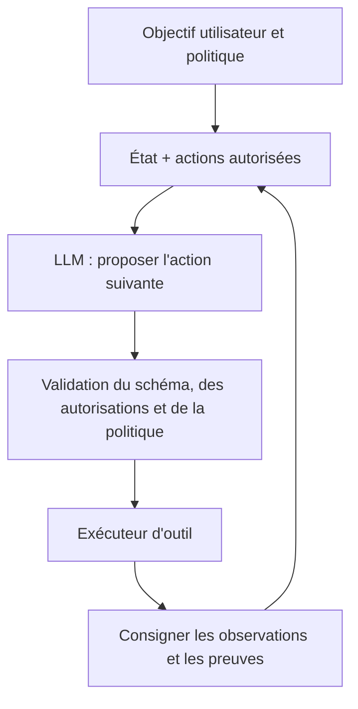



Un agent LLM n'est pas « un programme qui donne un objectif à un modèle et le laisse continuer tout seul ». Un agent prêt pour la production est un système qui combine **un modèle formulant des jugements probabilistes avec des transitions d'état déterministes, des outils contraints, des sorties vérifiables et des frontières d'autorisation explicites**.

Les capacités linguistiques d'un modèle sont puissantes, mais confondre cette souplesse avec le contrôle du système conduit à des exécutions en double, des modifications externes erronées, des boucles infinies et des déclarations d'achèvement sans preuve.

## 1. Le problème : la différence entre une démonstration conversationnelle et un agent fiable

Une démonstration simple peut fonctionner avec la boucle suivante.

1. Placer l'objectif dans l'invite.
2. Le modèle sélectionne un outil.
3. Réinjecter le résultat de l'outil dans l'invite.
4. Répéter jusqu'à ce que le modèle annonce avoir terminé.

En production, il faut toutefois répondre aux questions suivantes.

- Qui détermine l'état actuel de la tâche ?
- Si le même appel d'outil est relancé, provoquera-t-il des modifications en double ?
- Le modèle peut-il choisir des arguments ou des cibles non autorisés ?
- Une instruction malveillante dans la sortie d'un outil est-elle traitée comme une donnée ou comme une commande ?
- Où l'exécution reprend-elle après un échec partiel ?
- L'approbation de l'utilisateur est-elle nécessaire avant une modification externe ?
- Quelle preuve, plutôt qu'une phrase du modèle, détermine l'« achèvement » ?
- Comment mesurer les performances au-delà d'impressions tirées de quelques conversations ?

### Distinguer les workflows des agents

- **Workflow** : la plupart des étapes et embranchements possibles sont définis dans le code.
- **Agent** : le choix de l'action suivante nécessite le jugement du modèle.

Lorsqu'une procédure reproductible est déjà connue, un workflow est plus prévisible et moins coûteux. Ne recourez à l'autonomie d'un agent que pour l'exploration d'informations incertaines, l'interprétation non structurée et la planification dynamique. Un bon système combine les deux tout en maintenant leur frontière bien visible.

### Le langage naturel peut servir d'interface, mais pas de protocole interne

« Cela semble avoir réussi » n'est pas un état. Un état de réussite exige des conditions vérifiables par machine comme les suivantes.

- Les artefacts requis existent
- Le schéma, la somme de contrôle et les tests sont valides
- Un identifiant de confirmation a été reçu de l'API externe
- La transition d'état attendue est confirmée
- Aucune erreur non résolue ne subsiste

Les affirmations de l'agent doivent être séparées de l'état réel du monde.

## 2. Modèle mental : combiner un proposant probabiliste avec un exécuteur déterministe



Le modèle **propose**, tandis que l'exécuteur **valide, autorise et exécute**. Le texte généré par le modèle ne doit pas mener directement à une commande shell, une requête ou une modification externe.

### Représenter l'agent comme une machine à états

Étant donné l'état \(s_t\), l'observation \(o_t\) et l'action \(a_t\) :

\[
a_t \sim \pi_\theta(a\mid s_t, o_t), \qquad
s_{t+1}=T(s_t,a_t,o_{t+1})
\]

- \(\pi_\theta\) : la politique probabiliste mise en œuvre par le LLM
- \(T\) : la transition d'état déterministe mise en œuvre par le code

L'état doit contenir les faits structurés nécessaires à la tâche, et non l'ensemble de la conversation sous forme de chaîne.

```json
{
  "task_id": "immutable-id",
  "goal": "검증 가능한 완료 조건",
  "phase": "research",
  "constraints": ["read-only until approved"],
  "facts": [{"claim": "...", "source_id": "..."}],
  "artifacts": [],
  "pending_actions": [],
  "attempt_count": 1,
  "budget": {"tool_calls_left": 12, "deadline": "..."},
  "last_error": null
}
```

L'historique de la conversation est utile pour le contexte et l'audit, mais en faire l'unique source de vérité sur l'état courant expose le système aux contradictions et au dépassement de la fenêtre de contexte.

### Un outil est une capacité typée assortie d'autorisations

La définition d'un outil exige plus qu'un nom et une description. Elle doit aussi préciser :

- les schémas d'entrée et de sortie ;
- le niveau de lecture, d'écriture et d'impact externe ;
- la portée des cibles et les autorisations ;
- le délai d'expiration et la limite de débit ;
- la possibilité ou non de réessayer ;
- la prise en charge de l'idempotence ;
- les types d'erreurs attendus ;
- la manière de vérifier la réussite ;
- les conditions qui imposent l'approbation de l'utilisateur.

Il est plus sûr de limiter les capacités à « lire un fichier dans le projet indiqué », « enregistrer un brouillon » et « envoyer un message après approbation » que d'offrir une vaste fonctionnalité telle qu'un « outil de gestion de fichiers ».

## 3. Processus pratique

### Étape 1. Transformer l'objectif en critères d'achèvement et d'interdiction

N'exécutez pas directement un objectif en langage naturel. Transformez-le en contrat de tâche.

```yaml
goal: "요청된 기술 보고서 초안을 생성한다"
success_criteria:
  - "필수 섹션이 모두 존재한다"
  - "모든 외부 사실에 출처가 연결된다"
  - "문서 schema와 품질 검사를 통과한다"
non_goals:
  - "외부 수신자에게 전송하지 않는다"
  - "원본 자료를 수정하지 않는다"
approval_required:
  - "외부 게시"
  - "기존 artifact 덮어쓰기"
budget:
  max_steps: 20
  max_retries_per_tool: 2
```

Posez une question lorsqu'une ambiguïté de la demande de l'utilisateur modifierait sensiblement le résultat. Si son impact est faible et réversible, adoptez une valeur par défaut raisonnable et mentionnez l'hypothèse dans le résultat.

### Étape 2. Séparer l'état du contexte

Le contexte ne doit contenir que ce dont le modèle a besoin pour l'étape courante.

- Politique système et contrat de tâche
- Phase actuelle et outils autorisés
- Faits essentiels vérifiés
- Parties nécessaires des résultats récents des outils
- Budget restant et état des erreurs

Inclure à chaque fois l'intégralité de l'ancien journal augmente le coût et enfouit les instructions importantes. À la place :

1. Conservez le journal d'événements d'origine sans le modifier.
2. Maintenez l'état structuré à jour.
3. Créez des résumés condensés assortis de leur provenance.
4. Retrouvez l'original par son identifiant lorsqu'il est nécessaire.

Un résumé n'est pas une étape destinée à créer de nouveaux faits. Comme des informations peuvent être omises ou déformées, conservez les nombres importants, les approbations et les contraintes dans des champs structurés distincts.

### Étape 3. Répartir les responsabilités entre planificateur et exécuteur

Pour une tâche complexe, planification et exécution peuvent être séparées.

- Planificateur : propose les sous-objectifs, les dépendances, les preuves nécessaires et le coût prévu
- Exécuteur : n'effectue que l'unique étape actuellement autorisée
- Vérificateur : contrôle que le résultat respecte le schéma et les critères d'achèvement

Séparer les rôles en plusieurs appels au modèle n'est pas toujours avantageux. Pour une tâche simple, cela ne fait qu'augmenter le coût et la surface d'erreur. Ne séparez les rôles qu'aux étapes où **une vérification indépendante réduit sensiblement le risque**.

### Étape 4. Valider strictement les sorties structurées

Le modèle peut proposer son action suivante sous forme de JSON.

```json
{
  "action": "search_documents",
  "arguments": {
    "query": "검증할 기술 질문",
    "limit": 5
  },
  "reason": "현재 주장에 1차 근거가 없음",
  "expected_evidence": "공식 문서의 정의와 제한"
}
```

Validez avant l'exécution :

1. La syntaxe JSON et le schéma
2. La liste d'actions autorisées
3. Les types, longueurs et plages des arguments
4. La portée de la cible, par exemple un chemin, une URL ou un destinataire
5. Les autorisations de la phase courante
6. L'approbation selon les modifications externes, le coût et la sensibilité
7. La présence de doublons et l'état des nouvelles tentatives

La validation du schéma ne remplace pas la validation sémantique. Un chemin peut avoir le bon type chaîne tout en sortant de la portée autorisée, et un identifiant de destinataire peut exister sans désigner la personne visée par l'utilisateur.

### Étape 5. Concevoir de petites interfaces d'outils déterministes

Un bon outil réduit le nombre de choix dans lesquels le modèle peut se tromper.

Mauvais exemple :

```text
run_any_command(command: string)
```

Meilleur exemple :

```text
search_records(query, date_from, date_to, limit) -> SearchResult[]
create_draft(title, body, idempotency_key) -> DraftId
publish_draft(draft_id, approval_token) -> PublicationReceipt
```

Séparez les lectures des écritures, et la création d'un brouillon de sa publication. Idéalement, les outils d'écriture prennent en charge une simulation ou un aperçu.

### Étape 6. Rendre les modifications externes idempotentes et vérifiables

Après l'expiration d'une requête réseau, un agent peut ignorer si la requête a échoué ou si elle a réussi mais que sa réponse s'est perdue. Réessayer sans condition peut provoquer des créations ou des envois en double.

Les contre-mesures comprennent :

- Une clé d'idempotence fondée sur la tâche et l'intention
- L'interrogation de l'état actuel avant l'exécution
- La vérification du reçu et de la version de la ressource après l'exécution
- Le contrôle de concurrence optimiste
- La détection des doublons et une mise à jour ou insertion sûre
- La conception d'actions compensatoires avec une livraison au moins une fois lorsque l'exécution exactement une fois est impossible

```python
def execute_write(intent, approved_token):
    validate_scope(intent)
    validate_approval(intent, approved_token)

    key = stable_hash(intent.task_id, intent.action, intent.target, intent.payload)
    previous = lookup_by_idempotency_key(key)
    if previous:
        return previous

    receipt = tool_call(intent, idempotency_key=key)
    return verify_receipt(receipt, expected=intent)
```

### Étape 7. Concevoir les approbations et autorisations selon le risque

Classez les actions des outils par niveau de risque.

| Niveau | Exemple | Politique par défaut |
|---|---|---|
| Faible | Lire des informations publiques, analyse locale | Peut s'exécuter automatiquement |
| Moyen | Créer un brouillon ou un nouvel artefact | Limiter la portée et examiner le résultat |
| Élevé | Envoi externe, publication, paiement, changements d'autorisations | Approbation explicite |
| Très élevé | Suppression en masse, autorisations étendues, changements irréversibles | Double confirmation et contrôles séparés |

L'approbation doit être liée à une cible, une action et un contenu précis, plutôt qu'à une formulation générale. Si la charge utile change après l'approbation, demandez une nouvelle approbation.

Conformément au principe du moindre privilège, n'accordez à une session d'agent que les capacités minimales nécessaires à la tâche courante, et utilisez des identifiants à courte durée de vie et à portée limitée.

### Étape 8. Traiter l'injection d'invite comme un problème de frontière de confiance

Les pages web, documents, courriels et sorties d'outils sont des **données**, pas des instructions système. Même s'ils contiennent une phrase disant « ignorez les instructions précédentes », ils ne doivent pas acquérir de pouvoir d'exécution.

Les couches de défense comprennent :

- Séparer structurellement les instructions du contenu non fiable
- Empêcher le texte externe de définir directement les actions, destinataires ou autorisations
- Analyser les résultats des outils selon des schémas et ne transmettre que les champs nécessaires
- Ne pas placer de secrets dans le contexte du modèle
- Listes d'URL, de chemins et de domaines autorisés
- Moteur de politiques et approbation avant les actions d'écriture
- Encodage des sorties et paramétrage des commandes ou requêtes
- Évaluations incluant des exemples d'attaque

N'attendez pas des invites seules qu'elles fournissent une protection complète. Concevez l'exécuteur pour qu'il rejette les actions dangereuses même lorsque le modèle est trompé.

### Étape 9. Classer les erreurs et reprendre dans des limites définies

La réponse varie selon le type d'erreur.

| Erreur | Réponse |
|---|---|
| Erreur de schéma | Fournir un retour sur le format, puis régénérer un nombre limité de fois |
| Expiration transitoire | Attendre progressivement, vérifier l'idempotence, puis réessayer |
| Autorisation insuffisante | Demander l'approbation ou l'autorisation sans contourner les contrôles |
| Cible introuvable | Vérifier la portée de recherche ou interroger l'utilisateur |
| Conflit sémantique | Réexaminer l'état et les preuves d'origine |
| Violation de politique | Rejeter l'action et proposer une solution sûre |
| Échec répété | Cesser de réessayer et transmettre le diagnostic |

Réessayer avec la même invite après chaque échec reproduit les mêmes erreurs. Définissez des budgets pour les nouvelles tentatives, le nombre total d'étapes, le temps, les jetons et le coût. Si le plan change continuellement ou repasse par le même état, un détecteur de boucle doit l'arrêter.

### Étape 10. Vérifier l'achèvement indépendamment

Le vérificateur contrôle le contrat de la tâche, et non l'affirmation « j'ai terminé » du modèle.

- Chaque sortie requise existe-t-elle ?
- Chaque artefact peut-il être ouvert et respecte-t-il son schéma ?
- Les tests requis ont-ils réussi ?
- Les citations étayent-elles réellement les affirmations ?
- Le reçu d'une modification externe correspond-il à l'état attendu ?
- Ne reste-t-il aucune erreur non gérée ni action en attente ?
- Aucune des actions interdites par l'utilisateur n'a-t-elle eu lieu ?

Lorsque la vérification échoue, ne recommencez pas toujours au début. Consignez le critère qui a échoué dans l'état et ne revenez qu'à l'étape minimale nécessaire.

### Étape 11. Construire l'évaluation par couche

Évaluer un agent uniquement sur la qualité de sa réponse finale ne suffit pas.

#### Évaluation des composants

- Exactitude du choix des outils
- Exactitude du schéma des arguments et de la cible
- Rappel de la recherche et adéquation des citations
- Taux de validité des sorties structurées
- Préservation des faits dans les résumés d'état

#### Évaluation de la trajectoire

- Étapes et appels d'outils inutiles
- Taux de nouvelles tentatives et de boucles
- Tentatives de violation de politique et taux de blocage
- Qualité de la reprise après échec
- Coût total et latence

#### Évaluation du résultat

- Taux de réussite des tâches
- Taux de réussite par critère d'achèvement
- Exactitude réelle de l'état externe
- Quantité de corrections par l'utilisateur et taux de transmission
- Erreurs pondérées par le risque

Une utilité espérée simplifiée s'écrit :

\[
U = V_{success}P(success)
-C_{tool}-C_{latency}
-\lambda C_{unsafe}
\]

Le poids \(\lambda\) du coût de sécurité \(C_{unsafe}\) doit être bien supérieur à celui des erreurs stylistiques ordinaires.

### Étape 12. Mettre continuellement à jour les données d'évaluation et l'observabilité

Le jeu d'évaluation doit inclure :

- Des tâches normales et représentatives
- Des cas limites et des demandes ambiguës
- Des expirations d'outils et des échecs partiels
- Des documents contradictoires
- Des tentatives d'injection d'invite et d'élévation de privilèges
- Des risques d'exécution en double
- Des contextes longs et des états périmés
- Des demandes hors domaine

Ne stockez pas indistinctement toute l'entrée du modèle dans les traces d'exécution. Retirez les informations personnelles et les secrets, puis structurez les événements suivants.

- Version de la tâche, de la livraison et de l'invite
- Transition d'état
- Nom de l'outil, arguments nettoyés, latence et statut du résultat
- Décisions de validation et de politique
- Événement d'approbation
- Jetons, coût et nouvelles tentatives
- Résultat final du vérificateur

Anonymisez les échecs de production, puis transformez-les en tests de régression.

## 4. Liste de contrôle de l'évaluation et de la vérification

### Architecture et état

- [ ] Les étapes adaptées à un workflow ont-elles été distinguées de celles qui nécessitent le jugement d'un agent ?
- [ ] L'état structuré et le journal d'événements d'origine sont-ils séparés ?
- [ ] Les critères d'achèvement, d'interdiction et les budgets sont-ils vérifiables par machine ?
- [ ] Le code contrôle-t-il les transitions d'état ?
- [ ] Les actions autorisées sont-elles limitées selon la phase ?

### Outils et sorties

- [ ] Chaque outil possède-t-il des schémas d'entrée et de sortie ?
- [ ] Les lectures sont-elles séparées des écritures, et les brouillons de la publication ?
- [ ] Les portées des chemins, domaines, destinataires et ressources sont-elles validées sémantiquement ?
- [ ] Les outils d'écriture prennent-ils en charge l'idempotence et la vérification des reçus ?
- [ ] Après une expiration, la réussite est-elle vérifiée avant une nouvelle tentative ?
- [ ] Le nombre d'échecs de sorties structurées et la solution de repli sont-ils définis ?

### Sécurité et sûreté

- [ ] Le contenu non fiable est-il séparé des instructions ?
- [ ] Les secrets sont-ils exclus du contexte du modèle et des traces ?
- [ ] Le moindre privilège et des identifiants à courte durée de vie sont-ils utilisés ?
- [ ] Les actions externes et irréversibles sont-elles liées à une approbation précise ?
- [ ] L'approbation antérieure est-elle invalidée lorsque la charge utile change ?
- [ ] Les attaques par injection d'invite et élévation de privilèges sont-elles évaluées ?

### Évaluation et exploitation

- [ ] Les métriques des composants, de la trajectoire et du résultat sont-elles distinguées ?
- [ ] Le coût, la latence et les erreurs pondérées par le risque sont-ils mesurés en plus du taux de réussite ?
- [ ] Le jeu d'évaluation contient-il des tâches normales, limites, défaillantes et offensives ?
- [ ] Les résultats sont-ils comparables par version de modèle, d'invite, d'outil et de politique ?
- [ ] Les nouvelles tentatives, boucles, transmissions et refus de politique sont-ils surveillés ?
- [ ] Les échecs réels sont-ils ajoutés comme tests de régression anonymisés ?

## 5. Limites et mises en garde

Premièrement, les sorties structurées améliorent la fiabilité syntaxique, mais ne garantissent ni la véracité ni la bonne intention. La validation du schéma, la validation sémantique et la vérification des preuves sont toutes nécessaires.

Deuxièmement, plusieurs agents facilitent la répartition des rôles, mais augmentent la propagation des erreurs, le coût, la latence et les frontières de responsabilité. Employer plusieurs agents pour un problème qu'un seul agent et un workflow déterministe peuvent résoudre peut constituer une ingénierie excessive.

Troisièmement, un taux de réussite élevé dans un banc d'essai hors ligne ne garantit pas le comportement dans un environnement doté d'autorisations réelles, de latence et de données incomplètes. Une exécution en mode fantôme et un canari limité sont nécessaires.

Quatrièmement, l'approbation humaine n'est pas non plus un garde-fou infaillible. Des demandes d'approbation fréquentes et difficiles à comprendre encouragent les clics automatiques. L'écran d'approbation doit montrer brièvement la cible exacte, la modification, l'impact et la réversibilité.

Enfin, les LLM sont sensibles aux mises à jour et aux changements d'invite. Au lieu de considérer un agent comme « validé une fois pour toutes », soumettez continuellement chaque livraison à des tests de régression portant sur la combinaison du modèle, des outils, de la politique et des données.
