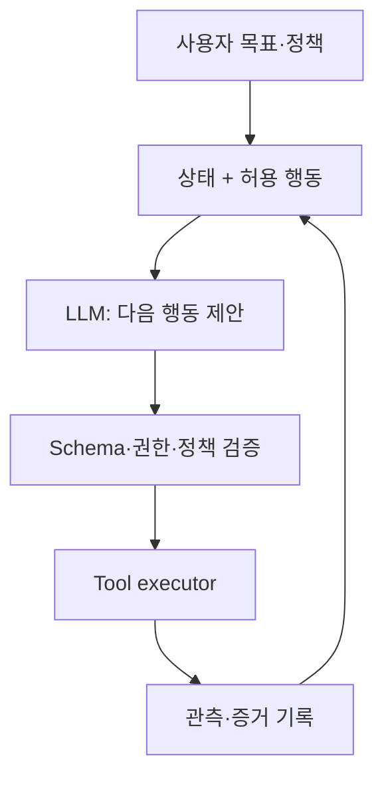



LLM agentは「モデルへ目標を与え、自律的に反復させるプログラム」ではない。運用可能なagentとは、**確率的判断を行うモデル、決定論的な状態遷移、制限されたツール、検証可能な出力、明示的な権限境界**を組み合わせたシステムである。

モデルの言語能力は強力だが、その柔軟性をシステム制御と混同すると、重複実行、誤った外部変更、無限loop、根拠のない完了報告が起きる。

## 1. 問題：会話デモと信頼できるagentの違い

簡単なデモなら次のloopでも動く。

1. 目標をpromptへ入れる。
2. モデルがツールを選ぶ。
3. ツール結果を再びpromptへ入れる。
4. モデルが完了と述べるまで繰り返す。

しかし実運用では、次の問いに答えなければならない。

- 現在の作業状態を誰が決定するのか。
- 同じツール呼び出しを再試行すると、変更が重複しないか。
- モデルが許可されていない引数や対象を選べるか。
- ツール出力内の悪意ある指示をデータとして扱うか、命令として扱うか。
- 部分障害後にどこから再開するか。
- 外部変更前に利用者承認が必要か。
- 「完了」をモデルの文ではなく、どの証拠で判定するか。
- 数件の会話に対する印象ではなく、性能をどう測るか。

### Workflowとagentを区別する

- **Workflow**：取り得る段階と分岐の大部分がコードで決まっている。
- **Agent**：次の行動選択にモデルの判断が必要である。

反復可能な手順が既知なら、workflowの方が予測可能で安価である。不確実な情報探索、非定型な解釈、動的計画にのみagentの自律性を使う。良いシステムは両者を混ぜながら境界を明確にする。

### 自然言語はinterfaceにはできるが内部protocolにしてはならない

「成功したようです」という文は状態ではない。成功状態には、次のような機械検証可能な条件が必要である。

- 必須artifactが存在する
- schema・checksum・テストを通過する
- 外部APIの確認IDがある
- 期待した状態遷移を確認できる
- 未解決エラーがない

Agentの主張と世界の状態を分離する。

## 2. Mental model：確率的提案者と決定論的実行器の結合



モデルは**提案**し、実行器は**検証・許可・実行**する。モデルが生成したtextを、直接shell、query、外部変更へつなげない。

### Agentを状態機械で表す

状態 \(s_t\)、観測 \(o_t\)、行動 \(a_t\) を置くと、

\[
a_t \sim \pi_\theta(a\mid s_t, o_t), \qquad
s_{t+1}=T(s_t,a_t,o_{t+1})
\]

- \(\pi_\theta\)：LLMが実装する確率的policy
- \(T\)：コードが実装する決定論的状態遷移

状態には会話全文ではなく、作業に必要な構造化事実を置く。

```json
{
  "task_id": "immutable-id",
  "goal": "검증 가능한 완료 조건",
  "phase": "research",
  "constraints": ["read-only until approved"],
  "facts": [{"claim": "...", "source_id": "..."}],
  "artifacts": [],
  "pending_actions": [],
  "attempt_count": 1,
  "budget": {"tool_calls_left": 12, "deadline": "..."},
  "last_error": null
}
```

会話履歴は監査・文脈には有用だが、現在状態のsingle source of truthにすると、矛盾とcontext overflowへ弱くなる。

### ツールは権限を持つtyped capabilityである

ツール定義には名称と説明だけでなく、次が必要である。

- 入出力schema
- read/writeと外部影響レベル
- 対象scopeと権限
- timeoutとrate limit
- 再試行の可否
- idempotency対応
- 想定エラー種別
- 成功を検証する方法
- 利用者承認が必要な条件

「ファイル管理ツール」のような広い機能より、「指定project内のファイル読取り」「draft保存」「承認後のメッセージ送信」のようにcapabilityを狭める方が安全である。

## 3. 実践workflow

### Step 1. 目標を完了条件と禁止条件へ変換する

自然言語の目標を直ちに実行せず、task contractへ変える。

```yaml
goal: "요청된 기술 보고서 초안을 생성한다"
success_criteria:
  - "필수 섹션이 모두 존재한다"
  - "모든 외부 사실에 출처가 연결된다"
  - "문서 schema와 품질 검사를 통과한다"
non_goals:
  - "외부 수신자에게 전송하지 않는다"
  - "원본 자료를 수정하지 않는다"
approval_required:
  - "외부 게시"
  - "기존 artifact 덮어쓰기"
budget:
  max_steps: 20
  max_retries_per_tool: 2
```

利用者の曖昧な部分が結果を大きく変えるなら質問する。影響が小さく可逆なら合理的なdefaultを使い、仮定を結果へ明示する。

### Step 2. 状態とcontextを分離する

Contextには、モデルが当該段階で必要とする情報だけを入れる。

- システムpolicyと作業契約
- 現在phaseと許可ツール
- 検証済みの主要事実
- 直近ツール結果の必要部分
- 残りbudgetとエラー状態

古い全ログを毎回入れるとコストが増え、重要な指示が埋もれる。代わりに次を行う。

1. 元のevent logは変更せず保存する。
2. 構造化stateを最新化する。
3. 圧縮summaryをprovenance付きで作る。
4. 必要時に原文をIDで再取得する。

Summaryは新たな事実を作る段階ではない。欠落・歪曲し得るため、重要な数値・承認・制約は構造化fieldへ分離する。

### Step 3. Plannerとexecutorの責任を分ける

複雑な課題では計画と実行を分離できる。

- Planner：下位目標、依存関係、必要証拠、予想コストを提案
- Executor：現在許可された一段階だけを実行
- Verifier：結果がschemaと完了条件を満たすか確認

役割を複数のモデル呼び出しへ分けることが常によいわけではない。単純なtaskではコストとエラー面だけが増える。**独立検証が実質的なリスク低減を生む段階**に限って分離する。

### Step 4. Structured outputを厳密に検証する

モデルに次の行動をJSONで提案させられる。

```json
{
  "action": "search_documents",
  "arguments": {
    "query": "검증할 기술 질문",
    "limit": 5
  },
  "reason": "현재 주장에 1차 근거가 없음",
  "expected_evidence": "공식 문서의 정의와 제한"
}
```

実行前の検証：

1. JSON syntaxとschema
2. action allowlist
3. argumentのtype・長さ・範囲
4. path・URL・recipientなど対象scope
5. 現在phaseの権限
6. 外部変更・コスト・機密度に応じたapproval
7. 重複・再試行の有無

Schema validationは意味検証を代替しない。文字列型として正しいpathでも許可範囲外かもしれず、存在するrecipient IDでも利用者が意図した相手とは限らない。

### Step 5. Tool interfaceを小さく決定論的に設計する

良いツールはモデルが誤れる選択肢を減らす。

悪い例：

```text
run_any_command(command: string)
```

より良い例：

```text
search_records(query, date_from, date_to, limit) -> SearchResult[]
create_draft(title, body, idempotency_key) -> DraftId
publish_draft(draft_id, approval_token) -> PublicationReceipt
```

readとwrite、draft作成とpublishを分ける。writeツールはdry-runまたはpreviewに対応するとよい。

### Step 6. 外部変更をidempotentかつ検証可能にする

network timeout後、agentには要求自体が失敗したのか、成功したが応答だけ失ったのか分からない。無条件に再試行すれば重複作成・送信が生じる。

対策：

- taskと意図に基づくidempotency key
- 実行前の現在状態照会
- 実行後のreceipt・resource version確認
- optimistic concurrency control
- 重複検出と安全なupsert
- exactly-onceが不可能ならat-least-onceを前提に補償動作を設計

```python
def execute_write(intent, approved_token):
    validate_scope(intent)
    validate_approval(intent, approved_token)

    key = stable_hash(intent.task_id, intent.action, intent.target, intent.payload)
    previous = lookup_by_idempotency_key(key)
    if previous:
        return previous

    receipt = tool_call(intent, idempotency_key=key)
    return verify_receipt(receipt, expected=intent)
```

### Step 7. 承認と権限をリスクベースで設計する

ツール行動をリスクレベルへ分ける。

| レベル | 例 | 既定policy |
|---|---|---|
| 低 | 公開情報の読取り、ローカル解析 | 自動実行可能 |
| 中 | draft・新規artifact作成 | scope制限、結果review |
| 高 | 外部送信、公開、決済、権限変更 | 明示的承認 |
| 非常に高 | 大量削除、広範な権限、不可逆変更 | 二重確認・別統制 |

承認は包括的表現ではなく、具体的な対象・行動・内容へ結び付ける。承認後にpayloadが変われば再承認する。

Least privilegeに従い、agent sessionへは現在taskに必要な最小capabilityだけを与え、寿命とscopeが短いクレデンシャルを使う。

### Step 8. Prompt injectionを信頼境界の問題として扱う

web page、文書、email、ツール出力は**データ**でありシステム指示ではない。その中に「以前の指示を無視せよ」と書かれても実行権限を得てはならない。

防御層：

- 指示と非信頼コンテンツを構造的に分離
- 外部textからaction・recipient・permissionを直接定義させない
- ツール結果をschemaでparseし必要fieldだけを渡す
- secretをモデルcontextへ入れない
- URL・path・domain allowlist
- write行動前のpolicy engineと承認
- 出力encodingとcommand/query parameterization
- 攻撃例を含む評価

Promptだけによる完全防御を期待しない。モデルが欺かれても、実行器が危険な行動を拒否するよう設計する。

### Step 9. エラーを分類し、制限付きで復旧する

エラー種別により対応は異なる。

| エラー | 対応 |
|---|---|
| schemaエラー | 形式feedback後に限定再生成 |
| 一時的timeout | backoff、idempotency確認後に再試行 |
| 権限不足 | 回避せず承認・権限を要求 |
| 対象なし | 検索scope確認または利用者確認 |
| 意味衝突 | stateと原文証拠を再検討 |
| policy違反 | 当該actionを拒否し安全な代替案 |
| 反復失敗 | retryを止め、診断情報付きでhandoff |

同じpromptで毎回再試行すれば同じエラーを繰り返す。再試行回数、総step、時間、token、コストのbudgetを置く。計画が変わり続ける、または同じ状態を循環するならloop detectorで中断する。

### Step 10. 完了を独立検証する

Verifierはモデルの「完了しました」ではなくtask contractを検査する。

- 必須出力が存在するか。
- 各artifactが開けてschemaを満たすか。
- 要求されたテストが通ったか。
- 引用が実際の主張を支持するか。
- 外部変更receiptが期待状態と一致するか。
- 未処理エラー・pending actionがないか。
- 利用者が禁止した行動が起きなかったか。

検証失敗時に無条件で最初からやり直さない。失敗条件をstateへ記録し、必要最小の段階へ戻る。

### Step 11. 評価を階層別に構築する

Agent評価は最終回答の品質だけでは不十分である。

#### Component evaluation

- tool選択の正確性
- argument schema・対象の正確性
- retrieval recall・citation entailment
- structured output valid rate
- 状態summaryの事実保持

#### Trajectory evaluation

- 不要なstep・tool call
- 再試行・loop率
- policy違反試行と阻止率
- 障害後の復旧品質
- 総コスト・遅延

#### Outcome evaluation

- task success rate
- 完了条件別の通過率
- 外部状態の実際の正確性
- 利用者修正量・handoff率
- リスク加重エラー

期待効用を単純化すると、

\[
U = V_{success}P(success)
-C_{tool}-C_{latency}
-\lambda C_{unsafe}
\]

安全関連コスト \(C_{unsafe}\) の重み \(\lambda\) は、一般的な文体エラーよりはるかに大きくすべきである。

### Step 12. 評価データと可観測性を継続更新する

評価セットには次を含める。

- 通常の代表task
- 境界・曖昧な要件
- ツールtimeout・部分障害
- 相互に矛盾する資料
- prompt injection・権限昇格試行
- 重複実行リスク
- 長いcontextと古いstate
- domain外要求

実行traceへモデル入力全文を無条件に保存しない。個人情報・secretを除去し、次のeventを構造化する。

- task・release・prompt version
- state transition
- tool name、sanitized argument、latency、result status
- validation・policy decision
- approval event
- token・コスト・retry
- 最終verifier結果

運用上の失敗例は非識別化してregression testへ昇格する。

## 4. 評価・検証checklist

### アーキテクチャと状態

- [ ] workflowで十分な段階とagent判断が必要な段階を区別した。
- [ ] 構造化stateと元のevent logが分離されている。
- [ ] 完了条件、禁止条件、budgetが機械検証可能である。
- [ ] 状態遷移をコードが制御する。
- [ ] phaseごとの許可actionが制限されている。

### ツールと出力

- [ ] すべてのツールに入出力schemaがある。
- [ ] readとwrite、draftとpublishが分離されている。
- [ ] path・domain・recipient・resource scopeを意味的に検証する。
- [ ] writeツールがidempotencyとreceipt検証をサポートする。
- [ ] timeout後に成功可否を照会してから再試行する。
- [ ] 構造化出力の失敗回数とfallbackが定義されている。

### セキュリティと安全

- [ ] 非信頼コンテンツを指示から分離する。
- [ ] secretがモデルcontext・traceへ入らない。
- [ ] 最小権限と短いクレデンシャル寿命を使う。
- [ ] 外部・不可逆行動が具体的な承認へ結び付く。
- [ ] payload変更時に既存承認を再利用しない。
- [ ] prompt injectionと権限昇格の攻撃評価がある。

### 評価と運用

- [ ] component、trajectory、outcome metricを区別する。
- [ ] 成功率だけでなくコスト・遅延・リスク加重エラーを測る。
- [ ] 通常・境界・障害・攻撃taskが評価セットにある。
- [ ] モデル・prompt・tool・policy version別に結果を比較できる。
- [ ] retry、loop、handoff、policy denialをmonitoringする。
- [ ] 実際の失敗を非識別regression testへ追加する。

## 5. 限界と注意点

第一に、structured outputは構文上の安定性を高めるが、事実性や正しい意図を保証しない。schema、semantic validation、根拠検証がすべて必要である。

第二に、複数agentを使うと役割分担は容易になるが、エラー伝播、コスト、遅延、責任境界が増える。単一agentと決定論的workflowで解ける問題にmulti-agentを使うのは過剰設計になり得る。

第三に、offline benchmarkの高い成功率は、実際の権限・遅延・不完全データがある環境を保証しない。shadow実行と制限されたcanaryが必要である。

第四に、human approvalも万能なguardrailではない。頻繁で理解しにくい承認要求は自動クリックを促す。承認画面には正確な対象・変更・影響・rollback可能性を短く示すべきである。

最後に、LLMは更新とprompt変更へ敏感である。「一度検証したagent」ではなく、モデル・ツール・policy・データの組合せであるreleaseを継続的にregression評価しなければならない。
