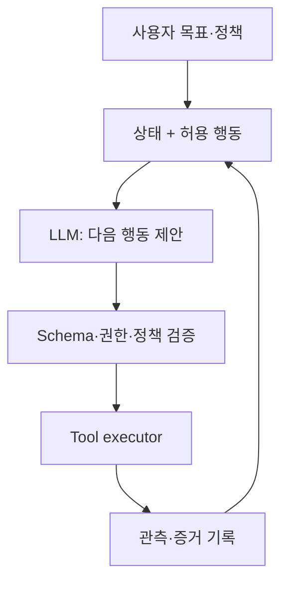

LLM agent는 “모델에게 목표를 주고 알아서 반복시키는 프로그램”이 아니다. 운영 가능한 agent는 **확률적 판단을 하는 모델과 결정론적 상태 전이, 제한된 도구, 검증 가능한 출력, 명시적 권한 경계**를 결합한 시스템이다.

모델의 언어 능력은 강력하지만, 그 유연성을 시스템 제어와 혼동하면 중복 실행, 잘못된 외부 변경, 무한 루프, 근거 없는 완료 보고가 발생한다.

## 1. 문제: 대화 데모와 신뢰할 수 있는 agent의 차이

간단한 데모는 다음 loop로도 동작한다.

1. 목표를 prompt에 넣는다.
2. 모델이 도구를 고른다.
3. 도구 결과를 다시 prompt에 넣는다.
4. 모델이 완료라고 말할 때까지 반복한다.

하지만 실제 운영에서는 다음 질문에 답해야 한다.

- 현재 작업 상태를 누가 결정하는가?
- 같은 도구 호출이 재시도되면 중복 변경이 일어나는가?
- 모델이 허용되지 않은 인수나 대상을 선택할 수 있는가?
- 도구 출력 안의 악성 지시를 데이터로 처리하는가, 명령으로 처리하는가?
- 부분 실패 뒤 어디서 재개하는가?
- 외부 변경 전에 사용자의 승인이 필요한가?
- “완료”를 모델의 문장 대신 어떤 증거로 판정하는가?
- 성능을 대화 몇 개의 인상평이 아니라 어떻게 측정하는가?

### Workflow와 agent를 구분한다

- **Workflow**: 가능한 단계와 분기가 코드로 대부분 정해져 있다.
- **Agent**: 다음 행동 선택에 모델의 판단이 필요하다.

반복 가능한 절차가 이미 알려져 있다면 workflow가 더 예측 가능하고 저렴하다. 불확실한 정보 탐색, 비정형 해석, 동적 계획에만 agent의 자율성을 사용한다. 좋은 시스템은 둘을 섞되 경계를 명확히 한다.

### 자연어는 인터페이스일 수 있지만 내부 프로토콜이어서는 안 된다

“성공한 것 같습니다”라는 문장은 상태가 아니다. 성공 상태에는 다음과 같은 기계 검증 가능한 조건이 필요하다.

- 필수 artifact 존재
- schema·checksum·테스트 통과
- 외부 API의 확인 ID
- 예상한 상태 전이 확인
- 미해결 오류가 없음

Agent의 주장과 세계의 상태를 분리해야 한다.

## 2. Mental model: 확률적 제안자와 결정론적 실행기의 결합



모델은 **제안**하고, 실행기는 **검증·허가·실행**한다. 모델이 생성한 텍스트가 직접 shell, query, 외부 변경으로 이어지지 않게 한다.

### Agent를 상태 머신으로 표현한다

상태 \(s_t\), 관측 \(o_t\), 행동 \(a_t\)를 두면:

\[
a_t \sim \pi_\theta(a\mid s_t, o_t), \qquad
s_{t+1}=T(s_t,a_t,o_{t+1})
\]

- \(\pi_\theta\): LLM이 구현하는 확률적 정책
- \(T\): 코드가 구현하는 결정론적 상태 전이

상태에는 전체 대화 문자열이 아니라 작업에 필요한 구조적 사실을 둔다.

```json
{
  "task_id": "immutable-id",
  "goal": "검증 가능한 완료 조건",
  "phase": "research",
  "constraints": ["read-only until approved"],
  "facts": [{"claim": "...", "source_id": "..."}],
  "artifacts": [],
  "pending_actions": [],
  "attempt_count": 1,
  "budget": {"tool_calls_left": 12, "deadline": "..."},
  "last_error": null
}
```

대화 기록은 감사·맥락에 유용하지만, 현재 상태의 단일 진실 원천으로 쓰면 모순과 context overflow에 취약하다.

### 도구는 권한이 있는 typed capability다

도구 정의에는 이름과 설명뿐 아니라 다음이 필요하다.

- 입력·출력 schema
- read/write 및 외부 영향 수준
- 대상 범위와 권한
- timeout과 rate limit
- 재시도 가능 여부
- idempotency 지원
- 예상 오류 유형
- 성공을 검증하는 방법
- 사용자 승인 필요 조건

“파일 관리 도구”처럼 넓은 기능보다 “지정된 프로젝트 안에서 파일 읽기”, “초안 저장”, “승인 후 메시지 전송”처럼 capability를 좁히는 편이 안전하다.

## 3. 실전 workflow

### Step 1. 목표를 완료 조건과 금지 조건으로 변환한다

자연어 목표를 바로 실행하지 않고 task contract로 바꾼다.

```yaml
goal: "요청된 기술 보고서 초안을 생성한다"
success_criteria:
  - "필수 섹션이 모두 존재한다"
  - "모든 외부 사실에 출처가 연결된다"
  - "문서 schema와 품질 검사를 통과한다"
non_goals:
  - "외부 수신자에게 전송하지 않는다"
  - "원본 자료를 수정하지 않는다"
approval_required:
  - "외부 게시"
  - "기존 artifact 덮어쓰기"
budget:
  max_steps: 20
  max_retries_per_tool: 2
```

사용자가 모호하게 말한 부분이 결과를 크게 바꾸면 질문한다. 영향이 작고 되돌릴 수 있으면 합리적 기본값을 쓰되 가정을 결과에 표시한다.

### Step 2. 상태와 context를 분리한다

Context에는 모델이 이번 단계에 필요한 정보만 넣는다.

- 시스템 정책과 작업 계약
- 현재 phase와 허용 도구
- 검증된 핵심 사실
- 최근 도구 결과의 필요한 부분
- 남은 예산과 오류 상태

오래된 전체 로그를 매번 넣으면 비용이 증가하고 중요한 지시가 묻힌다. 대신:

1. 원본 event log는 변경 없이 보존한다.
2. 구조화 state를 최신화한다.
3. 압축 summary는 provenance와 함께 만든다.
4. 필요할 때 원문을 ID로 다시 조회한다.

Summary는 사실을 새로 만드는 단계가 아니다. 누락·왜곡될 수 있으므로 중요한 숫자·승인·제약은 구조화 필드로 따로 둔다.

### Step 3. Planner와 executor의 책임을 나눈다

복잡한 과제에서는 계획과 실행을 분리할 수 있다.

- Planner: 하위 목표, 의존성, 필요한 증거, 예상 비용 제안
- Executor: 현재 허용된 한 단계만 실행
- Verifier: 결과가 schema와 완료 조건을 만족하는지 확인

역할을 여러 모델 호출로 분리하는 것이 항상 좋은 것은 아니다. 간단한 task에는 비용과 오류 표면만 늘어난다. **독립 검증이 실질적인 위험 감소를 만드는 단계**에만 분리한다.

### Step 4. Structured output을 엄격하게 검증한다

모델이 다음 행동을 JSON으로 제안하게 할 수 있다.

```json
{
  "action": "search_documents",
  "arguments": {
    "query": "검증할 기술 질문",
    "limit": 5
  },
  "reason": "현재 주장에 1차 근거가 없음",
  "expected_evidence": "공식 문서의 정의와 제한"
}
```

실행 전 검증:

1. JSON syntax와 schema
2. action allowlist
3. argument type·길이·범위
4. path·URL·recipient 등 대상 scope
5. 현재 phase의 권한
6. 외부 변경·비용·민감도에 따른 approval
7. 중복·재시도 여부

Schema validation은 의미 검증을 대신하지 않는다. 문자열 타입으로 올바른 경로라도 허용 범위 밖일 수 있고, 존재하는 수신자 ID라도 사용자가 의도한 사람이 아닐 수 있다.

### Step 5. Tool interface를 작고 결정론적으로 설계한다

좋은 도구는 모델이 실수할 선택지를 줄인다.

나쁜 예:

```text
run_any_command(command: string)
```

더 나은 예:

```text
search_records(query, date_from, date_to, limit) -> SearchResult[]
create_draft(title, body, idempotency_key) -> DraftId
publish_draft(draft_id, approval_token) -> PublicationReceipt
```

읽기와 쓰기를 분리하고, 초안 생성과 게시를 분리한다. 쓰기 도구는 dry-run 또는 preview를 지원하면 좋다.

### Step 6. 외부 변경은 idempotent하고 확인 가능하게 만든다

네트워크 timeout 뒤 agent는 요청이 실패했는지, 성공했지만 응답만 잃었는지 모를 수 있다. 무조건 재시도하면 중복 생성·전송이 발생한다.

대응:

- task와 의도에 기반한 idempotency key
- 실행 전 현재 상태 조회
- 실행 후 receipt·resource version 확인
- optimistic concurrency control
- 중복 감지와 안전한 upsert
- 정확히 한 번이 불가능하면 at-least-once를 전제로 보상 동작 설계

```python
def execute_write(intent, approved_token):
    validate_scope(intent)
    validate_approval(intent, approved_token)

    key = stable_hash(intent.task_id, intent.action, intent.target, intent.payload)
    previous = lookup_by_idempotency_key(key)
    if previous:
        return previous

    receipt = tool_call(intent, idempotency_key=key)
    return verify_receipt(receipt, expected=intent)
```

### Step 7. 승인과 권한을 위험 기반으로 설계한다

도구 행동을 위험 수준으로 나눈다.

| 수준 | 예 | 기본 정책 |
|---|---|---|
| 낮음 | 공개 정보 읽기, 로컬 분석 | 자동 실행 가능 |
| 중간 | 초안·새 artifact 생성 | 범위 제한, 결과 검토 |
| 높음 | 외부 전송, 게시, 결제, 권한 변경 | 명시적 승인 |
| 매우 높음 | 대량 삭제, 광범위 권한, 비가역 변경 | 이중 확인·별도 통제 |

승인은 포괄적 문구가 아니라 구체적인 대상, 행동, 내용을 묶어야 한다. 승인 후 payload가 바뀌면 재승인한다.

Least privilege 원칙에 따라 agent 세션에는 현재 task에 필요한 최소 capability만 주고, 수명과 scope가 짧은 자격 증명을 사용한다.

### Step 8. Prompt injection을 신뢰 경계 문제로 다룬다

웹페이지, 문서, 이메일, 도구 출력은 **데이터**이며 시스템 지시가 아니다. 그 안에 “이전 지시를 무시하라”는 문장이 있어도 실행 권한을 얻지 못해야 한다.

방어 계층:

- 지시와 비신뢰 콘텐츠를 구조적으로 분리
- 외부 텍스트가 action·recipient·permission을 직접 정의하지 못하게 함
- 도구 결과를 schema로 파싱하고 필요한 필드만 전달
- secret을 모델 context에 넣지 않음
- URL·path·도메인 allowlist
- 쓰기 행동 전 정책 엔진과 승인
- 출력 인코딩과 command/query parameterization
- 공격 예제를 포함한 평가

Prompt만으로 완전한 방어를 기대하지 않는다. 모델이 속아도 실행기가 위험한 행동을 거부하도록 설계한다.

### Step 9. 오류를 분류하고 제한적으로 복구한다

오류 유형에 따라 대응이 다르다.

| 오류 | 대응 |
|---|---|
| schema 오류 | 형식 피드백 후 제한 재생성 |
| 일시적 timeout | backoff, idempotency 확인 후 재시도 |
| 권한 부족 | 우회하지 않고 승인·권한 요청 |
| 대상 없음 | 검색 범위 점검 또는 사용자 확인 |
| 의미 충돌 | state와 원문 증거 재검토 |
| 정책 위반 | 해당 action 거부, 안전한 대안 |
| 반복 실패 | retry 중단, 진단 정보와 함께 handoff |

매 실패마다 같은 prompt로 재시도하면 같은 오류를 반복한다. 재시도 횟수, 총 step, 시간, token, 비용 예산을 둔다. 계획이 계속 변하거나 동일 상태를 순환하면 loop detector가 중단한다.

### Step 10. 완료를 독립적으로 검증한다

Verifier는 모델의 “완료했습니다”가 아니라 task contract를 검사한다.

- 필수 출력이 존재하는가?
- 각 artifact가 열리고 schema를 만족하는가?
- 요구된 테스트가 통과했는가?
- 인용이 실제 주장을 지지하는가?
- 외부 변경 receipt가 기대 상태와 일치하는가?
- 미처리 오류·pending action이 없는가?
- 사용자가 금지한 행동이 발생하지 않았는가?

검증 실패 시 무조건 처음부터 재시작하지 않는다. 실패한 조건을 state에 기록하고 최소 단계로 되돌아간다.

### Step 11. 평가를 계층별로 만든다

Agent 평가는 최종 답변 품질 하나로 부족하다.

#### Component evaluation

- tool 선택 정확도
- argument schema·대상 정확도
- retrieval recall·citation entailment
- structured output valid rate
- 상태 요약의 사실 보존

#### Trajectory evaluation

- 불필요한 step·tool call
- 재시도·loop 비율
- 정책 위반 시도와 차단률
- 실패 후 복구 품질
- 전체 비용·지연

#### Outcome evaluation

- task success rate
- 완료 조건별 통과율
- 외부 상태의 실제 정확성
- 사용자 수정량·handoff 비율
- 위험도 가중 오류

기대 효용을 단순화하면:

\[
U = V_{success}P(success)
-C_{tool}-C_{latency}
-\lambda C_{unsafe}
\]

안전 관련 비용 \(C_{unsafe}\)의 가중치 \(\lambda\)는 일반적인 문체 오류보다 훨씬 커야 한다.

### Step 12. 평가 데이터와 관측성을 지속적으로 갱신한다

평가 세트에는 다음을 포함한다.

- 정상 대표 task
- 경계·모호한 요구
- 도구 timeout·부분 실패
- 서로 모순되는 자료
- prompt injection·권한 상승 시도
- 중복 실행 위험
- 긴 context와 오래된 state
- 도메인 밖 요청

실행 trace에는 모델 입력 전체를 무조건 저장하지 않는다. 개인정보·secret을 제거하고 다음 이벤트를 구조화한다.

- task·release·prompt version
- state transition
- tool name, sanitized argument, latency, result status
- validation·policy decision
- approval event
- token·비용·retry
- 최종 verifier 결과

운영 실패 사례는 비식별화한 뒤 regression test로 승격한다.

## 4. 평가·검증 checklist

### 아키텍처와 상태

- [ ] workflow로 충분한 단계와 agent 판단이 필요한 단계를 구분했다.
- [ ] 구조화 state와 원본 event log가 분리되어 있다.
- [ ] 완료 조건, 금지 조건, 예산이 기계 검증 가능하다.
- [ ] 상태 전이는 코드가 통제한다.
- [ ] phase별 허용 action이 제한되어 있다.

### 도구와 출력

- [ ] 모든 도구에 입력·출력 schema가 있다.
- [ ] read와 write, draft와 publish가 분리되어 있다.
- [ ] 경로·도메인·수신자·자원 scope를 의미적으로 검증한다.
- [ ] 쓰기 도구는 idempotency와 receipt 검증을 지원한다.
- [ ] timeout 후 성공 여부를 조회한 뒤 재시도한다.
- [ ] 구조화 출력 실패 횟수와 fallback이 정의되었다.

### 보안과 안전

- [ ] 비신뢰 콘텐츠를 지시와 분리한다.
- [ ] secret이 모델 context·trace에 들어가지 않는다.
- [ ] 최소 권한과 짧은 자격 증명 수명을 사용한다.
- [ ] 외부·비가역 행동은 구체적 승인에 묶인다.
- [ ] payload 변경 시 기존 승인을 재사용하지 않는다.
- [ ] prompt injection과 권한 상승 공격 평가가 있다.

### 평가와 운영

- [ ] component, trajectory, outcome metric을 구분한다.
- [ ] 성공률뿐 아니라 비용·지연·위험 가중 오류를 측정한다.
- [ ] 정상·경계·실패·공격 task가 평가 세트에 있다.
- [ ] 모델·prompt·tool·policy 버전별 결과를 비교할 수 있다.
- [ ] retry, loop, handoff, policy denial을 모니터링한다.
- [ ] 실제 실패를 비식별 regression test로 추가한다.

## 5. 한계와 주의점

첫째, structured output은 문법적 안정성을 높이지만 사실성이나 올바른 의도를 보장하지 않는다. schema, semantic validation, 근거 검증이 모두 필요하다.

둘째, 여러 agent를 쓰면 역할 분담은 쉬워지지만 오류 전파, 비용, 지연, 책임 경계가 늘어난다. 단일 agent와 결정론적 workflow로 해결 가능한 문제에 다중 agent를 쓰는 것은 과설계일 수 있다.

셋째, offline benchmark의 높은 성공률은 실제 권한·지연·불완전한 데이터가 있는 환경을 보장하지 않는다. shadow 실행과 제한된 canary가 필요하다.

넷째, human approval도 만능 guardrail이 아니다. 잦고 이해하기 어려운 승인 요청은 자동 클릭을 유도한다. 승인 화면에는 정확한 대상·변경·영향·되돌리기 가능성을 짧게 보여 줘야 한다.

마지막으로, LLM은 업데이트와 prompt 변화에 민감하다. “한 번 검증된 agent”가 아니라 모델·도구·정책·데이터의 조합인 release를 지속적으로 회귀 평가해야 한다.
