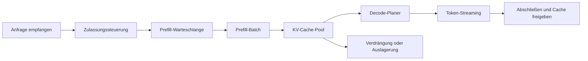



Die Bereitstellung eines LLM endet nicht damit, eine Modelldatei auf eine GPU zu laden und einen HTTP-Endpunkt zu öffnen.
Es handelt sich um ein Warteschlangensystem, das nutzerwahrgenommene Latenz, Parallelität, Ausgabequalität, GPU-Speicher und Fehlerisolierung gemeinsam steuern muss.

## 1. Das Problem: Durchsatz allein erklärt die Nutzererfahrung nicht

Eine Generierungsanfrage umfasst eine Phase, die die Eingabe auf einmal verarbeitet, und eine weitere, die wiederholt Token erzeugt.

- Prefill: berechnet Eingabetoken parallel, um den Ausgangszustand zu erzeugen.
- Decode: erzeugt anhand früherer Token und des KV-Caches sequenziell das nächste Token.

Beide Phasen besitzen unterschiedliche Recheneigenschaften.

- Ein langer Prompt erhöht Prefill-Berechnung und Anfangslatenz.
- Eine lange Ausgabe erhöht die Zahl der Decode-Iterationen und die Belegungsdauer des Caches.
- Mehr gleichzeitige Anfragen schaffen Batching-Möglichkeiten, aber auch Wartezeiten.
- Ein großer Batch kann den Durchsatz verbessern und zugleich die Endlatenz einzelner Anfragen verschlechtern.

Daher sind folgende Metriken getrennt zu betrachten.

- TTFT: Zeit von der Anfrage bis zum ersten Token
- TPOT: Zeit pro Token nach dem ersten Token
- End-to-End-Latenz: Zeit bis zur vollständigen Antwort
- Token pro Sekunde: Gesamtdurchsatz des Systems
- Nutzdurchsatz: innerhalb des SLO abgeschlossener nützlicher Durchsatz
- p95/p99: Endlatenz

## 2. Denkmodell: Eine zweistufige Warteschlange, die Speicher belegt



Eine Anfrage verbraucht neben Rechenzeit auch Cache-Speicher.
Die tragfähige Parallelität des Servers darf nicht allein aus der Größe der Modellparameter berechnet werden.

Ein grobes GPU-Speicherbudget lässt sich wie folgt auffassen.

$$
M_{\text{total}} \approx M_{\text{weights}}+M_{\text{KV}}+M_{\text{workspace}}+M_{\text{runtime}}
$$

Der KV-Cache skaliert mit Schichtzahl, Kopfdimension, Tokenzahl, gleichzeitigen Sequenzen und Datentyp.
Da die genaue Formel von Modellarchitektur und Parallelisierungsstrategie abhängt, ist sie durch tatsächliches Profiling zu bestätigen.

## 3. Anforderungen anhand von SLOs und Lasten definieren

Zunächst sind Verteilungen statt nur durchschnittlicher Anfragen zu erfassen.

- Eingabetoken p50/p95/p99
- Ausgabetoken p50/p95/p99
- Gleichzeitige Anfragen und Lastspitzengröße
- Ob Streaming erforderlich ist
- Häufigkeit von Zeitüberschreitungen und Abbrüchen
- Verkehrsanteil je Modell
- Anteil von Werkzeugaufrufen oder strukturierten Ausgaben

Beispiel für ein SLO:

```yaml
service_level:
  availability: "정의된 기간의 성공 응답 비율"
  ttft_p95: "interactive 요구에 맞춘 한도"
  tpot_p95: "읽기 가능한 streaming 속도"
  correctness_gate: "고정 평가 세트 기준"
  overload_policy: "bounded queue 후 명시적 거절"
```

Die Zahlen sind aus Last und Nutzererfahrung abzuleiten.
Die maximale Hardwareleistung darf nicht nachträglich als SLO ausgegeben werden.

## 4. Planung und Batching

Statische Batches warten, bis sich ähnlich große Anfragen sammeln, und eignen sich daher schlecht für Online-Verkehr.
Kontinuierliches Batching entfernt abgeschlossene Sequenzen und fügt dem laufenden Batch neue Anfragen hinzu.

Batching benötigt jedoch Richtlinien.

- Lange Anfragen dürfen kurze nicht blockieren.
- Zu lange wartende Anfragen erhalten höhere Priorität.
- Explizite Dienstklassen sind Nutzertarifen vorzuziehen.
- Das Budget ist so zu teilen, dass Prefill Decode nicht lange aushungert.
- Ressourcen abgebrochener Anfragen sind rasch zurückzugewinnen.

Ohne Zulassungssteuerung wächst die Warteschlange unbegrenzt und das System berechnet weiterhin bereits abgelaufene Anfragen.

Gutes Verhalten bei Überlastung:

1. Warteschlangenlänge oder erwartete Wartezeit schätzen.
2. Anfragen, deren SLO nicht eingehalten werden kann, früh ablehnen.
3. Hinweise für Wiederholung und Backoff geben.
4. Decode bereits abgebrochener Anfragen beenden.
5. Überlastungsereignisse nach Modell erfassen.

## 5. KV-Caches und Wiederverwendung von Präfixen

Ein KV-Cache reduziert doppelte Decode-Berechnungen, kann jedoch Speicherfragmentierung verursachen.
Seitenbasierte Verwaltung ist ein Ansatz, um verschwendeten Platz bei Sequenzen variabler Länge zu reduzieren.

Ein Präfix-Cache verwendet Prefill-Berechnungen für gemeinsame Systemprompts oder wiederholten Kontext erneut.
Folgende Bedingungen sind zu prüfen.

- Sind Tokenizer- und Modellrevision identisch?
- Ist die Tokenfolge des Präfixes exakt identisch?
- Wird verhindert, dass sensibler Kontext zwischen Nutzern mit verschiedenen Berechtigungen geteilt wird?
- Bildet der Cache-Schlüssel Adapter und Decode-Bedingungen ab?
- Wird der Eintrag nach Löschung oder Richtlinienänderung ungültig gemacht?

Die Maximierung der Cache-Trefferrate ist kein Selbstzweck.
Bei manchen Lasten übersteigen Suchkosten und Speicherbelegung die Einsparung.

## 6. Parallelität auswählen

Parallelität ist zu erwägen, wenn das Modell nicht auf einen Beschleuniger passt oder der Zieldurchsatz nicht erreicht wird.

- Tensorparallelität: verteilt Matrixoperationen auf mehrere Geräte.
- Pipelineparallelität: teilt Schichtbereiche in Gerätephasen auf.
- Datenparallele Bereitstellung: hält mehrere Modellreplikate vor.
- Expertenparallelität: verteilt Experten eines Mixture-of-Experts-Modells.

Auswahlkriterien:

- Passt das Modell auf ein einzelnes Gerät?
- Wie sind Bandbreite und Topologie der Verbindung?
- Konzentriert sich der Verkehr auf ein Modell?
- Sind lange oder kurze Sequenzen häufiger?
- Was sind die Einheiten von Ausfall und Ausrollung?

Übersteigt Kommunikation die Berechnung, können zusätzliche Geräte das System verlangsamen.
Sowohl Mikrobenchmarks als auch die Wiedergabe echter Lasten sind erforderlich.

## 7. Quantisierung ist Speicheroptimierung und Qualitätsänderung zugleich

Eine geringere Präzision von Gewichten oder Aktivierungen kann Speicher- und Bandbreitenbedarf senken.
Folgende Punkte sind jedoch getrennt zu bewerten.

- Ob nur Gewichte oder auch Aktivierungen betroffen sind
- Ob Kalibrierungsdaten erforderlich sind
- Ob der Kernel das Format effizient unterstützt
- Ob sich der Datentyp des KV-Caches ändert
- Ob sich die Qualitätsminderung je Aufgabe unterscheidet

Vor und nach der Quantisierung ist mit identischen Decode-Einstellungen zu prüfen.

```text
baseline model
  -> task quality suite
  -> latency and memory profile
quantized candidate
  -> same quality suite
  -> same workload profile
  -> acceptance gates
```

Eine kleinere Modelldatei senkt die tatsächliche Latenz nicht zwangsläufig.
Dequantisierung, nicht optimierte Kernel oder kleine Batches können den Vorteil aufheben.

## 8. Praktischer Ablauf: Ein Kapazitätsplanungsexperiment

Statt einer einzigen synthetischen Anfragelänge ist die tatsächliche Verteilung wiederzugeben.

```python
def workload_sample(rng, observed):
    return {
        "prompt_tokens": observed.prompt_lengths.sample(rng),
        "max_new_tokens": observed.output_lengths.sample(rng),
        "arrival_gap": observed.arrival_gaps.sample(rng),
        "stream": True,
    }
```

Versuchsreihenfolge:

1. Kernel- und Qualitätsreferenz mit einer einzelnen Anfrage bestimmen.
2. Parallelität schrittweise erhöhen.
3. Bei jedem Schritt TTFT, TPOT, Nutzdurchsatz und Spitzenspeicher erfassen.
4. Den Punkt ermitteln, an dem die Warteschlange dauerhaft wächst.
5. Abbrüche, Zeitüberschreitungen und Lastspitzen beimischen, um das Überlastungsverhalten zu beobachten.
6. Einen Worker beenden, um Wiederherstellung und Neuverteilung zu prüfen.
7. Kapazität mit Sicherheitsmarge für das Ziel-SLO festlegen.

Außerdem ist auszuschließen, dass CPU, Netzwerk oder Verbindungspool des Benchmark-Clients zum Engpass werden.

## 9. Qualität und API-Korrektheit prüfen

Eine Änderung an der Bereitstellung kann neben der Leistung auch die Semantik verändern.

- Tokenizer-Revision
- Chat-Vorlage
- BOS/EOS-Behandlung
- Abbruchkriterien
- Sampling-Seed und -Algorithmus
- Logit-Prozessor
- Einschränkungen strukturierter Ausgabe
- Adapterauswahl

Regressionstests sollten Folgendes enthalten.

- Greedy-Ausgabe oder zulässiges Muster für feste Prompts
- Grenzfälle mit langem Kontext
- Stopp-Token und Maximallänge
- Unicode- und mehrsprachige Eingaben
- Rekonstruktion gestreamter Fragmente
- Abbruch durch den Client
- Isolation zwischen Anfragen innerhalb eines Batches
- Schemabeschränkte Ausgabe

Bei stochastischem Sampling sind Aufgabenmetriken und Verteilungsprüfungen statt exakter Zeichenkettenvergleiche einzusetzen.

## 10. Beobachtbarkeit und Fehlerisolierung

Die Protokollierung vollständiger Prompts für jede Anfrage ist riskant.
Standardmäßig werden Tokenzahlen, Modellrevision, Sampling-Einstellungen, Zeitmessungen und Fehlercodes erfasst.

Erforderliche Spans:

- Eingang und Authentifizierung
- Wartezeit
- Prefill
- Decode
- Detokenisierung und Streaming
- Externe Abhängigkeiten

Metriken werden nach Modell, Revision, Route und Lastklasse aufgeschlüsselt, wobei die Label-Kardinalität begrenzt bleibt.

Fehlerreaktion:

- Fehlerhafte Worker aus dem Lastverteiler entfernen.
- OOM-Fehler nicht unbegrenzt wiederholen.
- Für jedes Modell einen Leistungsschalter einsetzen.
- Gemischte Tokenizer-Revisionen während eines rollierenden Updates verhindern.
- Lastabwurf über einen ausdrücklichen Status sichtbar machen.

## 11. Bewertungscheckliste

- [ ] Werden TTFT, TPOT und Gesamtlatenz getrennt gemessen?
- [ ] Werden neben Durchschnittswerten p95 und p99 untersucht?
- [ ] Wird Last anhand tatsächlicher Verteilungen von Ein- und Ausgabelängen reproduziert?
- [ ] Werden Gewichte, KV-Cache und Workspace-Speicher getrennt budgetiert?
- [ ] Gibt es eine begrenzte Warteschlange und Zulassungssteuerung?
- [ ] Wird die Berechnung für abgebrochene Anfragen beendet?
- [ ] Hält der Präfix-Cache Berechtigungsgrenzen ein?
- [ ] Wird die Aufgabenqualität vor und nach der Quantisierung verglichen?
- [ ] Sind Revisionen von Tokenizer und Chat-Vorlage fixiert?
- [ ] Ist bei der Ausrollung ein rollbackfähiges Modellartefakt verfügbar?
- [ ] Wurde die Wiederherstellung durch injizierten OOM und Worker-Verlust geprüft?
- [ ] Sind Client- und Netzwerkengpässe aus Leistungsmessungen ausgeschlossen?

## 12. Häufige Fehler und Einschränkungen

### Nur für die maximale Tokenzahl pro Sekunde entwerfen

Eine größere Batchgröße kann den maximalen Durchsatz steigern und zugleich die interaktive TTFT verschlechtern.
Ziel ist SLO-konformer Nutzdurchsatz, nicht Spitzendurchsatz.

### 100 Prozent GPU-Auslastung als gesunden Zustand behandeln

Auch ein gesättigtes System mit explodierender Warteschlange zeigt hohe Auslastung.
Auslastung ist gemeinsam mit Latenz, Warteschlangen und Abschlussrate zu deuten.

### Jeder Anfrage dieselbe Priorität geben

Kurze Unterhaltungen und lange Batch-Aufgaben in derselben Warteschlange verstärken das Blockieren am Kopf der Schlange.
Klare Dienstklassen und eine Fairnessrichtlinie sind zu definieren.

### Benchmark-Ergebnisse mit Produktionsleistung verwechseln

Feste Längen, warme Caches und fehlerfreier synthetischer Verkehr bilden den Betrieb nicht ab.
Tatsächliche Verteilungen, Lastspitzen, Kaltstarts und Fehler müssen enthalten sein.

Die Optimierung der Bereitstellung reagiert empfindlich auf Hardware, Treiber, Kernel und Modellarchitektur.
Optimale Einstellungen einer Umgebung lassen sich nicht unverändert auf ein anderes Gerät übertragen.

## 13. Offizielle Referenzen

- [Offizielle vLLM-Dokumentation](https://docs.vllm.ai/)
- [vLLM-PagedAttention-Paper](https://arxiv.org/abs/2309.06180)
- [Offizielle NVIDIA-TensorRT-LLM-Dokumentation](https://nvidia.github.io/TensorRT-LLM/)
- [CUDA C++ Programming Guide](https://docs.nvidia.com/cuda/cuda-c-programming-guide/)
- [Offizielle Dokumentation zu Hugging Face Text Generation Inference](https://huggingface.co/docs/text-generation-inference/)

## 14. Fazit

LLM-Bereitstellung ist die Gestaltung von Speicher, Warteschlangen und Planung rund um die Modellinferenz.
Wer Lastverteilung und Qualitätsgrenzen fixiert und anschließend TTFT, TPOT und Nutzdurchsatz gemeinsam optimiert, erhält einen schnellen und vorhersagbaren Dienst.
