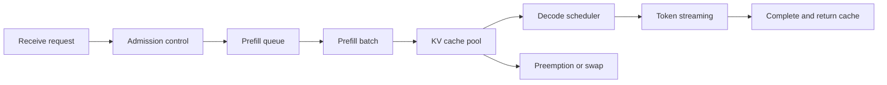



LLM serving does not end with loading a model file onto a GPU and opening an HTTP endpoint.
It is a queueing system that must jointly manage user-perceived latency, concurrency, output quality, GPU memory, and fault isolation.

## 1. The Problem: Throughput Alone Cannot Explain User Experience

A generation request has one stage that processes the input at once and another that repeatedly generates tokens.

- Prefill: computes input tokens in parallel to create the initial state.
- Decode: sequentially generates the next token using previous tokens and the KV cache.

The two stages have different computational characteristics.

- A long prompt increases prefill computation and initial latency.
- A long output increases the number of decode iterations and cache occupancy time.
- More concurrent requests create batching opportunities but also queueing delays.
- A large batch can improve throughput while worsening tail latency for individual requests.

Therefore, separate the following metrics.

- TTFT: time from request to first token
- TPOT: time per token after the first token
- End-to-end latency: time until the entire response is complete
- Tokens per second: total system throughput
- Goodput: useful throughput completed within the SLO
- p95/p99: tail latency

## 2. Mental Model: A Two-Stage Queue That Occupies Memory



A request consumes cache space as well as compute time.
Do not calculate the server's sustainable concurrency from model-parameter size alone.

A rough GPU memory budget can be viewed as follows.

$$
M_{\text{total}} \approx M_{\text{weights}}+M_{\text{KV}}+M_{\text{workspace}}+M_{\text{runtime}}
$$

The KV cache scales with the number of layers, head dimension, number of tokens, concurrent sequences, and dtype.
Because the exact formula varies with model architecture and parallelization strategy, verify it with actual profiling.

## 3. Define Requirements Through SLOs and Workloads

First collect distributions, not only average requests.

- Input-token p50/p95/p99
- Output-token p50/p95/p99
- Concurrent requests and burst size
- Whether streaming is required
- Timeout and cancellation frequency
- Traffic share by model
- Proportion of tool calls or structured output

Example SLO:

```yaml
service_level:
  availability: "정의된 기간의 성공 응답 비율"
  ttft_p95: "interactive 요구에 맞춘 한도"
  tpot_p95: "읽기 가능한 streaming 속도"
  correctness_gate: "고정 평가 세트 기준"
  overload_policy: "bounded queue 후 명시적 거절"
```

Derive the numbers from the workload and user experience.
Do not disguise the hardware's maximum output as an SLO after the fact.

## 4. Scheduling and Batching

Static batches wait until similarly sized requests collect, making them a poor fit for online traffic.
Continuous batching removes completed sequences and inserts new requests into the running batch.

But batching requires policy.

- Prevent long requests from blocking short requests.
- Raise the priority of requests that have waited too long.
- Use explicit service classes rather than user tiers.
- Divide the budget so that prefill does not starve decode for a long time.
- Reclaim resources from canceled requests quickly.

Without admission control, the queue grows without bound and the system continues computing requests that have already timed out.

Good overload behavior:

1. Estimate queue length or expected waiting time.
2. Reject early any request whose SLO cannot be met.
3. Provide retry hints and backoff.
4. Stop decoding requests that have already been canceled.
5. Record overload events by model.

## 5. KV Caches and Prefix Reuse

A KV cache reduces duplicate decode computation but can cause memory fragmentation.
Page-based management is an approach to reducing wasted space for variable-length sequences.

A prefix cache reuses prefill computation for shared system prompts or repeated context.
Check the following conditions.

- Are the tokenizer and model revision identical?
- Is the prefix token sequence exactly identical?
- Is sensitive context prevented from being shared among users with different permissions?
- Does the cache key reflect the adapter and decoding conditions?
- Is the entry invalidated after deletion or a policy change?

Maximizing cache hit ratio is not the objective by itself.
In some workloads, cache lookup cost and memory occupancy exceed the savings.

## 6. Choosing Parallelism

Consider parallelism when the model does not fit on one accelerator or target throughput cannot be reached.

- Tensor parallelism: partitions matrix operations across multiple devices.
- Pipeline parallelism: divides layer ranges into stages assigned to devices.
- Data-parallel serving: maintains multiple model replicas.
- Expert parallelism: distributes the experts of a mixture-of-experts model.

Selection criteria:

- Does the model fit on a single device?
- What are the interconnect bandwidth and topology?
- Is traffic concentrated on one model?
- Are long or short sequences more common?
- What are the units of failure and deployment?

If communication exceeds computation, adding devices can make the system slower.
Perform both microbenchmarks and actual workload replay.

## 7. Quantization Is Both a Memory Optimization and a Quality Change

Reducing the precision of weights or activations can lower loading-memory and bandwidth requirements.
But evaluate the following separately.

- Whether it is weight-only or includes activations
- Whether calibration data is required
- Whether the kernel efficiently supports the format
- Whether it changes the KV-cache dtype
- Whether quality degradation differs by task

Evaluate before and after quantization with identical decoding settings.

```text
baseline model
  -> task quality suite
  -> latency and memory profile
quantized candidate
  -> same quality suite
  -> same workload profile
  -> acceptance gates
```

A smaller model file does not necessarily reduce actual latency.
The benefit can disappear because of dequantization, unoptimized kernels, or small batches.

## 8. Practical Workflow: A Capacity-Planning Experiment

Replay the actual distribution rather than one synthetic request length.

```python
def workload_sample(rng, observed):
    return {
        "prompt_tokens": observed.prompt_lengths.sample(rng),
        "max_new_tokens": observed.output_lengths.sample(rng),
        "arrival_gap": observed.arrival_gaps.sample(rng),
        "stream": True,
    }
```

Experiment sequence:

1. Establish kernel and quality baselines with a single request.
2. Increase concurrency step by step.
3. Record TTFT, TPOT, goodput, and peak memory at each step.
4. Find the point where the queue grows continuously.
5. Mix in cancellations, timeouts, and bursts to observe overload behavior.
6. Terminate one worker to verify recovery and redistribution.
7. Set capacity while preserving a safety margin for the target SLO.

Also verify that the benchmark client's CPU, network, or connection pool is not the bottleneck.

## 9. Quality and API Correctness Verification

A serving change can alter semantics as well as performance.

- Tokenizer revision
- Chat template
- BOS/EOS handling
- Stopping criteria
- Sampling seed and algorithm
- Logit processor
- Structured-output constraints
- Adapter selection

Include the following in regression tests.

- Greedy output or an allowed pattern for fixed prompts
- Long-context boundary cases
- Stop tokens and maximum length
- Unicode and multilingual input
- Reconstruction of streaming chunks
- Client cancellation
- Isolation among requests within a batch
- Schema-constrained output

For stochastic sampling, use task metrics and distribution checks rather than exact string matching.

## 10. Observability and Fault Isolation

Logging the complete prompt for every request is risky.
By default, record token counts, model revision, sampling settings, timing, and error codes.

Required spans:

- Ingress and authentication
- Queue wait
- Prefill
- Decode
- Detokenization and streaming
- External dependencies

Break down metrics by model, revision, route, and workload bucket while limiting label cardinality.

Failure response:

- Remove unhealthy workers from the load balancer.
- Do not retry OOM failures without limit.
- Use a circuit breaker for each model.
- Prevent mixed tokenizer revisions during a rolling update.
- Expose load shedding through an explicit status.

## 11. Evaluation Checklist

- [ ] Are TTFT, TPOT, and total latency measured separately?
- [ ] Are p95 and p99 inspected in addition to averages?
- [ ] Is load reproduced using actual input- and output-length distributions?
- [ ] Are weights, KV-cache, and workspace memory budgeted separately?
- [ ] Are there a bounded queue and admission control?
- [ ] Is computation stopped for canceled requests?
- [ ] Does the prefix cache respect authorization boundaries?
- [ ] Is task quality compared before and after quantization?
- [ ] Are tokenizer and chat-template revisions pinned?
- [ ] Is a rollback-capable model artifact available during deployment?
- [ ] Has recovery been verified by injecting OOM and worker loss?
- [ ] Are client and network bottlenecks excluded from performance measurements?

## 12. Common Failures and Limitations

### Designing only around maximum tokens per second

Increasing batch size can raise maximum throughput while worsening interactive TTFT.
The objective is goodput that meets the SLO, not peak throughput.

### Treating 100% GPU utilization as a healthy state

A saturated system with an exploding queue also shows high utilization.
Interpret utilization together with latency, queues, and completion rate.

### Giving every request the same priority

Putting short conversations and long batch jobs in the same queue increases head-of-line blocking.
Define clear service classes and a fairness policy.

### Mistaking benchmark results for production performance

Fixed lengths, warm caches, and error-free synthetic traffic do not represent operations.
Include actual distributions, bursts, cold starts, and failures.

Serving optimization is sensitive to hardware, drivers, kernels, and model architecture.
The optimal settings for one environment cannot be applied unchanged to another device.

## 13. Official References

- [Official vLLM documentation](https://docs.vllm.ai/)
- [vLLM PagedAttention paper](https://arxiv.org/abs/2309.06180)
- [Official NVIDIA TensorRT-LLM documentation](https://nvidia.github.io/TensorRT-LLM/)
- [CUDA C++ Programming Guide](https://docs.nvidia.com/cuda/cuda-c-programming-guide/)
- [Official Hugging Face Text Generation Inference documentation](https://huggingface.co/docs/text-generation-inference/)

## 14. Conclusion

LLM serving is the design of memory, queues, and scheduling around model inference.
Fix the workload distribution and quality gates, then optimize TTFT, TPOT, and goodput together to build a fast, predictable service.
