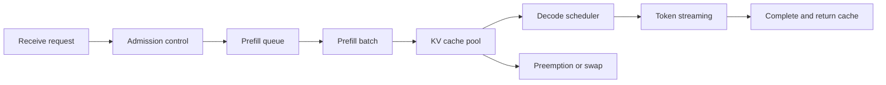



La publicación LLM no termina con la carga de un archivo de modelo en un GPU y la apertura de un punto final HTTP.
Es un sistema de colas que debe gestionar conjuntamente la latencia percibida por el usuario, la simultaneidad, la calidad de salida, la memoria GPU y el aislamiento de fallos.

## 1. El problema: el rendimiento por sí solo no puede explicar la experiencia del usuario

Una solicitud de generación tiene una etapa que procesa la entrada a la vez y otra que genera tokens repetidamente.

- Prerrelleno: calcula los tokens de entrada en paralelo para crear el estado inicial.
- Decodificar: genera secuencialmente el siguiente token utilizando los tokens anteriores y el caché KV.

Las dos etapas tienen diferentes características computacionales.

- Un prompt largo aumenta el cálculo previo al llenado y la latencia inicial.
- Una salida larga aumenta el número de iteraciones de decodificación y el tiempo de ocupación de la caché.
- Más solicitudes simultáneas crean oportunidades de procesamiento por lotes, pero también retrasos en las colas.
- Un lote grande puede mejorar el rendimiento y al mismo tiempo empeorar la latencia de cola para solicitudes individuales.

Por lo tanto, separe las siguientes métricas.

- TTFT: tiempo desde la solicitud hasta el primer token
- TPOT: tiempo por token después del primer token
- Latencia de un extremo a otro: tiempo hasta que se completa la respuesta completa
- Tokens por segundo: rendimiento total del sistema
- Goodput: rendimiento útil completado dentro del SLO
- p95/p99: latencia de cola

## 2. Modelo mental: una cola de dos etapas que ocupa la memoria



Una solicitud consume espacio de caché y tiempo de cálculo.
No calcule la simultaneidad sostenible del servidor únicamente a partir del tamaño del parámetro del modelo.

Un presupuesto de memoria GPU aproximado se puede ver de la siguiente manera.

$$
M_{\text{total}} \approx M_{\text{weights}}+M_{\text{KV}}+M_{\text{workspace}}+M_{\text{runtime}}
$$

La caché KV se escala con la cantidad de capas, la dimensión del cabezal, la cantidad de tokens, las secuencias simultáneas y el tipo de letra.
Debido a que la fórmula exacta varía según la arquitectura del modelo y la estrategia de paralelización, verifíquela con la creación de perfiles reales.

## 3. Definir requisitos a través de SLO y cargas de trabajo

Primero recopile las distribuciones, no solo las solicitudes promedio.

- Token de entrada p50/p95/p99
- Token de salida p50/p95/p99
- Solicitudes simultáneas y tamaño de ráfaga
- Si se requiere transmisión
- Tiempo de espera y frecuencia de cancelación
- Cuota de tráfico por modelo.
- Proporción de llamadas a herramientas o resultados estructurados.

Ejemplo SLO:

```yaml
service_level:
  availability: "정의된 기간의 성공 응답 비율"
  ttft_p95: "interactive 요구에 맞춘 한도"
  tpot_p95: "읽기 가능한 streaming 속도"
  correctness_gate: "고정 평가 세트 기준"
  overload_policy: "bounded queue 후 명시적 거절"
```

Derive los números de la carga de trabajo y la experiencia del usuario.
No disfrace la salida máxima del hardware como SLO después del hecho.

## 4. Programación y procesamiento por lotes

Los lotes estáticos esperan hasta que se recopilan solicitudes de tamaño similar, lo que los hace inadecuados para el tráfico en línea.
El procesamiento por lotes continuo elimina secuencias completadas e inserta nuevas solicitudes en el lote en ejecución.

Pero el procesamiento por lotes requiere una política.

- Evite que las solicitudes largas bloqueen las solicitudes cortas.
- Aumentar la prioridad de las solicitudes que han esperado demasiado.
- Utilice clases de servicios explícitas en lugar de niveles de usuarios.
- Divide el presupuesto para que el prefill no muera de hambre durante mucho tiempo.
- Recupere recursos de solicitudes canceladas rápidamente.

Sin control de admisión, la cola crece sin límites y el sistema continúa calculando las solicitudes que ya han expirado.

Buen comportamiento de sobrecarga:

1. Calcule la longitud de la cola o el tiempo de espera esperado.
2. Rechazar anticipadamente cualquier solicitud cuyo SLO no pueda cumplirse.
3. Proporcione sugerencias para reintentar y retroceder.
4. Deje de decodificar solicitudes que ya hayan sido canceladas.
5. Registre los eventos de sobrecarga por modelo.

## 5. KV Cachés y reutilización de prefijos

Una caché KV reduce el cálculo de decodificación duplicada, pero puede causar fragmentación de la memoria.
La gestión basada en páginas es un enfoque para reducir el espacio desperdiciado para secuencias de longitud variable.

Una caché de prefijo reutiliza el cálculo de precarga para mensajes compartidos del sistema o contexto repetido.
Compruebe las siguientes condiciones.

- ¿Son idénticos el tokenizador y la revisión del modelo?
- ¿La secuencia del token de prefijo es exactamente idéntica?
- ¿Se evita que el contexto confidencial se comparta entre usuarios con diferentes permisos?
- ¿La clave de caché refleja las condiciones del adaptador y de decodificación?
- ¿Se invalida la entrada después de su eliminación o cambio de política?

Maximizar la tasa de aciertos de caché no es el objetivo en sí mismo.
En algunas cargas de trabajo, el costo de búsqueda de caché y la ocupación de la memoria superan los ahorros.

## 6. Elegir el paralelismo

Considere el paralelismo cuando el modelo no se ajusta a un acelerador o no se puede alcanzar el rendimiento objetivo.

- Paralelismo tensorial: particiona operaciones matriciales en múltiples dispositivos.
- Paralelismo de canalización: divide los rangos de capas en etapas asignadas a los dispositivos.
- Servicio de datos en paralelo: mantiene múltiples réplicas de modelos.
- Paralelismo de expertos: distribuye los expertos de un modelo mixto de expertos.

Criterios de selección:

- ¿El modelo cabe en un solo dispositivo?
- ¿Cuáles son el ancho de banda y la topología de interconexión?
- ¿El tráfico se concentra en un modelo?
- ¿Son más habituales las secuencias largas o cortas?
- ¿Cuáles son las unidades de fracaso y despliegue?

Si la comunicación excede el cálculo, agregar dispositivos puede hacer que el sistema sea más lento.
Realice tanto microbenchmarks como repetición de la carga de trabajo real.

## 7. La cuantización es tanto una optimización de la memoria como un cambio de calidad

Reducir la precisión de los pesos o activaciones puede reducir los requisitos de memoria de carga y ancho de banda.
Pero evalúe lo siguiente por separado.

- Si es solo peso o incluye activaciones
- Si se requieren datos de calibración
- Si el kernel soporta eficientemente el formato.
- Si cambia el tipo de caché KV-
- Si la degradación de la calidad difiere según la tarea

Evalúe antes y después de la cuantificación con configuraciones de decodificación idénticas.

```text
baseline model
  -> task quality suite
  -> latency and memory profile
quantized candidate
  -> same quality suite
  -> same workload profile
  -> acceptance gates
```

Un archivo de modelo más pequeño no necesariamente reduce la latencia real.
El beneficio puede desaparecer debido a la descuantificación, núcleos no optimizados o lotes pequeños.

## 8. Flujo de trabajo práctico: un experimento de planificación de capacidades

Reproduzca la distribución real en lugar de una duración de solicitud sintética.

```python
def workload_sample(rng, observed):
    return {
        "prompt_tokens": observed.prompt_lengths.sample(rng),
        "max_new_tokens": observed.output_lengths.sample(rng),
        "arrival_gap": observed.arrival_gaps.sample(rng),
        "stream": True,
    }
```

Secuencia del experimento:

1. Establecer líneas base de núcleo y calidad con una sola solicitud.
2. Aumente la concurrencia paso a paso.
3. Registre TTFT, TPOT, goodput y memoria máxima en cada paso.
4. Encuentre el punto donde la cola crece continuamente.
5. Combine cancelaciones, tiempos de espera y ráfagas para observar el comportamiento de sobrecarga.
6. Despedir a un trabajador para verificar la recuperación y redistribución.
7. Establezca la capacidad preservando un margen de seguridad para el objetivo SLO.

También verifique que el CPU, la red o el grupo de conexiones del cliente de referencia no sea el cuello de botella.

## 9. Verificación de calidad y API corrección

Un cambio de publicación puede alterar tanto la semántica como el rendimiento.

- Revisión del tokenizador
- Plantilla de chat
- BOS/EOS manejo
- Criterios de parada
- Semilla de muestreo y algoritmo.
- Procesador logit
- Restricciones de producción estructurada
- Selección del adaptador

Incluya lo siguiente en las pruebas de regresión.

- Salida codiciosa o un patrón permitido para mensajes fijos
- Casos límite de contexto largo
- Tokens de parada y longitud máxima.
- Entrada Unicode y multilingüe.
- Reconstrucción de fragmentos de streaming.
- Cancelación de cliente
- Aislamiento entre solicitudes dentro de un lote.
- Salida restringida por esquema

Para el muestreo estocástico, utilice métricas de tareas y comprobaciones de distribución en lugar de coincidencias exactas de cadenas.

## 10. Observabilidad y aislamiento de fallas

Registrar el prompt completo para cada solicitud es arriesgado.
De forma predeterminada, registre el recuento de tokens, la revisión del modelo, la configuración de muestreo, el tiempo y los códigos de error.

Lapsos requeridos:

- Ingreso y autenticación
- Espera en cola
- Precarga
- Decodificar
- Destokenización y streaming
- Dependencias externas

Divida las métricas por modelo, revisión, ruta y grupo de carga de trabajo mientras limita la cardinalidad de las etiquetas.

Respuesta de falla:

- Eliminar los trabajadores en mal estado del equilibrador de carga.
- No reintentar OOM fallos sin límite.
- Utilice un disyuntor para cada modelo.
- Evite revisiones mixtas de tokenizadores durante una actualización continua.
- Exponer el deslastre de carga mediante un estado explícito.

## 11. Lista de verificación de evaluación

- [ ] ¿Se miden TTFT, TPOT y la latencia total por separado?
- [ ] ¿Se inspeccionan p95 y p99 además de los promedios?
- [] ¿Se reproduce la carga utilizando distribuciones reales de longitud de entrada y salida?
- [ ] ¿Se presupuestan por separado los pesos, la KV-caché y la memoria del espacio de trabajo?
- [ ] ¿Hay cola acotada y control de admisión?
- [] ¿Se detiene el cálculo de las solicitudes canceladas?
- [] ¿La caché de prefijos respeta los límites de autorización?
- [] ¿Se compara la calidad de la tarea antes y después de la cuantificación?
- [] ¿Están fijadas las revisiones de tokenizadores y plantillas de chat?
- [] ¿Hay disponible un artefacto de modelo con capacidad de reversión durante la implementación?
- [] ¿Se ha verificado la recuperación mediante la inyección de OOM y la pérdida de trabajadores?
- [ ] ¿Se excluyen de las mediciones de rendimiento los cuellos de botella de clientes y redes?

## 12. Fallas y limitaciones comunes

### Diseñar solo alrededor del máximo de tokens por segundo

Aumentar el tamaño del lote puede aumentar el rendimiento máximo y empeorar la TTFT interactiva.
El objetivo es un buen rendimiento que cumpla con el SLO, no un rendimiento máximo.

### Tratar el 100% de utilización de GPU como un estado saludable

Un sistema saturado con una cola explosiva también muestra una alta utilización.
Interprete la utilización junto con la latencia, las colas y la tasa de finalización.

### Dar a cada solicitud la misma prioridad

Poner conversaciones cortas y trabajos por lotes largos en la misma cola aumenta el bloqueo del encabezado de línea.
Definir clases de servicios claras y una política de equidad.

### Confundir los resultados de las pruebas comparativas con el rendimiento de producción

Las longitudes fijas, las cachés calientes y el tráfico sintético sin errores no representan operaciones.
Incluya distribuciones reales, ráfagas, arranques en frío y fallas.

La optimización del servicio depende del hardware, los controladores, los núcleos y la arquitectura del modelo.
La configuración óptima para un entorno no se puede aplicar sin cambios a otro dispositivo.

## 13. Referencias oficiales

- [Documentación oficial de vLLM](https://docs.vllm.ai/)
- [documento vLLM PagedAttention](https://arxiv.org/abs/2309.06180)
- [Documentación oficial NVIDIA TensorRT-LLM](https://nvidia.github.io/TensorRT-LLM/)
- [CUDA Guía de programación C++](https://docs.nvidia.com/cuda/cuda-c-programming-guide/)
- [Documentación oficial de inferencia de generación de texto de cara de abrazo](https://huggingface.co/docs/text-generation-inference/)

## 14. Conclusión

El servicio LLM es el diseño de memoria, colas y programación en torno a la inferencia de modelos.
Corrija la distribución de la carga de trabajo y los controles de calidad, luego optimice TTFT, TPOT y haga goodput para crear un servicio rápido y predecible.
