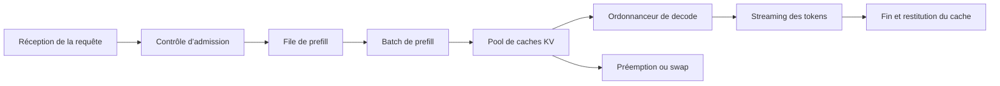



Servir un LLM ne consiste pas seulement à charger un fichier de modèle sur un GPU et à ouvrir un endpoint HTTP.
C’est un système de files d’attente qui doit gérer conjointement la latence perçue par l’utilisateur, la concurrence, la qualité des sorties, la mémoire GPU et l’isolation des défaillances.

## 1. Problème : le débit seul n’explique pas l’expérience utilisateur

Une requête de génération comporte une étape qui traite toute l’entrée en une fois, puis une autre qui produit les tokens de manière répétée.

- Prefill : calcule en parallèle les tokens d’entrée afin de créer l’état initial.
- Decode : génère séquentiellement le token suivant à partir des tokens précédents et du cache KV.

Ces deux étapes ont des caractéristiques de calcul différentes.

- Un prompt long augmente le calcul du prefill et la latence initiale.
- Une sortie longue augmente le nombre d’itérations de decode et la durée d’occupation du cache.
- Davantage de requêtes simultanées créent des possibilités de batching, mais aussi des délais d’attente.
- Un grand batch peut améliorer le débit tout en dégradant la latence de queue des requêtes individuelles.

Il faut donc distinguer les métriques suivantes.

- TTFT : temps entre la requête et le premier token
- TPOT : temps par token après le premier token
- Latence de bout en bout : temps nécessaire pour terminer toute la réponse
- Tokens par seconde : débit total du système
- Goodput : débit utile achevé dans les limites du SLO
- p95/p99 : latence de queue

## 2. Modèle mental : une file à deux étapes qui occupe de la mémoire



Une requête consomme non seulement du temps de calcul, mais aussi de l’espace de cache.
Il ne faut pas calculer la concurrence supportable par le serveur à partir de la seule taille des paramètres du modèle.

On peut estimer grossièrement le budget de mémoire GPU comme suit.

$$
M_{\text{total}} \approx M_{\text{weights}}+M_{\text{KV}}+M_{\text{workspace}}+M_{\text{runtime}}
$$

Le cache KV croît avec le nombre de couches, la dimension des heads, le nombre de tokens, les séquences simultanées et le dtype.
La formule exacte dépendant de l’architecture du modèle et du mode de parallélisation, il faut la vérifier par un profilage réel.

## 3. Définir les exigences par les SLO et la charge de travail

Il faut d’abord recueillir des distributions, et pas seulement une requête moyenne.

- p50/p95/p99 du nombre de tokens d’entrée
- p50/p95/p99 du nombre de tokens de sortie
- Requêtes simultanées et taille des rafales
- Nécessité ou non du streaming
- Fréquence des timeouts et des annulations
- Part du trafic par modèle
- Proportion de tool calls ou de sorties structurées

Exemple de SLO :

```yaml
service_level:
  availability: "정의된 기간의 성공 응답 비율"
  ttft_p95: "interactive 요구에 맞춘 한도"
  tpot_p95: "읽기 가능한 streaming 속도"
  correctness_gate: "고정 평가 세트 기준"
  overload_policy: "bounded queue 후 명시적 거절"
```

Les valeurs doivent découler de la charge de travail et de l’expérience utilisateur.
Il ne faut pas rebaptiser après coup la capacité maximale du matériel en SLO.

## 4. Ordonnancement et batching

Un batch statique attend que des requêtes de taille similaire soient réunies, ce qui convient mal au trafic en ligne.
Le continuous batching retire les séquences terminées et insère de nouvelles requêtes dans le batch en cours d’exécution.

Le batching exige toutefois une politique.

- Éviter que les requêtes longues bloquent les courtes.
- Augmenter la priorité des requêtes qui attendent depuis trop longtemps.
- Utiliser des classes de service explicites plutôt que des niveaux d’utilisateur.
- Répartir le budget pour que le prefill ne prive pas durablement le decode de ressources.
- Récupérer rapidement les ressources des requêtes annulées.

Sans contrôle d’admission, la file croît indéfiniment et le système continue même à calculer des requêtes déjà expirées.

Bon comportement en surcharge :

1. Estimer la longueur de la file ou le temps d’attente prévu.
2. Rejeter tôt toute requête dont le SLO ne peut pas être respecté.
3. Fournir des indications de nouvelle tentative et de backoff.
4. Arrêter le decode des requêtes déjà annulées.
5. Enregistrer les événements de surcharge par modèle.

## 5. Cache KV et réutilisation des préfixes

Le cache KV réduit les calculs de decode dupliqués, mais peut fragmenter la mémoire.
Une gestion par pages permet de réduire l’espace perdu par des séquences de longueur variable.

Un cache de préfixes réutilise le calcul de prefill des prompts système communs ou des contextes répétés.
Il faut vérifier les conditions suivantes.

- Le tokenizer et la révision du modèle sont-ils identiques ?
- La séquence de tokens du préfixe est-elle strictement identique ?
- Empêche-t-on le partage de contextes sensibles entre des utilisateurs aux autorisations différentes ?
- La clé de cache tient-elle compte de l’adapter et des conditions de decode ?
- L’entrée est-elle invalidée après une suppression ou un changement de politique ?

Maximiser le taux de succès du cache n’est pas un objectif en soi.
Pour certaines charges, le coût de consultation et l’occupation mémoire du cache dépassent les économies obtenues.

## 6. Choisir la parallélisation

Il faut envisager la parallélisation lorsque le modèle ne tient pas sur un seul accélérateur ou que le débit visé reste hors d’atteinte.

- Tensor parallelism : répartit les opérations matricielles entre plusieurs appareils.
- Pipeline parallelism : découpe les plages de couches en stages affectés aux appareils.
- Data-parallel serving : maintient plusieurs réplicas du modèle.
- Expert parallelism : distribue les experts d’un modèle mixture-of-experts.

Critères de choix :

- Le modèle tient-il sur un seul appareil ?
- Quelles sont la bande passante et la topologie de l’interconnexion ?
- Le trafic se concentre-t-il sur un seul modèle ?
- Les séquences longues ou courtes sont-elles majoritaires ?
- Quelles sont les unités de défaillance et de déploiement ?

Si la communication dépasse le calcul, ajouter des appareils peut ralentir le système.
Il faut effectuer à la fois des microbenchmarks et des replays de la charge réelle.

## 7. La quantification est à la fois une optimisation mémoire et une modification de la qualité

Réduire la précision des poids ou des activations peut diminuer les besoins en mémoire de chargement et en bande passante.
Il faut toutefois évaluer séparément les points suivants.

- S’agit-il uniquement des poids ou aussi des activations ?
- Des données de calibration sont-elles nécessaires ?
- Le kernel prend-il efficacement en charge ce format ?
- Le dtype du cache KV est-il modifié ?
- La dégradation de qualité varie-t-elle selon la tâche ?

L’évaluation avant et après quantification doit utiliser les mêmes paramètres de decode.

```text
baseline model
  -> task quality suite
  -> latency and memory profile
quantized candidate
  -> same quality suite
  -> same workload profile
  -> acceptance gates
```

Un fichier de modèle plus petit ne réduit pas nécessairement la latence réelle.
La déquantification, des kernels non optimisés ou de petits batches peuvent annuler le gain.

## 8. Workflow pratique : une expérience de planification de capacité

Il faut rejouer la distribution réelle plutôt qu’une seule longueur synthétique.

```python
def workload_sample(rng, observed):
    return {
        "prompt_tokens": observed.prompt_lengths.sample(rng),
        "max_new_tokens": observed.output_lengths.sample(rng),
        "arrival_gap": observed.arrival_gaps.sample(rng),
        "stream": True,
    }
```

Déroulement de l’expérience :

1. Établir les baselines du kernel et de la qualité avec une seule requête.
2. Augmenter progressivement la concurrence.
3. À chaque étape, enregistrer le TTFT, le TPOT, le goodput et le pic de mémoire.
4. Repérer le point à partir duquel la file croît continuellement.
5. Ajouter des annulations, des timeouts et des rafales pour observer le comportement en surcharge.
6. Arrêter un worker afin de vérifier la reprise et la redistribution.
7. Fixer la capacité en conservant une marge de sécurité pour le SLO cible.

Il faut également vérifier que le CPU, le réseau ou le pool de connexions du client de benchmark ne constitue pas le goulot d’étranglement.

## 9. Vérifier la qualité et l’exactitude de l’API

Une modification du service peut changer la sémantique aussi bien que les performances.

- Révision du tokenizer
- Template de chat
- Traitement des BOS/EOS
- Critères d’arrêt
- Seed et algorithme d’échantillonnage
- Logit processor
- Contraintes de sortie structurée
- Sélection de l’adapter

Les tests de régression doivent inclure les éléments suivants.

- Sortie greedy ou motif autorisé pour des prompts fixes
- Cas limites en contexte long
- Tokens d’arrêt et longueur maximale
- Entrées Unicode et multilingues
- Reconstruction des chunks de streaming
- Annulation par le client
- Isolation entre les requêtes d’un même batch
- Sortie contrainte par un schéma

Pour l’échantillonnage stochastique, il faut utiliser des métriques de tâche et des contrôles de distribution plutôt qu’une comparaison exacte de chaînes.

## 10. Observabilité et isolation des défaillances

Journaliser le prompt complet de chaque requête est risqué.
Par défaut, il faut enregistrer le nombre de tokens, la révision du modèle, les paramètres d’échantillonnage, les temps et les codes d’erreur.

Spans nécessaires :

- Ingress et authentification
- Attente en file
- Prefill
- Decode
- Dé-tokenisation et streaming
- Dépendances externes

Il faut ventiler les métriques par modèle, révision, route et classe de charge tout en limitant la cardinalité des labels.

Réponse aux défaillances :

- Retirer les workers défaillants du load balancer.
- Ne pas réessayer indéfiniment après une erreur OOM.
- Utiliser un circuit breaker pour chaque modèle.
- Éviter de mélanger les révisions de tokenizer pendant une mise à jour progressive.
- Exposer le délestage de charge par un statut explicite.

## 11. Checklist d’évaluation

- [ ] Le TTFT, le TPOT et la latence totale sont-ils mesurés séparément ?
- [ ] Les p95 et p99 sont-ils examinés en plus des moyennes ?
- [ ] La charge est-elle reproduite à partir des distributions réelles des longueurs d’entrée et de sortie ?
- [ ] Les budgets mémoire des poids, du cache KV et du workspace sont-ils séparés ?
- [ ] Une file bornée et un contrôle d’admission sont-ils en place ?
- [ ] Le calcul s’arrête-t-il pour les requêtes annulées ?
- [ ] Le cache de préfixes respecte-t-il les frontières d’autorisation ?
- [ ] La qualité par tâche est-elle comparée avant et après quantification ?
- [ ] Les révisions du tokenizer et du template de chat sont-elles épinglées ?
- [ ] Un artefact de modèle permettant un rollback est-il disponible pendant le déploiement ?
- [ ] La reprise a-t-elle été vérifiée par injection d’une OOM et de la perte d’un worker ?
- [ ] Les goulots d’étranglement du client et du réseau sont-ils exclus des mesures de performance ?

## 12. Échecs fréquents et limites

### Concevoir uniquement autour du nombre maximal de tokens par seconde

Augmenter la taille du batch peut accroître le débit maximal tout en dégradant le TTFT interactif.
L’objectif est le goodput qui respecte le SLO, et non le débit de pointe.

### Considérer une utilisation GPU de 100 % comme un état sain

Un système saturé dont la file explose affiche lui aussi une utilisation élevée.
Il faut interpréter l’utilisation avec la latence, les files et le taux d’achèvement.

### Donner la même priorité à toutes les requêtes

Placer les courtes conversations et les longs traitements batch dans la même file augmente le blocage en tête de file.
Il faut définir des classes de service claires et une politique d’équité.

### Confondre résultats de benchmark et performances de production

Des longueurs fixes, des caches chauds et un trafic synthétique sans erreur ne représentent pas l’exploitation réelle.
Il faut inclure les distributions réelles, les rafales, les démarrages à froid et les défaillances.

L’optimisation du service dépend fortement du matériel, des pilotes, des kernels et de l’architecture du modèle.
Les réglages optimaux d’un environnement ne peuvent pas être transposés tels quels à un autre appareil.

## 13. Références officielles

- [Documentation officielle de vLLM](https://docs.vllm.ai/)
- [Article vLLM PagedAttention](https://arxiv.org/abs/2309.06180)
- [Documentation officielle de NVIDIA TensorRT-LLM](https://nvidia.github.io/TensorRT-LLM/)
- [Guide de programmation CUDA C++](https://docs.nvidia.com/cuda/cuda-c-programming-guide/)
- [Documentation officielle de Hugging Face Text Generation Inference](https://huggingface.co/docs/text-generation-inference/)

## 14. Conclusion

Servir un LLM consiste à concevoir la mémoire, les files et l’ordonnancement autour de l’inférence du modèle.
Fixez la distribution de la charge et les seuils de qualité, puis optimisez ensemble le TTFT, le TPOT et le goodput afin de construire un service rapide et prévisible.
