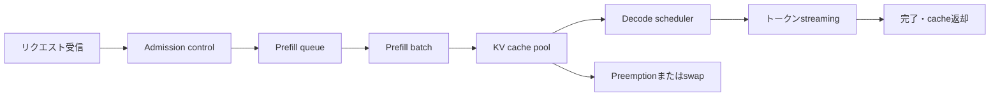



LLMサービングは、モデルファイルをGPUに載せてHTTP endpointを開くだけでは終わらない。
ユーザーが体感する遅延、同時実行性、出力品質、GPUメモリ、障害分離を併せて扱うqueueing systemである。

## 1. 問題：throughputだけではユーザー体験を説明できない

生成リクエストは、入力を一度に処理する段階と、トークンを繰り返し生成する段階に分かれる。

- prefill：入力トークンを並列に計算し、初期状態を作る。
- decode：以前のトークンとKV cacheを使用し、次のトークンを逐次生成する。

二つの段階では計算特性が異なる。

- 長いpromptはprefillの計算量と初期遅延を増やす。
- 長い出力はdecodeの反復回数とcache占有時間を増やす。
- 同時リクエストの増加はbatchingの機会を生むが、queue遅延も生む。
- 大きなbatchはthroughputを高めても、個別リクエストのtail latencyを悪化させることがある。

したがって、次の指標を分ける。

- TTFT：リクエストから最初のトークンまでの時間
- TPOT：最初のトークン以降のトークン当たり時間
- end-to-end latency：応答全体が完了するまでの時間
- tokens per second：システム全体のスループット
- goodput：SLO内で完了した有効スループット
- p95/p99：tail latency

## 2. Mental model：メモリを占有する二段階queue



リクエストは計算時間だけでなく、cache空間も消費する。
サーバーが処理できる同時実行数を、モデルパラメータのサイズだけで計算してはならない。

概算のGPUメモリ予算は、次のように考えられる。

$$
M_{\text{total}} \approx M_{\text{weights}}+M_{\text{KV}}+M_{\text{workspace}}+M_{\text{runtime}}
$$

KV cacheはlayer数、head次元、トークン数、同時sequence、dtypeに比例する。
正確な式はモデル構造と並列化方式によって異なるため、実際のprofileで検証する。

## 3. 要件をSLOとworkloadで定義する

まず、平均リクエストではなく分布を収集する。

- 入力トークンp50/p95/p99
- 出力トークンp50/p95/p99
- 同時リクエストとburstサイズ
- streamingの必要性
- timeoutとキャンセルの頻度
- モデル別traffic比率
- tool callまたはstructured outputの比率

SLOの例：

```yaml
service_level:
  availability: "정의된 기간의 성공 응답 비율"
  ttft_p95: "interactive 요구에 맞춘 한도"
  tpot_p95: "읽기 가능한 streaming 속도"
  correctness_gate: "고정 평가 세트 기준"
  overload_policy: "bounded queue 후 명시적 거절"
```

数値はworkloadとユーザー体験に基づいて決める。
ハードウェアが出せる最大値を、後付けでSLOとして取り繕ってはならない。

## 4. Schedulerとbatching

静的batchは同じサイズのリクエストが集まるまで待つため、オンラインtrafficには不利である。
continuous batchingは、完了したsequenceを取り除き、新しいリクエストを実行中のbatchに入れる。

ただし、batchingにはポリシーが必要である。

- 長いリクエストが短いリクエストを妨げないようにする。
- 待ち時間が長すぎるリクエストのpriorityを上げる。
- ユーザー等級ではなく、明示されたサービスclassを使用する。
- prefillによってdecodeが長時間飢餓状態にならないよう、予算を分ける。
- キャンセルされたリクエストのリソースを速やかに回収する。

admission controlがなければqueueは際限なく伸び、timeout済みのリクエストまで計算することになる。

望ましいoverload時の動作：

1. queueの長さ、または予想待ち時間を推定する。
2. SLOを守れないリクエストを早期に拒否する。
3. 再試行のヒントとbackoffを提供する。
4. すでにキャンセルされたリクエストのdecodeを中断する。
5. overloadイベントをモデル別に記録する。

## 5. KV cacheとprefixの再利用

KV cacheはdecodeの重複計算を減らすが、メモリ断片化を引き起こすことがある。
page単位の管理方式は、可変長sequenceによる空間の無駄を減らすアプローチである。

prefix cacheは、共通のsystem promptや反復するコンテキストのprefillを再利用する。
次の条件を点検する。

- tokenizerとモデルrevisionが同じか？
- prefix token sequenceが完全に同一か？
- 権限が異なるユーザーの機密コンテキストが共有されないか？
- cache keyにadapterとdecoding条件が反映されているか？
- 削除やポリシー変更時に無効化されるか？

cache hit ratioを高めることだけが目標ではない。
cache lookupコストとメモリ占有が節約効果を上回るworkloadもある。

## 6. 並列化の選択

一つのacceleratorにモデルが収まらない場合や、目標スループットに届かない場合は、並列化を検討する。

- tensor parallelism：行列演算を複数のデバイスに分割する。
- pipeline parallelism：layerの区間をデバイスごとのstageに分ける。
- data parallel serving：モデルreplicaを複数配置する。
- expert parallelism：mixture-of-expertsのexpertを分散する。

選択基準：

- モデルを単一デバイスにロードできるか？
- interconnectの帯域幅とtopologyはどうなっているか？
- trafficが一つのモデルに集中しているか？
- 長いsequenceと短いsequenceのどちらが多いか？
- 障害単位とデプロイ単位は何か？

通信コストが計算コストを上回ると、デバイスを増やしても遅くなることがある。
microbenchmarkと実際のworkload replayの両方を実行する。

## 7. 量子化はメモリ最適化であると同時に品質変更でもある

重みまたはactivationの精度を下げると、ロード時のメモリとbandwidth要件を減らせる。
しかし、次の点を個別に確認する。

- weight-onlyか、activationまで含むか
- calibration dataが必要か
- kernelが該当formatを効率よくサポートするか
- KV cacheのdtypeを変更するか
- 品質低下がtaskごとに異なるか

量子化の前後を、同じdecoding設定で評価する。

```text
baseline model
  -> task quality suite
  -> latency and memory profile
quantized candidate
  -> same quality suite
  -> same workload profile
  -> acceptance gates
```

モデルファイルが小さくなっても、実際のlatencyが必ず減るわけではない。
dequantization、最適化されていないkernel、小さなbatchでは利益が失われることがある。

## 8. 実践workflow：容量計画の実験

実験では、合成した単一の長さではなく実際の分布をreplayする。

```python
def workload_sample(rng, observed):
    return {
        "prompt_tokens": observed.prompt_lengths.sample(rng),
        "max_new_tokens": observed.output_lengths.sample(rng),
        "arrival_gap": observed.arrival_gaps.sample(rng),
        "stream": True,
    }
```

実験手順：

1. 単一リクエストでkernelと品質のbaselineを定める。
2. 同時実行数を段階的に増やす。
3. 各段階でTTFT、TPOT、goodput、memory peakを記録する。
4. queueが継続的に増加し始める地点を見つける。
5. キャンセル、timeout、burstを混ぜてoverload時の動作を確認する。
6. 一つのworkerを終了し、復旧と再分配を確認する。
7. 目標SLOに安全余裕を残してcapacityを決める。

benchmark clientのCPU、network、connection poolがボトルネックでないかも確認する。

## 9. 品質とAPIの正確性を検証する

サービングの変更は性能だけでなく、意味も変える可能性がある。

- tokenizer revision
- chat template
- BOS/EOSの処理
- stopping criteria
- sampling seedとalgorithm
- logit processor
- structured output constraint
- adapterの選択

回帰テストには次を含める。

- 固定promptのgreedy outputまたは許容パターン
- 長いcontextの境界ケース
- 停止tokenと最大長
- Unicodeと多言語入力
- streaming chunkの再組み立て
- clientからのキャンセル
- batch内のリクエスト間分離
- schema-constrained output

確率的samplingでは、文字列の完全一致ではなく、task metricと分布検査を使用する。

## 10. 可観測性と障害分離

リクエストログにprompt全体を残すのは危険である。
原則としてtoken count、model revision、sampling設定、timing、エラーcodeを記録する。

必須span：

- ingressと認証
- queue wait
- prefill
- decode
- detokenizationとstreaming
- 外部dependency

metricをモデル、revision、route、workload bucketに分けるが、label cardinalityは制限する。

障害対応：

- unhealthy workerをload balancerから外す。
- OOMを無制限に再試行しない。
- モデルごとにcircuit breakerを設ける。
- rolling update中に異なるtokenizerの組み合わせを防ぐ。
- load sheddingを明示的なstatusとして公開する。

## 11. 評価checklist

- [ ] TTFT、TPOT、全体の遅延を分けて測定しているか？
- [ ] 平均だけでなくp95とp99も確認しているか？
- [ ] 実際の入力・出力長の分布で負荷を再現しているか？
- [ ] weights、KV cache、workspaceのメモリを個別に予算化しているか？
- [ ] bounded queueとadmission controlがあるか？
- [ ] キャンセルされたリクエストの計算を中断しているか？
- [ ] prefix cacheが権限境界を越えていないか？
- [ ] 量子化の前後でtask品質を比較しているか？
- [ ] tokenizerとchat templateのrevisionを固定しているか？
- [ ] デプロイ中にrollback可能なmodel artifactがあるか？
- [ ] OOMとworker lossを注入して復旧を検証したか？
- [ ] 性能値にclientとnetworkのボトルネックが混在していないか？

## 12. よくある失敗と限界

### 最大tokens/sだけを見て設計する

batchを大きくして最大スループットを高めても、interactive TTFTが悪化する場合がある。
目標はpeak throughputではなく、SLOを満たすgoodputである。

### GPU使用率100%を良好な状態だと考える

queueが急増した飽和状態でも高い使用率を示す。
使用率は遅延、queue、完了率と併せて解釈する。

### すべてのリクエストを同じ優先順位にする

短い対話と長いbatch処理が同じqueueにあると、head-of-line blockingが大きくなる。
明確なservice classと公平性ポリシーを設ける。

### benchmarkを実サービスの性能だと誤解する

固定長、warm cache、エラーのないsynthetic trafficは運用環境を代表しない。
実際の分布、burst、cold start、failureを含める。

サービング最適化は、ハードウェア、driver、kernel、モデル構造に敏感である。
ある環境の最適設定を、別のデバイスにそのまま適用することはできない。

## 13. 公式参考資料

- [vLLM公式ドキュメント](https://docs.vllm.ai/)
- [vLLM PagedAttention論文](https://arxiv.org/abs/2309.06180)
- [NVIDIA TensorRT-LLM公式ドキュメント](https://nvidia.github.io/TensorRT-LLM/)
- [CUDA C++ Programming Guide](https://docs.nvidia.com/cuda/cuda-c-programming-guide/)
- [Hugging Face Text Generation Inference公式ドキュメント](https://huggingface.co/docs/text-generation-inference/)

## 14. まとめ

LLMサービングは、モデル推論を取り巻くメモリ・queue・schedulerの設計である。
workload分布と品質gateを固定し、TTFT、TPOT、goodputを併せて最適化してこそ、高速で予測可能なサービスを構築できる。
