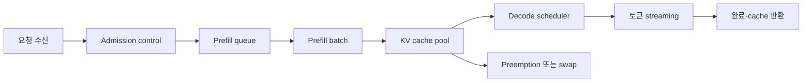



LLM 서빙은 모델 파일을 GPU에 올리고 HTTP endpoint를 여는 작업으로 끝나지 않는다.
사용자 체감 지연, 동시성, 출력 품질, GPU 메모리, 장애 격리를 함께 다루는 queueing system이다.

## 1. 문제: throughput 하나로는 사용자 경험을 설명할 수 없다

생성 요청은 입력을 한 번에 처리하는 단계와 토큰을 반복 생성하는 단계로 나뉜다.

- prefill: 입력 토큰을 병렬 계산해 초기 상태를 만든다.
- decode: 이전 토큰과 KV cache를 사용해 다음 토큰을 순차 생성한다.

두 단계의 계산 특성이 다르다.

- 긴 prompt는 prefill 계산량과 초기 지연을 키운다.
- 긴 출력은 decode 반복 횟수와 cache 점유 시간을 키운다.
- 동시 요청 증가는 batching 기회를 주지만 queue 지연도 만든다.
- 큰 batch는 throughput을 높여도 개별 요청의 tail latency를 악화할 수 있다.

따라서 다음 지표를 분리한다.

- TTFT: 요청부터 첫 토큰까지 시간
- TPOT: 첫 토큰 이후 토큰당 시간
- end-to-end latency: 전체 응답 완료 시간
- tokens per second: 시스템 전체 처리량
- goodput: SLO 안에서 완료된 유효 처리량
- p95/p99: tail latency

## 2. Mental model: 메모리를 점유하는 두 단계 queue



요청은 계산 시간뿐 아니라 cache 공간도 소비한다.
서버가 감당할 수 있는 동시성을 모델 파라미터 크기만으로 계산하면 안 된다.

대략적인 GPU 메모리 예산은 다음처럼 생각할 수 있다.

$$
M_{\text{total}} \approx M_{\text{weights}}+M_{\text{KV}}+M_{\text{workspace}}+M_{\text{runtime}}
$$

KV cache는 layer 수, head 차원, 토큰 수, 동시 sequence, dtype에 비례한다.
정확한 식은 모델 구조와 병렬화 방식에 따라 달라지므로 실제 profile로 검증한다.

## 3. 요구사항을 SLO와 workload로 정의한다

먼저 평균 요청이 아닌 분포를 수집한다.

- 입력 토큰 p50/p95/p99
- 출력 토큰 p50/p95/p99
- 동시 요청과 burst 크기
- streaming 필요 여부
- timeout과 취소 빈도
- 모델별 traffic 비중
- tool call 또는 structured output 비율

SLO 예:

```yaml
service_level:
  availability: "정의된 기간의 성공 응답 비율"
  ttft_p95: "interactive 요구에 맞춘 한도"
  tpot_p95: "읽기 가능한 streaming 속도"
  correctness_gate: "고정 평가 세트 기준"
  overload_policy: "bounded queue 후 명시적 거절"
```

숫자는 workload와 사용자 경험에서 결정한다.
하드웨어가 낼 수 있는 최대값을 SLO로 거꾸로 포장하지 않는다.

## 4. Scheduler와 batching

정적 batch는 같은 크기의 요청이 모일 때까지 기다리므로 온라인 traffic에 불리하다.
continuous batching은 완료된 sequence를 빼고 새 요청을 실행 중 batch에 넣는다.

하지만 batching에는 정책이 필요하다.

- 긴 요청이 짧은 요청을 가로막지 않게 한다.
- 너무 오래 기다린 요청의 priority를 높인다.
- 사용자 등급보다 명시된 서비스 class를 사용한다.
- prefill이 decode를 장시간 굶기지 않게 예산을 나눈다.
- 취소된 요청의 자원을 빠르게 회수한다.

admission control이 없으면 queue가 무한히 늘고 timeout 요청까지 계산하게 된다.

좋은 overload 동작:

1. queue 길이 또는 예상 대기 시간을 추정한다.
2. SLO를 지킬 수 없는 요청을 조기에 거절한다.
3. 재시도 힌트와 backoff를 제공한다.
4. 이미 취소된 요청의 decode를 중단한다.
5. overload 이벤트를 모델별로 기록한다.

## 5. KV cache와 prefix 재사용

KV cache는 decode의 중복 계산을 줄이지만 메모리 단편화를 일으킬 수 있다.
page 단위 관리 방식은 가변 길이 sequence의 공간 낭비를 줄이는 접근이다.

prefix cache는 공통 system prompt나 반복 문맥의 prefill을 재사용한다.
다음 조건을 점검한다.

- tokenizer와 모델 revision이 같은가?
- prefix token sequence가 정확히 같은가?
- 권한이 다른 사용자의 민감 문맥이 공유되지 않는가?
- cache key에 adapter와 decoding 조건이 반영되는가?
- 삭제와 정책 변경 시 무효화되는가?

cache hit ratio만 높이는 것은 목표가 아니다.
cache lookup 비용과 메모리 점유가 절감 효과보다 큰 workload도 있다.

## 6. 병렬화 선택

하나의 accelerator에 모델이 들어가지 않거나 목표 처리량이 부족하면 병렬화를 검토한다.

- tensor parallelism: 행렬 연산을 여러 장치에 분할한다.
- pipeline parallelism: layer 구간을 장치별 stage로 나눈다.
- data parallel serving: 모델 replica를 여러 개 둔다.
- expert parallelism: mixture-of-experts의 expert를 분산한다.

선택 기준:

- 모델이 단일 장치에 적재되는가?
- interconnect 대역폭과 topology는 어떤가?
- traffic이 한 모델에 집중되는가?
- 긴 sequence와 짧은 sequence 중 무엇이 많은가?
- 장애 단위와 배포 단위는 무엇인가?

통신이 계산보다 커지면 장치를 늘리고도 느려질 수 있다.
microbenchmark와 실제 workload replay를 모두 수행한다.

## 7. 양자화는 메모리 최적화이자 품질 변경이다

가중치 또는 activation의 정밀도를 줄이면 적재 메모리와 bandwidth 요구를 줄일 수 있다.
그러나 다음을 별도로 본다.

- weight-only인지 activation까지 포함하는지
- calibration data가 필요한지
- kernel이 해당 format을 효율적으로 지원하는지
- KV cache dtype을 바꾸는지
- 품질 저하가 task별로 다른지

양자화 전후에 같은 decoding 설정으로 평가한다.

```text
baseline model
  -> task quality suite
  -> latency and memory profile
quantized candidate
  -> same quality suite
  -> same workload profile
  -> acceptance gates
```

모델 파일이 작아졌다고 실제 latency가 반드시 줄지는 않는다.
dequantization, 비최적 kernel, 작은 batch에서는 이득이 사라질 수 있다.

## 8. 실전 workflow: 용량 계획 실험

실험은 합성된 단일 길이보다 실제 분포를 replay한다.

```python
def workload_sample(rng, observed):
    return {
        "prompt_tokens": observed.prompt_lengths.sample(rng),
        "max_new_tokens": observed.output_lengths.sample(rng),
        "arrival_gap": observed.arrival_gaps.sample(rng),
        "stream": True,
    }
```

실험 순서:

1. 단일 요청으로 kernel과 품질 baseline을 잡는다.
2. 동시성을 단계적으로 높인다.
3. 각 단계에서 TTFT, TPOT, goodput, memory peak를 기록한다.
4. queue가 지속 증가하는 지점을 찾는다.
5. 취소, timeout, burst를 섞어 overload 동작을 본다.
6. 한 worker를 종료해 복구와 재분배를 확인한다.
7. 목표 SLO의 안전 여유를 남겨 capacity를 정한다.

benchmark client의 CPU, network, connection pool이 병목이 아닌지도 확인한다.

## 9. 품질과 API 정확성 검증

서빙 변경은 성능뿐 아니라 의미를 바꿀 수 있다.

- tokenizer revision
- chat template
- BOS/EOS 처리
- stopping criteria
- sampling seed와 algorithm
- logit processor
- structured output constraint
- adapter 선택

회귀 테스트에는 다음을 포함한다.

- 고정 prompt의 greedy output 또는 허용 패턴
- 긴 context 경계 사례
- 중단 token과 최대 길이
- Unicode와 다국어 입력
- streaming chunk 재조립
- client 취소
- batch 안 요청 간 격리
- schema-constrained output

확률적 sampling은 완전 문자열 일치 대신 task metric과 분포 검사를 사용한다.

## 10. 관측성과 장애 격리

요청 로그에 전체 prompt를 남기는 것은 위험하다.
기본적으로 token count, model revision, sampling 설정, timing, 오류 code를 기록한다.

필수 span:

- ingress와 인증
- queue wait
- prefill
- decode
- detokenization과 streaming
- 외부 dependency

metric을 모델, revision, route, workload bucket으로 나누되 label cardinality를 제한한다.

장애 대응:

- unhealthy worker를 load balancer에서 제거한다.
- OOM을 무제한 재시도하지 않는다.
- 모델별 circuit breaker를 둔다.
- rolling update 중 서로 다른 tokenizer 조합을 막는다.
- load shedding을 명시적 status로 노출한다.

## 11. 평가 checklist

- [ ] TTFT, TPOT, 전체 지연을 분리해 측정하는가?
- [ ] 평균뿐 아니라 p95와 p99를 보는가?
- [ ] 실제 입력·출력 길이 분포로 부하를 재현하는가?
- [ ] weights, KV cache, workspace 메모리를 따로 예산화하는가?
- [ ] bounded queue와 admission control이 있는가?
- [ ] 취소된 요청의 계산을 중단하는가?
- [ ] prefix cache가 권한 경계를 넘지 않는가?
- [ ] 양자화 전후 task 품질을 비교하는가?
- [ ] tokenizer와 chat template revision을 고정하는가?
- [ ] 배포 중 rollback 가능한 model artifact가 있는가?
- [ ] OOM과 worker loss를 주입해 복구를 검증했는가?
- [ ] 성능 수치에 client와 network 병목이 섞이지 않았는가?

## 12. 흔한 실패와 한계

### 최대 tokens/s만 보고 설계한다

batch를 키워 최대 처리량을 높여도 interactive TTFT가 악화될 수 있다.
목표는 peak throughput이 아니라 SLO를 만족하는 goodput이다.

### GPU 사용률 100%를 좋은 상태로 본다

queue가 폭증한 포화 상태도 높은 사용률을 보인다.
사용률은 지연, queue, 완료율과 함께 해석한다.

### 모든 요청에 같은 우선순위를 둔다

짧은 대화와 긴 batch 작업이 같은 queue에 있으면 head-of-line blocking이 커진다.
명확한 service class와 공정성 정책을 둔다.

### benchmark를 실서비스 성능으로 오해한다

고정 길이, warm cache, 오류 없는 synthetic traffic은 운영을 대표하지 않는다.
실제 분포, burst, cold start, failure를 포함한다.

서빙 최적화는 하드웨어, driver, kernel, 모델 구조에 민감하다.
한 환경의 최적 설정을 다른 장치에 그대로 적용할 수 없다.

## 13. 공식 참고자료

- [vLLM 공식 문서](https://docs.vllm.ai/)
- [vLLM PagedAttention 논문](https://arxiv.org/abs/2309.06180)
- [NVIDIA TensorRT-LLM 공식 문서](https://nvidia.github.io/TensorRT-LLM/)
- [CUDA C++ Programming Guide](https://docs.nvidia.com/cuda/cuda-c-programming-guide/)
- [Hugging Face Text Generation Inference 공식 문서](https://huggingface.co/docs/text-generation-inference/)

## 14. 마무리

LLM 서빙은 모델 추론을 둘러싼 메모리·queue·scheduler 설계다.
workload 분포와 품질 gate를 고정하고 TTFT, TPOT, goodput을 함께 최적화해야 빠르면서도 예측 가능한 서비스를 만들 수 있다.
