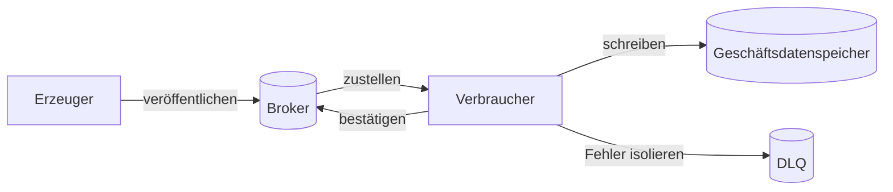



## Das Problem: Eine Warteschlange verringert Kopplung nicht automatisch

Ein Nachrichtenbroker kann die zeitliche Kopplung zwischen Erzeugern und Verbrauchern verringern und Lastspitzen abfedern.

Er führt jedoch neue Probleme ein.

- Nachrichten werden dupliziert.
- Die Verarbeitungsreihenfolge ändert sich.
- Schadhafte Nachrichten werden unbegrenzt erneut versucht.
- Ein langsamer Verbraucher lässt den Rückstand unbeschränkt wachsen.
- Schemaänderungen beschädigen alte Verbraucher.
- Erfolgreiches Veröffentlichen und Datenbank-Commit weichen voneinander ab.
- Die DLQ wird zu dauerhaftem Speicher, den niemand untersucht.

Die entscheidende Frage lautet nicht `welchen Broker sollen wir verwenden`.

Sie lautet, `ob Geschäftsereignisse ihre Invarianten trotz Duplikaten, Verzögerungen, Umordnung und vermutetem Verlust bewahren`.

## Denkmodell: Broker-Garantien von Geschäftsgarantien trennen



### Höchstens einmal

Dieses Modell priorisiert die Vermeidung von Duplikaten gegenüber erneuter Zustellung.

Wird eine Nachricht vor der Verarbeitung bestätigt oder nach einem Fehler nicht erneut gesendet, kann sie verschwinden.

Es kann in begrenzten Fällen wie Telemetrie geeignet sein, wenn Verlust akzeptabel ist.

### Mindestens einmal

Um das Verlustrisiko zu verringern, wird eine Nachricht erneut zugestellt, wenn sie vor der Bestätigung fehlschlägt.

Der Verbraucher kann dieselbe Nachricht mehrfach sehen.

Die meisten Geschäftspipelines kombinieren dieses Modell mit einem idempotenten Verbraucher.

### Der Geltungsbereich von „genau einmal“

Manche Broker bieten Genau-einmal-Funktionen für bestimmte Transaktionen und internen Zustand.

Diese Garantien erstrecken sich nicht automatisch auf Seiteneffekte in einer externen REST-API, einer E-Mail oder einer anderen Datenbank.

Anhand der offiziellen Dokumentation ist zu bestätigen, wo die Garantie beginnt und endet.

### Die Bestätigung ist die Grenze des Geschäftsabschlusses

Der Zeitpunkt der Bestätigung ist entscheidend.

- Bestätigung vor Verarbeitung: reduziert Duplikate, kann aber bei einem Verarbeitungsfehler eine Nachricht verlieren.
- Bestätigung nach Verarbeitung: erlaubt erneute Verarbeitung, kann jedoch Duplikate erzeugen.
- Transaktion und Bestätigung koppeln: unterstützten Geltungsbereich und Grenze externer Seiteneffekte prüfen.

## Reihenfolge: Die benötigte Ordnung definieren statt globale Ordnung zu fordern

Globale Ordnung verursacht hohe Kosten für Skalierbarkeit und Verfügbarkeit.

Für die meisten Geschäftsfälle genügt eine Ordnung innerhalb jedes Aggregats.

Wird etwa die Bestell-ID als Partitionsschlüssel verwendet, lassen sich Ereignisse derselben Bestellung an dieselbe Partition leiten.

Dennoch kann die Reihenfolge in folgenden Fällen brechen.

- Ein Erzeuger veröffentlicht parallel.
- Nur eine fehlgeschlagene Nachricht wandert in eine separate Wiederholungswarteschlange.
- Die Verbraucherkonkurrenz ignoriert Aggregatgrenzen.
- Eine Änderung der Partitionszahl verändert die Schlüsselabbildung.
- Unterschiedliche Verarbeitungszeiten ändern die Abschlussreihenfolge.

Daher gehören eine Aggregat-ID und eine monoton steigende Version in die Nachricht; der Verbraucher muss Umkehrungen erkennen.

## Ablauf: Eine sichere Ereignispipeline entwerfen

### Schritt 1. Befehle, Ereignisse und Dokumente unterscheiden

- Ein Befehl fordert einen bestimmten Empfänger zu einer Handlung auf.
- Ein Ereignis gibt eine bereits eingetretene Tatsache bekannt.
- Eine Dokumentnachricht transportiert den für die Verarbeitung benötigten Datenschnappschuss.

Ein Ereignisname sollte eine abgeschlossene Tatsache wie `OrderCreated` statt `CreateOrder` ausdrücken.

Ein separates öffentliches Schema verhindert, dass Verbraucher an die interne Tabellenstruktur des Erzeugers gekoppelt werden.

### Schritt 2. Den Nachrichtenumschlag standardisieren

Das folgende Beispiel zeigt die Mindestfelder.

```json
{
  "message_id": "unique-id",
  "event_type": "example.entity.updated",
  "schema_version": 2,
  "occurred_at": "2026-01-01T00:00:00Z",
  "producer": "example-service",
  "aggregate_id": "entity-id",
  "aggregate_version": 17,
  "correlation_id": "traceable-id",
  "payload": {}
}
```

Die Reihenfolge darf nicht allein aus `occurred_at` bestimmt werden.

`message_id` identifiziert eine Zustellinstanz und `aggregate_version` die Reihenfolge des Geschäftszustands.

### Schritt 3. Konsistenz beim Veröffentlichen herstellen

Stirbt ein Prozess nach dem Commit der Geschäftsdatenbank, aber vor dem Veröffentlichen, fehlt das Ereignis.

Scheitert der Commit nach dem Veröffentlichen, sehen Verbraucher ein Ereignis für eine nicht vorhandene Änderung.

Eine transaktionale Outbox schreibt Geschäfts- und Outbox-Zeile in derselben lokalen Transaktion.

Ein separates Relay sendet den Outbox-Inhalt an den Broker.

Idempotenz beim Verbraucher fängt doppelte Veröffentlichungen des Relays ab.

### Schritt 4. Den Verbraucher idempotent gestalten

Die einfachste Methode speichert eine verarbeitete Nachrichten-ID in derselben Transaktion wie die Geschäftsänderung.

```sql
BEGIN;
INSERT INTO processed_messages(consumer, message_id)
VALUES (:consumer, :message_id)
ON CONFLICT DO NOTHING;

-- 삽입 성공했을 때만 업무 상태를 조건부 갱신
COMMIT;
```

Die Aufbewahrungsdauer der Duplikatdatensätze muss die maximale erneute Zustellungs- und Wiedergabedauer des Brokers abdecken.

Zusätzliche bedingte Aktualisierungen anhand der Aggregatversion können Umkehrungen verhindern.

### Schritt 5. Eine Taxonomie für Wiederholungen erstellen

Fehler sind in mindestens drei Kategorien zu unterteilen.

- **Vorübergehend**: kurze Netzwerkfehler; mit begrenztem Backoff erneut versuchen
- **Ratenbegrenzt/überlastet**: längerer Backoff und geringere Parallelität
- **Dauerhaft/schadhaft**: Schemafehler oder Verletzungen von Geschäftsregeln; sofort isolieren

Nicht jede Ausnahme darf mit derselben Rate wiederholt werden.

Gesamtdauer und Geschäftsfrist können wichtiger als die Anzahl der Versuche sein.

### Schritt 6. Die DLQ als Wiederherstellungsablauf gestalten

Neben der ursprünglichen Nutzlast sind folgende Informationen in einer DLQ-Nachricht zu bewahren.

- Ursprüngliche Warteschlange oder ursprüngliches Thema
- Zeitpunkte des ersten und letzten Fehlers
- Anzahl der Versuche
- Fehlerklasse und sicher bereinigte Fehlerinformationen
- Verbraucherversion
- Korrelations-ID
- Freigabe und Ergebnis der Rückführung

Sensible Werte dürfen nicht direkt in Fehlermeldungen stehen.

Alarme müssen DLQ-Größe, Alter der ältesten Nachricht und Eingangsrate abdecken.

Bei der Wiedergabe nach einer Korrektur gelten dieselben Idempotenzregeln.

### Schritt 7. Rückstau quantifizieren

Nach dem Littleschen Gesetz hängt der mittlere Rückstand mit Ankunftsrate und Verweildauer zusammen.

Die Produktionsüberwachung muss mindestens Folgendes abdecken.

- Veröffentlichungsrate
- Erfolgsrate des Verbrauchs
- Wiederholungsrate
- Warteschlangentiefe
- Alter der ältesten Nachricht
- Perzentile der Verarbeitungslatenz
- Verbraucherkonkurrenz
- Sättigung nachgelagerter Systeme

Die Tiefe allein hat bei verschiedenen Verkehrsvolumina unterschiedliche Bedeutung.

Das Alter der ältesten Nachricht steht direkter mit nutzersichtbarer Verzögerung in Verbindung.

### Schritt 8. Eine Überlastrichtlinie definieren

Unbegrenztes Skalieren der Verbraucher kann zuerst die Datenbank zum Absturz bringen.

Die Parallelität ist anhand der sicheren Kapazität nachgelagerter Systeme zu begrenzen.

Bei einer Prioritätswarteschlange muss das Verhungern niedrig priorisierter Arbeit beurteilt werden.

Lässt sich die Produktionsrate steuern, ist der Erzeuger zu drosseln.

Abgelaufene Arbeit sollte möglicherweise verworfen statt verarbeitet werden.

### Schritt 9. Schemaentwicklung validieren

Kompatible additive Änderungen sind zu bevorzugen.

Statt die Bedeutung eines Feldes zu ändern, wird ein neues Feld oder ein neuer Ereignistyp ergänzt.

Verbraucher sollten unbekannte Felder ignorieren können.

Vor dem Hinzufügen eines Pflichtfelds muss bestätigt sein, dass alle Verbraucher migriert wurden.

Auch mit einem Schema-Register erfordert semantische Kompatibilität Tests.

## Praktisches Beispiel: Massenarbeit verarbeiten

Der Erzeuger nimmt eine Arbeitsanforderung an und schreibt eine Geschäftszeile sowie einen Outbox-Eintrag.

Das Relay veröffentlicht ein Ereignis `job.accepted`.

Partitionsschlüssel ist die Job-ID.

Der Verbraucher verarbeitet in folgender Reihenfolge.

1. Nachrichtenumschlag parsen und Schema validieren.
2. Prüfen, ob die Frist verstrichen ist.
3. Bedingt einen Datensatz für die verarbeitete Nachricht erzeugen.
4. Jobzustand bedingt von `accepted -> running` ändern.
5. Einen separaten Idempotenzschlüssel an externe Arbeit übergeben.
6. Ergebnisartefakt unter einem unveränderlichen Schlüssel speichern.
7. Zustand von `running -> succeeded` ändern.
8. Abschlussereignis in die Outbox schreiben.
9. Brokernachricht nach dem Commit der lokalen Transaktion bestätigen.

Selbst wenn der Prozess nach Schritt 7 und vor Schritt 9 stirbt, wird die Nachricht erneut zugestellt.

Der zweite Versuch erkennt Nachrichten-ID und Zustandsversion und verwendet das fertige Ergebnis wieder.

## Erneute Verarbeitung und Wiedergabe

Wiedergabe bedeutet nicht, eine DLQ-Nachricht einfach in die ursprüngliche Warteschlange zu kopieren.

Zuerst ist Folgendes zu entscheiden.

- Kann die aktuelle Verbraucherversion sie verarbeiten?
- Kann das alte Schema gelesen werden?
- Kann ein altes Ereignis auf den aktuellen Zustand angewendet werden?
- Sollen externe Seiteneffekte erneut ausgeführt werden?
- Überlastet die Wiedergaberate nachgelagerte Systeme?
- Wie werden Ergebnisse auditiert und der Prozess gestoppt?

Zunächst kann ein Trockenlauf mit einem Schattenverbraucher oder einem isolierten Ziel erfolgen.

Wiedergabe-Batchgröße und Ratenbegrenzung sind festzulegen.

## Validierungscheckliste

### Verträge

- [ ] Die Bedeutungen von Befehlen und Ereignissen sind unterschieden.
- [ ] Nachrichten-ID, Typ und Schemaversion sind vorhanden.
- [ ] Die Wahl des Partitionsschlüssels ist begründet.
- [ ] Der Geltungsbereich der Ordnungsgarantie ist auf Aggregatebene ausdrücklich angegeben.
- [ ] Es gibt Richtlinien für maximale Nachrichtengröße und Referenzen auf externe Nutzlasten.

### Zustellung und Verarbeitung

- [ ] Der Bestätigungspunkt fällt mit dem Geschäfts-Commit zusammen.
- [ ] Der Verbraucher ist bei Duplikaten sicher.
- [ ] Versionierung erkennt Umkehrungen der Reihenfolge.
- [ ] Es gibt eine Taxonomie wiederholbarer Fehler.
- [ ] Wiederholungen besitzen Backoff, Jitter und eine Gesamtdauerbegrenzung.
- [ ] Eine schadhafte Nachricht blockiert den normalen Verkehr nicht.

### Betrieb

- [ ] Für das Alter der ältesten Nachricht existiert ein SLO.
- [ ] Es gibt eine auf nachgelagerter Kapazität beruhende Parallelitätsgrenze.
- [ ] Für die DLQ sind Verantwortliche und Reaktionszeit festgelegt.
- [ ] Trockenlauf und Freigabe gehen einer Rückführung voraus.
- [ ] Tests der Schemakompatibilität laufen in der CI.
- [ ] Broker-Kontingente und Aufbewahrung werden regelmäßig geprüft.
- [ ] Offset- und Duplikatsemantik wurden nach Notfallwiederherstellung getestet.

## Häufige Fehler und Einschränkungen

### Nur die Warteschlangentiefe als Autoskalierungsmetrik verwenden

Bei unterschiedlichen Verarbeitungszeiten hat dieselbe Tiefe verschiedene Bedeutungen.

Alter, Verarbeitungsrate und Sättigung nachgelagerter Systeme sind gemeinsam zu verwenden.

### Die Reihenfolge mit einer Wiederholungswarteschlange brechen

Während eine fehlgeschlagene Nachricht verzögert wird, können spätere Ereignisse desselben Aggregats zuerst verarbeitet werden.

Es ist eine der Maßnahmen Versionsvalidierung, Pause pro Schlüssel oder fachliche Kompensation zu entwerfen.

### Die DLQ nur als Sicherheitsnetz behandeln

Eine DLQ kann zu einem Ort werden, an dem sich Datenverlust unsichtbar ansammelt.

Ohne Verantwortliche, Alarme, Triage und Wiedergabe ist sie keine Absicherung.

### Große Nutzlasten direkt in den Broker legen

Dies erhöht Übertragungs-, Wiederholungs- und Aufbewahrungskosten.

Große Nutzlasten bleiben als unveränderliche Objekte gespeichert; gesendet werden Referenzen mit Integritätsinformationen.

### Einen Nachrichtenbroker als Ersatz für Datenbanktransaktionen verwenden

Die Atomaritätsgrenze zwischen Broker und Geschäftsspeicher verschwindet nicht.

Outbox, Inbox, Saga oder kompensierende Transaktion müssen ausdrücklich gewählt werden.

## Offizielle Referenzen

- [Apache Kafka Design](https://kafka.apache.org/documentation/#design)
- [RabbitMQ-Bestätigungen von Verbrauchern und Erzeugern](https://www.rabbitmq.com/docs/confirms)
- [Amazon-SQS-Sichtbarkeitszeitüberschreitung](https://docs.aws.amazon.com/AWSSimpleQueueService/latest/SQSDeveloperGuide/sqs-visibility-timeout.html)
- [Genau-einmal-Zustellung von Google Cloud Pub/Sub](https://cloud.google.com/pubsub/docs/exactly-once-delivery)
- [CloudEvents-Spezifikation](https://github.com/cloudevents/spec)

## Fazit

Eine Nachrichtenwarteschlange beseitigt Fehler nicht; sie verändert, wo und wann sie auftreten.

Wichtiger als die Bezeichnung einer Zustellsemantik ist die durchgängige Verbindung von Bestätigungsgrenze, Idempotenz, Versionierung, Wiederholungstaxonomie und DLQ-Betrieb.

Eine asynchrone Architektur ist erst dann wirklich lose gekoppelt, wenn Duplikate und Verzögerungen als normale Eingaben behandelt werden.
