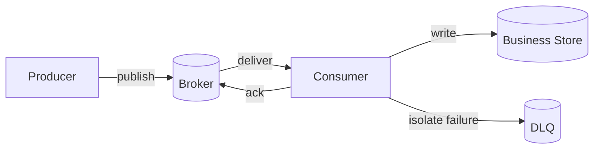



## The Problem: Adding a Queue Does Not Automatically Reduce Coupling

A message broker can reduce temporal coupling between producers and consumers and absorb bursts.

However, it introduces new problems to solve.

- Messages are duplicated.
- Processing order changes.
- Poison messages are retried indefinitely.
- A slow consumer causes the backlog to grow without bound.
- Schema changes break old consumers.
- A successful publish and a database commit diverge.
- The DLQ becomes permanent storage that nobody inspects.

The key question is not `which broker should we use`.

It is `whether business events preserve invariants despite duplicates, delays, reordering, and suspected loss`.

## Mental Model: Separate Broker Guarantees from Business Guarantees



### At-Most-Once

This prioritizes avoiding duplicates over redelivery.

If a message is acknowledged before processing or not resent after failure, it can disappear.

It may be suitable in limited cases such as telemetry where loss is acceptable.

### At-Least-Once

To reduce the risk of loss, a message that fails before acknowledgment is delivered again.

The consumer may see the same message several times.

Most business pipelines combine this model with an idempotent consumer.

### The Scope of “Exactly-Once”

Some brokers provide exactly-once features for particular transactions and internal state.

Those guarantees do not automatically extend to side effects in an external REST API, email, or another database.

Use the official documentation to confirm where the guarantee starts and ends.

### Acknowledgment Is the Boundary of Business Completion

The timing of acknowledgment is critical.

- Acknowledge before processing: reduces duplicates but can lose a message if processing fails.
- Acknowledge after processing: allows reprocessing but may cause duplicates.
- Couple transaction and acknowledgment: verify the supported scope and the boundary of external side effects.

## Ordering: Define the Ordering You Need Instead of Global Ordering

Global ordering carries high scalability and availability costs.

For most businesses, ordering within each aggregate is enough.

For example, using the order ID as the partition key can route events for the same order to the same partition.

However, order can still break in the following cases.

- A producer publishes in parallel.
- Only a failed message moves to a separate retry queue.
- Consumer concurrency ignores aggregate boundaries.
- Changing the partition count changes key mapping.
- Differences in processing time change completion order.

Therefore, put an aggregate ID and monotonic version in the message, and have the consumer detect reversals.

## Workflow: Designing a Safe Event Pipeline

### Step 1. Distinguish Commands, Events, and Documents

- A command asks a particular receiver to do something.
- An event announces a fact that has already occurred.
- A document message carries the data snapshot needed for processing.

An event name should express a completed fact, such as `OrderCreated` rather than `CreateOrder`.

Design a separate public schema so consumers do not become coupled to the producer's internal table structure.

### Step 2. Standardize the Message Envelope

The following is an example of the minimum fields.

```json
{
  "message_id": "unique-id",
  "event_type": "example.entity.updated",
  "schema_version": 2,
  "occurred_at": "2026-01-01T00:00:00Z",
  "producer": "example-service",
  "aggregate_id": "entity-id",
  "aggregate_version": 17,
  "correlation_id": "traceable-id",
  "payload": {}
}
```

Do not determine ordering solely from `occurred_at`.

Use `message_id` to identify a delivery instance and `aggregate_version` for business-state ordering.

### Step 3. Establish Publish Consistency

If a process dies after the business database commits but before publishing, the event is omitted.

If the commit fails after publishing, consumers see an event for a change that does not exist.

A transactional outbox writes both the business row and outbox row in the same local transaction.

A separate relay sends the outbox to the broker.

Consumer idempotency absorbs duplicate publishes from the relay.

### Step 4. Make the Consumer Idempotent

The simplest method is to record a processed message ID in the same transaction as the business change.

```sql
BEGIN;
INSERT INTO processed_messages(consumer, message_id)
VALUES (:consumer, :message_id)
ON CONFLICT DO NOTHING;

-- 삽입 성공했을 때만 업무 상태를 조건부 갱신
COMMIT;
```

The retention period for duplicate records must include the broker's maximum redelivery and replay periods.

Using conditional updates on the aggregate version as well can prevent order reversals.

### Step 5. Create a Retry Taxonomy

Divide failures into at least three categories.

- **Transient**: brief network errors; retry with limited backoff
- **Rate limited/overload**: longer backoff and reduced concurrency
- **Permanent/poison**: schema errors or business-rule violations; isolate immediately

Do not retry every exception at the same rate.

Total elapsed time and the business deadline may matter more than the number of retries.

### Step 6. Design the DLQ as a Recovery Workflow

Preserve the following information in a DLQ message in addition to the original payload.

- Original queue or topic
- Times of the first and most recent failures
- Number of attempts
- Failure class and safely sanitized error information
- Consumer version
- Correlation ID
- Redrive approval and result

Do not put sensitive values directly into error messages.

Alert on DLQ size, oldest age, and arrival rate.

Apply the same idempotency rules when replaying after a fix.

### Step 7. Quantify Backpressure

From the perspective of Little's Law, average backlog is related to arrival rate and residence time.

At a minimum, production monitoring should cover the following.

- Publish rate
- Consume success rate
- Retry rate
- Queue depth
- Oldest message age
- Processing-latency percentiles
- Consumer concurrency
- Downstream saturation

Depth alone means different things at different traffic volumes.

Oldest age is more directly connected to user-visible delay.

### Step 8. Define an Overload Policy

Scaling consumers without limit can bring down the database first.

Limit concurrency according to safe downstream capacity.

When using a priority queue, assess starvation of low-priority work.

If the production rate can be controlled, throttle the producer.

Expired work may be better discarded than processed.

### Step 9. Validate Schema Evolution

Prefer compatible additive changes.

Add a new field or event type instead of changing a field's meaning.

Allow consumers to ignore fields they do not recognize.

Before adding a required field, confirm that every consumer has migrated.

Even with a schema registry, semantic compatibility requires testing.

## Practical Example: Processing Bulk Work

The producer accepts a work request and writes a business row and an outbox entry.

The relay publishes a `job.accepted` event.

The partition key is the job ID.

The consumer processes it in this order.

1. Parse the message envelope and validate the schema.
2. Check whether the deadline has passed.
3. Conditionally create a processed-message record.
4. Conditionally change the job state from `accepted -> running`.
5. Pass a separate idempotency key to external work.
6. Store the result artifact under an immutable key.
7. Change the state from `running -> succeeded`.
8. Write a completion event to the outbox.
9. Acknowledge the broker message after the local transaction commits.

Even if the process dies after step 7 and before step 9, the message is redelivered.

The second attempt observes the message ID and state version and reuses the completed result.

## Reprocessing and Replay

Replay is not simply copying a DLQ message back to the original queue.

Decide the following first.

- Can it be processed by the current consumer version?
- Can the old schema be read?
- Can an old event be applied to the current state?
- Should external side effects be performed again?
- Will the replay rate overwhelm downstream systems?
- How will the results be audited and the process stopped?

A dry run can be performed first with a shadow consumer or isolated target.

Set a replay batch size and rate limit.

## Validation Checklist

### Contracts

- [ ] The meanings of commands and events are distinguished.
- [ ] A message ID, type, and schema version exist.
- [ ] The choice of partition key has a rationale.
- [ ] The scope of ordering guarantees is explicitly stated at the aggregate level.
- [ ] A maximum message size and external-payload reference policy exist.

### Delivery and Processing

- [ ] The acknowledgment point coincides with the business commit.
- [ ] The consumer is safe under duplication.
- [ ] Versioning detects order reversals.
- [ ] A taxonomy of retryable errors exists.
- [ ] Retries have backoff, jitter, and a total-time limit.
- [ ] A poison message does not block normal traffic.

### Operations

- [ ] There is an SLO for oldest message age.
- [ ] There is a concurrency limit based on downstream capacity.
- [ ] The DLQ has a defined owner and response time.
- [ ] A dry run and approval process precede redrive.
- [ ] Schema-compatibility tests run in CI.
- [ ] Broker quotas and retention are reviewed periodically.
- [ ] Offset and duplication semantics have been tested after disaster recovery.

## Common Failures and Limitations

### Using Only Queue Depth as an Autoscaling Metric

When processing times differ, the same depth has a different meaning.

Use age, processing rate, and downstream saturation together.

### Breaking Order with a Retry Queue

While one failed message is delayed, later events for the same aggregate may be processed first.

Design one of version validation, a per-key pause, or business compensation.

### Treating the DLQ Only as a Safety Net

A DLQ can become a place where data loss accumulates invisibly.

Without an owner, alarms, triage, and replay, it is not a safeguard.

### Putting Large Payloads Directly into the Broker

This increases transmission cost, retry cost, and retention burden.

Keep large payloads as immutable objects and send references that include integrity information.

### Using a Message Broker as a Substitute for Database Transactions

The atomicity boundary between the broker and business store does not disappear.

You must explicitly choose an outbox, inbox, saga, or compensating transaction.

## Official References

- [Apache Kafka Design](https://kafka.apache.org/documentation/#design)
- [RabbitMQ Consumer Acknowledgements and Publisher Confirms](https://www.rabbitmq.com/docs/confirms)
- [Amazon SQS Visibility Timeout](https://docs.aws.amazon.com/AWSSimpleQueueService/latest/SQSDeveloperGuide/sqs-visibility-timeout.html)
- [Google Cloud Pub/Sub Exactly-once Delivery](https://cloud.google.com/pubsub/docs/exactly-once-delivery)
- [CloudEvents Specification](https://github.com/cloudevents/spec)

## Conclusion

A message queue does not eliminate failures; it changes where and when failures appear.

More important than the name of a delivery semantic is connecting the acknowledgment boundary, idempotency, versioning, retry taxonomy, and DLQ operations end to end.

An asynchronous architecture becomes truly loosely coupled when duplicates and delays are treated as normal inputs.
