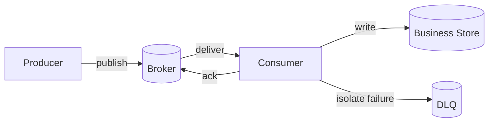



## El problema: agregar una cola no reduce automáticamente el acoplamiento

Un intermediario de mensajes puede reducir el acoplamiento temporal entre productores y consumidores y absorber ráfagas.

Sin embargo, introduce nuevos problemas que resolver.

- Los mensajes están duplicados.
- Tramitación de cambios de orden.
- Los mensajes envenenados se reintentan indefinidamente.
- Un consumidor lento hace que la cartera de pedidos crezca sin límites.
- Los cambios de esquema rompen con los viejos consumidores.
- Una publicación exitosa y una confirmación de la base de datos divergen.
- El DLQ se convierte en almacenamiento permanente que nadie inspecciona.

La pregunta clave no es `which broker should we use`.

Es `whether business events preserve invariants despite duplicates, delays, reordering, and suspected loss`.

## Modelo mental: Separar las garantías de los corredores de las garantías comerciales



### Como máximo una vez

Esto prioriza evitar duplicados sobre la reenvío.

Si se reconoce un mensaje antes de procesarlo o no se reenvía después de una falla, puede desaparecer.

Puede resultar adecuado en casos limitados, como la telemetría, donde la pérdida es aceptable.

### Al menos una vez

Para reducir el riesgo de pérdida, un mensaje que falla antes del acuse de recibo se vuelve a entregar.

El consumidor puede ver el mismo mensaje varias veces.

La mayoría de los canales de negocios combinan este modelo con un consumidor idempotente.

### El alcance de "Exactamente una vez"

Algunos corredores ofrecen funciones exactamente una vez para transacciones y estados internos particulares.

Esas garantías no se extienden automáticamente a los efectos secundarios en una REST API externa, correo electrónico u otra base de datos.

Utilice la documentación oficial para confirmar dónde comienza y termina la garantía.

### El reconocimiento es el límite de la finalización del negocio

El momento del reconocimiento es fundamental.

- Confirmar antes del procesamiento: reduce los duplicados pero puede perder un mensaje si falla el procesamiento.
- Confirmar después del procesamiento: permite el reprocesamiento pero puede provocar duplicados.
- Transacción de pareja y reconocimiento: verifique el alcance admitido y el límite de los efectos secundarios externos.

## Pedidos: defina el pedido que necesita en lugar del pedido global

Los pedidos globales conllevan altos costos de escalabilidad y disponibilidad.

Para la mayoría de las empresas, realizar pedidos dentro de cada agregado es suficiente.

Por ejemplo, usar la orden ID como clave de partición puede enrutar eventos para la misma orden a la misma partición.

Sin embargo, el orden aún puede alterarse en los siguientes casos.

- Un productor publica en paralelo.
- Sólo un mensaje fallido pasa a una cola de reintento independiente.
- La concurrencia del consumidor ignora los límites agregados.
- Cambiar el recuento de particiones cambia la asignación de claves.
- Diferencias en el tiempo de procesamiento del orden de finalización del cambio.

Por lo tanto, coloque una ID agregada y una versión monótona en el mensaje, y haga que el consumidor detecte las reversiones.

## Flujo de trabajo: Diseño de una canalización de eventos segura

### Paso 1. Distinguir comandos, eventos y documentos

- Un comando le pide a un receptor en particular que haga algo.
- Un acontecimiento anuncia un hecho que ya ha ocurrido.
- Un mensaje de documento contiene la instantánea de los datos necesarios para su procesamiento.

El nombre de un evento debe expresar un hecho completo, como `OrderCreated` en lugar de `CreateOrder`.

Diseñe un esquema público separado para que los consumidores no se acoplen a la estructura de tabla interna del productor.

### Paso 2. Estandarizar el sobre del mensaje

El siguiente es un ejemplo de los campos mínimos.

```json
{
  "message_id": "unique-id",
  "event_type": "example.entity.updated",
  "schema_version": 2,
  "occurred_at": "2026-01-01T00:00:00Z",
  "producer": "example-service",
  "aggregate_id": "entity-id",
  "aggregate_version": 17,
  "correlation_id": "traceable-id",
  "payload": {}
}
```

No determine el pedido únicamente desde `occurred_at`.

Utilice `message_id` para identificar una instancia de entrega y `aggregate_version` para realizar pedidos de estado empresarial.

### Paso 3. Establecer coherencia en la publicación

Si un proceso finaliza después de que la base de datos empresarial se confirma pero antes de publicarse, el evento se omite.

Si la confirmación falla después de la publicación, los consumidores ven un evento para un cambio que no existe.

Una bandeja de salida transaccional escribe tanto la fila comercial como la fila de la bandeja de salida en la misma transacción local.

Un relé independiente envía la bandeja de salida al corredor.

La idempotencia del consumidor absorbe publicaciones duplicadas del relé.

### Paso 4. Hacer que el consumidor sea idempotente

El método más sencillo es registrar un mensaje procesado ID en la misma transacción que el cambio comercial.

```sql
BEGIN;
INSERT INTO processed_messages(consumer, message_id)
VALUES (:consumer, :message_id)
ON CONFLICT DO NOTHING;

-- 삽입 성공했을 때만 업무 상태를 조건부 갱신
COMMIT;
```

El período de retención de registros duplicados debe incluir los períodos máximos de reenvío y reproducción del corredor.

El uso de actualizaciones condicionales en la versión agregada también puede evitar reversiones de pedidos.

### Paso 5. Crear una taxonomía de reintento

Divida los fracasos en al menos tres categorías.

- **Transitorio**: errores breves de red; reintentar con retroceso limitado
- **Tasa limitada/sobrecarga**: retraso más largo y concurrencia reducida
- **Permanente/veneno**: errores de esquema o violaciones de reglas comerciales; aislar inmediatamente

No vuelva a intentar todas las excepciones al mismo ritmo.

El tiempo total transcurrido y la fecha límite comercial pueden importar más que el número de reintentos.

### Paso 6. Diseñe el DLQ como un flujo de trabajo de recuperación

Conserve la siguiente información en un mensaje DLQ además de la carga útil original.

- Cola o tema original
- Tiempos de los primeros y más recientes fallos.
- Número de intentos
- Clase de falla e información de error desinfectada de forma segura
- Versión para consumidores
- Correlación ID
- Redireccionar aprobación y resultado.

No incluya valores confidenciales directamente en los mensajes de error.

Alerta sobre DLQ tamaño, edad más avanzada y tasa de llegada.

Aplique las mismas reglas de idempotencia al reproducir después de una corrección.

### Paso 7. Cuantificar la contrapresión

Desde la perspectiva de la Ley de Little, el retraso promedio está relacionado con la tasa de llegada y el tiempo de residencia.

Como mínimo, el seguimiento de la producción debe cubrir lo siguiente.

- Tarifa de publicación
- Consumir tasa de éxito
- Tasa de reintento
- Profundidad de la cola
- Edad del mensaje más antiguo
- Percentiles de latencia de procesamiento
- Concurrencia del consumidor
- Saturación aguas abajo

La profundidad por sí sola significa cosas diferentes en diferentes volúmenes de tráfico.

La edad avanzada está más directamente relacionada con el retraso visible para el usuario.

### Paso 8. Definir una política de sobrecarga

Escalar a los consumidores sin límite puede hacer caer la base de datos primero.

Limite la concurrencia según la capacidad descendente segura.

Cuando utilice una cola prioritaria, evalúe la falta de trabajos de baja prioridad.

Si se puede controlar la tasa de producción, estrangule al productor.

Es mejor descartar el trabajo caducado que procesarlo.

### Paso 9. Validar la evolución del esquema

Prefiere cambios de aditivos compatibles.

Agregue un nuevo campo o tipo de evento en lugar de cambiar el significado de un campo.

Permita que los consumidores ignoren los campos que no reconocen.

Antes de agregar un campo obligatorio, confirme que todos los consumidores hayan migrado.

Incluso con un registro de esquemas, la compatibilidad semántica requiere pruebas.

## Ejemplo práctico: procesamiento de trabajo masivo

El productor acepta una solicitud de trabajo y escribe una fila comercial y una entrada en la bandeja de salida.

El relé publica un evento `job.accepted`.

La clave de partición es el trabajo ID.

El consumidor lo procesa en este orden.

1. Analice el sobre del mensaje y valide el esquema.
2. Compruebe si ha pasado el plazo.
3. Cree condicionalmente un registro de mensaje procesado.
4. Cambie condicionalmente el estado del trabajo de `accepted -> running`.
5. Pase una clave de idempotencia separada al trabajo externo.
6. Almacene el artefacto resultante bajo una clave inmutable.
7. Cambie el estado de `running -> succeeded`.
8. Escriba un evento de finalización en la bandeja de salida.
9. Confirme el mensaje del corredor después de que se confirme la transacción local.

Incluso si el proceso finaliza después del paso 7 y antes del paso 9, el mensaje se vuelve a enviar.

El segundo intento observa el mensaje ID y la versión del estado y reutiliza el resultado completo.

## Reprocesamiento y reproducción

La reproducción no consiste simplemente en copiar un mensaje DLQ a la cola original.

Decide lo siguiente primero.

- ¿Puede ser procesado por la versión actual para el consumidor?
- ¿Se puede leer el esquema antiguo?
- ¿Se puede aplicar un evento antiguo al estado actual?
- ¿Deberían realizarse nuevamente los efectos secundarios externos?
- ¿La tasa de repetición abrumará a los sistemas posteriores?
- ¿Cómo se auditarán los resultados y se detendrá el proceso?

Primero se puede realizar un ensayo con un consumidor oculto o un objetivo aislado.

Establezca un tamaño de lote de reproducción y un límite de velocidad.

## Lista de verificación de validación

### Contratos

- [ ] Se distinguen los significados de comandos y eventos.
- [ ] Existe un mensaje ID, tipo y versión del esquema.
- [] La elección de la clave de partición tiene un fundamento.
- [ ] El alcance de la ordenación de garantías se establece explícitamente a nivel agregado.
- [] Existe un tamaño máximo de mensaje y una política de referencia de carga útil externa.

### Entrega y procesamiento

- [ ] El punto de reconocimiento coincide con el compromiso empresarial.
- [ ] El consumidor está seguro ante la duplicación.
- [ ] El control de versiones detecta reversiones de órdenes.
- [ ] Existe una taxonomía de errores reintentables.
- [] Los reintentos tienen retroceso, fluctuación y un límite de tiempo total.
- [ ] Un mensaje dudoso no bloquea el tráfico normal.

### Operaciones

- [] Hay un SLO para la antigüedad del mensaje más antiguo.
- [ ] Existe un límite de simultaneidad basado en la capacidad descendente.
- [ ] El DLQ tiene un propietario y un tiempo de respuesta definidos.
- [ ] Un proceso de prueba y aprobación precede a la nueva conducción.
- [] Las pruebas de compatibilidad de esquemas se ejecutan en CI.
- [ ] Las cuotas y la retención de los corredores se revisan periódicamente.
- [] La semántica de compensación y duplicación se ha probado después de la recuperación ante desastres.

## Fallos y limitaciones comunes

### Usar solo la profundidad de la cola como métrica de escalado automático

Cuando los tiempos de procesamiento difieren, la misma profundidad tiene un significado diferente.

Utilice la edad, la velocidad de procesamiento y la saturación posterior juntas.

### Romper el orden con una cola de reintento

Si bien un mensaje fallido se retrasa, es posible que primero se procesen eventos posteriores para el mismo agregado.

Diseñe uno de validación de versión, una pausa por tecla o compensación comercial.

### Tratar a DLQ solo como una red de seguridad

Un DLQ puede convertirse en un lugar donde la pérdida de datos se acumula de forma invisible.

Sin propietario, alarmas, clasificación y repetición, no es una protección.

### Poner grandes cargas útiles directamente en el corredor

Esto aumenta el costo de transmisión, el costo de reintento y la carga de retención.

Mantenga cargas útiles grandes como objetos inmutables y envíe referencias que incluyan información de integridad.

### Uso de un intermediario de mensajes como sustituto de las transacciones de bases de datos

El límite de atomicidad entre el corredor y la tienda comercial no desaparece.

Debe elegir explícitamente una bandeja de salida, una bandeja de entrada, una saga o una transacción de compensación.

## Referencias oficiales

- [Diseño Apache Kafka](https://kafka.apache.org/documentation/#design)
- [Reconocimientos del consumidor de RabbitMQ y confirmaciones del editor](https://www.rabbitmq.com/docs/confirms)
- [Amazon SQS Tiempo de espera de visibilidad](https://docs.aws.amazon.com/AWSSimpleQueueService/latest/SQSDeveloperGuide/sqs-visibility-timeout.html)
- [Entrega de Google Cloud Pub/Sub exactamente una vez](https://cloud.google.com/pubsub/docs/exactly-once-delivery)
- [Especificación de CloudEvents](https://github.com/cloudevents/spec)

## Conclusión

Una cola de mensajes no elimina los errores; cambia dónde y cuándo aparecen las fallas.

Más importante que el nombre de una semántica de entrega es conectar el límite de reconocimiento, la idempotencia, el control de versiones, la taxonomía de reintento y las operaciones DLQ de un extremo a otro.

Una arquitectura asincrónica se vuelve verdaderamente débil cuando los duplicados y los retrasos se tratan como entradas normales.
