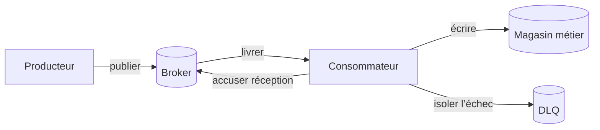



## Le problème : ajouter une file ne réduit pas automatiquement le couplage

Un broker de messages peut réduire le couplage temporel entre producteurs et consommateurs et absorber les pics de charge.

Cependant, il introduit de nouveaux problèmes à résoudre.

- Les messages sont dupliqués.
- L’ordre de traitement change.
- Les messages empoisonnés sont relancés indéfiniment.
- Un consommateur lent fait croître l’arriéré sans limite.
- Les changements de schéma cassent les anciens consommateurs.
- Une publication réussie et la validation d’une transaction de base de données divergent.
- La DLQ devient un stockage permanent que personne n’inspecte.

La question essentielle n’est pas `quel broker devons-nous utiliser`.

C’est `si les événements métier préservent les invariants malgré les doublons, les retards, les réordonnancements et les pertes présumées`.

## Modèle mental : séparer les garanties du broker des garanties métier



### Au plus une fois

Ce modèle donne la priorité à l’évitement des doublons plutôt qu’à une nouvelle livraison.

Si un message est acquitté avant son traitement ou n’est pas renvoyé après un échec, il peut disparaître.

Il peut convenir à des cas limités, comme la télémétrie où une perte est acceptable.

### Au moins une fois

Pour réduire le risque de perte, un message qui échoue avant l’accusé de réception est livré de nouveau.

Le consommateur peut voir le même message plusieurs fois.

La plupart des pipelines métier associent ce modèle à un consommateur idempotent.

### Portée de l’« exactement une fois »

Certains brokers proposent des fonctions d’exécution exactement une fois pour certaines transactions et certains états internes.

Ces garanties ne s’étendent pas automatiquement aux effets de bord dans une API REST externe, un courriel ou une autre base de données.

Consultez la documentation officielle pour confirmer où commence et où finit la garantie.

### L’accusé de réception est la frontière de l’achèvement métier

Le moment de l’accusé de réception est crucial.

- Accuser réception avant le traitement : réduit les doublons, mais peut perdre un message si le traitement échoue.
- Accuser réception après le traitement : autorise un nouveau traitement, mais peut provoquer des doublons.
- Coupler transaction et accusé de réception : vérifier la portée prise en charge et la frontière des effets de bord externes.

## Ordre : définir l’ordre nécessaire plutôt qu’un ordre global

Un ordre global entraîne des coûts élevés en matière de passage à l’échelle et de disponibilité.

Pour la plupart des activités, un ordre au sein de chaque agrégat suffit.

Par exemple, utiliser l’identifiant de commande comme clé de partition permet d’acheminer les événements d’une même commande vers la même partition.

Toutefois, l’ordre peut encore être rompu dans les cas suivants.

- Un producteur publie en parallèle.
- Seul un message en échec est déplacé vers une file de nouvelle tentative séparée.
- La concurrence des consommateurs ignore les frontières des agrégats.
- La modification du nombre de partitions change l’affectation des clés.
- Les différences de durée de traitement changent l’ordre d’achèvement.

Placez donc dans le message un identifiant d’agrégat et une version monotone, puis faites détecter les inversions par le consommateur.

## Workflow : concevoir un pipeline d’événements sûr

### Étape 1. Distinguer commandes, événements et documents

- Une commande demande à un destinataire précis d’effectuer une action.
- Un événement annonce un fait qui s’est déjà produit.
- Un message document transporte l’instantané de données nécessaire au traitement.

Le nom d’un événement doit exprimer un fait accompli, comme `OrderCreated` plutôt que `CreateOrder`.

Concevez un schéma public distinct afin que les consommateurs ne soient pas couplés à la structure des tables internes du producteur.

### Étape 2. Normaliser l’enveloppe du message

Voici un exemple de champs minimaux.

```json
{
  "message_id": "unique-id",
  "event_type": "example.entity.updated",
  "schema_version": 2,
  "occurred_at": "2026-01-01T00:00:00Z",
  "producer": "example-service",
  "aggregate_id": "entity-id",
  "aggregate_version": 17,
  "correlation_id": "traceable-id",
  "payload": {}
}
```

Ne déterminez pas l’ordre à partir du seul champ `occurred_at`.

Utilisez `message_id` pour identifier une instance de livraison et `aggregate_version` pour ordonner l’état métier.

### Étape 3. Établir la cohérence de publication

Si un processus s’arrête après la validation de la base de données métier mais avant la publication, l’événement est omis.

Si la validation échoue après la publication, les consommateurs voient un événement correspondant à une modification qui n’existe pas.

Une boîte d’envoi transactionnelle écrit la ligne métier et la ligne de la boîte d’envoi dans la même transaction locale.

Un relais distinct envoie le contenu de la boîte d’envoi au broker.

L’idempotence du consommateur absorbe les publications en double du relais.

### Étape 4. Rendre le consommateur idempotent

La méthode la plus simple consiste à enregistrer l’identifiant du message traité dans la même transaction que la modification métier.

```sql
BEGIN;
INSERT INTO processed_messages(consumer, message_id)
VALUES (:consumer, :message_id)
ON CONFLICT DO NOTHING;

-- 삽입 성공했을 때만 업무 상태를 조건부 갱신
COMMIT;
```

La durée de conservation des enregistrements de déduplication doit couvrir les durées maximales de nouvelle livraison et de relecture du broker.

L’utilisation conjointe de mises à jour conditionnelles sur la version de l’agrégat peut empêcher les inversions d’ordre.

### Étape 5. Créer une taxonomie des nouvelles tentatives

Répartissez les échecs en au moins trois catégories.

- **Transitoire** : brèves erreurs réseau ; relancer avec une temporisation limitée
- **Limitation de débit ou surcharge** : temporisation plus longue et concurrence réduite
- **Permanent ou empoisonné** : erreurs de schéma ou violations de règles métier ; isoler immédiatement

Ne relancez pas toutes les exceptions au même rythme.

La durée totale écoulée et l’échéance métier peuvent compter davantage que le nombre de tentatives.

### Étape 6. Concevoir la DLQ comme un workflow de récupération

Conservez les informations suivantes dans un message de DLQ en plus de la charge utile d’origine.

- File ou sujet d’origine
- Dates du premier échec et du plus récent
- Nombre de tentatives
- Classe d’échec et informations d’erreur nettoyées de manière sûre
- Version du consommateur
- Identifiant de corrélation
- Approbation et résultat de la réinjection

Ne placez pas directement de valeurs sensibles dans les messages d’erreur.

Déclenchez des alertes sur la taille de la DLQ, l’âge du message le plus ancien et le débit d’arrivée.

Appliquez les mêmes règles d’idempotence lors d’une relecture après correction.

### Étape 7. Quantifier la contre-pression

Du point de vue de la loi de Little, l’arriéré moyen est lié au débit d’arrivée et au temps de séjour.

Au minimum, la supervision en production doit couvrir les éléments suivants.

- Débit de publication
- Débit de consommation réussie
- Taux de nouvelles tentatives
- Profondeur de la file
- Âge du message le plus ancien
- Percentiles de latence de traitement
- Concurrence des consommateurs
- Saturation des systèmes en aval

La profondeur seule prend un sens différent selon le volume de trafic.

L’âge du message le plus ancien est plus directement lié au retard visible par l’utilisateur.

### Étape 8. Définir une politique de surcharge

Faire évoluer le nombre de consommateurs sans limite peut faire tomber la base de données en premier.

Limitez la concurrence selon la capacité sûre des systèmes en aval.

Lorsque vous utilisez une file prioritaire, évaluez le risque de famine des travaux peu prioritaires.

Si le débit de production peut être contrôlé, limitez le producteur.

Il peut être préférable d’abandonner un travail expiré plutôt que de le traiter.

### Étape 9. Valider l’évolution du schéma

Privilégiez les modifications additives compatibles.

Ajoutez un nouveau champ ou un nouveau type d’événement plutôt que de changer la signification d’un champ.

Autorisez les consommateurs à ignorer les champs qu’ils ne reconnaissent pas.

Avant d’ajouter un champ obligatoire, confirmez que chaque consommateur a migré.

Même avec un registre de schémas, la compatibilité sémantique exige des tests.

## Exemple pratique : traitement de travaux en masse

Le producteur accepte une demande de travail et écrit une ligne métier ainsi qu’une entrée dans la boîte d’envoi.

Le relais publie un événement `job.accepted`.

La clé de partition est l’identifiant de la tâche.

Le consommateur le traite dans l’ordre suivant.

1. Analyser l’enveloppe du message et valider le schéma.
2. Vérifier si l’échéance est dépassée.
3. Créer conditionnellement un enregistrement de message traité.
4. Faire passer conditionnellement l’état de la tâche de `accepted -> running`.
5. Transmettre une clé d’idempotence distincte au travail externe.
6. Stocker l’artefact de résultat sous une clé immuable.
7. Faire passer l’état de `running -> succeeded`.
8. Écrire un événement d’achèvement dans la boîte d’envoi.
9. Accuser réception du message du broker après la validation de la transaction locale.

Même si le processus s’arrête après l’étape 7 et avant l’étape 9, le message est livré de nouveau.

La deuxième tentative constate l’identifiant du message et la version de l’état, puis réutilise le résultat achevé.

## Nouveau traitement et relecture

Une relecture ne consiste pas simplement à recopier un message de DLQ dans la file d’origine.

Décidez d’abord des points suivants.

- Peut-il être traité par la version actuelle du consommateur ?
- L’ancien schéma peut-il être lu ?
- Un ancien événement peut-il être appliqué à l’état actuel ?
- Faut-il effectuer de nouveau les effets de bord externes ?
- Le débit de relecture va-t-il submerger les systèmes en aval ?
- Comment les résultats seront-ils audités et le processus arrêté ?

Une exécution à blanc peut d’abord être réalisée avec un consommateur fantôme ou une cible isolée.

Définissez une taille de lot et une limite de débit pour la relecture.

## Liste de contrôle de validation

### Contrats

- [ ] Les significations des commandes et des événements sont distinguées.
- [ ] Le message comporte un identifiant, un type et une version de schéma.
- [ ] Le choix de la clé de partition est justifié.
- [ ] La portée des garanties d’ordre est explicitement indiquée au niveau de l’agrégat.
- [ ] Il existe une taille maximale de message et une politique de référence aux charges utiles externes.

### Livraison et traitement

- [ ] Le point d’accusé de réception coïncide avec la validation métier.
- [ ] Le consommateur reste sûr en cas de doublon.
- [ ] Le versionnement détecte les inversions d’ordre.
- [ ] Il existe une taxonomie des erreurs relançables.
- [ ] Les nouvelles tentatives comportent une temporisation, un aléa et une limite de durée totale.
- [ ] Un message empoisonné ne bloque pas le trafic normal.

### Exploitation

- [ ] Il existe un SLO pour l’âge du message le plus ancien.
- [ ] La concurrence est limitée selon la capacité des systèmes en aval.
- [ ] La DLQ a un responsable et un délai de réponse définis.
- [ ] Une exécution à blanc et une procédure d’approbation précèdent la réinjection.
- [ ] Les tests de compatibilité des schémas s’exécutent dans la CI.
- [ ] Les quotas et la conservation du broker sont réexaminés périodiquement.
- [ ] La sémantique des offsets et des doublons a été testée après une reprise après sinistre.

## Échecs courants et limites

### Utiliser uniquement la profondeur de la file comme métrique d’auto-scaling

Lorsque les durées de traitement diffèrent, une même profondeur n’a pas la même signification.

Utilisez ensemble l’âge, le débit de traitement et la saturation en aval.

### Rompre l’ordre avec une file de nouvelle tentative

Pendant qu’un message en échec est retardé, des événements ultérieurs du même agrégat peuvent être traités en premier.

Concevez l’une des solutions suivantes : validation de version, pause par clé ou compensation métier.

### Considérer la DLQ uniquement comme un filet de sécurité

Une DLQ peut devenir un endroit où les pertes de données s’accumulent sans être visibles.

Sans responsable, alertes, triage et relecture, elle ne constitue pas une protection.

### Placer de grandes charges utiles directement dans le broker

Cela augmente le coût de transmission, le coût des nouvelles tentatives et la charge de conservation.

Conservez les grandes charges utiles sous forme d’objets immuables et envoyez des références accompagnées d’informations d’intégrité.

### Utiliser un broker de messages à la place de transactions de base de données

La frontière d’atomicité entre le broker et le magasin métier ne disparaît pas.

Vous devez choisir explicitement une boîte d’envoi, une boîte de réception, une saga ou une transaction compensatoire.

## Références officielles

- [Conception d’Apache Kafka](https://kafka.apache.org/documentation/#design)
- [Accusés de réception des consommateurs et confirmations des producteurs dans RabbitMQ](https://www.rabbitmq.com/docs/confirms)
- [Délai de visibilité d’Amazon SQS](https://docs.aws.amazon.com/AWSSimpleQueueService/latest/SQSDeveloperGuide/sqs-visibility-timeout.html)
- [Livraison exactement une fois dans Google Cloud Pub/Sub](https://cloud.google.com/pubsub/docs/exactly-once-delivery)
- [Spécification CloudEvents](https://github.com/cloudevents/spec)

## Conclusion

Une file de messages n’élimine pas les échecs ; elle modifie l’endroit et le moment où ils apparaissent.

Il est plus important que le nom d’une sémantique de livraison de relier de bout en bout la frontière d’accusé de réception, l’idempotence, le versionnement, la taxonomie des nouvelles tentatives et l’exploitation de la DLQ.

Une architecture asynchrone devient réellement faiblement couplée lorsque les doublons et les retards sont traités comme des entrées normales.
