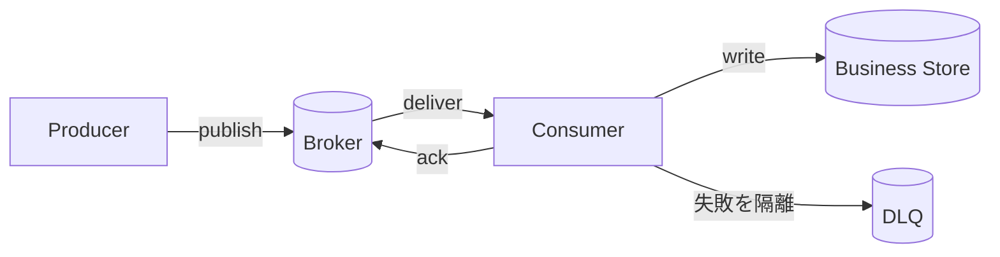



## 問題：キューを導入しても結合度が自動的に下がるわけではない

メッセージブローカーはproducerとconsumerの時間的結合を弱め、burstを吸収できる。

しかし、新たに解決すべき問題が生じる。

- messageが重複する。
- 処理順序が変わる。
- poison messageが繰り返し再試行される。
- consumerが遅くなり、backlogが際限なく増える。
- schema変更が古いconsumerを壊す。
- publishの成功とdatabase commitが分断される。
- DLQが永久保管庫になり、誰も確認しなくなる。

中心となる問いは`どのbrokerを使うか`ではない。

`業務eventが重複・遅延・逆転・消失の疑いがある状態でもinvariantを守れるか`である。

## Mental model：brokerの保証と業務上の保証を分ける



### at-most-once

再配信よりも重複防止を優先する。

処理前にackするか、失敗時に再送しなければmessageが消失する可能性がある。

損失を許容するtelemetryなどに限定して適する場合がある。

### at-least-once

損失リスクを減らすため、ack前に失敗したmessageを再配信する。

consumerは同じmessageを複数回見る可能性がある。

多くの業務pipelineでは、このモデルとidempotent consumerを組み合わせる。

### exactly-onceという表現の範囲

brokerによっては、特定のtransactionと内部stateに対してexactly-once機能を提供する。

その保証が外部REST API、email、別のdatabaseへの副作用にまで自動的に拡張されるわけではない。

保証の開始点と終了点を公式文書で確認する。

### ackは業務完了の境界である

ackのタイミングは非常に重要である。

- 処理前のack：重複は減るが、処理失敗時に失われる可能性がある。
- 処理後のack：重複の可能性はあるが、再処理できる。
- transactionとackの結合：サポート範囲と外部副作用の境界を確認する必要がある。

## 順序：全体順序ではなく必要な順序を定義する

グローバル順序はスケーラビリティと可用性のコストが大きい。

多くの業務ではaggregateごとの順序で十分である。

たとえば注文IDをpartition keyにすれば、同じ注文のeventを同じpartitionへ送れる。

ただし、次の場合には順序が崩れる可能性がある。

- producerが並列にpublishする。
- failed messageだけを別のretry queueへ移動する。
- consumer concurrencyがaggregate境界を無視する。
- partition数を変更し、key mappingが変わる。
- 処理時間の差によって完了順序が変わる。

したがってmessageにaggregate IDとmonotonic versionを入れ、consumerが逆転を検証する。

## Workflow：安全なevent pipelineを設計する

### Step 1. command、event、documentを区別する

- commandは特定のreceiverに処理を依頼する。
- eventはすでに起きた事実を通知する。
- document messageは処理に必要なdata snapshotを渡す。

event名は`CreateOrder`よりも`OrderCreated`のように完了した事実を表す。

consumerがproducerの内部table構造に結合しないよう、公開schemaを別途設計する。

### Step 2. message envelopeを標準化する

最小限のfield例は次のとおりである。

```json
{
  "message_id": "unique-id",
  "event_type": "example.entity.updated",
  "schema_version": 2,
  "occurred_at": "2026-01-01T00:00:00Z",
  "producer": "example-service",
  "aggregate_id": "entity-id",
  "aggregate_version": 17,
  "correlation_id": "traceable-id",
  "payload": {}
}
```

`occurred_at`だけで順序を決定しない。

`message_id`は配信instanceの識別に、`aggregate_version`は業務状態の順序に用いる。

### Step 3. publishの一貫性を定める

業務databaseのcommit後、publish前にprocessが停止するとeventが欠落する。

publish後にcommitが失敗すると、存在しない変更のeventが見える。

transactional outboxはlocal transaction内で業務rowとoutbox rowを同時に記録する。

別のrelayがoutboxをbrokerへ配信する。

relayによる重複publishはconsumer idempotencyで吸収する。

### Step 4. consumerをidempotentにする

最も単純な方法は、処理済みmessage IDを業務変更と同じtransactionに記録することである。

```sql
BEGIN;
INSERT INTO processed_messages(consumer, message_id)
VALUES (:consumer, :message_id)
ON CONFLICT DO NOTHING;

-- 삽입 성공했을 때만 업무 상태를 조건부 갱신
COMMIT;
```

重複記録の保持期間には、brokerの最大redelivery期間とreplay期間を含める必要がある。

aggregate versionによる条件付き更新も併用すれば、順序の逆転を防げる。

### Step 5. retry taxonomyを作る

失敗を少なくとも3種類に分ける。

- **transient**：短時間のnetwork障害、制限付きbackoff再試行
- **rate limited/overload**：より長いbackoff、concurrencyの縮小
- **permanent/poison**：schemaエラー、業務規則違反、即時隔離

すべてのexceptionを同じ速度で再試行しない。

再試行回数より総経過時間と業務deadlineの方が重要な場合もある。

### Step 6. DLQを復旧workflowとして設計する

DLQ messageには元のpayloadだけでなく、次の情報を保持する。

- 元のqueueまたはtopic
- 最初の失敗時刻と直近の失敗時刻
- 試行回数
- failure classと安全にサニタイズしたエラー情報
- consumer version
- correlation ID
- redriveの承認と結果

機密値をエラーmessageへそのまま入れない。

DLQのサイズ、oldest age、流入率にアラートを設定する。

修正後のreplayにも同じidempotency規則を適用する。

### Step 7. backpressureを数値化する

Little's Lawの観点では、平均backlogは到着率と滞在時間に関係する。

運用では少なくとも次を確認する。

- publish rate
- consume success rate
- retry rate
- queue depth
- oldest message age
- processing latency percentile
- consumer concurrency
- downstream saturation

depthだけではトラフィック規模によって意味が変わる。

oldest ageはユーザーの遅延により直接的に結び付く。

### Step 8. overloadポリシーを定める

consumerを無制限にスケールすると、databaseが先に破綻する可能性がある。

downstreamの安全容量を基準にconcurrencyを制限する。

priority queueを使う場合はlow priority starvationを検討する。

生成速度を制御できるならproducer throttlingを適用する。

期限切れの作業は、処理するより失効させる方が適切な場合がある。

### Step 9. schema evolutionを検証する

互換性のあるadditive changeを優先する。

fieldの意味を変えるより、新しいfieldや新しいevent typeを追加する。

consumerが未知のfieldを無視できるようにする。

required fieldを追加する前に、すべてのconsumerの移行を確認する。

schema registryがあっても、意味上の互換性にはtestが必要である。

## 実践例：大量ジョブの処理

producerはジョブ要求を受け、業務rowとoutboxを書き込む。

relayが`job.accepted` eventをpublishする。

partition keyはjob IDである。

consumerは次の順序で処理する。

1. message envelopeをparseし、schemaを検証する。
2. deadlineを過ぎていないか確認する。
3. processed message recordを条件付きで作成する。
4. job状態を`accepted -> running`へ条件付きで変更する。
5. 外部処理には別のidempotency keyを渡す。
6. 結果artifactをimmutable keyで保存する。
7. 状態を`running -> succeeded`へ変更する。
8. 完了eventをoutboxに記録する。
9. local transactionのcommit後にbrokerへackする。

processが手順7の後、手順9の前に停止しても再配信される。

2回目の試行ではmessage IDと状態versionを確認し、完了結果を再利用する。

## 再処理とreplay

replayは単にDLQ messageを元のqueueへコピーする作業ではない。

まず次を決定する。

- 現在のconsumer versionで処理してよいか？
- 過去のschemaを読めるか？
- 現在の状態に古いeventを適用してよいか？
- 外部副作用を再実行するか？
- replayの速度がdownstreamを圧倒しないか？
- 結果をどのように監査し、中止するか？

shadow consumerまたは隔離したtargetで先にdry runできる。

replayのbatchとrate limitを設定する。

## 検証Checklist

### 契約

- [ ] commandとeventの意味が区別されている。
- [ ] message ID、type、schema versionがある。
- [ ] partition keyの選定根拠がある。
- [ ] 順序保証の範囲がaggregate単位で明記されている。
- [ ] 最大messageサイズと外部payload参照ポリシーがある。

### 配信と処理

- [ ] ackのタイミングが業務commitと一致する。
- [ ] consumerが重複に対して安全である。
- [ ] 順序の逆転をversionで検出する。
- [ ] 再試行可能なエラーのtaxonomyがある。
- [ ] retryにbackoff、jitter、総時間の上限がある。
- [ ] poison messageが通常trafficを妨げない。

### 運用

- [ ] oldest message ageにSLOがある。
- [ ] downstream容量に基づくconcurrency limitがある。
- [ ] DLQの担当者と対応時間が決まっている。
- [ ] redrive前のdry runと承認手順がある。
- [ ] schema互換性testがCIにある。
- [ ] broker quotaとretentionを定期的に確認する。
- [ ] disaster recovery後のoffsetと重複セマンティクスを試験した。

## よくある失敗と限界

### queue depthだけをautoscalingの基準にする

処理時間が異なれば、同じdepthでも意味は変わる。

age、処理率、downstream saturationを併用する。

### retry queueによって順序を壊す

失敗した1件を遅らせる間に、同じaggregateの後続eventが先に処理される場合がある。

version検証、keyごとのpause、業務上の補償のいずれかを設計する。

### DLQを単なる安全網と考える

DLQはデータ損失が見えないまま蓄積する場所になり得る。

担当者、alarm、triage、replayがなければ安全装置ではない。

### 大きなpayloadをbrokerへ直接入れる

転送コスト、retryコスト、retention負荷が増える。

大きなpayloadはimmutable objectとして置き、integrity情報付きの参照を送る。

### message brokerをdatabase transactionの代替として使う

brokerと業務storeの原子性境界は消えない。

outbox、inbox、saga、補償transactionを明示的に選択する必要がある。

## 公式参考資料

- [Apache Kafka Design](https://kafka.apache.org/documentation/#design)
- [RabbitMQ Consumer Acknowledgements and Publisher Confirms](https://www.rabbitmq.com/docs/confirms)
- [Amazon SQS Visibility Timeout](https://docs.aws.amazon.com/AWSSimpleQueueService/latest/SQSDeveloperGuide/sqs-visibility-timeout.html)
- [Google Cloud Pub/Sub Exactly-once Delivery](https://cloud.google.com/pubsub/docs/exactly-once-delivery)
- [CloudEvents Specification](https://github.com/cloudevents/spec)

## まとめ

メッセージキューは失敗をなくすのではなく、失敗が現れる場所と時間を変える。

配信セマンティクスの名称より、ack境界、idempotency、version、retry taxonomy、DLQ運用をend-to-endでつなげよう。

重複と遅延を通常の入力として扱うことで、非同期構造は実際に疎結合になる。
