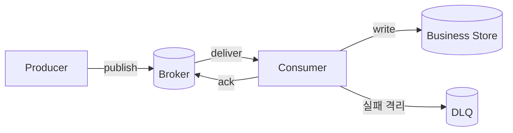



## 문제: 큐를 붙였다고 결합도가 자동으로 낮아지지는 않는다

메시지 브로커는 producer와 consumer의 시간적 결합을 줄이고 burst를 흡수할 수 있다.

그러나 새로 풀어야 할 문제가 생긴다.

- message가 중복된다.
- 처리 순서가 바뀐다.
- 독성 message가 계속 재시도된다.
- consumer가 느려져 backlog가 무한히 늘어난다.
- schema 변경이 오래된 consumer를 깨뜨린다.
- publish 성공과 database commit이 갈라진다.
- DLQ가 영구 보관소가 되어 아무도 보지 않는다.

핵심 질문은 `어떤 broker를 쓸까`가 아니다.

`업무 event가 중복·지연·역전·유실 의심 상태에서도 invariant를 지키는가`다.

## Mental model: broker 보장과 업무 보장을 분리한다



### at-most-once

재전달보다 중복 방지를 우선한다.

처리 전에 ack하거나 실패 때 다시 보내지 않으면 message가 사라질 수 있다.

손실을 허용하는 telemetry 등에 제한적으로 적합할 수 있다.

### at-least-once

손실 위험을 줄이기 위해 ack 전 실패한 message를 다시 전달한다.

consumer는 같은 message를 여러 번 볼 수 있다.

대부분의 업무 pipeline은 이 모델과 idempotent consumer를 결합한다.

### exactly-once라는 표현의 범위

어떤 broker는 특정 transaction과 내부 state에 대해 exactly-once 기능을 제공한다.

그 보장이 외부 REST API, email, 다른 database의 부작용까지 자동 확장되지는 않는다.

어디서 시작하고 끝나는 보장인지 공식 문서로 확인한다.

### ack는 업무 완료의 경계다

ack 시점은 매우 중요하다.

- 처리 전 ack: 중복은 줄지만 처리 실패 시 손실될 수 있다.
- 처리 후 ack: 중복 가능성이 있지만 재처리할 수 있다.
- transaction과 ack 결합: 지원 범위와 외부 부작용 경계를 확인해야 한다.

## 순서: 전체 순서보다 필요한 순서를 정의한다

전역 순서는 확장성과 가용성 비용이 크다.

대부분의 업무는 aggregate별 순서면 충분하다.

예를 들어 주문 ID를 partition key로 사용하면 같은 주문의 event를 같은 partition에 보낼 수 있다.

하지만 다음 경우 순서가 깨질 수 있다.

- producer가 병렬로 publish한다.
- failed message만 별도 retry queue로 이동한다.
- consumer concurrency가 aggregate 경계를 무시한다.
- partition 수를 바꾸며 key mapping이 달라진다.
- 처리 시간 차이로 완료 순서가 달라진다.

따라서 message에 aggregate ID와 monotonic version을 넣고 consumer가 역전을 검증한다.

## Workflow: 안전한 event pipeline 설계

### Step 1. command, event, document를 구분한다

- command는 특정 receiver에게 어떤 일을 요청한다.
- event는 이미 일어난 사실을 알린다.
- document message는 처리에 필요한 data snapshot을 전달한다.

event 이름은 `CreateOrder`보다 `OrderCreated`처럼 완료된 사실을 표현한다.

consumer가 producer의 내부 table 구조에 결합되지 않도록 공개 schema를 따로 설계한다.

### Step 2. message envelope을 표준화한다

최소 field 예시는 다음과 같다.

```json
{
  "message_id": "unique-id",
  "event_type": "example.entity.updated",
  "schema_version": 2,
  "occurred_at": "2026-01-01T00:00:00Z",
  "producer": "example-service",
  "aggregate_id": "entity-id",
  "aggregate_version": 17,
  "correlation_id": "traceable-id",
  "payload": {}
}
```

`occurred_at`만으로 순서를 결정하지 않는다.

`message_id`는 전달 instance 식별, `aggregate_version`은 업무 상태 순서에 사용한다.

### Step 3. publish 일관성을 정한다

업무 database commit 뒤 publish 전에 process가 죽으면 event가 빠진다.

publish 뒤 commit이 실패하면 존재하지 않는 변경의 event가 보인다.

transactional outbox는 local transaction 안에 업무 row와 outbox row를 함께 기록한다.

별도 relay가 outbox를 broker로 전달한다.

relay 중복 publish는 consumer idempotency가 흡수한다.

### Step 4. consumer를 idempotent하게 만든다

가장 단순한 방법은 처리된 message ID를 업무 변경과 같은 transaction에 기록하는 것이다.

```sql
BEGIN;
INSERT INTO processed_messages(consumer, message_id)
VALUES (:consumer, :message_id)
ON CONFLICT DO NOTHING;

-- 삽입 성공했을 때만 업무 상태를 조건부 갱신
COMMIT;
```

중복 기록 보존 기간은 broker의 최대 redelivery와 replay 기간을 포함해야 한다.

aggregate version 조건부 갱신도 함께 사용하면 순서 역전을 막을 수 있다.

### Step 5. retry taxonomy를 만든다

실패를 적어도 세 종류로 나눈다.

- **transient**: 짧은 network 오류, 제한된 backoff 재시도
- **rate limited/overload**: 더 긴 backoff, concurrency 축소
- **permanent/poison**: schema 오류, 업무 규칙 위반, 즉시 격리

모든 exception을 같은 속도로 재시도하지 않는다.

재시도 횟수보다 총 경과 시간과 업무 deadline이 더 중요할 수 있다.

### Step 6. DLQ를 복구 workflow로 설계한다

DLQ message에는 원본 payload뿐 아니라 다음 정보를 보존한다.

- 원본 queue 또는 topic
- 첫 실패와 최근 실패 시간
- 시도 횟수
- failure class와 안전하게 정제한 오류 정보
- consumer version
- correlation ID
- redrive 승인과 결과

민감 값을 오류 message에 그대로 넣지 않는다.

DLQ 크기, oldest age, 유입률에 경보를 둔다.

수정 후 replay할 때 같은 idempotency 규칙을 적용한다.

### Step 7. backpressure를 수치화한다

Little's Law 관점에서 평균 backlog는 도착률과 체류 시간에 연결된다.

운영에서는 최소한 다음을 본다.

- publish rate
- consume success rate
- retry rate
- queue depth
- oldest message age
- processing latency percentile
- consumer concurrency
- downstream saturation

depth만 보면 트래픽 규모에 따라 의미가 달라진다.

oldest age는 사용자 지연과 더 직접적으로 연결된다.

### Step 8. overload 정책을 정한다

consumer를 무한 확장하면 database가 먼저 무너질 수 있다.

downstream 안전 용량을 기준으로 concurrency를 제한한다.

priority queue를 사용할 때 low priority starvation을 검토한다.

생성 속도를 제어할 수 있다면 producer throttling을 건다.

기한이 지난 작업은 처리보다 만료가 맞을 수 있다.

### Step 9. schema evolution을 검증한다

호환 가능한 additive change를 우선한다.

field 의미를 바꾸기보다 새 field나 새 event type을 추가한다.

consumer가 모르는 field를 무시할 수 있게 한다.

required field 추가 전 모든 consumer의 전환을 확인한다.

schema registry가 있어도 의미 호환성은 test가 필요하다.

## 실전 예제: 대량 작업 처리

producer는 작업 요청을 받아 업무 row와 outbox를 쓴다.

relay가 `job.accepted` event를 publish한다.

partition key는 job ID다.

consumer는 다음 순서로 처리한다.

1. message envelope을 parse하고 schema를 검증한다.
2. deadline이 지났는지 확인한다.
3. processed message record를 조건부 생성한다.
4. job 상태를 `accepted -> running`으로 조건부 변경한다.
5. 외부 작업에는 별도 idempotency key를 전달한다.
6. 결과 artifact를 immutable key로 저장한다.
7. 상태를 `running -> succeeded`로 변경한다.
8. 완료 event를 outbox에 기록한다.
9. local transaction commit 뒤 broker에 ack한다.

process가 7번 뒤 9번 전에 죽어도 재전달된다.

두 번째 시도는 message ID와 상태 version을 보고 완료 결과를 재사용한다.

## 재처리와 replay

replay는 단순히 DLQ message를 원래 queue로 복사하는 작업이 아니다.

다음을 먼저 결정한다.

- 현재 consumer version으로 처리해도 되는가?
- 과거 schema를 읽을 수 있는가?
- 현재 상태에 오래된 event를 적용해도 되는가?
- 외부 부작용을 다시 수행할 것인가?
- replay 속도가 downstream을 압도하지 않는가?
- 결과를 어떻게 감사하고 중단하는가?

shadow consumer 또는 격리된 target으로 먼저 dry run할 수 있다.

replay batch와 rate limit을 설정한다.

## 검증 Checklist

### 계약

- [ ] command와 event 의미가 구분되어 있다.
- [ ] message ID, type, schema version이 있다.
- [ ] partition key 선택 근거가 있다.
- [ ] 순서 보장 범위가 aggregate 수준으로 명시되어 있다.
- [ ] 최대 message 크기와 외부 payload 참조 정책이 있다.

### 전달과 처리

- [ ] ack 시점이 업무 commit과 일치한다.
- [ ] consumer가 중복에 안전하다.
- [ ] 순서 역전을 version으로 탐지한다.
- [ ] retry 가능 오류 taxonomy가 있다.
- [ ] retry에 backoff, jitter, 총시간 한도가 있다.
- [ ] poison message가 정상 traffic을 막지 않는다.

### 운영

- [ ] oldest message age에 SLO가 있다.
- [ ] downstream 용량 기준 concurrency limit이 있다.
- [ ] DLQ 소유자와 대응 시간이 정해져 있다.
- [ ] redrive 전에 dry run과 승인 절차가 있다.
- [ ] schema 호환성 test가 CI에 있다.
- [ ] broker quota와 retention을 주기적으로 확인한다.
- [ ] disaster recovery 뒤 offset과 중복 의미를 시험했다.

## 자주 겪는 실패와 한계

### queue depth만 autoscaling 기준으로 쓴다

작업 시간이 다르면 같은 depth의 의미가 달라진다.

age, 처리율, downstream saturation을 함께 사용한다.

### retry queue로 순서를 깨뜨린다

실패한 하나를 늦게 돌리는 동안 같은 aggregate의 후속 event가 먼저 처리될 수 있다.

version 검증, key별 pause, 업무 보상 중 하나를 설계한다.

### DLQ를 안전망으로만 본다

DLQ는 데이터 손실이 보이지 않게 쌓이는 장소가 될 수 있다.

소유자, alarm, triage, replay가 없으면 안전장치가 아니다.

### 큰 payload를 broker에 직접 넣는다

전송 비용, retry 비용, retention 부담이 커진다.

대형 payload는 immutable object로 두고 integrity 정보가 있는 참조를 보낸다.

### message broker를 database transaction 대체재로 쓴다

broker와 업무 store의 원자성 경계는 사라지지 않는다.

outbox, inbox, saga, 보상 transaction을 명시적으로 선택해야 한다.

## 공식 참고자료

- [Apache Kafka Design](https://kafka.apache.org/documentation/#design)
- [RabbitMQ Consumer Acknowledgements and Publisher Confirms](https://www.rabbitmq.com/docs/confirms)
- [Amazon SQS Visibility Timeout](https://docs.aws.amazon.com/AWSSimpleQueueService/latest/SQSDeveloperGuide/sqs-visibility-timeout.html)
- [Google Cloud Pub/Sub Exactly-once Delivery](https://cloud.google.com/pubsub/docs/exactly-once-delivery)
- [CloudEvents Specification](https://github.com/cloudevents/spec)

## 마무리

메시지 큐는 실패를 제거하지 않고 실패가 나타나는 위치와 시간을 바꾼다.

전달 의미론의 이름보다 ack 경계, idempotency, version, retry taxonomy, DLQ 운영을 end-to-end로 연결하자.

중복과 지연을 정상 입력으로 다룰 때 비동기 구조가 실제로 느슨하게 결합된다.
