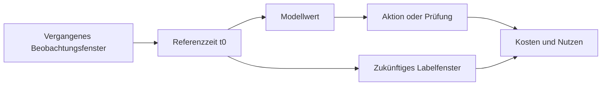



Ein gutes Machine-Learning-System beginnt nicht mit einem komplexen Modell. Es beginnt mit der Festlegung, **wer zu welchem Zeitpunkt welche Informationen verwendet, um welche Aktion besser auszuwählen**. Ist diese Frage unklar, wird selbst ein hoher Validierungswert nicht in realen Nutzen übergehen.

Dieser Artikel konzentriert sich auf tabellarische Vorhersageprobleme, doch dieselben Prinzipien gelten für Zeitreihen, Anomalieerkennung, Empfehlungssysteme und Scientific ML.

## 1. Das Problem: Wo Projekte vor dem Modell scheitern

Ein typisches Machine-Learning-Projekt scheitert in folgender Reihenfolge.

1. Die Geschäftsfrage wird direkt in ein Klassifikations- oder Regressionsproblem übersetzt.
2. Jede aus der aktuellen Datenbank leicht erhältliche Spalte wird als Feature verwendet.
3. Trainings- und Validierungsdaten werden zufällig aufgeteilt.
4. Das Modell mit dem höchsten Wert wird ausgewählt.
5. Beim Deployment fehlen die im Training verfügbaren Informationen, die Vorhersage kommt zu spät oder die Aktion kostet mehr als ihr Nutzen.

Grundursache ist, dass **Vorhersageziel, beobachtbare Informationen, Entscheidungszeitpunkt und Aktionsergebnis** nie als ein gemeinsamer Vertrag festgelegt wurden.

### Als Entscheidungsproblem statt als Vorhersageproblem formulieren

Der Satz „Ein Ereignis vorhersagen“ reicht nicht aus. Beantworten Sie mindestens folgende Fragen.

| Element | Erforderliche Frage |
|---|---|
| Vorhersageeinheit | Repräsentiert eine Zeile eine Person, Maschine, Transaktion, ein Intervall oder eine Sitzung? |
| Referenzzeit | Zu welchem exakten Zeitpunkt wird das Modell aufgerufen? |
| Beobachtungsfenster | Bis zu welchem Zeitraum dürfen Informationen verwendet werden? |
| Vorhersagehorizont | Wie weit nach der Referenzzeit wird das Ergebnis vorhergesagt? |
| Aktion | Was ändert sich tatsächlich bei einem hohen oder niedrigen Wert? |
| Kosten | Wie hoch sind jeweils die Kosten von False Positives, False Negatives, Latenz und Prüfung? |
| Constraints | Welche Grenzen gelten für Antwortzeit, Erklärbarkeit, verfügbares Personal und Regulierung? |

Selbst bei identischen Daten verändert ein Wechsel des Vorhersagehorizonts von zehn Minuten auf dreißig Tage Label, Features, Validierungsverfahren und mögliche Aktionen.

### Data Leakage ist mehr als „versehentlich die Antwortspalte aufzunehmen“

Data Leakage bezeichnet jeden Fall, in dem beim Deployment nicht verfügbare Informationen in Training oder Evaluation gelangen.

- **Target Leakage**: Einen Statuscode oder Folgedatensatz verwenden, der nach Eintreten des Ergebnisses erzeugt wurde
- **Temporal Leakage**: Statistiken des Gesamtzeitraums, zukünftige Korrekturen oder später finalisierte Werte an eine historische Zeile anhängen
- **Split Leakage**: Aus derselben Entität oder demselben Ereignis abgeleitete Zeilen in Training und Validierung platzieren
- **Preprocessing Leakage**: Imputation, Skalierung oder Feature-Auswahl zuerst auf dem gesamten Datensatz fitten
- **Label Leakage**: Das Label mit einer Regel definieren, die praktisch identisch mit einem Eingabe-Feature ist
- **Operational Leakage**: Eine offline verfügbare Spalte verwenden, die auf dem Online-Inferenzpfad zu spät eintrifft

Leakage lässt sich nicht allein anhand von Spaltennamen beurteilen. Es muss bekannt sein, **wann ein Wert erzeugt und finalisiert wird und wann er abfragbar wird**.

## 2. Denkmodell: Verträge und Risikominimierung auf einer Zeitachse

### Jeder Zeile eine „As-of-Zeit“ geben

Jede Vorhersagezeile besitzt eine Referenzzeit $t_0$. Features werden nur aus Informationen berechnet, die bis $t_0$ beobachtbar sind; das Label wird über das anschließende Intervall definiert.

\[
X_i = g\left(\mathcal{H}_i(t \le t_0)\right), \qquad
y_i = h\left(\mathcal{H}_i(t_0 < t \le t_0 + H)\right)
\]

- $\mathcal{H}_i$: Ereignisverlauf des Subjekts $i$
- $t_0$: Referenzzeit der Vorhersage
- $H$: Vorhersagehorizont
- $g$: Funktion, die Features aus vergangenen Informationen erzeugt
- $h$: Funktion, die ein Label aus dem zukünftigen Intervall erzeugt

Diese Notation explizit zu machen verhindert viele Formen von Leakage im Voraus.



### Ein Modellwert ist eine Eingabe für eine Entscheidung, nicht das Ziel selbst

Ein Modell gibt gewöhnlich $s(x)$ oder eine Wahrscheinlichkeit $p(y=1\mid x)$ aus. Das tatsächliche Ziel besteht nicht nur darin, den Modell-Loss zu verringern, sondern die erwarteten Kosten der Entscheidungsrichtlinie $a(s)$ zu senken.

\[
R(a) = \mathbb{E}\left[C\bigl(Y, a(s(X))\bigr)\right]
\]

Ein Modell mit höherer AUC erzeugt daher nicht zwingend eine bessere betriebliche Richtlinie. Wahrscheinlichkeitskalibrierung, Schwellenwerte, Prüfkapazität und Aktionswirkungen müssen gemeinsam betrachtet werden.

### Ein Datenvertrag ist ein semantischer Vertrag und nicht nur ein Schema

Ein Schema definiert Namen und Datentypen. Ein Datenvertrag ergänzt:

- Bedeutung einer Zeile und eindeutigen Schlüssel
- Ereigniszeit und Ingest-Zeit
- Erlaubte Bereiche, Einheiten und Bedeutung fehlender Werte
- Datenerzeuger und Aktualisierungsrhythmus
- Verfügbarkeit zum Deployment-Zeitpunkt
- Möglichkeit von Korrekturen und verspätetem Eintreffen
- Umgang mit Qualitätsverletzungen

Modellcode setzt implizit einen Datenvertrag voraus. Reproduzierbarkeit und Wartbarkeit erfordern, diese Annahmen in Dokumentation und automatisierter Validierung explizit zu machen.

## 3. Praktischer Workflow

### Schritt 1. Zuerst eine Entscheidungskarte erstellen

Legen Sie vor der Modellierung Folgendes auf einer Seite fest.

```yaml
decision:
  unit: "한 번의 평가 대상"
  as_of_time: "모델 호출 직전 시각"
  observation_window: "t0 이전의 고정 길이 구간"
  prediction_horizon: "t0 이후의 결과 관측 구간"
  action: "점수 구간별 검토 또는 개입"
  capacity: "단위 시간당 처리 가능한 최대 건수"

label:
  definition: "미래 구간에서 관측되는 객관적 조건"
  maturity_delay: "레이블이 최종 확정되기까지의 시간"
  exclusions: "판정 불가능하거나 중도 절단된 사례"

constraints:
  max_latency_ms: 200
  explainability: "개별 판단 근거 제공"
  fallback: "모델 또는 특징 장애 시 기본 정책"
```

Wählen Sie Zahlen passend zu den Systemanforderungen und versionieren Sie sie stets. Eine Änderung der Labeldefinition ist keine einfache Codeänderung; sie verändert das Problem selbst.

### Schritt 2. Labelgültigkeit und Beobachtungsbias prüfen

Ein Label ist gewöhnlich nicht die Wahrheit der Welt, sondern **das Ergebnis eines Messverfahrens**. Fragen Sie:

- Wird das Ergebnis für jedes Subjekt auf dieselbe Weise beobachtet?
- Ist ein positiver oder negativer Status nur für getestete Subjekte bekannt?
- Hat eine vorhandene Richtlinie bestimmt, wer getestet wurde, und Selektionsbias eingeführt?
- Sind aktuelle negative Labels noch unreif, weil die Finalisierung verzögert ist?
- Sind sich menschliche Beurteilende uneinig?
- Wurde „nicht beobachtet“ fälschlich als „negativ“ behandelt?

Bei Labels geringer Qualität lernt ein komplexeres Modell deren Unsicherheit nur differenzierter. Verwenden Sie zuerst Verfahren wie die Prüfung strittiger Stichproben, Mehrfachbeurteilungen, Weak-label-Flags und den Ausschluss von Intervallen mit unvollständigen Labels.

### Schritt 3. Provenienz und Verfügbarkeitszeit auf Spaltenebene erfassen

Verwalten Sie einen Feature-Katalog wie den folgenden.

| Feature | Quelle | Formelversion | Ereigniszeit | Verfügbarkeitsverzögerung | Einheit | Bedeutung fehlender Werte |
|---|---|---|---|---|---|---|
| Aktuelle Anzahl | Ereignislog | v2 | Quellenereigniszeit | Minuten | count | Keine Historie von Erfassungsfehler unterscheiden |
| Gleitende Statistik | Sensoraggregation | v1 | Fensterendzeit | Sekunden | Standardeinheit | Kann durch einen Qualitätsfilter ausgeschlossen sein |
| Kategoriezustand | Betriebssystem | v3 | Zeitpunkt der Zustandsänderung | Minuten | category | Nicht eingegeben von nicht anwendbar unterscheiden |

Ein Point-in-time Join für das Training ist kein einfacher Key Join. Er muss für jeden Vorhersagezeitpunkt den neuesten, nicht späteren Wert abrufen.

```sql
-- 개념 예시: 실제 문법은 데이터 엔진에 맞게 조정한다.
SELECT p.entity_id, p.as_of_time, f.feature_value
FROM prediction_points p
LEFT JOIN feature_history f
  ON p.entity_id = f.entity_id
 AND f.available_at <= p.as_of_time
QUALIFY ROW_NUMBER() OVER (
  PARTITION BY p.entity_id, p.as_of_time
  ORDER BY f.available_at DESC
) = 1;
```

`event_time <= as_of_time` reicht möglicherweise nicht aus. Wenn ein Ereignis in der Vergangenheit stattfand, aber verspätet in das System gelangte, verwenden Sie `available_at` als Kriterium.

### Schritt 4. Split-Strategie vor dem Modell festlegen

Der Split muss die Deployment-Umgebung simulieren.

- Einen chronologischen Split zur Vorhersage der Zukunft verwenden.
- Einen Group Split zur Generalisierung auf neue Benutzer oder Maschinen verwenden.
- Einen Split auf Domänenebene für den Transfer zwischen Standorten oder Institutionen verwenden.
- Nach Ereignis-ID splitten, wenn mehrere Zeilen vom selben Ereignis stammen.
- Bei wiederholtem Tuning das endgültige Testintervall bis zum Schluss versiegelt halten.

Preprocessing darf nur innerhalb jedes Trainings-Folds gefittet werden.

```python
# 실행 가능한 특정 라이브러리 코드가 아니라 구조를 보여 주는 의사코드다.
for train_idx, valid_idx in splitter.split(rows, groups=entity_ids, time=as_of_time):
    preprocess = Preprocessor().fit(rows[train_idx])
    X_train = preprocess.transform(rows[train_idx])
    X_valid = preprocess.transform(rows[valid_idx])

    model = Model(config).fit(X_train, y[train_idx])
    predictions[valid_idx] = model.predict_proba(X_valid)
```

### Schritt 5. Eine Baseline-Leiter aufbauen

Eine Baseline ist keine Formalität zur Erzeugung eines niedrigen Werts. Sie ist der Maßstab für die Frage, ob neue Komplexität realen Nutzen schafft.

1. **Policy-Baseline**: Aktuelle Regel oder Richtlinie, nichts zu unternehmen
2. **Konstante Baseline**: Gesamtmittelwert, Median, letzter Wert oder Mehrheitsklasse
3. **Einfachregel mit einem Feature**: Ein oder zwei voraussichtlich stärkste Signale
4. **Einfaches statistisches Modell**: Regularisiertes lineares oder logistisches Modell
5. **Nichtlineares Modell**: Baum- oder neuronale Netzfamilie, die Interaktionen lernt
6. **Ensemble**: Nur wenn der Gewinn betriebliche Komplexität und Rechenkosten rechtfertigt

Vergleichen Sie jede Stufe mit demselben Split, denselben Metriken und Kostenannahmen. Ist die durchschnittliche Verbesserung eines komplexen Modells klein und seine Varianz groß, kann ein einfaches Modell die bessere Wahl sein.

### Schritt 6. Jede Experimentiereinheit vollständig erfassen

Identifizieren Sie ein Experiment mindestens durch folgendes Tupel.

\[
E = (D, L, S, F, M, H, C, R)
\]

- $D$: Daten-Snapshot
- $L$: Version der Labeldefinition
- $S$: Split-Spezifikation
- $F$: Feature-Code und -Liste
- $M$: Version der Modellimplementierung
- $H$: Hyperparameter
- $C$: Ausführungsumgebung
- $R$: Zufallsseeds und Wiederholungsinformationen

Werte allein können ein Ergebnis nicht reproduzieren. Fehlgeschlagene Experimente samt Ablehnungsgrund zu erfassen verhindert die Wiederholung desselben Pfads.

### Schritt 7. Offline-Metriken in eine Betriebsrichtlinie übersetzen

Berichten Sie für ein Klassifikationsproblem nicht nur einen Schwellenwert, sondern untersuchen Sie gemeinsam:

- ROC-AUC und PR-AUC
- Precision, Recall und Spezifität je Schwellenwert
- Wahrscheinlichkeitskalibrierung und Reliability Curves
- Treffer- und Erfassungsquote in den obersten $k$ %
- Leistung nach Zeit, Gruppe und wichtiger Subgruppe
- Erwartete Kosten unter Berücksichtigung der Verarbeitungskapazität
- Leistung bei fehlenden oder verspäteten Eingaben

Untersuchen Sie bei Regression neben MAE oder RMSE auch Richtung der Residuen, Extrembereiche, Abdeckung der Vorhersageintervalle und Fehler nahe Entscheidungsgrenzen.

## 4. Checkliste für Evaluation und Verifikation

### Problemdefinition

- [ ] Vorhersageeinheit, Referenzzeit, Beobachtungsfenster und Vorhersagehorizont sind angegeben.
- [ ] Die aus einem Modellwert entstehende Aktion ist definiert.
- [ ] Kosten von False Positives, False Negatives, Latenz und Prüfung werden unterschieden.
- [ ] Verzögerung der Labelfinalisierung und Zensierungsregeln sind definiert.

### Datenverträge und Leakage

- [ ] Erzeugungszeit und betriebliche Verfügbarkeitszeit jedes Features sind bekannt.
- [ ] Point-in-time-korrekte Joins werden verwendet.
- [ ] Aus derselben Entität oder demselben Ereignis abgeleitete Zeilen überschreiten keine Split-Grenzen.
- [ ] Preprocessing und Feature-Auswahl werden nur innerhalb von Trainings-Folds gefittet.
- [ ] Gesamtzeitraum-Aggregate, Zustände nach dem Ergebnis und korrigierte Endwerte wurden geprüft.
- [ ] Fehlende Werte werden als „keine“, „nicht gemessen“ oder „Erfassungsfehler“ unterschieden.

### Baselines und Validierung

- [ ] Baselines für aktuelle Richtlinie, Konstanten und einfache Modelle existieren.
- [ ] Zeit-, Gruppen- oder Domänen-Splits simulieren die Deployment-Umgebung.
- [ ] Variabilität wurde über mehrere Seeds oder Zeitfenster geprüft.
- [ ] Nicht nur Durchschnittswerte, sondern auch Unsicherheitsintervalle und die schwächste Subgruppe werden berichtet.
- [ ] Endgültige Testdaten blieben bis zum Abschluss der Entscheidung versiegelt.

### Betriebliche Machbarkeit

- [ ] Feature-Berechnungen für Training und Serving besitzen identische Bedeutungen.
- [ ] Latenz, Speicher, Durchsatz und Feature-Aktualität wurden gemessen.
- [ ] Ein Fallback für Modellausfall oder fehlende Features ist definiert.
- [ ] Monitoring-Metriken sowie Kriterien für Neutraining und Rollback sind definiert.

## 5. Grenzen und Vorsichtsmaßnahmen

Erstens garantiert ein vollständiger Datenvertrag nicht, dass Daten wahr sind. Sensorfehler, Beurteilungsbias und Änderungen der Erfassungspraxis erfordern separate Qualitätsuntersuchungen und Domänenwissen.

Zweitens beweist gute Offline-Validierung nicht automatisch den kausalen Effekt einer Intervention. Genau vorherzusagen und Ergebnisse durch Handeln auf Vorhersagen zu verbessern sind verschiedene Fragen. Verifizieren Sie tatsächliche Policy-Effekte durch Verfahren wie gestuften Rollout, randomisierte Experimente oder quasi-experimentelle Designs.

Drittens verändern sich Labels und Umgebungen. Die anfängliche Problemdefinition ist eine versionierte Hypothese, kein dauerhafter Vertrag. Erfassen Sie bei Änderungen, was sich warum geändert hat, damit vergangene Ergebnisse vergleichbar bleiben.

Schließlich ist das genaueste Modell nicht immer das beste. In der Praxis kann das Modell mit dem geringeren **Gesamtsystemrisiko** die bessere Wahl sein, einschließlich Datenaktualität, Erklärbarkeit, Fehlerbehebung und Wartungskosten.
