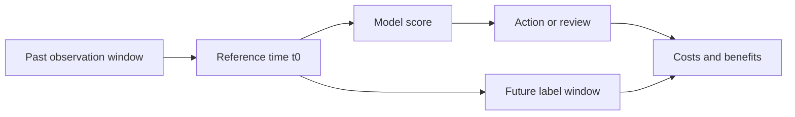



A good machine learning system does not begin with a complex model. It begins by specifying **who will use what information, at what time, to choose which action more effectively**. If this question is unclear, even a high validation score will not translate into real value.

This article focuses on tabular prediction problems, but the same principles apply to time series, anomaly detection, recommendation, and Scientific ML.

## 1. The Problem: Where Projects Fail Before the Model

A common machine learning project fails in the following sequence.

1. The business question is translated directly into a classification or regression problem.
2. Every column that is easy to obtain from the current database is used as a feature.
3. Training and validation data are split randomly.
4. The model with the highest score is selected.
5. At deployment time, the information available during training is absent, the prediction arrives too late, or the action costs more than its benefit.

The root cause is that the **prediction target, observable information, decision time, and action outcome** were never fixed as one contract.

### Frame it as a decision problem, not a prediction problem

The sentence “predict an event” is insufficient. At minimum, answer the following questions.

| Item | Required question |
|---|---|
| Prediction unit | Does one row represent a person, machine, transaction, interval, or session? |
| Reference time | At exactly what time is the model invoked? |
| Observation window | Up to what period can information be used? |
| Prediction horizon | How far after the reference time is the outcome predicted? |
| Action | What actually changes when the score is high or low? |
| Cost | What are the respective costs of false positives, false negatives, latency, and review? |
| Constraints | What are the limits on response time, explainability, available personnel, and regulation? |

Even with identical data, changing the prediction horizon from ten minutes to thirty days changes the label, features, validation method, and feasible actions.

### Data leakage is broader than “accidentally including the answer column”

Data leakage means every case in which information unavailable at deployment time enters training or evaluation.

- **Target leakage**: using a status code or follow-up record created after the outcome occurred
- **Temporal leakage**: attaching whole-period statistics, future corrections, or values finalized later to a historical row
- **Split leakage**: placing rows derived from the same entity or event in both training and validation
- **Preprocessing leakage**: fitting imputation, scaling, or feature selection on the entire dataset first
- **Label leakage**: defining the label with a rule that is effectively identical to an input feature
- **Operational leakage**: using a column available offline that arrives too late on the online inference path

Leakage cannot be judged from column names alone. You must know **when a value is generated, when it is finalized, and when it becomes queryable**.

## 2. Mental Model: Contracts and Risk Minimization on a Timeline

### Give every row an “as-of time”

Each prediction row has a reference time \(t_0\). Features are computed only from information observable through \(t_0\), while the label is defined over the interval after it.

\[
X_i = g\left(\mathcal{H}_i(t \le t_0)\right), \qquad
y_i = h\left(\mathcal{H}_i(t_0 < t \le t_0 + H)\right)
\]

- \(\mathcal{H}_i\): event history of subject \(i\)
- \(t_0\): prediction reference time
- \(H\): prediction horizon
- \(g\): function that constructs features from past information
- \(h\): function that constructs a label from the future interval

Making this notation explicit prevents many forms of leakage in advance.



### A model score is an input to a decision, not the objective itself

A model usually outputs \(s(x)\) or a probability \(p(y=1\mid x)\). The actual objective is not only to reduce model loss, but to reduce the expected cost of the decision policy \(a(s)\).

\[
R(a) = \mathbb{E}\left[C\bigl(Y, a(s(X))\bigr)\right]
\]

Therefore, a model with higher AUC does not necessarily produce a better operational policy. Probability calibration, thresholds, review capacity, and action effects must be considered together.

### A data contract is a semantic contract, not just a schema

A schema defines names and data types. A data contract adds the following.

- Row meaning and unique key
- Event time and ingestion time
- Permitted ranges, units, and the meaning of missingness
- Data producer and update frequency
- Availability at deployment time
- Possibility of corrections and late arrivals
- Handling of quality violations

Model code implicitly assumes a data contract. Reproducibility and maintainability require making those assumptions explicit in documentation and automated validation.

## 3. Practical Workflow

### Step 1. Write a decision card first

Before modeling, fix the following on one page.

```yaml
decision:
  unit: "한 번의 평가 대상"
  as_of_time: "모델 호출 직전 시각"
  observation_window: "t0 이전의 고정 길이 구간"
  prediction_horizon: "t0 이후의 결과 관측 구간"
  action: "점수 구간별 검토 또는 개입"
  capacity: "단위 시간당 처리 가능한 최대 건수"

label:
  definition: "미래 구간에서 관측되는 객관적 조건"
  maturity_delay: "레이블이 최종 확정되기까지의 시간"
  exclusions: "판정 불가능하거나 중도 절단된 사례"

constraints:
  max_latency_ms: 200
  explainability: "개별 판단 근거 제공"
  fallback: "모델 또는 특징 장애 시 기본 정책"
```

Choose numbers to fit system requirements, but always version-control them. A change to the label definition is not a simple code edit; it changes the problem itself.

### Step 2. Check label validity and observation bias

A label is usually not the truth of the world but **the result of a measurement procedure**. Ask the following questions.

- Is the outcome observed in the same way for every subject?
- Is positive or negative status known only for subjects who were tested?
- Did an existing policy decide who was tested and introduce selection bias?
- Are recent negative labels still immature because finalization is delayed?
- Do human adjudicators disagree?
- Was “unobserved” incorrectly treated as “negative”?

With low-quality labels, a more complex model merely learns their uncertainty more intricately. First use procedures such as reviewing disputed samples, multiple adjudications, weak-label flags, and excluding intervals with incomplete labels.

### Step 3. Record column-level provenance and availability time

Manage a feature catalog like the following.

| Feature | Source | Formula version | Event time | Availability delay | Unit | Meaning of missingness |
|---|---|---|---|---|---|---|
| Recent count | Event log | v2 | Source event time | Minutes | count | Distinguish no history from collection failure |
| Moving statistic | Sensor aggregation | v1 | Window end time | Seconds | Standard unit | May be excluded by a quality filter |
| Category state | Operational system | v3 | State-change time | Minutes | category | Distinguish not entered from not applicable |

A point-in-time join for training is not a simple key join. It must retrieve the latest value no later than each prediction time.

```sql
-- 개념 예시: 실제 문법은 데이터 엔진에 맞게 조정한다.
SELECT p.entity_id, p.as_of_time, f.feature_value
FROM prediction_points p
LEFT JOIN feature_history f
  ON p.entity_id = f.entity_id
 AND f.available_at <= p.as_of_time
QUALIFY ROW_NUMBER() OVER (
  PARTITION BY p.entity_id, p.as_of_time
  ORDER BY f.available_at DESC
) = 1;
```

`event_time <= as_of_time` may not be sufficient. If an event occurred in the past but entered the system late, use `available_at` as the criterion.

### Step 4. Fix the split strategy before the model

The split must simulate the deployment environment.

- Use a chronological split when predicting the future.
- Use a group split when generalizing to new users or machines.
- Use a domain-level split when transferring across locations or institutions.
- Split by event ID when multiple rows derive from the same event.
- If tuning repeatedly, keep the final test interval sealed until the end.

Preprocessing must be fit only within each training fold.

```python
# 실행 가능한 특정 라이브러리 코드가 아니라 구조를 보여 주는 의사코드다.
for train_idx, valid_idx in splitter.split(rows, groups=entity_ids, time=as_of_time):
    preprocess = Preprocessor().fit(rows[train_idx])
    X_train = preprocess.transform(rows[train_idx])
    X_valid = preprocess.transform(rows[valid_idx])

    model = Model(config).fit(X_train, y[train_idx])
    predictions[valid_idx] = model.predict_proba(X_valid)
```

### Step 5. Build a baseline ladder

A baseline is not a formality intended to produce a low score. It is the standard for deciding whether new complexity creates real value.

1. **Policy baseline**: the current rule or a policy of taking no action
2. **Constant baseline**: overall mean, median, latest value, or majority class
3. **Single-feature rule**: one or two signals expected to be strongest
4. **Simple statistical model**: a regularized linear or logistic model
5. **Nonlinear model**: a tree or neural-network family that learns interactions
6. **Ensemble**: only when the gain justifies operational complexity and compute cost

Compare every stage with the same split, metrics, and cost assumptions. If a complex model's mean improvement is small and variance is large, a simple model may be the better choice.

### Step 6. Fully record each experiment unit

At minimum, identify an experiment with the following tuple.

\[
E = (D, L, S, F, M, H, C, R)
\]

- \(D\): data snapshot
- \(L\): label-definition version
- \(S\): split specification
- \(F\): feature code and list
- \(M\): model-implementation version
- \(H\): hyperparameters
- \(C\): execution environment
- \(R\): random seeds and repetition information

Scores alone cannot reproduce a result. Recording failed experiments with the reason they were rejected prevents repeating the same path.

### Step 7. Translate offline metrics into an operational policy

For a classification problem, do not report only one threshold; inspect the following together.

- ROC-AUC and PR-AUC
- Precision, recall, and specificity by threshold
- Probability calibration and reliability curves
- Hit rate and capture rate in the top \(k\)%
- Performance by time, group, and important subgroup
- Expected cost reflecting processing capacity
- Performance when inputs are missing or delayed

For regression, inspect residual directionality, extreme ranges, prediction-interval coverage, and errors near decision boundaries in addition to MAE or RMSE.

## 4. Evaluation and Verification Checklist

### Problem definition

- [ ] The prediction unit, reference time, observation window, and prediction horizon are specified.
- [ ] The action produced by a model score is defined.
- [ ] False-positive, false-negative, latency, and review costs are distinguished.
- [ ] Label-finalization delay and censoring rules are defined.

### Data contracts and leakage

- [ ] The generation time and operational availability time of every feature are known.
- [ ] Point-in-time-correct joins are used.
- [ ] Rows derived from the same entity or event do not cross split boundaries.
- [ ] Preprocessing and feature selection are fit only within training folds.
- [ ] Whole-period aggregates, post-outcome states, and corrected final values have been checked.
- [ ] Missingness is distinguished among “none,” “not measured,” and “collection failure.”

### Baselines and validation

- [ ] Baselines exist for the current policy, constants, and simple models.
- [ ] Time, group, or domain splits simulate the deployment environment.
- [ ] Variability has been checked across multiple seeds or time windows.
- [ ] Uncertainty intervals and the worst-performing subgroup are reported, not only averages.
- [ ] Final test data remained sealed until decision-making was complete.

### Operational feasibility

- [ ] Training and serving feature computations have identical meanings.
- [ ] Latency, memory, throughput, and feature freshness have been measured.
- [ ] A fallback is defined for model failure or missing features.
- [ ] Monitoring metrics and retraining and rollback criteria are defined.

## 5. Limitations and Cautions

First, a complete data contract does not guarantee that data is truthful. Sensor errors, adjudication bias, and changes in recording practice require separate quality investigations and domain knowledge.

Second, good offline validation does not automatically prove the causal effect of an intervention. Predicting accurately and improving outcomes by acting on predictions are different questions. Verify actual policy effects through methods such as staged rollout, randomized experiments, or quasi-experimental designs.

Third, labels and environments change. The initial problem definition is a versioned hypothesis, not a permanent contract. When it changes, record what changed and why so that past results remain comparable.

Finally, the most accurate model is not always the best. In practice, the better model may be the one with lower **total system risk**, including data freshness, explainability, failure recovery, and maintenance cost.
