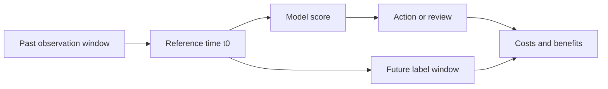



Un buen sistema de aprendizaje automático no comienza con un modelo complejo. Comienza especificando **quién utilizará qué información, en qué momento, para elegir qué acción será más efectiva**. Si esta pregunta no está clara, ni siquiera una puntuación de validación alta se traducirá en un valor real.

Este artículo se centra en problemas de predicción tabular, pero los mismos principios se aplican a series temporales, detección de anomalías, recomendaciones y ML científico.

## 1. El problema: dónde fallan los proyectos antes que el modelo

Un proyecto común de aprendizaje automático falla en la siguiente secuencia.

1. La cuestión empresarial se traduce directamente en un problema de clasificación o regresión.
2. Cada columna que sea fácil de obtener de la base de datos actual se utiliza como característica.
3. Los datos de capacitación y validación se dividen al azar.
4. Se selecciona el modelo con mayor puntuación.
5. En el momento del despliegue, la información disponible durante el entrenamiento está ausente, la predicción llega demasiado tarde o la acción cuesta más que su beneficio.

La causa principal es que el **objetivo de predicción, la información observable, el tiempo de decisión y el resultado de la acción** nunca se fijaron como un solo contrato.

### Plantéelo como un problema de decisión, no como un problema de predicción.

La frase “predecir un evento” es insuficiente. Como mínimo, responda las siguientes preguntas.

| Artículo | Pregunta obligatoria |
|---|---|
| Unidad de predicción | ¿Una fila representa una persona, máquina, transacción, intervalo o sesión? |
| Tiempo de referencia | ¿A qué hora exactamente se invoca el modelo? |
| Ventana de observación | ¿Hasta qué plazo se puede utilizar la información? |
| Horizonte de predicción | ¿Cuánto tiempo después del tiempo de referencia se predice el resultado? |
| Acción | ¿Qué cambia realmente cuando la puntuación es alta o baja? |
| Costo | ¿Cuáles son los costos respectivos de los falsos positivos, los falsos negativos, la latencia y la revisión? |
| Restricciones | ¿Cuáles son los límites en cuanto a tiempo de respuesta, explicabilidad, personal disponible y regulación? |

Incluso con datos idénticos, cambiar el horizonte de predicción de diez minutos a treinta días cambia la etiqueta, las características, el método de validación y las acciones factibles.

### La filtración de datos es más amplia que "incluir accidentalmente la columna de respuestas"

La fuga de datos significa cada caso en el que información no disponible en el momento de la implementación ingresa en la capacitación o evaluación.

- **Fuga objetivo**: utilizando un código de estado o un registro de seguimiento creado después de que se produjo el resultado
- Fuga de **Temporal**: adjuntar estadísticas de todo el período, correcciones futuras o valores finalizados más tarde a una fila histórica
- **Fuga dividida**: colocar filas derivadas de la misma entidad o evento tanto en entrenamiento como en validación
- **Fugas de preprocesamiento**: primero se ajusta la imputación, la escala o la selección de características en todo el conjunto de datos
- **Fuga de etiquetas**: definir la etiqueta con una regla que es efectivamente idéntica a una característica de entrada
- **Fuga operativa**: uso de una columna disponible sin conexión que llega demasiado tarde a la ruta de inferencia en línea

Las fugas no se pueden juzgar únicamente por los nombres de las columnas. Debe saber **cuándo se genera un valor, cuándo se finaliza y cuándo se vuelve consultable**.

## 2. Modelo mental: contratos y minimización de riesgos en una línea de tiempo

### Asigne a cada fila un "actualizado"

Cada fila de predicción tiene un tiempo de referencia \(t_0\). Las características se calculan únicamente a partir de información observable hasta \(t_0\), mientras que la etiqueta se define en el intervalo posterior.

\[
X_i = g\left(\mathcal{H}_i(t \le t_0)\right), \qquad
y_i = h\left(\mathcal{H}_i(t_0 < t \le t_0 + H)\right)
\]

- \(\mathcal{H}_i\): historial de eventos del sujeto \(i\)
- \(t_0\): tiempo de referencia de predicción
- \(H\): horizonte de predicción
- \(g\): función que construye características a partir de información pasada
- \(h\): función que construye una etiqueta a partir del intervalo futuro

Hacer explícita esta notación evita muchas formas de filtración por adelantado.



### La puntuación de un modelo es un insumo para una decisión, no el objetivo en sí.

Un modelo normalmente genera \(s(x)\) o una probabilidad \(p(y=1\mid x)\). El objetivo real no es solo reducir la pérdida del modelo, sino también reducir el costo esperado de la política de decisión \(a(s)\).

\[
R(a) = \mathbb{E}\left[C\bigl(Y, a(s(X))\bigr)\right]
\]

Por lo tanto, un modelo con un AUC superior no necesariamente produce una mejor política operativa. La calibración de probabilidad, los umbrales, la capacidad de revisión y los efectos de la acción deben considerarse en conjunto.

### Un contrato de datos es un contrato semántico, no solo un esquema

Un esquema define nombres y tipos de datos. Un contrato de datos añade lo siguiente.

- Significado de la fila y clave única.
- Hora del evento y tiempo de ingestión.
- Rangos permitidos, unidades y el significado de falta
- Productor de datos y frecuencia de actualización.
- Disponibilidad en el momento de la implementación
- Posibilidad de correcciones y llegadas tardías.
- Manejo de violaciones de calidad.

El código modelo asume implícitamente un contrato de datos. La reproducibilidad y la mantenibilidad requieren hacer explícitas esas suposiciones en la documentación y la validación automatizada.

## 3. Flujo de trabajo práctico

### Paso 1. Primero escriba una tarjeta de decisión

Antes de modelar, arregle lo siguiente en una página.

```yaml
decision:
  unit: "한 번의 평가 대상"
  as_of_time: "모델 호출 직전 시각"
  observation_window: "t0 이전의 고정 길이 구간"
  prediction_horizon: "t0 이후의 결과 관측 구간"
  action: "점수 구간별 검토 또는 개입"
  capacity: "단위 시간당 처리 가능한 최대 건수"

label:
  definition: "미래 구간에서 관측되는 객관적 조건"
  maturity_delay: "레이블이 최종 확정되기까지의 시간"
  exclusions: "판정 불가능하거나 중도 절단된 사례"

constraints:
  max_latency_ms: 200
  explainability: "개별 판단 근거 제공"
  fallback: "모델 또는 특징 장애 시 기본 정책"
```

Elija números que se ajusten a los requisitos del sistema, pero siempre controle las versiones. Un cambio en la definición de la etiqueta no es una simple edición de código; cambia el problema en sí.

### Paso 2. Verificar la validez de la etiqueta y el sesgo de observación

Una etiqueta no suele ser la verdad del mundo sino **el resultado de un procedimiento de medición**. Haga las siguientes preguntas.

- ¿Se observa el resultado de la misma manera para todos los sujetos?
- ¿Se conoce el estado positivo o negativo sólo de los sujetos que fueron evaluados?
- ¿Una política existente decidió quién fue evaluado e introdujo un sesgo de selección?
- ¿Son todavía inmaduras las recientes etiquetas negativas porque se ha retrasado su finalización?
- ¿Los jueces humanos no están de acuerdo?
- ¿Se trató incorrectamente lo “no observado” como “negativo”?

Con etiquetas de baja calidad, un modelo más complejo simplemente aprende su incertidumbre de manera más compleja. Utilice por primera vez procedimientos como la revisión de muestras en disputa, adjudicaciones múltiples, indicadores de etiquetas débiles y exclusión de intervalos con etiquetas incompletas.

### Paso 3. Registrar la procedencia y el tiempo de disponibilidad a nivel de columna

Administre un catálogo de funciones como el siguiente.

| Característica | Fuente | Versión de fórmula | Hora del evento | Retraso de disponibilidad | Unidad | Significado de missness |
|---|---|---|---|---|---|---|
| Recuento reciente | Registro de eventos | v2 | Hora del evento fuente | Minutos | contar | No distinguir antecedentes de fallas en la recolección |
| Estadística en movimiento | Agregación de sensores | v1 | Hora de finalización de la ventana | Segundos | Unidad estándar | Puede ser excluido por un filtro de calidad |
| Estado de la categoría | Sistema operativo | v3 | Hora de cambio de estado | Minutos | categoría | Distinguir no ingresado de no aplicable |

Una unión en un momento determinado para la capacitación no es una simple unión clave. Debe recuperar el último valor a más tardar en cada hora de predicción.

```sql
-- 개념 예시: 실제 문법은 데이터 엔진에 맞게 조정한다.
SELECT p.entity_id, p.as_of_time, f.feature_value
FROM prediction_points p
LEFT JOIN feature_history f
  ON p.entity_id = f.entity_id
 AND f.available_at <= p.as_of_time
QUALIFY ROW_NUMBER() OVER (
  PARTITION BY p.entity_id, p.as_of_time
  ORDER BY f.available_at DESC
) = 1;
```

`event_time <= as_of_time` puede no ser suficiente. Si un evento ocurrió en el pasado pero ingresó tarde al sistema, use `available_at` como criterio.

### Paso 4. Arreglar la estrategia dividida antes del modelo.

La división debe simular el entorno de implementación.

- Utilice una división cronológica al predecir el futuro.
- Utilice una división de grupo al generalizar a nuevos usuarios o máquinas.
- Utilice una división a nivel de dominio al realizar transferencias entre ubicaciones o instituciones.
- Dividir por evento ID cuando varias filas derivan del mismo evento.
- Si sintoniza repetidamente, mantenga sellado el intervalo de prueba final hasta el final.

El preprocesamiento debe ajustarse únicamente dentro de cada pliegue de entrenamiento.

```python
# 실행 가능한 특정 라이브러리 코드가 아니라 구조를 보여 주는 의사코드다.
for train_idx, valid_idx in splitter.split(rows, groups=entity_ids, time=as_of_time):
    preprocess = Preprocessor().fit(rows[train_idx])
    X_train = preprocess.transform(rows[train_idx])
    X_valid = preprocess.transform(rows[valid_idx])

    model = Model(config).fit(X_train, y[train_idx])
    predictions[valid_idx] = model.predict_proba(X_valid)
```

### Paso 5. Construya una escalera de referencia

Una línea de base no es una formalidad destinada a producir una puntuación baja. Es el estándar para decidir si la nueva complejidad crea valor real.

1. **Línea base de la política**: la regla actual o una política de no tomar ninguna medida
2. **Línea de base constante**: media general, mediana, último valor o clase mayoritaria
3. **Regla de característica única**: se espera que una o dos señales sean más fuertes
4. **Modelo estadístico simple**: un modelo lineal o logístico regularizado
5. **Modelo no lineal**: un árbol o una familia de redes neuronales que aprende interacciones
6. **Conjunto**: solo cuando la ganancia justifica la complejidad operativa y el costo informático

Compare cada etapa con las mismas suposiciones de división, métricas y costos. Si la mejora media de un modelo complejo es pequeña y la varianza es grande, un modelo simple puede ser la mejor opción.

### Paso 6. Registre completamente cada unidad de experimento

Como mínimo, identifique un experimento con la siguiente tupla.

\[
E = (D, L, S, F, M, H, C, R)
\]

- \(D\): instantánea de datos
- \(L\): versión de definición de etiqueta
- \(S\): especificación dividida
- \(F\): código de característica y lista
- \(M\): versión de implementación del modelo
- \(H\): hiperparámetros
- \(C\): entorno de ejecución
- \(R\): semillas aleatorias e información de repetición

Las puntuaciones por sí solas no pueden reproducir un resultado. Registrar experimentos fallidos con el motivo por el que fueron rechazados evita repetir el mismo camino.

### Paso 7. Traducir las métricas fuera de línea en una política operativa

Para un problema de clasificación, no informe solo un umbral; Inspeccione lo siguiente juntos.

- ROC-AUC y PR-AUC
- Precisión, recuperación y especificidad por umbral.
- Curvas de calibración y confiabilidad de probabilidad.
- Tasa de aciertos y tasa de captura en el \(k\)% superior
- Desempeño por tiempo, grupo y subgrupo importante.
- Costo esperado que refleja la capacidad de procesamiento.
- Rendimiento cuando faltan entradas o se retrasan

Para la regresión, inspeccione la direccionalidad residual, los rangos extremos, la cobertura del intervalo de predicción y los errores cerca de los límites de decisión, además de MAE o RMSE.

## 4. Lista de verificación de evaluación y verificación

### Definición del problema

- [ ] Se especifican la unidad de predicción, el tiempo de referencia, la ventana de observación y el horizonte de predicción.
- [ ] Se define la acción producida por una puntuación del modelo.
- [ ] Se distinguen los costos de falsos positivos, falsos negativos, latencia y revisión.
- [ ] Se definen reglas de censura y retraso en la finalización de la etiqueta.

### Contratos de datos y fuga

- [ ] Se conoce el tiempo de generación y el tiempo de disponibilidad operativa de cada característica.
- [] Se utilizan uniones correctas en un momento dado.
- [] Las filas derivadas de la misma entidad o evento no cruzan límites divididos.
- [] El preprocesamiento y la selección de funciones solo se ajustan a los pliegues de entrenamiento.
- [ ] Se han comprobado los agregados de todo el período, los estados posteriores a los resultados y los valores finales corregidos.
- [ ] Los datos perdidos se distinguen entre “ninguno”, “no medido” y “fallo en la recopilación”.

### Líneas de base y validación

- [ ] Existen líneas de base para la política actual, constantes y modelos simples.
- [] Las divisiones de tiempo, grupo o dominio simulan el entorno de implementación.
- [] Se ha comprobado la variabilidad en múltiples semillas o ventanas de tiempo.
- [ ] Se informan los intervalos de incertidumbre y el subgrupo con peor desempeño, no solo los promedios.
- [ ] Los datos finales de la prueba permanecieron sellados hasta que se completó la toma de decisiones.

### Viabilidad operativa

- [] Los cálculos de funciones de entrenamiento y servicio tienen significados idénticos.
- [] Se han medido la latencia, la memoria, el rendimiento y la actualización de las funciones.
- [ ] Se define un respaldo para fallas del modelo o características faltantes.
- [ ] Se definen métricas de seguimiento y criterios de reentrenamiento y rollback.

## 5. Limitaciones y precauciones

En primer lugar, un contrato de datos completo no garantiza que los datos sean veraces. Los errores de sensores, el sesgo de adjudicación y los cambios en la práctica de registro requieren investigaciones de calidad y conocimientos de dominio separados.

En segundo lugar, una buena validación fuera de línea no prueba automáticamente el efecto causal de una intervención. Predecir con precisión y mejorar los resultados actuando según las predicciones son cuestiones diferentes. Verificar los efectos reales de las políticas mediante métodos como la implementación por etapas, experimentos aleatorios o diseños cuasiexperimentales.

En tercer lugar, las etiquetas y los entornos cambian. La definición inicial del problema es una hipótesis versionada, no un contrato permanente. Cuando cambie, registre qué cambió y por qué para que los resultados pasados ​​sigan siendo comparables.

Finalmente, el modelo más preciso no siempre es el mejor. En la práctica, el mejor modelo puede ser el que tenga un menor **riesgo total del sistema**, incluida la actualización de los datos, la explicabilidad, la recuperación de fallas y el costo de mantenimiento.
