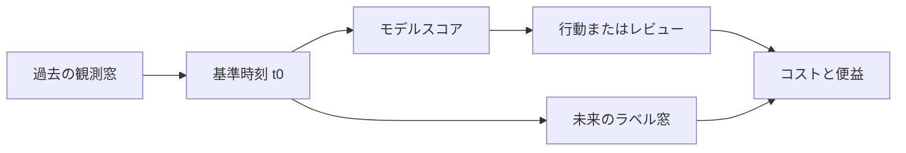



優れた機械学習システムは、複雑なモデルから始まるものではない。**誰が、いつ、どの情報を使って、どの行動をより適切に選ぶのか**を明示することから始まる。この問いが曖昧なら、高い検証スコアも実際の価値にはつながらない。

本稿では表形式の予測問題を中心に説明するが、時系列・異常検知・推薦・Scientific MLにも同じ原則を適用できる。

## 1. 問題：モデルより先に失敗する地点

機械学習プロジェクトでよくある失敗は、次のような順序で起こる。

1. 業務上の問いを、直ちに分類・回帰問題へ翻訳する。
2. 現在のデータベースから容易に取得できる列をすべて特徴量に入れる。
3. 学習・検証データをランダムに分割する。
4. 最もスコアの高いモデルを選ぶ。
5. 運用時には学習時にあった情報が存在しない、予測が遅すぎる、または行動コストが便益を上回るという事実に気づく。

根本的な原因は、**予測対象、観測可能な情報、意思決定時点、行動の結果**が一つの契約として固定されていないことにある。

### 予測問題ではなく、意思決定問題として書く

「事象を予測する」という文だけでは足りない。最低限、次の項目が必要である。

| 項目 | 必ず答えるべき問い |
|---|---|
| 予測単位 | 一行は人、設備、取引、区間、セッションのどれか。 |
| 基準時刻 | モデルが呼び出される正確な時刻はいつか。 |
| 観測窓 | どの期間までの情報を利用できるか。 |
| 予測ホライズン | 基準時刻後のいつまでの結果を予測するか。 |
| 行動 | スコアが高い、または低いとき、実際に何を変えるか。 |
| コスト | 偽陽性、偽陰性、遅延、レビューのコストはそれぞれいくらか。 |
| 制約 | 応答時間、説明可能性、利用可能な人員、規制上の限界は何か。 |

同じデータでも、予測ホライズンが10分か30日かによって、ラベル、特徴量、検証方法、可能な行動はすべて変わる。

### データリークは「正解の列を入れるミス」より広い

データリーク（leakage）とは、運用時点では知り得ない情報が学習または評価に入るすべてのケースを指す。

- **ターゲットリーク**：結果が発生した後に生成される状態コードや事後対応の記録を使う。
- **時間リーク**：全期間の統計、未来の補正値、後から確定した値を過去の行に付与する。
- **分割リーク**：同じ対象・事象から派生した行が、学習と検証の両方に存在する。
- **前処理リーク**：欠損値補完、スケーリング、特徴選択を、先に全データへ適合する。
- **ラベルリーク**：ラベルを作る規則が入力特徴量と事実上同一である。
- **運用リーク**：オフラインデータにはあるが、オンライン推論経路では到着が遅い列を使う。

リークの有無は、列名を見るだけでは判断できない。**その値がいつ生成され、いつ確定し、いつ参照可能になるか**を知る必要がある。

## 2. Mental model：時間軸上の契約とリスク最小化

### すべての行に「as-of time」を与える

各予測行には基準時刻\(t_0\)がある。特徴量は\(t_0\)までに観測可能な情報だけで計算し、ラベルはそれより後の区間で定義する。

\[
X_i = g\left(\mathcal{H}_i(t \le t_0)\right), \qquad
y_i = h\left(\mathcal{H}_i(t_0 < t \le t_0 + H)\right)
\]

- \(\mathcal{H}_i\)：対象\(i\)の事象履歴
- \(t_0\)：予測の基準時刻
- \(H\)：予測ホライズン
- \(g\)：過去の情報から特徴量を作る関数
- \(h\)：未来の区間からラベルを作る関数

この表記を明確にするだけでも、多くのリークを事前に防げる。



### モデルスコアは目的関数ではなく、意思決定への入力である

モデルは通常、\(s(x)\)または確率\(p(y=1\mid x)\)を出力する。実際の目的は、モデルの損失だけを減らすことではなく、意思決定ポリシー\(a(s)\)の期待コストを減らすことである。

\[
R(a) = \mathbb{E}\left[C\bigl(Y, a(s(X))\bigr)\right]
\]

したがって、AUCの高いモデルが必ずしも優れた運用ポリシーを作るとは限らない。確率較正、しきい値、レビュー容量、行動の効果を併せて検討する必要がある。

### データ契約はスキーマではなく、意味の契約である

スキーマは名前とデータ型を定義する。データ契約は、そこに次の内容を加える。

- 行の意味と一意キー
- イベント時刻とロード時刻
- 許容範囲・単位・欠損の意味
- データ生成主体と更新周期
- 運用時点での可用性
- 修正・遅延到着の可能性
- 品質違反時の処理方法

モデルコードはデータ契約を暗黙に仮定している。その仮定を文書と自動検証として明示してこそ、再現性と保守性が生まれる。

## 3. 実践workflow

### Step 1. Decision cardを先に作成する

モデリングの前に、次の内容を一ページに固定する。

```yaml
decision:
  unit: "한 번의 평가 대상"
  as_of_time: "모델 호출 직전 시각"
  observation_window: "t0 이전의 고정 길이 구간"
  prediction_horizon: "t0 이후의 결과 관측 구간"
  action: "점수 구간별 검토 또는 개입"
  capacity: "단위 시간당 처리 가능한 최대 건수"

label:
  definition: "미래 구간에서 관측되는 객관적 조건"
  maturity_delay: "레이블이 최종 확정되기까지의 시간"
  exclusions: "판정 불가능하거나 중도 절단된 사례"

constraints:
  max_latency_ms: 200
  explainability: "개별 판단 근거 제공"
  fallback: "모델 또는 특징 장애 시 기본 정책"
```

数値はシステム要件に合わせて決めるが、必ずバージョン管理する。特にラベル定義の変更は、単なるコード修正ではなく、問題そのものの変更である。

### Step 2. ラベルの妥当性と観測バイアスを点検する

ラベルは現実の真実ではなく、たいていは**測定手続きの結果**である。次の問いを確認する。

- 結果はすべての対象で同じ方法により観測されるか。
- 検査を受けた対象についてのみ、陽性かどうかが分かるのか。
- 既存ポリシーが検査対象を決めることで、選択バイアスが生じていないか。
- 結果確定が遅く、最近のデータにある陰性がまだ未成熟ではないか。
- 手動判定者間に不一致があるか。
- 「未観測」を「陰性」と誤って扱っていないか。

ラベル品質が低ければ、より複雑なモデルは、その不確実性をより精緻に学習するだけである。不一致サンプルの再検討、複数者による判定、弱いラベルの表示、確定遅延区間の除外といった手続きが先に必要だ。

### Step 3. 列単位のprovenanceと利用可能時刻を記録する

特徴量カタログを次のように管理する。

| 特徴量 | ソース | 計算式のバージョン | イベント時刻 | 可用性の遅延 | 単位 | 欠損の意味 |
|---|---|---|---|---|---|---|
| 直近の回数 | イベントログ | v2 | 元事象の時刻 | 数分 | count | 履歴なし/収集失敗を区別 |
| 移動統計 | センサー集計 | v1 | 窓の終了時刻 | 数秒 | 標準単位 | 品質フィルターで除外される可能性 |
| カテゴリ状態 | 運用システム | v3 | 状態の変更時刻 | 数分 | category | 未入力/該当なしを区別 |

学習用のpoint-in-time joinは、単純なキージョインではない。各予測時刻より遅くない最新値を取得しなければならない。

```sql
-- 개념 예시: 실제 문법은 데이터 엔진에 맞게 조정한다.
SELECT p.entity_id, p.as_of_time, f.feature_value
FROM prediction_points p
LEFT JOIN feature_history f
  ON p.entity_id = f.entity_id
 AND f.available_at <= p.as_of_time
QUALIFY ROW_NUMBER() OVER (
  PARTITION BY p.entity_id, p.as_of_time
  ORDER BY f.available_at DESC
) = 1;
```

`event_time <= as_of_time`だけでは不十分な場合がある。事象が過去に発生していても、システムに遅れて入った値なら、`available_at`を基準にしなければならない。

### Step 4. 分割戦略をモデルより先に固定する

分割はデプロイ環境を模倣すべきである。

- 未来を予測するなら時間順の分割
- 新規ユーザー・設備への一般化が目的ならグループ分割
- 場所や機関をまたぐ移行が目的ならドメイン単位の分割
- 同一事象から複数の行が派生するなら事象ID単位の分割
- チューニングを繰り返すなら、最終テスト区間は最後まで封印

前処理は各学習fold内だけで適合しなければならない。

```python
# 실행 가능한 특정 라이브러리 코드가 아니라 구조를 보여 주는 의사코드다.
for train_idx, valid_idx in splitter.split(rows, groups=entity_ids, time=as_of_time):
    preprocess = Preprocessor().fit(rows[train_idx])
    X_train = preprocess.transform(rows[train_idx])
    X_valid = preprocess.transform(rows[valid_idx])

    model = Model(config).fit(X_train, y[train_idx])
    predictions[valid_idx] = model.predict_proba(X_valid)
```

### Step 5. ベースラインの梯子を作る

ベースラインは、低いスコアを得るための形式的な段階ではない。新たな複雑性が実際に価値を生むかを判断する基準である。

1. **ポリシーベースライン**：現在使われている規則、または何も行動しないポリシー
2. **定数ベースライン**：全体平均、中央値、直近値、多数クラス
3. **単一特徴量の規則**：最も強いと予想される一つか二つのシグナル
4. **単純な統計モデル**：正規化された線形・ロジスティックモデル
5. **非線形モデル**：相互作用を学習するツリー・ニューラルネットワーク系
6. **アンサンブル**：利得が運用上の複雑性と計算コストに見合う場合のみ

各段階で同じsplit、同じmetric、同じコスト仮定を使って比較する。複雑なモデルの平均スコア向上が小さく、分散が大きいなら、単純なモデルのほうが優れた選択肢になり得る。

### Step 6. 実験単位を完全に記録する

一つの実験は、最低限、次のタプルで識別できなければならない。

\[
E = (D, L, S, F, M, H, C, R)
\]

- \(D\)：データスナップショット
- \(L\)：ラベル定義のバージョン
- \(S\)：分割仕様
- \(F\)：特徴量のコード・リスト
- \(M\)：モデル実装のバージョン
- \(H\)：ハイパーパラメータ
- \(C\)：実行環境
- \(R\)：乱数シードと反復情報

スコアだけを残しても結果は再現できない。失敗した実験も「なぜ棄却したか」とともに残せば、同じ道を繰り返さずに済む。

### Step 7. オフライン指標を運用ポリシーへ翻訳する

分類問題では、単一のしきい値だけを報告せず、次の項目を併せて調べる。

- ROC-AUCとPR-AUC
- しきい値ごとのprecision、recall、specificity
- 確率較正と信頼度曲線
- 上位\(k\)%での的中率と捕捉率
- 時間・グループ・重要なサブグループ別の性能
- 処理容量を反映した期待コスト
- 入力の欠損・遅延時の性能

回帰問題では、MAEやRMSEに加えて、残差の方向性、極端な区間、予測区間の被覆率、意思決定境界付近の誤差を確認する。

## 4. 評価・検証checklist

### 問題定義

- [ ] 予測単位、基準時刻、観測窓、予測ホライズンが明示されている。
- [ ] モデルスコアがどの行動につながるか定義されている。
- [ ] 偽陽性・偽陰性・遅延・レビューのコストが区別されている。
- [ ] ラベル確定の遅延と打ち切り規則が定められている。

### データ契約とリーク

- [ ] すべての特徴量について、生成時刻と運用上の利用可能時刻を把握している。
- [ ] point-in-time correct joinを使用した。
- [ ] 同じ対象・事象の派生行がsplit境界を越えていない。
- [ ] 前処理と特徴選択を学習fold内だけで適合した。
- [ ] 全期間集計、事後状態、修正済み最終値を点検した。
- [ ] 欠損が「存在しない」「未測定」「収集失敗」のどれかを区別した。

### ベースラインと検証

- [ ] 現在のポリシーと、定数・単純モデルのベースラインがある。
- [ ] デプロイ環境を模倣した時間・グループ・ドメイン分割を使った。
- [ ] 複数のシードまたは複数の時間窓で変動性を確認した。
- [ ] 平均だけでなく、不確実性区間と最悪のサブグループを報告した。
- [ ] 最終テストデータは意思決定が終わるまで封印した。

### 運用可能性

- [ ] 学習時とサービング時の特徴量計算が同じ意味を持つ。
- [ ] レイテンシ、メモリ、スループット、特徴量の鮮度を測定した。
- [ ] モデル障害・特徴量欠損時のfallbackが定義されている。
- [ ] モニタリング指標と再学習・ロールバック条件が定められている。

## 5. 限界と注意点

第一に、完全なデータ契約もデータの真実性を保証するわけではない。センサーの誤り、判定バイアス、記録慣行の変化には、別途の品質調査と現場知識が必要である。

第二に、優れたオフライン検証も、介入の因果効果を自動的に証明するわけではない。モデルが正しく予測することと、モデルに従って行動したときに結果が改善することは別の問いである。実際のポリシー効果は、段階的デプロイ、ランダム化実験、準実験設計などで確認しなければならない。

第三に、ラベルと環境は変化する。最初の問題定義は永久的な契約ではなく、バージョンを持つ仮説である。ただし変更時には、過去の結果と比較できるよう、何が、なぜ変わったのかを記録しなければならない。

最後に、最も正確なモデルが常に最善とは限らない。データの鮮度、説明可能性、障害復旧、保守コストまで含めた**システム全体のリスク**がより小さいモデルこそ、実際にはより優れたモデルである。
