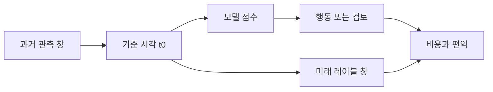



좋은 머신러닝 시스템은 복잡한 모델에서 시작하지 않는다. **누가, 언제, 어떤 정보를 사용해, 어떤 행동을 더 잘 선택할 것인가**를 명시하는 데서 시작한다. 이 질문이 불분명하면 높은 검증 점수도 실제 가치로 연결되지 않는다.

이 글은 표 형식 예측 문제를 중심으로 설명하지만, 시계열·이상 탐지·추천·Scientific ML에도 같은 원칙을 적용할 수 있다.

## 1. 문제: 모델보다 먼저 실패하는 지점

머신러닝 프로젝트의 흔한 실패는 다음과 같은 순서로 발생한다.

1. 업무 질문을 곧바로 분류·회귀 문제로 번역한다.
2. 현재 데이터베이스에서 쉽게 얻을 수 있는 열을 모두 특징으로 넣는다.
3. 무작위로 학습·검증 데이터를 나눈다.
4. 가장 높은 점수의 모델을 선택한다.
5. 운영 시점에는 학습 때 있던 정보가 없거나, 예측이 너무 늦거나, 행동 비용이 편익보다 크다는 사실을 발견한다.

핵심 원인은 **예측 대상, 관측 가능 정보, 의사결정 시점, 행동 결과**가 하나의 계약으로 고정되지 않았기 때문이다.

### 예측 문제가 아니라 의사결정 문제로 쓴다

“사건을 예측한다”는 문장은 부족하다. 최소한 다음 항목이 필요하다.

| 항목 | 반드시 답할 질문 |
|---|---|
| 예측 단위 | 한 행은 사람, 장비, 거래, 구간, 세션 중 무엇인가? |
| 기준 시각 | 모델이 호출되는 정확한 시각은 언제인가? |
| 관측 창 | 어느 기간의 정보까지 사용할 수 있는가? |
| 예측 지평 | 기준 시각 이후 언제까지의 결과를 예측하는가? |
| 행동 | 점수가 높거나 낮을 때 실제로 무엇을 바꾸는가? |
| 비용 | 거짓 양성, 거짓 음성, 지연, 검토 비용은 각각 얼마인가? |
| 제약 | 응답 시간, 설명 가능성, 가용 인력, 규정상 한계는 무엇인가? |

동일한 데이터라도 예측 지평이 10분인지 30일인지에 따라 레이블, 특징, 검증 방식, 가능한 행동이 모두 바뀐다.

### 데이터 누수는 “정답 열을 넣는 실수”보다 넓다

데이터 누수(leakage)는 운영 시점에 알 수 없는 정보가 학습이나 평가에 들어가는 모든 경우를 뜻한다.

- **목표 누수**: 결과가 발생한 뒤 생성되는 상태 코드나 사후 조치 기록을 사용한다.
- **시간 누수**: 전체 기간 통계, 미래 보정값, 뒤늦게 확정된 값을 과거 행에 붙인다.
- **분할 누수**: 같은 개체·사건에서 파생된 행이 학습과 검증에 동시에 존재한다.
- **전처리 누수**: 결측치 대체, 스케일링, 특징 선택을 전체 데이터에 먼저 적합한다.
- **레이블 누수**: 레이블을 만드는 규칙이 입력 특징과 사실상 동일하다.
- **운영 누수**: 오프라인 데이터에는 있지만 온라인 추론 경로에서는 늦게 도착하는 열을 쓴다.

누수 여부는 열 이름만 보고 판단할 수 없다. **그 값이 언제 생성되고, 언제 확정되며, 언제 조회 가능한지**를 알아야 한다.

## 2. Mental model: 시간축 위의 계약과 위험 최소화

### 모든 행에 “as-of time”을 부여한다

각 예측 행에는 기준 시각 \(t_0\)가 있다. 특징은 \(t_0\)까지 관측 가능한 정보만으로 계산하고, 레이블은 그 이후 구간에서 정의한다.

\[
X_i = g\left(\mathcal{H}_i(t \le t_0)\right), \qquad
y_i = h\left(\mathcal{H}_i(t_0 < t \le t_0 + H)\right)
\]

- \(\mathcal{H}_i\): 대상 \(i\)의 사건 이력
- \(t_0\): 예측 기준 시각
- \(H\): 예측 지평
- \(g\): 과거 정보로 특징을 만드는 함수
- \(h\): 미래 구간으로 레이블을 만드는 함수

이 표기만 명확해도 많은 누수를 사전에 차단할 수 있다.



### 모델 점수는 목적함수가 아니라 의사결정의 입력이다

모델은 보통 \(s(x)\) 또는 확률 \(p(y=1\mid x)\)를 출력한다. 실제 목적은 모델 손실만 줄이는 것이 아니라 의사결정 정책 \(a(s)\)의 기대 비용을 줄이는 것이다.

\[
R(a) = \mathbb{E}\left[C\bigl(Y, a(s(X))\bigr)\right]
\]

따라서 AUC가 높은 모델이 반드시 더 좋은 운영 정책을 만들지는 않는다. 확률 보정, 임계값, 검토 용량, 행동 효과를 함께 봐야 한다.

### 데이터 계약은 스키마가 아니라 의미 계약이다

스키마는 이름과 자료형을 정의한다. 데이터 계약은 거기에 다음을 더한다.

- 행의 의미와 고유 키
- 이벤트 시간과 적재 시간
- 허용 범위·단위·결측 의미
- 데이터 생성 주체와 갱신 주기
- 운영 시점 가용성
- 수정·지연 도착 가능성
- 품질 위반 시 처리 방식

모델 코드는 데이터 계약을 암묵적으로 가정한다. 그 가정을 문서와 자동 검증으로 끌어내야 재현성과 유지보수성이 생긴다.

## 3. 실전 workflow

### Step 1. Decision card를 먼저 작성한다

모델링 전에 한 페이지로 다음을 고정한다.

```yaml
decision:
  unit: "한 번의 평가 대상"
  as_of_time: "모델 호출 직전 시각"
  observation_window: "t0 이전의 고정 길이 구간"
  prediction_horizon: "t0 이후의 결과 관측 구간"
  action: "점수 구간별 검토 또는 개입"
  capacity: "단위 시간당 처리 가능한 최대 건수"

label:
  definition: "미래 구간에서 관측되는 객관적 조건"
  maturity_delay: "레이블이 최종 확정되기까지의 시간"
  exclusions: "판정 불가능하거나 중도 절단된 사례"

constraints:
  max_latency_ms: 200
  explainability: "개별 판단 근거 제공"
  fallback: "모델 또는 특징 장애 시 기본 정책"
```

숫자는 시스템 요구에 맞게 결정하되, 반드시 버전 관리한다. 특히 레이블 정의 변경은 단순한 코드 수정이 아니라 문제 자체의 변경이다.

### Step 2. 레이블의 타당성과 관측 편향을 점검한다

레이블은 현실의 진실이 아니라 대개 **측정 절차의 결과**다. 다음 질문을 확인한다.

- 결과가 모든 대상에게 같은 방식으로 관측되는가?
- 검사를 받은 대상만 양성 여부를 알 수 있는가?
- 기존 정책이 누구를 검사할지 결정해 선택 편향이 생겼는가?
- 결과 확정이 늦어 최근 데이터의 음성이 아직 미성숙한 것은 아닌가?
- 수동 판정자 간 불일치가 있는가?
- “미관측”을 “음성”으로 잘못 취급하지 않았는가?

레이블 품질이 낮으면 더 복잡한 모델은 그 불확실성을 더 정교하게 학습할 뿐이다. 불일치 표본 재검토, 다중 판정, 약한 레이블 표시, 확정 지연 구간 제외 같은 절차가 먼저다.

### Step 3. 열 단위 provenance와 가용 시각을 기록한다

특징 카탈로그를 다음처럼 관리한다.

| 특징 | 원천 | 계산식 버전 | 이벤트 시각 | 가용 지연 | 단위 | 결측 의미 |
|---|---|---|---|---|---|---|
| 최근 횟수 | 이벤트 로그 | v2 | 원천 사건 시각 | 수분 | count | 이력 없음/수집 실패 구분 |
| 이동 통계 | 센서 집계 | v1 | 창 종료 시각 | 수초 | 표준 단위 | 품질 필터로 제외 가능 |
| 범주 상태 | 운영 시스템 | v3 | 상태 변경 시각 | 수분 | category | 미입력/해당 없음 구분 |

훈련용 point-in-time join은 단순한 키 조인이 아니다. 각 예측 시각보다 늦지 않은 최신 값을 가져와야 한다.

```sql
-- 개념 예시: 실제 문법은 데이터 엔진에 맞게 조정한다.
SELECT p.entity_id, p.as_of_time, f.feature_value
FROM prediction_points p
LEFT JOIN feature_history f
  ON p.entity_id = f.entity_id
 AND f.available_at <= p.as_of_time
QUALIFY ROW_NUMBER() OVER (
  PARTITION BY p.entity_id, p.as_of_time
  ORDER BY f.available_at DESC
) = 1;
```

`event_time <= as_of_time`만으로 충분하지 않을 수 있다. 사건은 과거에 일어났지만 시스템에 늦게 들어온 값이라면 `available_at`을 기준으로 해야 한다.

### Step 4. 분할 전략을 모델보다 먼저 고정한다

분할은 배포 환경을 모사해야 한다.

- 미래를 예측한다면 시간 순서 분할
- 새 사용자·장비로 일반화한다면 그룹 분할
- 장소나 기관 간 이전이 목적이면 도메인 단위 분할
- 동일 사건에서 여러 행이 파생되면 사건 ID 단위 분할
- 튜닝을 반복한다면 최종 테스트 구간은 마지막까지 봉인

전처리는 각 학습 fold에서만 적합해야 한다.

```python
# 실행 가능한 특정 라이브러리 코드가 아니라 구조를 보여 주는 의사코드다.
for train_idx, valid_idx in splitter.split(rows, groups=entity_ids, time=as_of_time):
    preprocess = Preprocessor().fit(rows[train_idx])
    X_train = preprocess.transform(rows[train_idx])
    X_valid = preprocess.transform(rows[valid_idx])

    model = Model(config).fit(X_train, y[train_idx])
    predictions[valid_idx] = model.predict_proba(X_valid)
```

### Step 5. 베이스라인 사다리를 만든다

베이스라인은 낮은 점수를 얻기 위한 형식적 단계가 아니다. 새 복잡성이 실제 가치를 만드는지 판단하는 기준이다.

1. **정책 베이스라인**: 현재 사용 중인 규칙 또는 아무 행동도 하지 않는 정책
2. **상수 베이스라인**: 전체 평균, 중앙값, 최근 값, 다수 클래스
3. **단일 특징 규칙**: 가장 강한 것으로 예상되는 한두 개 신호
4. **단순 통계 모델**: 정규화된 선형·로지스틱 모델
5. **비선형 모델**: 상호작용을 학습하는 트리·신경망 계열
6. **앙상블**: 이득이 운영 복잡성과 계산 비용을 정당화할 때만

각 단계에서 동일한 split, 동일한 metric, 동일한 비용 가정으로 비교한다. 복잡한 모델의 평균 점수 향상이 작고 분산이 크다면 단순 모델이 더 나은 선택일 수 있다.

### Step 6. 실험 단위를 완전히 기록한다

하나의 실험은 최소한 다음 튜플로 식별되어야 한다.

\[
E = (D, L, S, F, M, H, C, R)
\]

- \(D\): 데이터 스냅샷
- \(L\): 레이블 정의 버전
- \(S\): 분할 명세
- \(F\): 특징 코드·목록
- \(M\): 모델 구현 버전
- \(H\): 하이퍼파라미터
- \(C\): 실행 환경
- \(R\): 난수 시드와 반복 정보

점수만 남겨서는 결과를 재현할 수 없다. 실패한 실험도 “왜 기각했는지”와 함께 남기면 같은 길을 반복하지 않는다.

### Step 7. 오프라인 지표를 운영 정책으로 번역한다

분류 문제라면 단일 임계값만 보고하지 말고 다음을 함께 본다.

- ROC-AUC와 PR-AUC
- 임계값별 precision, recall, specificity
- 확률 보정과 신뢰도 곡선
- 상위 \(k\)%에서의 적중률과 포착률
- 시간·그룹·중요 하위집단별 성능
- 처리 용량을 반영한 기대 비용
- 입력 누락·지연 시 성능

회귀 문제라면 MAE나 RMSE 외에도 잔차의 방향성, 극단 구간, 예측 구간 포함률, 의사결정 경계 근처 오차를 확인한다.

## 4. 평가·검증 checklist

### 문제 정의

- [ ] 예측 단위, 기준 시각, 관측 창, 예측 지평이 명시되었다.
- [ ] 모델 점수가 어떤 행동으로 이어지는지 정의되었다.
- [ ] 거짓 양성·거짓 음성·지연·검토 비용이 구분되었다.
- [ ] 레이블 확정 지연과 중도 절단 규칙이 정해졌다.

### 데이터 계약과 누수

- [ ] 모든 특징의 생성 시각과 운영 가용 시각을 알고 있다.
- [ ] point-in-time correct join을 사용했다.
- [ ] 같은 개체·사건의 파생 행이 split 경계를 넘지 않는다.
- [ ] 전처리와 특징 선택을 학습 fold 안에서만 적합했다.
- [ ] 전체 기간 집계, 사후 상태, 수정된 최종값을 점검했다.
- [ ] 결측이 “없음”, “미측정”, “수집 실패” 중 무엇인지 구분했다.

### 베이스라인과 검증

- [ ] 현재 정책과 상수·단순 모델 베이스라인이 있다.
- [ ] 배포 환경을 모사한 시간·그룹·도메인 분할을 사용했다.
- [ ] 여러 시드 또는 여러 시간 창에서 변동성을 확인했다.
- [ ] 평균뿐 아니라 불확실성 구간과 최악 하위집단을 보고했다.
- [ ] 최종 테스트 데이터는 의사결정이 끝날 때까지 봉인했다.

### 운영 가능성

- [ ] 훈련과 서빙 특징 계산이 동일한 의미를 갖는다.
- [ ] 지연 시간, 메모리, 처리량, 특징 신선도를 측정했다.
- [ ] 모델 장애·특징 누락 시 fallback이 정의되었다.
- [ ] 모니터링 지표와 재학습·롤백 조건이 정해졌다.

## 5. 한계와 주의점

첫째, 완전한 데이터 계약이 데이터의 진실성을 보장하지는 않는다. 센서 오류, 판정 편향, 기록 관행 변화는 별도의 품질 조사와 현장 지식이 필요하다.

둘째, 좋은 오프라인 검증도 개입의 인과 효과를 자동으로 증명하지 않는다. 모델이 잘 맞히는 것과 모델에 따라 행동했을 때 결과가 개선되는 것은 다른 질문이다. 실제 정책 효과는 단계적 배포, 무작위 실험, 준실험 설계 등으로 확인해야 한다.

셋째, 레이블과 환경은 변한다. 최초 문제 정의는 영구 계약이 아니라 버전이 있는 가설이다. 다만 변경할 때는 과거 결과와 비교 가능하도록 무엇이, 왜 바뀌었는지 기록해야 한다.

마지막으로, 가장 정확한 모델이 항상 최선은 아니다. 데이터 신선도, 설명 가능성, 장애 복구, 유지 비용까지 포함한 **전체 시스템 위험**이 더 작은 모델이 실제로는 더 좋은 모델이다.
