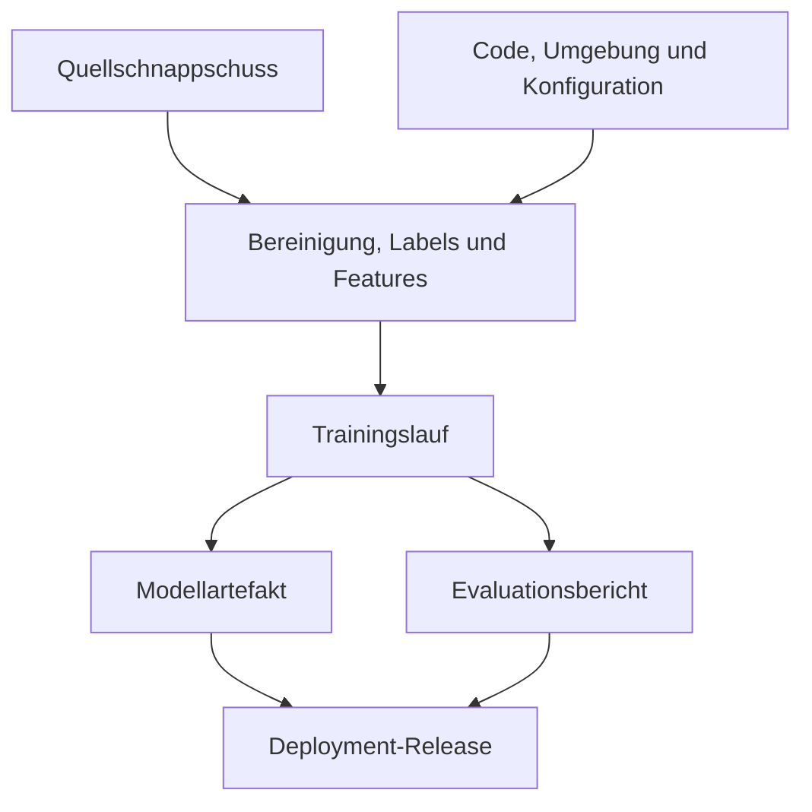
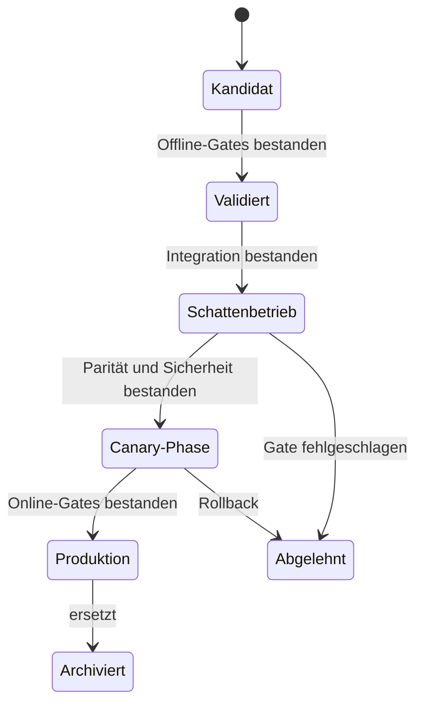



Bei MLOps geht es nicht nur darum, das Modelltraining zu automatisieren. Sein Kern besteht darin, **nachzuweisen, welche Daten und welcher Code ein Modell aus welchem Grund erzeugten, es unter denselben Bedingungen neu zu erstellen, sicher zu promovieren und bei einem Fehler zurückzurollen**.

Eine einzelne Modelldatei bewahrt ein Ergebnis, aber kein reproduzierbares System. Eingabedaten, Labeldefinition, Feature-Code, Ausführungsumgebung, Evaluationsrichtlinie, Schwellenwerte und Deployment-Konfiguration müssen sämtlich verknüpft sein.

## 1. Das Problem: Warum „derselbe Code“ nicht dasselbe Modell erzeugt

Ein Machine-Learning-Ergebnis ist eine Funktion von:

\[
Artifact = F(D, L, S, C, E, H, R, P)
\]

- \(D\): Quelldaten und Schnappschuss
- \(L\): Labeldefinition
- \(S\): Aufteilung in Training, Validierung und Test
- \(C\): Code für Features, Vorverarbeitung und Training
- \(E\): Betriebssystem, Laufzeit, Bibliotheken und Hardwareumgebung
- \(H\): Hyperparameter
- \(R\): Zufalls-Seeds und nichtdeterministische Operationen
- \(P\): Trainingsrichtlinie und Ausführungsreihenfolge

Selbst beim gleichen Git-Commit verändert eine Datenänderung das Ergebnis. Auch bei demselben Datenschnappschuss können eine andere Label-SQL-Abfrage, Bibliothek oder Reihenfolge des verteilten Trainings das Ergebnis verändern.

### Häufige betriebliche Brüche

- Es funktioniert in einem Notebook, lässt sich aber in der Batch-Pipeline nicht reproduzieren.
- Das erneute Lesen der neuesten Quelltabelle verändert unbemerkt die Daten eines früheren Experiments.
- Eine Modelldatei mit demselben Namen wird überschrieben.
- Offline-Vorverarbeitung und Online-Feature-Berechnung unterscheiden sich.
- Metriken wurden aufgezeichnet, nicht aber die Evaluationsdaten und die Version der Metrikimplementierung.
- Das Wahrscheinlichkeitsmodell blieb gleich und nur der Schwellenwert änderte sich, dennoch fehlt eine Änderungshistorie.
- Das Tag `production` ist nur ein manuell gesetzter Alias ohne Validierungs-Gate.
- Nach dem Deployment kann niemand nachvollziehen, welches Modell eine bestimmte Anfrage beantwortete.

### Reproduzierbarkeit besitzt Stufen

1. **Wiederholbarkeit**: Denselben Lauf mit demselben Code, denselben Daten und derselben Umgebung wiederholen.
2. **Reproduzierbarkeit**: Das Ergebnis in einer unabhängigen Umgebung nach demselben Verfahren innerhalb einer definierten Toleranz reproduzieren.
3. **Replizierbarkeit**: Mit einer unabhängigen Implementierung und unabhängigen Daten bestätigen, dass die Schlussfolgerung Bestand hat.

Sind Hardwareoperationen nichtdeterministisch, ist es realistischer, Toleranzen für Metriken und Vorhersageunterschiede festzulegen, als bitweise Gleichheit zu verlangen.

## 2. Denkmodell: ein Provenienzgraph unveränderlicher Artefakte

MLOps sollte als gerichteter azyklischer Graph und nicht als Dateiablage gedacht werden.



Jeder Knoten besitzt eine unveränderliche ID, und jede Kante bedeutet „wurde daraus erzeugt“. Ein Name wie „latest“ ist lediglich ein verschiebbarer Zeiger auf ein unveränderliches Artefakt.

### Artefakt und Release unterscheiden

- **Modellartefakt**: trainierte Gewichte, Vorverarbeitung, Signatur und Metadaten
- **Entscheidungsrichtlinie**: Kalibrator, Schwellenwerte, Regeln und Fallback
- **Release**: Deployment-Einheit aus einem bestimmten Artefakt, einer Richtlinie, Serving-Code und Umgebung

Eine Änderung des Schwellenwerts verändert das tatsächliche Verhalten, auch wenn die Modellgewichte identisch bleiben. Deshalb muss die Richtlinie versioniert und in die Release-Herkunft aufgenommen werden.

### Eine Registry ist ein Zustandsautomat, kein Dateilager

Beispiel für empfohlene Zustände:



Jeder Zustandsübergang muss Validierungsnachweise, genehmigende Person, Zeitpunkt und Begründung bewahren. Ein manueller Prozess, der nur einen Tag-Namen ändert, besitzt eine schwache Auditierbarkeit und Reproduzierbarkeit.

## 3. Praktischer Workflow

### Schritt 1. Reproduzierbarkeitsvertrag festlegen

Zu Projektbeginn ist festzulegen:

- Müssen Wiederholungsläufe denselben Artefakt-Hash, dieselben Vorhersagen oder denselben Metrikbereich erzeugen?
- Welcher numerische Fehler ist akzeptabel?
- Werden Quelldaten als Schnappschuss, Append-only-Log oder Query-as-of-Ergebnis fixiert?
- Welche Aufbewahrungs- und Löschrichtlinien gelten?
- Gibt es abgeleitete Daten, die eine Reproduktion ohne sensible Daten ermöglichen?
- Wer darf welches Artefakt in die Produktion promovieren?

Deterministische Optionen können die Leistung verringern. Strenge Reproduzierbarkeit in der Forschung und statistische Reproduzierbarkeit bei groß angelegtem Produktionstraining dürfen unterschieden werden, doch dieser Unterschied muss dokumentiert sein.

### Schritt 2. Ausführbaren Code von deklarativer Konfiguration trennen

Notebooks sind für die Exploration hilfreich, der endgültige Trainingspfad sollte jedoch in parametrisierte Funktionen und Befehle verschoben werden.

```yaml
run:
  code_revision: "immutable-commit-id"
  random_seed: 1729

data:
  snapshot_id: "content-addressed-id"
  label_spec_version: "label-v4"
  split_spec_version: "temporal-split-v2"

features:
  definition_version: "features-v7"
  fit_scope: "train-only"

model:
  family: "candidate-family"
  hyperparameters:
    regularization: 0.01

evaluation:
  metric_spec_version: "metrics-v3"
  slices: [time, domain, data_quality]
```

Die Zahlenwerte sind nur Beispiele. Entscheidend ist, dass eine eingecheckte Konfigurationsdatei den Lauf definiert und nicht Argumente, an die sich eine Person erinnert.

Keine Geheimnisse in die Konfiguration schreiben. Sie werden über einen eigenen Secret-Pfad injiziert und in Logs sowie Artefakten maskiert.

### Schritt 3. Datenschnappschüsse und Herkunft erzeugen

Die Strategie zur Datenversionierung hängt von Größenordnung und Regulierung ab.

#### Physischer Schnappschuss

Die für das Training verwendeten Zeilen werden in unveränderlichen Dateien gespeichert. Die Reproduktion ist einfach, doch doppelter Speicher und die Aufbewahrung sensibler Daten schaffen Risiken.

#### Abfrage + Quellversion

Abfrage, Version der Quellpartition und As-of-Zeitstempel werden gespeichert. Die Quelle muss Zeitreisen und Unveränderlichkeit unterstützen.

#### Inhaltsadressiertes Manifest

Dateipfade, Größen, Prüfsummen, Schema, Zeilenzahlen und Zeitraum werden in einem Manifest gebündelt. Ändert sich der Inhalt, ändert sich auch die ID.

Beispiel eines Datenmanifests:

```json
{
  "dataset_id": "sha256:...",
  "created_at": "ISO-8601 timestamp",
  "schema_version": "v5",
  "label_spec": "label-v4",
  "time_range": {"start": "...", "end": "..."},
  "partitions": [
    {"uri": "immutable/path", "sha256": "...", "rows": 0}
  ],
  "quality_report_id": "sha256:..."
}
```

Personenbezogene Informationen oder ursprüngliche Datensatztexte dürfen nicht in Registry-Metadaten repliziert werden. Die Herkunft sollte nur die mindestens nötigen Kennungen und zugriffsgeschützten Speicherorte enthalten.

### Schritt 4. Features und Labels sowohl im Code als auch in den Daten versionieren

Eine Feature-Version ist mehr als eine Spaltenliste.

- Formeln und Fensterdefinitionen
- Regeln für Point-in-time-Joins
- Umgang mit fehlenden Werten, Ausreißern und Einheitenumrechnung
- Kategoriewörterbücher und Behandlung unbekannter Werte
- Statistiken, die angepasst werden müssen
- Äquivalenz von Online- und Offline-Implementierung

Eine Labelversion umfasst Ereignisdefinition, Beobachtungshorizont, Ausschlussregeln, Reifeverzögerung und Richtlinie zur manuellen Entscheidung.

Der angepasste Preprocessor wird zusammen mit dem Modell im Trainingsartefakt gebündelt, oder es wird auf das exakt erforderliche Vorverarbeitungsartefakt verwiesen. Zur Inferenzzeit darf kein beliebiger neuester Preprocessor abgerufen werden.

### Schritt 5. Umgebung sperren und Build-Provenienz aufzeichnen

Mindestens Folgendes ist festzulegen:

- Laufzeitversion
- Lockdatei für direkte und transitive Abhängigkeiten
- Betriebssystem und Systembibliotheken
- Informationen zu CPU/GPU und Beschleunigungsbibliotheken
- Digest des Container-Images
- Compiler-Optionen
- Werte von Umgebungsvariablen, die Ergebnisse beeinflussen

Tags können verschoben werden; deshalb wird beim Deployment neben dem Image-Tag auch der Image-Digest aufgezeichnet. Für die Lieferkettensicherheit werden Abhängigkeitsinventar, Ergebnisse von Schwachstellenscans, Signaturen und Attestierungen mit den Release-Nachweisen verknüpft.

### Schritt 6. Jeden Lauf strukturiert erfassen

Jeder Lauf benötigt folgende Angaben:

| Kategorie | Aufgezeichnete Elemente |
|---|---|
| Eingabe | Dataset-, Label-, Split- und Feature-Version |
| Code | Commit, Dirty-Status, Build-ID |
| Umgebung | Image-Digest, Laufzeit, Hardware |
| Training | Konfiguration, Seed, Dauer, Ressourcennutzung |
| Ausgabe | Modellprüfsumme, Preprocessor, Signatur |
| Evaluation | Metrik, Konfidenzintervall, Segmentbericht |
| Entscheidung | Annahme- oder Ablehnungsgrund, Prüfer, Vergleichsbasis |

Fand der Lauf in einem veränderten Arbeitsbaum statt, wird das Diff als Artefakt aufbewahrt oder der Lauf von einer Promotion ausgeschlossen. „Die Commit-ID war gleich, aber es gab lokale Änderungen“ ist eine häufige Ursache gebrochener Reproduzierbarkeit.

### Schritt 7. Verträge in das Modellpaket aufnehmen

Ein Modellpaket sollte mindestens Folgendes enthalten:

- Gewichte oder ein serialisiertes Modell
- Artefakte der Vor- und Nachverarbeitung
- Ein-/Ausgabesignatur
- Feature-Namen, Reihenfolge, Datentypen und Einheiten
- Richtlinien für fehlende Werte und unbekannte Kategorien
- Herkunfts-IDs von Trainingsdaten und Code
- ID des Evaluationsberichts
- erwartete Ressourcen- und Latenzbereiche
- Lizenz-, Sicherheits- und Nutzungseinschränkungen
- unterstützte Domänen und bekannte Fehlermodi

Beispiel einer Signatur:

```json
{
  "inputs": [
    {"name": "feature_a", "dtype": "float32", "nullable": false},
    {"name": "category_b", "dtype": "string", "unknown": "map_to_other"}
  ],
  "outputs": [
    {"name": "risk_probability", "dtype": "float32", "range": [0, 1]}
  ]
}
```

Übereinstimmende Schemata garantieren keine übereinstimmende Bedeutung. Für Einheiten, Referenzzeiten und Kategoriedefinitionen sind zusätzlich semantische Vertragstests nötig.

### Schritt 8. Promotion-Gates als Code implementieren

Ein Kandidat muss automatisierte und manuelle Gates bestehen, bevor er in die nächste Stufe wechseln darf.

#### Daten-Gates

- Schema- und semantische Verträge
- Leakage, Duplikate und Zeitgrenzen
- Änderungen bei Fehlwertanteil, Wertebereichen und Kategorien
- Labelreife und -qualität

#### Modell-Gates

- Mindestleistung gegenüber einer festen Basislinie
- Untergrenzen für wichtige Segmente
- Kalibrierungs- und Unsicherheitsqualität
- Robustheits- und Stresstests
- Fairness- und Sicherheitsanforderungen

#### System-Gates

- Serialisierungs-Roundtrip
- Parität zwischen Batch- und Online-Vorhersage
- Latenz, Speicher und Durchsatz
- Fallbacks bei Fehlern, Timeouts und fehlenden Features
- Sicherheitsprüfungen und Abhängigkeitsrichtlinie

Ein Gate sollte nicht nur die Durchschnittsleistung vergleichen. Zum Beispiel:

\[
\Delta m = m_{candidate}-m_{champion}
\]

Neben einem durchschnittlichen \(\Delta m>0\) sind Konfidenzintervalle, Regressionen in Untergruppen und Betriebskosten zu berücksichtigen. Ein Kandidat kann den Gesamtdurchschnitt verbessern und zugleich ein wichtiges Segment schädigen.

### Schritt 9. Online-Risiko durch Shadowing und Canarys begrenzen

Im **Shadow**-Modus werden reale Anfragen zur Vorhersage an den Kandidaten kopiert, doch seine Ausgabe beeinflusst das Verhalten nicht.

- Signatur- und Feature-Parität
- Latenz und Ressourcen
- Unterschiede zwischen den Vorhersagen des Kandidaten und des aktuellen Modells
- Fehler und Fallbacks
- OOD-Rate im realen Traffic

Bei einem **Canary** wird der Kandidaten-Release tatsächlich auf einen begrenzten Teil des Traffics angewandt.

- schrittweise Traffic-Ausweitung
- vorab definierte Leitplanken
- automatische Stopp- und Rollback-Bedingungen
- stabile Zuweisung, damit ein Benutzer oder eine Entität nicht zwischen Modellen hin- und herwechselt
- Ergebnisverfolgung nach Modellversion

Bei sicherheitskritischen Entscheidungen kann dem Canary eine menschliche Genehmigung oder eine rein beratende Stufe vorausgehen.

### Schritt 10. Rollback vor dem Deployment üben

Ein Rollback erfordert mehr als die vorige Modelldatei.

- Modell, Vorverarbeitung und Richtlinie des vorigen Releases
- kompatibles Feature-Schema
- Rückwärtskompatibilität für Datenmigrationen
- Traffic-Routing-Konfiguration
- Regeln gegen erneute Verarbeitung und doppelte Aktionen
- Überwachungskriterien nach dem Rollback

Werden Modell und Feature-Pipeline unabhängig bereitgestellt, ist eine Kompatibilitätsmatrix erforderlich. Das Release-Bundle wird atomar verwaltet, damit ein Notfall-Rollback nicht fälschlich ein altes Modell mit neuen Features kombiniert.

### Schritt 11. CI, CD und CT getrennt betreiben

- **CI**: Code- und Datenverträge, Unit-/Integrationstests und ein kleiner reproduzierbarer Trainingslauf
- **CD**: einen validierten Release in einer Umgebung bereitstellen und durch Shadowing sowie Canarys führen
- **CT**: Daten aktualisieren und abhängig von Bedingung oder Zeitplan Kandidatenmodelle erzeugen

Automatisches CT verlangt keine automatische Produktions-Promotion. Je nach Risiko sind eine menschliche Genehmigung, eine Mindestbeobachtungszeit und Online-Nachweise erforderlich.

## 4. Prüfliste für Evaluation und Verifikation

### Reproduzierbarkeit

- [ ] Code-Commit und Dirty-Status aufzeichnen.
- [ ] Dataset-, Label-, Split- und Feature-Versionen über unveränderliche IDs verknüpfen.
- [ ] Lockdatei, Image-Digest und Hardwareinformationen bewahren.
- [ ] Richtlinie für Seeds und nichtdeterministische Operationen festlegen.
- [ ] Toleranzen für bitweise oder statistische Reproduzierbarkeit definieren.
- [ ] Einen repräsentativen Lauf in einer sauberen Umgebung wiederholen.

### Herkunft und Registry

- [ ] Ein Modell lässt sich zu seinem Quellschnappschuss zurückverfolgen.
- [ ] Der Evaluationsbericht verweist auf das exakte Artefakt und Testset.
- [ ] Modell-, Richtlinien- und Release-Versionen sind getrennt.
- [ ] Artefakte werden niemals überschrieben und über Prüfsummen identifiziert.
- [ ] Jeder Zustandsübergang bewahrt Gate, Genehmiger, Zeitpunkt und Begründung.
- [ ] Sensible Quelldaten und Geheimnisse fehlen in Metadaten und Logs.

### Promotion

- [ ] Der Kandidat wurde unter identischen Bedingungen mit Basislinie und aktuellem Produktionsmodell verglichen.
- [ ] Wichtige Segmente besitzen Untergrenzen, nicht nur eine Gesamtleistung.
- [ ] Signatur-, Semantik- sowie Online-/Offline-Paritätstests bestehen.
- [ ] Latenz, Speicher, Durchsatz und Fallback-Verhalten wurden verifiziert.
- [ ] Shadow-Nachweise wurden geprüft.
- [ ] Bedingungen für Canary-Ausweitung, Stopp und Rollback sind quantifiziert.

### Betrieb und Wiederherstellung

- [ ] Jede Vorhersage kann einer Release-ID zugeordnet werden.
- [ ] Eingaben, Ausgaben, Leistung und Richtlinienergebnisse werden nach Version überwacht.
- [ ] Der vorige Release und kompatible Features lassen sich sofort wiederherstellen.
- [ ] Das Rollback-Runbook wurde geübt.
- [ ] Lösch- und Aufbewahrungsanforderungen für Daten gelten auch für Herkunftsartefakte.
- [ ] Nachträglich lassen sich Ursachen des erneuten Trainings und Promotion-Entscheidungen auditieren.

## 5. Einschränkungen und Vorbehalte

Erstens verbessert das Speichern sämtlicher Informationen die Reproduzierbarkeit, erhöht aber auch Kosten und Datenschutzrisiken. Statt Quelldaten zu duplizieren, sind unveränderliche Referenzen, Manifeste und Zugriffskontrollen zu verwenden; außerdem werden Aufbewahrungsfristen festgelegt.

Zweitens kann vollständiger Determinismus mit Leistung und Geschwindigkeit kollidieren. Entscheidend ist, die Grenzen offenzulegen und zu prüfen, dass sich Ergebnisse und Schlussfolgerungen innerhalb der definierten Toleranz wiederholen.

Drittens schafft eine Registry nicht automatisch Governance. Besteht sie aus bedeutungslosen manuellen Tags, umgehbaren Gates und zeremoniellen Genehmigungen, unterscheidet sie sich nicht von einem Dateiserver.

Viertens garantieren Offline-Gates keine kausalen Online-Wirkungen. Shadowing prüft Systemkompatibilität, Canarys prüfen begrenzte Auswirkungen in der realen Welt. Beide liefern unterschiedliche Nachweise.

Schließlich ist automatisches erneutes Training nicht gleichbedeutend mit automatischer Verbesserung. Es kann einen Datenausfall oder eine Richtlinienverzerrung schneller erlernen. Erneutes Training, Rekalibrierung, Schwellenwertänderungen und Rollback sind als getrennte Reaktionen zu entwerfen.
