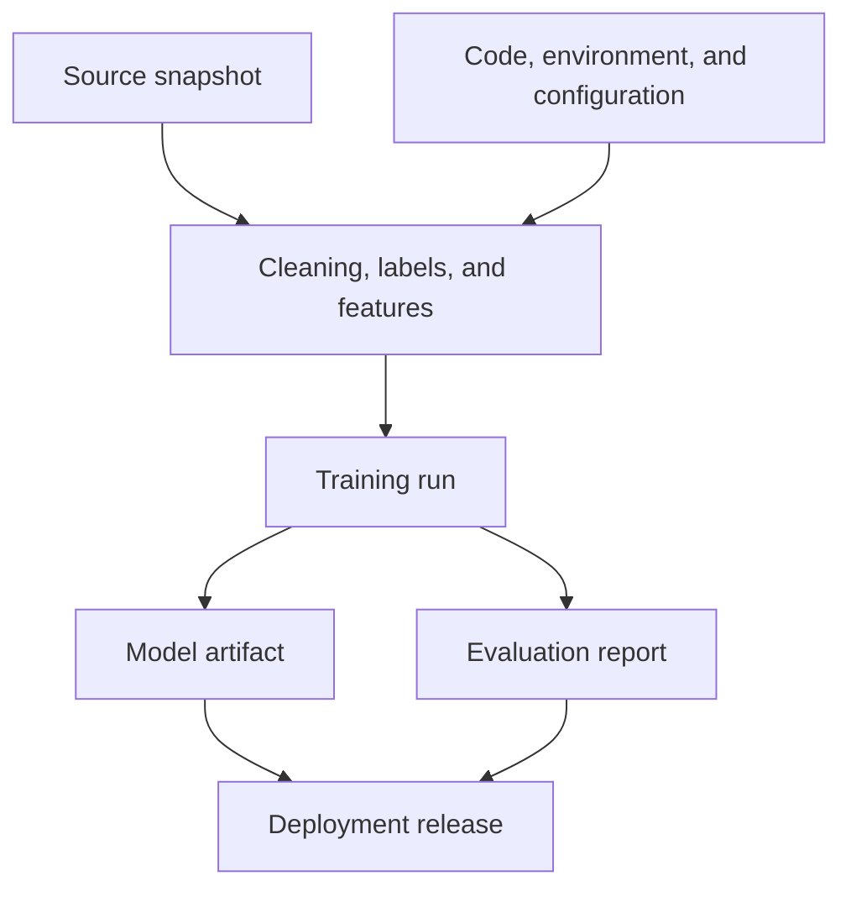
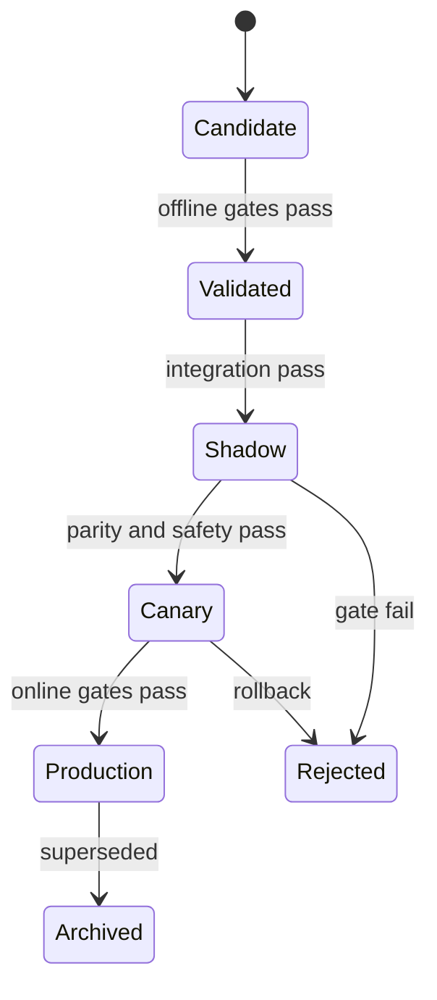



MLOps is not merely about automating model training. Its essence is **proving which data and code produced a model and why, rebuilding it under the same conditions, promoting it safely, and rolling it back when something goes wrong**.

Saving one model file preserves an output, but not a reproducible system. The input data, label definition, feature code, execution environment, evaluation policy, thresholds, and deployment configuration must all be linked.

## 1. The Problem: Why “The Same Code” Does Not Produce the Same Model

A machine-learning result is a function of:

\[
Artifact = F(D, L, S, C, E, H, R, P)
\]

- \(D\): source data and snapshot
- \(L\): label definition
- \(S\): train/validation/test split
- \(C\): feature, preprocessing, and training code
- \(E\): operating system, runtime, libraries, and hardware environment
- \(H\): hyperparameters
- \(R\): random seeds and nondeterministic operations
- \(P\): training policy and execution order

Even with the same Git commit, a change in data changes the result. Even with the same data snapshot, a different label SQL query, library, or distributed-training order can change the result.

### Common Operational Disconnects

- It works in a notebook but cannot be reproduced in the batch pipeline.
- Rereading the latest source table silently changes the data used in a past experiment.
- A model file with the same name is overwritten.
- Offline preprocessing differs from online feature computation.
- Metrics were recorded, but the evaluation data and metric-implementation version were not.
- The probability model is unchanged and only the threshold changed, yet there is no change history.
- The `production` tag is merely an alias attached manually, with no validation gate.
- After deployment, no one can trace which model answered a particular request.

### Reproducibility Has Levels

1. **Repeatability**: Repeat the same run with the same code, data, and environment.
2. **Reproducibility**: Reproduce the result within a defined tolerance in an independent environment by following the same procedure.
3. **Replicability**: Confirm that the conclusion holds with an independent implementation and data.

When hardware operations are nondeterministic, defining tolerances for metrics and prediction differences is more realistic than requiring bitwise equality.

## 2. Mental Model: A Provenance Graph of Immutable Artifacts

Think of MLOps as a directed acyclic graph rather than a file repository.



Each node has an immutable ID, and each edge means “was produced from.” A name such as “latest” is only a movable pointer to an immutable artifact.

### Distinguish an Artifact from a Release

- **Model artifact**: Trained weights, preprocessing, signature, and metadata
- **Decision policy**: Calibrator, thresholds, rules, and fallback
- **Release**: A deployment unit combining a particular artifact, policy, serving code, and environment

Changing a threshold changes actual behavior even when the model weights remain identical. The policy must therefore be versioned and included in release lineage.

### A Registry Is a State Machine, Not a File Warehouse

Example recommended states:



Every state transition must retain validation evidence, approver, time, and reason. A manual process that only changes a tag name has weak auditability and reproducibility.

## 3. Practical Workflow

### Step 1. Define the Reproducibility Contract

At project start, specify:

- Must reruns produce the same artifact hash, predictions, or metric range?
- What numerical error is acceptable?
- Will source data be fixed as a snapshot, append-only log, or query-as-of result?
- What are the retention and deletion policies?
- Is there derived data that permits reproduction without sensitive data?
- Who may promote which artifact to production?

Deterministic options can reduce performance. Strict reproducibility during research and statistical reproducibility for large-scale production training may be distinguished, but the difference must be documented.

### Step 2. Separate Executable Code from Declarative Configuration

Notebooks are useful for exploration, but move the final training path into parameterized functions and commands.

```yaml
run:
  code_revision: "immutable-commit-id"
  random_seed: 1729

data:
  snapshot_id: "content-addressed-id"
  label_spec_version: "label-v4"
  split_spec_version: "temporal-split-v2"

features:
  definition_version: "features-v7"
  fit_scope: "train-only"

model:
  family: "candidate-family"
  hyperparameters:
    regularization: 0.01

evaluation:
  metric_spec_version: "metrics-v3"
  slices: [time, domain, data_quality]
```

The numerical values are only examples. What matters is that a committed configuration file—not arguments remembered by a person—defines the run.

Do not place secrets in configuration. Inject them through a dedicated secret path and mask them in logs and artifacts.

### Step 3. Create Data Snapshots and Lineage

The data-versioning strategy depends on scale and regulation.

#### Physical Snapshot

Store the rows used for training in immutable files. Reproduction is easy, but duplicate storage and sensitive-data retention create risk.

#### Query + Source Version

Store the query, source-partition version, and as-of timestamp. The source must support time travel and immutability.

#### Content-Addressed Manifest

Bundle file paths, sizes, checksums, schema, row counts, and time range in a manifest. If the contents change, the ID changes too.

Example data manifest:

```json
{
  "dataset_id": "sha256:...",
  "created_at": "ISO-8601 timestamp",
  "schema_version": "v5",
  "label_spec": "label-v4",
  "time_range": {"start": "...", "end": "..."},
  "partitions": [
    {"uri": "immutable/path", "sha256": "...", "rows": 0}
  ],
  "quality_report_id": "sha256:..."
}
```

Do not replicate personal information or original record text in registry metadata. Lineage should contain only the minimum identifiers and access-controlled locations.

### Step 4. Version Features and Labels in Both Code and Data

A feature version is more than a list of columns.

- formulas and window definitions
- point-in-time join rules
- missing-value, outlier, and unit conversions
- category dictionaries and unknown handling
- statistics that require fitting
- equivalence of online and offline implementations

A label version includes the event definition, observation horizon, exclusion rules, maturity delay, and manual-adjudication policy.

Bundle the fitted preprocessor with the model in the training artifact, or reference the exact preprocessing artifact required. Do not fetch an arbitrary latest preprocessor at inference time.

### Step 5. Lock the Environment and Record Build Provenance

At minimum, fix:

- runtime version
- lockfile for direct and transitive dependencies
- OS and system libraries
- CPU/GPU and acceleration-library information
- container image digest
- compiler options
- environment-variable values that affect results

Tags can move, so record the image digest as well as the image tag for deployment. For supply-chain safety, connect the dependency inventory, vulnerability scan results, signatures, and attestations to the release evidence.

### Step 6. Record Every Run in a Structured Form

Every run needs the following:

| Category | Recorded items |
|---|---|
| Input | dataset, label, split, feature version |
| Code | commit, dirty status, build ID |
| Environment | image digest, runtime, hardware |
| Training | config, seed, duration, resource usage |
| Output | model checksum, preprocessor, signature |
| Evaluation | metric, confidence interval, slice report |
| Decision | reason for acceptance or rejection, reviewer, comparison baseline |

If the run occurred with a modified working tree, preserve the diff as an artifact or exclude the run from promotion. “The commit ID was the same, but local changes existed” is a common cause of broken reproducibility.

### Step 7. Include Contracts in the Model Package

A model package should contain at least:

- weights or a serialized model
- preprocessing and postprocessing artifacts
- input/output signature
- feature names, order, data types, and units
- policies for missing values and unknown categories
- training-data and code-lineage IDs
- evaluation-report ID
- expected resource and latency ranges
- license, security, and usage restrictions
- supported domains and known failure modes

Example signature:

```json
{
  "inputs": [
    {"name": "feature_a", "dtype": "float32", "nullable": false},
    {"name": "category_b", "dtype": "string", "unknown": "map_to_other"}
  ],
  "outputs": [
    {"name": "risk_probability", "dtype": "float32", "range": [0, 1]}
  ]
}
```

Matching schemas do not guarantee matching meaning. Semantic contract tests are also required for units, reference times, and category definitions.

### Step 8. Implement Promotion Gates as Code

A candidate must pass automated and manual gates before moving to the next stage.

#### Data Gates

- schema and semantic contracts
- leakage, duplication, and time boundaries
- changes in missingness, ranges, and categories
- label maturity and quality

#### Model Gates

- minimum performance relative to a fixed baseline
- lower bounds for important slices
- calibration and uncertainty quality
- robustness and stress tests
- fairness and safety requirements

#### System Gates

- serialization round trip
- batch/online prediction parity
- latency, memory, and throughput
- fallbacks for failures, timeouts, and missing features
- security checks and dependency policy

A gate should not compare only average performance. For example:

\[
\Delta m = m_{candidate}-m_{champion}
\]

In addition to average \(\Delta m>0\), consider confidence intervals, subgroup regressions, and operating cost. A candidate may improve the overall average while harming an important slice.

### Step 9. Limit Online Risk with Shadowing and Canaries

In **shadow** mode, real requests are copied to the candidate for prediction, but its output does not affect behavior.

- signature and feature parity
- latency and resources
- differences between candidate and current-model predictions
- errors and fallbacks
- OOD rate in real traffic

In a **canary**, the candidate release is actually applied to limited traffic.

- gradual traffic expansion
- predefined guardrails
- automatic stop and rollback conditions
- stable assignment so a user or entity does not move back and forth between models
- outcome tracking by model version

For safety-critical decisions, human approval or an advisory-only stage may precede the canary.

### Step 10. Practice Rollback Before Deployment

Rollback requires more than the previous model file.

- previous release's model, preprocessing, and policy
- compatible feature schema
- backward compatibility for data migrations
- traffic-routing configuration
- rules that prevent reprocessing and duplicate actions
- post-rollback monitoring criteria

If the model and feature pipeline are deployed independently, a compatibility matrix is needed. Manage the release bundle atomically so an emergency rollback does not combine an old model with new features incorrectly.

### Step 11. Operate CI, CD, and CT Separately

- **CI**: code and data contracts, unit/integration tests, and a small reproducibility training run
- **CD**: deploy a validated release to an environment and progress through shadowing and canaries
- **CT**: refresh data and produce candidate models based on a condition or schedule

Automatic CT does not require automatic production promotion. Depending on risk, require human approval, a minimum observation period, and online evidence.

## 4. Evaluation and Verification Checklist

### Reproducibility

- [ ] Record the code commit and dirty status.
- [ ] Link dataset, label, split, and feature versions through immutable IDs.
- [ ] Preserve the lockfile, image digest, and hardware information.
- [ ] Specify the policy for seeds and nondeterministic operations.
- [ ] Define bitwise or statistical reproducibility tolerances.
- [ ] Replay a representative run in a clean environment.

### Lineage and Registry

- [ ] A model can be traced back to its source snapshot.
- [ ] The evaluation report references the exact artifact and test set.
- [ ] Model, policy, and release versions are distinct.
- [ ] Artifacts are never overwritten and are identified by checksum.
- [ ] Every state transition retains its gate, approver, time, and reason.
- [ ] Sensitive source data and secrets are absent from metadata and logs.

### Promotion

- [ ] The candidate was compared with the baseline and current production model under identical conditions.
- [ ] Important slices have lower bounds, not just overall performance.
- [ ] Signature, semantic, and online/offline parity tests pass.
- [ ] Latency, memory, throughput, and fallback behavior were verified.
- [ ] Shadow evidence was reviewed.
- [ ] Canary expansion, stop, and rollback conditions are quantified.

### Operations and Recovery

- [ ] Every prediction can be linked to a release ID.
- [ ] Inputs, outputs, performance, and policy results are monitored by version.
- [ ] The previous release and compatible features can be restored immediately.
- [ ] The rollback runbook has been practiced.
- [ ] Data deletion and retention requirements also apply to lineage artifacts.
- [ ] Retraining causes and promotion decisions are auditable after the fact.

## 5. Limitations and Caveats

First, saving everything improves reproducibility but also increases cost and privacy risk. Use immutable references, manifests, and access controls instead of duplicating source data, and set retention periods.

Second, complete determinism can conflict with performance and speed. The important thing is to disclose the limits and verify that results and conclusions repeat within the defined tolerance.

Third, a registry does not automatically create governance. If it consists of meaningless manual tags, bypassable gates, and ceremonial approvals, it is no different from a file server.

Fourth, offline gates do not guarantee online causal effects. Shadowing verifies system compatibility; canaries verify limited real-world impact. Each provides different evidence.

Finally, automatic retraining is not synonymous with automatic improvement. It may learn a data outage or policy bias more quickly. Design retraining, recalibration, threshold changes, and rollback as separate responses.
