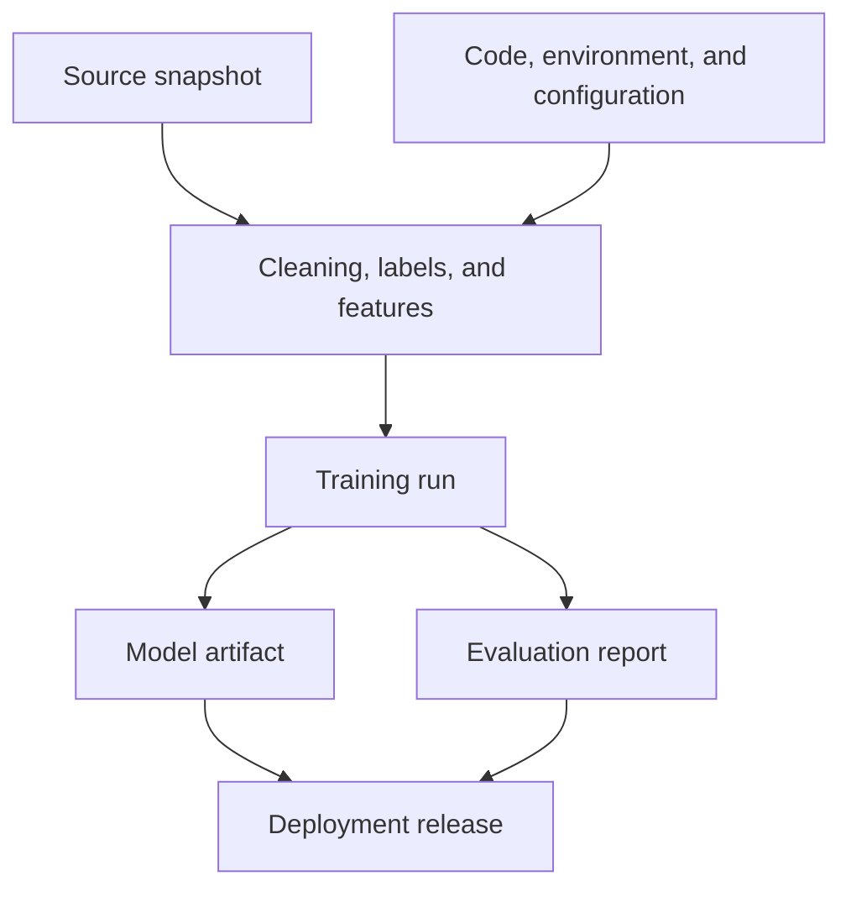
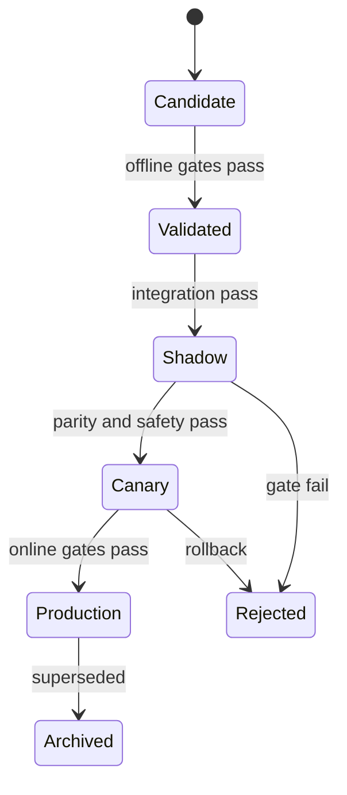



MLOps no se trata simplemente de automatizar el entrenamiento de modelos. Su esencia es **probar qué datos y código produjeron un modelo y por qué, reconstruirlo en las mismas condiciones, promocionarlo de forma segura y revertirlo cuando algo sale mal**.

Guardar un archivo de modelo conserva una salida, pero no un sistema reproducible. Los datos de entrada, la definición de la etiqueta, el código de característica, el entorno de ejecución, la política de evaluación, los umbrales y la configuración de implementación deben estar vinculados.

## 1. El problema: por qué “el mismo código” no produce el mismo modelo

Un resultado de aprendizaje automático es una función de:

\[
Artifact = F(D, L, S, C, E, H, R, P)
\]

- \(D\): datos de origen e instantánea
- \(L\): definición de etiqueta
- \(S\): división de entrenamiento/validación/prueba
- \(C\): característica, preprocesamiento y código de entrenamiento
- \(E\): sistema operativo, tiempo de ejecución, bibliotecas y entorno de hardware
- \(H\): hiperparámetros
- \(R\): semillas aleatorias y operaciones no deterministas
- \(P\): política de formación y orden de ejecución

Incluso con el mismo compromiso de Git, un cambio en los datos cambia el resultado. Incluso con la misma instantánea de datos, una consulta de etiqueta SQL, una biblioteca o un orden de entrenamiento distribuido diferente pueden cambiar el resultado.

### Desconexiones operativas comunes

- Funciona en un cuaderno pero no se puede reproducir en el proceso por lotes.
- Volver a leer la tabla fuente más reciente cambia silenciosamente los datos utilizados en un experimento anterior.
- Se sobrescribe un archivo de modelo con el mismo nombre.
- El preprocesamiento fuera de línea difiere del cálculo de características en línea.
- Se registraron las métricas, pero no los datos de evaluación ni la versión de implementación de las métricas.
- El modelo de probabilidad no ha cambiado y solo ha cambiado el umbral, pero no hay un historial de cambios.
- La etiqueta `production` es simplemente un alias adjunto manualmente, sin puerta de validación.
- Después de la implementación, nadie puede rastrear qué modelo respondió a una solicitud en particular.

### La reproducibilidad tiene niveles

1. **Repetibilidad**: repita la misma ejecución con el mismo código, datos y entorno.
2. **Reproducibilidad**: Reproducir el resultado dentro de una tolerancia definida en un entorno independiente siguiendo el mismo procedimiento.
3. **Replicabilidad**: Confirme que la conclusión se cumple con una implementación y datos independientes.

Cuando las operaciones de hardware no son deterministas, definir tolerancias para métricas y diferencias de predicción es más realista que exigir igualdad bit a bit.

## 2. Modelo mental: un gráfico de procedencia de artefactos inmutables

Piense en MLOps como un gráfico acíclico dirigido en lugar de un repositorio de archivos.



Cada nodo tiene un ID inmutable y cada borde significa "fue producido a partir de". Un nombre como "último" es sólo un puntero móvil a un artefacto inmutable.

### Distinguir un artefacto de una versión

- **Artefacto de modelo**: pesos entrenados, preprocesamiento, firma y metadatos
- **Política de decisiones**: calibrador, umbrales, reglas y respaldo
- **Lanzamiento**: una unidad de implementación que combina un artefacto, una política, un código de servicio y un entorno en particular.

Cambiar un umbral cambia el comportamiento real incluso cuando los pesos del modelo siguen siendo idénticos. Por lo tanto, la política debe tener una versión e incluirse en el linaje de versiones.

### Un registro es una máquina de estados, no un almacén de archivos

Ejemplos de estados recomendados:



Cada transición estatal debe conservar la evidencia de validación, el aprobador, el tiempo y el motivo. Un proceso manual que solo cambia el nombre de una etiqueta tiene una auditabilidad y reproducibilidad débiles.

## 3. Flujo de trabajo práctico

### Paso 1. Definir el contrato de reproducibilidad

Al inicio del proyecto, especifique:

- ¿Las repeticiones deben producir el mismo hash de artefacto, predicciones o rango métrico?
- ¿Qué error numérico es aceptable?
- ¿Los datos de origen se corregirán como una instantánea, un registro de solo anexar o una consulta como resultado?
- ¿Cuáles son las políticas de retención y eliminación?
- ¿Existen datos derivados que permitan la reproducción sin datos sensibles?
- ¿Quién puede promover qué artefacto a producción?

Las opciones deterministas pueden reducir el rendimiento. Se puede distinguir la reproducibilidad estricta durante la investigación y la reproducibilidad estadística para la capacitación en producción a gran escala, pero la diferencia debe documentarse.

### Paso 2. Separe el código ejecutable de la configuración declarativa

Los cuadernos son útiles para la exploración, pero trasladan el camino de entrenamiento final a funciones y comandos parametrizados.

```yaml
run:
  code_revision: "immutable-commit-id"
  random_seed: 1729

data:
  snapshot_id: "content-addressed-id"
  label_spec_version: "label-v4"
  split_spec_version: "temporal-split-v2"

features:
  definition_version: "features-v7"
  fit_scope: "train-only"

model:
  family: "candidate-family"
  hyperparameters:
    regularization: 0.01

evaluation:
  metric_spec_version: "metrics-v3"
  slices: [time, domain, data_quality]
```

Los valores numéricos son sólo ejemplos. Lo que importa es que un archivo de configuración comprometido (no argumentos recordados por una persona) defina la ejecución.

No coloque secretos en la configuración. Inyéctalos a través de un camino secreto dedicado y enmascaralos en registros y artefactos.

### Paso 3. Crear instantáneas de datos y linaje

La estrategia de versionado de datos depende de la escala y la regulación.

#### Instantánea física

Almacene las filas utilizadas para el entrenamiento en archivos inmutables. La reproducción es fácil, pero el almacenamiento duplicado y la retención de datos confidenciales generan riesgos.

#### Consulta + Versión fuente

Almacene la consulta, la versión de la partición de origen y la marca de tiempo actual. La fuente debe soportar el viaje en el tiempo y la inmutabilidad.

#### Manifiesto dirigido al contenido

Agrupe rutas de archivos, tamaños, sumas de verificación, esquemas, recuentos de filas y rango de tiempo en un manifiesto. Si el contenido cambia, el ID también cambia.

Manifiesto de datos de ejemplo:

```json
{
  "dataset_id": "sha256:...",
  "created_at": "ISO-8601 timestamp",
  "schema_version": "v5",
  "label_spec": "label-v4",
  "time_range": {"start": "...", "end": "..."},
  "partitions": [
    {"uri": "immutable/path", "sha256": "...", "rows": 0}
  ],
  "quality_report_id": "sha256:..."
}
```

No replique información personal ni texto de registro original en los metadatos del registro. Lineage debe contener solo los identificadores mínimos y ubicaciones de acceso controlado.

### Paso 4. Características y etiquetas de la versión tanto en código como en datos

Una versión de característica es más que una lista de columnas.

- fórmulas y definiciones de ventanas
- reglas de unión en un momento dado
- conversiones de valores faltantes, valores atípicos y unidades
- diccionarios de categorías y manejo desconocido
- estadísticas que requieren ajuste
- equivalencia de implementaciones en línea y fuera de línea

Una versión de etiqueta incluye la definición del evento, el horizonte de observación, las reglas de exclusión, el retraso en el vencimiento y la política de adjudicación manual.

Combine el preprocesador instalado con el modelo en el artefacto de entrenamiento o haga referencia al artefacto de preprocesamiento exacto requerido. No busque un preprocesador arbitrario más reciente en el momento de la inferencia.

### Paso 5. Bloquear el entorno y registrar la procedencia de la construcción

Como mínimo, arregle:

- versión en tiempo de ejecución
- archivo de bloqueo para dependencias directas y transitivas
- OS y bibliotecas del sistema
- CPU/GPU e información de la biblioteca de aceleración
- resumen de imagen del contenedor
- opciones del compilador
- valores de variables de entorno que afectan los resultados

Las etiquetas se pueden mover, así que registre el resumen de la imagen y la etiqueta de la imagen para su implementación. Para la seguridad de la cadena de suministro, conecte el inventario de dependencia, los resultados del análisis de vulnerabilidades, las firmas y las certificaciones con la evidencia de publicación.

### Paso 6. Registre cada ejecución en forma estructurada

Cada ejecución necesita lo siguiente:

| Categoría | Artículos grabados |
|---|---|
| Entrada | conjunto de datos, etiqueta, división, versión de característica |
| Código | confirmar, estado sucio, compilar ID |
| Medio ambiente | resumen de imágenes, tiempo de ejecución, hardware |
| Formación | configuración, semilla, duración, uso de recursos |
| Salida | suma de comprobación del modelo, preprocesador, firma |
| Evaluación | métrica, intervalo de confianza, informe de sector |
| Decisión | motivo de aceptación o rechazo, revisor, línea base de comparación |

Si la ejecución se produjo con un árbol de trabajo modificado, conserve la diferencia como un artefacto o excluya la ejecución de la promoción. "La confirmación ID era la misma, pero existían cambios locales" es una causa común de reproducibilidad rota.

### Paso 7. Incluir contratos en el paquete modelo

Un paquete modelo debe contener al menos:

- pesas o un modelo serializado
- artefactos de preprocesamiento y posprocesamiento
- firma de entrada/salida
- nombres de funciones, orden, tipos de datos y unidades
- políticas para valores faltantes y categorías desconocidas
- ID de datos de entrenamiento y linaje de código
- informe-evaluación ID
- rangos de latencia y recursos esperados
- restricciones de licencia, seguridad y uso
- dominios soportados y modos de falla conocidos

Firma de ejemplo:

```json
{
  "inputs": [
    {"name": "feature_a", "dtype": "float32", "nullable": false},
    {"name": "category_b", "dtype": "string", "unknown": "map_to_other"}
  ],
  "outputs": [
    {"name": "risk_probability", "dtype": "float32", "range": [0, 1]}
  ]
}
```

Los esquemas coincidentes no garantizan un significado coincidente. También se requieren pruebas de contrato semántico para unidades, tiempos de referencia y definiciones de categorías.

### Paso 8. Implementar puertas de promoción como código

Un candidato debe pasar puertas automáticas y manuales antes de pasar a la siguiente etapa.

#### Puertas de datos

- esquema y contratos semánticos
- fugas, duplicaciones y límites de tiempo
- cambios en faltantes, rangos y categorías
- madurez y calidad de la etiqueta

#### Puertas modelo

- rendimiento mínimo en relación con una línea de base fija
- límites inferiores para porciones importantes
- calidad de calibración e incertidumbre
- pruebas de robustez y estrés
- requisitos de equidad y seguridad

#### Puertas del sistema

- serialización ida y vuelta
- paridad de predicción por lotes/en línea
- latencia, memoria y rendimiento
- alternativas para fallas, tiempos de espera y funciones faltantes
- controles de seguridad y política de dependencia

Una puerta no debe compararse sólo con el rendimiento promedio. Por ejemplo:

\[
\Delta m = m_{candidate}-m_{champion}
\]

Además del promedio \(\Delta m>0\), considere los intervalos de confianza, las regresiones de subgrupos y el costo operativo. Un candidato puede mejorar el promedio general y al mismo tiempo perjudicar una porción importante.

### Paso 9. Limite el riesgo en línea con seguimiento y canarios

En el modo **sombra**, las solicitudes reales se copian al candidato para su predicción, pero su resultado no afecta el comportamiento.

- firma y paridad de características
- latencia y recursos
- diferencias entre las predicciones del modelo candidato y actual
- errores y retrocesos
- Tasa OOD en tráfico real

En un **canario**, la versión candidata en realidad se aplica al tráfico limitado.

- expansión gradual del tráfico
- barandillas predefinidas
- condiciones automáticas de parada y retroceso
- asignación estable para que un usuario o entidad no se mueva hacia adelante y hacia atrás entre modelos
- seguimiento de resultados por versión del modelo

Para decisiones críticas para la seguridad, la aprobación humana o una etapa de solo asesoramiento puede preceder al canario.

### Paso 10. Practique la reversión antes de la implementación

La reversión requiere más que el archivo del modelo anterior.

- modelo, preprocesamiento y política de la versión anterior
- esquema de características compatible
- compatibilidad con versiones anteriores para migraciones de datos
- configuración de enrutamiento de tráfico
- reglas que impiden el reprocesamiento y la duplicación de acciones
- criterios de seguimiento posteriores a la reversión

Si el modelo y la canalización de funciones se implementan de forma independiente, se necesita una matriz de compatibilidad. Administre el paquete de lanzamiento de forma atómica para que una reversión de emergencia no combine incorrectamente un modelo antiguo con nuevas características.

### Paso 11. Opere CI, CD y CT por separado

- **CI**: contratos de código y datos, pruebas unitarias/de integración y una pequeña ejecución de entrenamiento de reproducibilidad
- **CD**: implementa una versión validada en un entorno y progresa a través del seguimiento y los valores canarios.
- **CT**: actualiza datos y produce modelos candidatos según una condición o cronograma

El CT automático no requiere promoción de producción automática. Dependiendo del riesgo, se requiere aprobación humana, un período mínimo de observación y evidencia en línea.

## 4. Lista de verificación de evaluación y verificación

### Reproducibilidad

- [] Registre la confirmación del código y el estado sucio.
- [] Vincular versiones de conjuntos de datos, etiquetas, divisiones y funciones a través de ID inmutables.
- [] Preservar el archivo de bloqueo, el resumen de imágenes y la información del hardware.
- [ ] Especificar la política para semillas y operaciones no deterministas.
- [ ] Definir tolerancias de reproducibilidad estadística o bit a bit.
- [] Reproducir una ejecución representativa en un entorno limpio.

### Linaje y Registro

- [] Se puede rastrear un modelo hasta su instantánea de origen.
- [] El informe de evaluación hace referencia al artefacto exacto y al conjunto de prueba.
- [ ] Las versiones de modelo, política y lanzamiento son distintas.
- [ ] Los artefactos nunca se sobrescriben y se identifican mediante una suma de verificación.
- [] Cada transición de estado conserva su puerta, aprobador, tiempo y motivo.
- [] Los datos de origen confidenciales y los secretos no están presentes en los metadatos y registros.

### Promoción

- [ ] El candidato se comparó con el modelo de producción inicial y actual en condiciones idénticas.
- [] Los sectores importantes tienen límites inferiores, no solo el rendimiento general.
- [ ] Se aprueban las pruebas de firma, semánticas y de paridad en línea/fuera de línea.
- [] Se verificaron la latencia, la memoria, el rendimiento y el comportamiento de reserva.
- [ ] Se revisó la evidencia oculta.
- [] Se cuantifican las condiciones de expansión, parada y reversión de Canary.

### Operaciones y Recuperación

- [] Cada predicción se puede vincular a una publicación ID.
- [ ] Las entradas, salidas, desempeño y resultados de políticas se monitorean por versión.
- [ ] La versión anterior y las funciones compatibles se pueden restaurar inmediatamente.
- [] Se ha practicado el runbook de reversión.
- [] Los requisitos de eliminación y retención de datos también se aplican a los artefactos de linaje.
- [ ] Las causas de reentrenamiento y las decisiones de promoción son auditables a posteriori.

## 5. Limitaciones y advertencias

En primer lugar, guardar todo mejora la reproducibilidad pero también aumenta el costo y el riesgo de privacidad. Utilice referencias, manifiestos y controles de acceso inmutables en lugar de duplicar los datos de origen y establezca períodos de retención.

En segundo lugar, el determinismo total puede entrar en conflicto con el rendimiento y la velocidad. Lo importante es divulgar los límites y verificar que los resultados y conclusiones se repitan dentro de la tolerancia definida.

En tercer lugar, un registro no crea automáticamente gobernanza. Si consta de etiquetas manuales sin sentido, puertas evitables y aprobaciones ceremoniales, no se diferencia de un servidor de archivos.

Cuarto, las puertas fuera de línea no garantizan efectos causales en línea. El seguimiento verifica la compatibilidad del sistema; Canarias verifica un impacto limitado en el mundo real. Cada uno proporciona evidencia diferente.

Por último, el reciclaje automático no es sinónimo de mejora automática. Es posible que se entere más rápidamente de una interrupción de datos o de un sesgo político. Diseñe el reentrenamiento, la recalibración, los cambios de umbral y la reversión como respuestas separadas.
